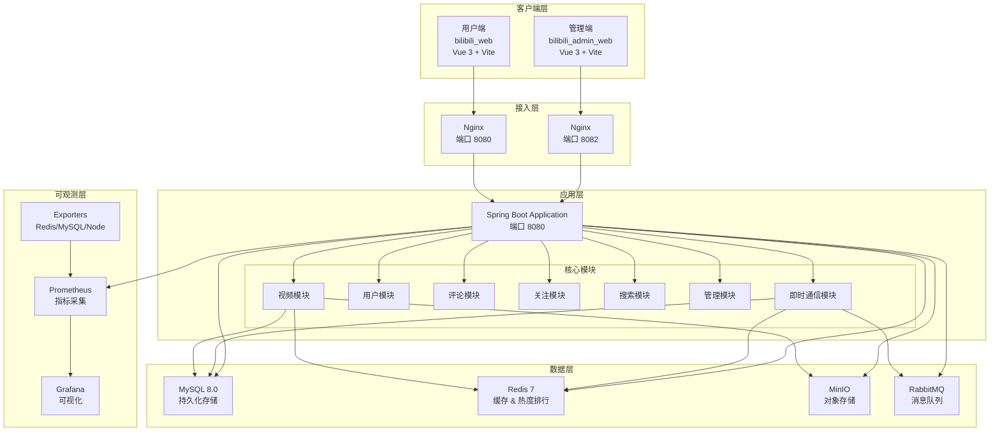
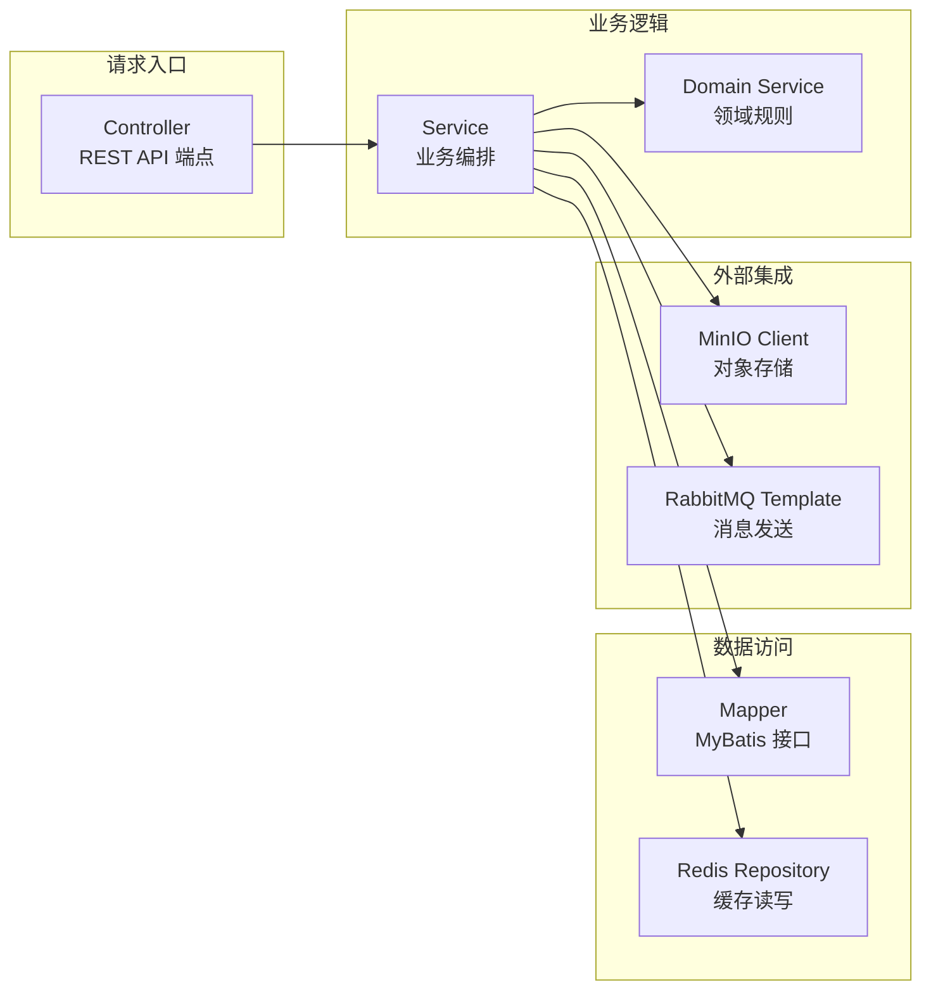
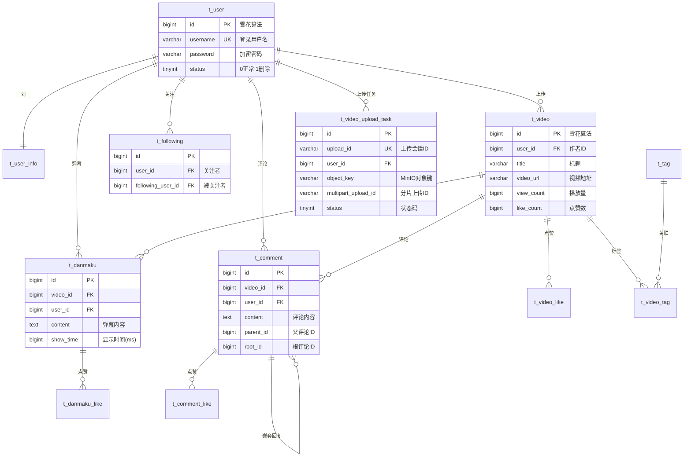
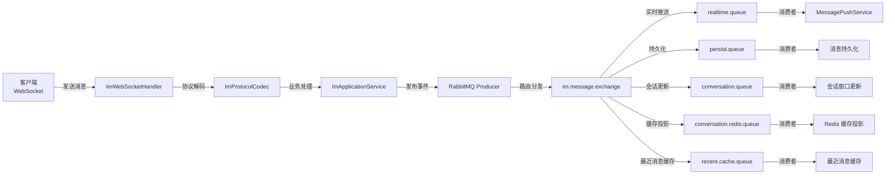

本文档是 Bilibili 全栈项目的入口文档，旨在帮助开发者快速建立对项目整体架构、技术栈选型和核心功能模块的全局认知。无论你是前端、后端还是全栈开发者，阅读本文后将能够理解项目的组织方式，并知道下一步应该深入哪些具体领域的文档。

## 项目定位与核心特性

Bilibili 项目是一个模拟哔哩哔哩核心功能的全栈 Web 应用，涵盖了视频平台的核心业务闭环。项目采用前后端分离架构，后端基于 Spring Boot 构建 RESTful API 和 WebSocket 实时通信服务，前端则使用 Vue 3 生态构建用户交互界面。

**核心功能矩阵**：

| 功能领域 | 具体能力 | 关键技术实现 |
|---------|---------|------------|
| **用户系统** | 注册登录、个人主页、隐私设置 | JWT + Spring Security + Snowflake ID |
| **视频管理** | 分片上传、视频流播放、封面管理 | MinIO 分片上传 + 预签名 URL |
| **弹幕系统** | 实时弹幕发送、弹幕点赞 | WebSocket + 前端弹幕渲染引擎 |
| **评论系统** | 嵌套评论、评论点赞 | 无限层级树形结构设计 |
| **社交关系** | 关注/取关、粉丝列表 | 双向关联表 + 计数器缓存 |
| **即时通信** | 私聊、群聊、消息已读、敏感词过滤 | WebSocket + RabbitMQ + Redis 多级缓存 |
| **视频热度** | 双 Slot 热度排行榜 | Redis Lua 脚本 + 定时任务 |
| **管理后台** | 用户管理、视频审核 | 独立 Vue 应用 + 管理员权限体系 |
| **搜索服务** | 视频标题搜索 | 数据库 LIKE 查询（可扩展至 ES） |

## 整体架构设计

项目采用经典的**分层架构**与**领域驱动设计（DDD）思想**相结合的方式组织代码。下图展示了系统的核心架构关系：



Sources: [docker-compose.yml](bilibili_SpringBoot/docker-compose.yml#L1-L143), [monitoring/docker-compose.yml](monitoring/docker-compose.yml#L1-L138), [application.yaml](bilibili_SpringBoot/src/main/resources/application.yaml#L1-L159)

## 技术栈全景

### 后端技术栈

| 类别 | 技术选型 | 版本 | 用途说明 |
|-----|---------|-----|---------|
| **核心框架** | Spring Boot | 4.0.3 | 应用基础框架 |
| **语言** | Java | 17 | LTS 版本，支持现代语法特性 |
| **ORM** | MyBatis-Plus | 3.5.15 | 简化数据库操作，内置代码生成 |
| **数据库** | MySQL | 8.0 | 主数据存储，支持 JSON、窗口函数 |
| **缓存** | Redis | 7.x | 热点数据缓存、排行榜、会话存储 |
| **消息队列** | RabbitMQ | 3.13 | IM 消息异步处理、削峰填谷 |
| **对象存储** | MinIO | latest | 视频、图片等大文件存储 |
| **安全框架** | Spring Security + JWT | - | 认证授权、接口保护 |
| **WebSocket** | Spring WebSocket | - | 实时通信基础通道 |
| **数据库迁移** | Flyway | - | 版本化数据库 schema 管理 |
| **API 文档** | SpringDoc + Knife4j | 3.0.1 / 4.5.0 | OpenAPI 3 规范文档 |
| **IP 定位** | ip2region | 3.3.6 | 基于本地库的 IP 地理位置查询 |
| **监控接入** | Micrometer + Prometheus | - | 应用指标暴露 |

Sources: [pom.xml](bilibili_SpringBoot/pom.xml#L1-L197)

### 前端技术栈（用户端 & 管理端共用）

| 类别 | 技术选型 | 版本 | 用途说明 |
|-----|---------|-----|---------|
| **框架** | Vue | 3.5.30 | 响应式 UI 框架 |
| **路由** | Vue Router | 5.0.4 | SPA 路由管理，支持路由守卫 |
| **构建工具** | Vite | 8.0.1 | 极速开发服务器与构建 |
| **语言** | TypeScript | 5.9.3 | 类型安全的 JavaScript 超集 |
| **HTTP 客户端** | Axios | 1.13.6 | API 请求封装 |
| **测试框架** | Vitest | 3.2.4 | 单元测试、路由守卫验证 |

Sources: [bilibili_web/package.json](bilibili_web/package.json#L1-L30), [bilibili_admin_web/package.json](bilibili_admin_web/package.json#L1-L30)

### 基础设施与运维

| 类别 | 技术选型 | 部署方式 |
|-----|---------|---------|
| **容器编排** | Docker Compose | 多 compose 文件分离业务与监控 |
| **反向代理** | Nginx | 用户端 8080 端口，管理端 8082 端口 |
| **监控采集** | Prometheus | 1 秒级采集间隔 |
| **可视化** | Grafana | 预置 Dashboard + 自动 Provisioning |
| **容器监控** | cAdvisor | 容器级 CPU/内存指标 |
| **主机监控** | Node Exporter | 宿主机级系统指标 |
| **Redis 监控** | Redis Exporter | Redis 连接数、内存、命令统计 |
| **MySQL 监控** | MySQLD Exporter | InnoDB 指标、慢查询、连接数 |

Sources: [docker-compose.yml](bilibili_SpringBoot/docker-compose.yml#L1-L143), [monitoring/docker-compose.yml](monitoring/docker-compose.yml#L1-L138)

## 后端代码分层架构

后端代码位于 `bilibili_SpringBoot/src/main/java/com/bilibili/` 目录下，按**领域模块**组织，每个模块内部遵循经典的分层架构模式：



**模块职责划分**：

| 模块 | 路径 | 核心职责 |
|-----|------|---------|
| **user** | `com.bilibili.user` | 用户注册、登录、个人信息管理 |
| **video** | `com.bilibili.video` | 视频上传、详情、热度排行、弹幕管理 |
| **comment** | `com.bilibili.comment` | 评论的 CRUD、嵌套回复、点赞 |
| **following** | `com.bilibili.following` | 关注/取关、粉丝列表 |
| **search** | `com.bilibili.search` | 视频搜索 |
| **admin** | `com.bilibili.admin` | 管理后台专用 API（用户审核、视频审核） |
| **im** | `com.bilibili.im` | 即时通信全链路（WebSocket、消息、会话、群聊） |
| **storage** | `com.bilibili.storage` | MinIO 对象存储抽象层 |
| **security** | `com.bilibili.security` | JWT 令牌签发/验证、请求过滤器 |
| **common** | `com.bilibili.common` | 通用工具（AOP、异常处理、分页、统一响应） |
| **config** | `com.bilibili.config` | 各类配置类（数据库、Redis、MQ、安全等） |

Sources: [目录结构 bilibili_SpringBoot/src/main/java/com/bilibili](bilibili_SpringBoot/src/main/java/com/bilibili)

## 前端应用结构

### 用户端（bilibili_web）

用户端面向普通用户提供视频浏览、互动、创作和社交功能。采用 Vue 3 Composition API 风格开发。

**页面路由体系**：

| 路径 | 页面组件 | 功能说明 | 是否需要登录 |
|-----|---------|---------|------------|
| `/` | HomeView | 首页视频流 | 否 |
| `/auth` | AuthView | 登录/注册 | 否 |
| `/search` | SearchView | 搜索结果 | 否 |
| `/video/:id` | VideoDetailView | 视频详情 + 弹幕 | 否 |
| `/user/:uid` | UserSpaceView | 用户空间 | 否 |
| `/studio` | StudioView | 创作中心（上传视频） | 是 |
| `/profile` | ProfileView → SettingsView | 个人设置 | 是 |
| `/profile/privacy` | ProfilePrivacyView | 隐私设置 | 是 |
| `/messages` | MessagesView | 即时消息 | 是 |

Sources: [bilibili_web/src/router.ts](bilibili_web/src/router.ts#L1-L84)

### 管理端（bilibili_admin_web）

管理端为管理员提供后台管理功能，独立部署在 8082 端口。采用管理员角色校验的路由守卫机制。

**页面路由体系**：

| 路径 | 页面组件 | 功能说明 |
|-----|---------|---------|
| `/login` | AdminLoginView | 管理员登录 |
| `/videos` | AdminVideosView | 视频审核与管理 |
| `/users` | AdminUsersView | 用户管理 |

Sources: [bilibili_admin_web/src/router.ts](bilibili_admin_web/src/router.ts#L1-L54)

## 数据库核心表结构

数据库 `bilibili` 采用 MySQL 8.0，使用 Flyway 进行版本化迁移管理。以下是核心业务表的关系概览：



Sources: [bilibili.sql](bilibili_SpringBoot/src/main/resources/bilibili.sql#L1-L208)

## 即时通信（IM）系统架构亮点

IM 模块是本项目中最为复杂和完善的子系统，采用了多层次的异步处理和缓存策略来保障消息的可靠投递与实时性。

**IM 消息处理管线**：



Sources: [application.yaml - IM MQ配置](bilibili_SpringBoot/src/main/resources/application.yaml#L95-L159), [IM模块目录结构](bilibili_SpringBoot/src/main/java/com/bilibili/im)

## 部署架构

项目采用 Docker Compose 进行容器化部署，分为两个独立的 compose 文件：

1. **业务栈** (`bilibili_SpringBoot/docker-compose.yml`)：包含应用、数据库、缓存、消息队列、对象存储和前端 Nginx
2. **监控栈** (`monitoring/docker-compose.yml`)：包含 Prometheus、Grafana、各类 Exporter

**服务端口映射**：

| 服务 | 容器端口 | 宿主机端口 | 说明 |
|-----|---------|----------|------|
| 用户端 Nginx | 80 | 8080 | 用户端静态资源 + API 代理 |
| 管理端 Nginx | 80 | 8082 | 管理端静态资源 + API 代理 |
| MySQL | 3306 | 3307 | 数据库 |
| Redis | 6379 | 6379 | 缓存 |
| RabbitMQ AMQP | 5672 | 5672 | 消息队列 |
| RabbitMQ Management | 15672 | 15672 | 管理界面 |
| MinIO API | 9000 | 9000 | 对象存储 |
| MinIO Console | 9001 | 9001 | 管理界面 |
| Prometheus | 9090 | 9090 | 监控采集 |
| Grafana | 3000 | 3000 | 监控可视化 |
| cAdvisor | 8080 | 8081 | 容器监控 |

Sources: [docker-compose.yml](bilibili_SpringBoot/docker-compose.yml#L1-L143), [Nginx配置](bilibili_SpringBoot/deploy/nginx/default.conf#L1-L73)

## 项目目录结构总览

```
biliibli/
├── bilibili_SpringBoot/          # 后端 Spring Boot 应用
│   ├── src/main/java/com/bilibili/
│   │   ├── user/                 # 用户模块
│   │   ├── video/                # 视频模块（含热度排行）
│   │   ├── comment/              # 评论模块
│   │   ├── following/            # 关注模块
│   │   ├── search/               # 搜索模块
│   │   ├── admin/                # 管理后台模块
│   │   ├── im/                   # 即时通信模块（最复杂）
│   │   ├── storage/              # MinIO 存储抽象
│   │   ├── security/             # JWT & Spring Security
│   │   ├── common/               # 通用工具
│   │   └── config/               # 配置类
│   ├── src/main/resources/
│   │   ├── application.yaml      # 主配置文件
│   │   ├── bilibili.sql          # 初始数据库 Schema
│   │   ├── db/migration/         # Flyway 迁移脚本
│   │   └── mapper/               # MyBatis XML 映射
│   ├── docker-compose.yml        # 业务栈容器编排
│   └── deploy/nginx/             # Nginx 配置
├── bilibili_web/                 # 用户端 Vue 3 应用
│   └── src/
│       ├── views/                # 页面组件
│       ├── components/           # 通用组件
│       ├── features/             # 功能模块（如消息）
│       └── lib/                  # 工具库（API、认证）
├── bilibili_admin_web/           # 管理端 Vue 3 应用
│   └── src/
│       ├── views/                # 管理页面
│       └── lib/                  # 工具库
├── monitoring/                   # 监控栈
│   ├── docker-compose.yml        # 监控容器编排
│   ├── grafana/dashboards/       # Grafana Dashboard JSON
│   └── prometheus/               # Prometheus 配置
├── loadtest/                     # k6 压测框架（独立项目）
│   ├── scripts/scenarios/        # 压测场景脚本
│   └── docker-compose.yml        # k6 运行环境
└── docs/                         # 设计文档与计划
```

Sources: [目录结构](.), [bilibili_SpringBoot目录结构](bilibili_SpringBoot/src/main/java/com/bilibili)

## 推荐阅读路径

根据你的角色和兴趣，建议按以下路径深入阅读：

### 后端开发者

1. **[环境搭建与启动](2-huan-jing-da-jian-yu-qi-dong)** — 快速运行项目
2. **[Spring Boot 后端架构分层与领域划分](8-spring-boot-hou-duan-jia-gou-fen-ceng-yu-ling-yu-hua-fen)** — 深入理解代码组织
3. **[JWT 认证与 Spring Security 权限体系](9-jwt-ren-zheng-yu-spring-security-quan-xian-ti-xi)** — 安全机制
4. **[数据库设计与 Flyway 迁移管理](10-shu-ju-ku-she-ji-yu-flyway-qian-yi-guan-li)** — 数据模型

### 前端开发者

1. **[环境搭建与启动](2-huan-jing-da-jian-yu-qi-dong)** — 前端开发环境
2. **[用户端路由与页面体系](4-yong-hu-duan-lu-you-yu-ye-mian-ti-xi)** — 前端架构
3. **[视频浏览与弹幕交互](5-shi-pin-liu-lan-yu-dan-mu-jiao-hu)** — 核心交互
4. **[即时通信（IM）前端集成](6-ji-shi-tong-xin-im-qian-duan-ji-cheng)** — 实时通信

### IM 系统深入

1. **[IM 领域模型与应用层编排](16-im-ling-yu-mo-xing-yu-ying-yong-ceng-bian-pai)** — IM 整体设计
2. **[WebSocket 连接管理与自定义协议](17-websocket-lian-jie-guan-li-yu-zi-ding-yi-xie-yi)** — 通信层
3. **[RabbitMQ 消息队列与消费者设计](18-rabbitmq-xiao-xi-dui-lie-yu-xiao-fei-zhe-she-ji)** — 异步处理

### 运维与部署

1. **[Docker Compose 多服务编排](25-docker-compose-duo-fu-wu-bian-pai)** — 部署架构
2. **[Prometheus + Grafana 监控栈搭建](27-prometheus-grafana-jian-kong-zhan-da-jian)** — 可观测性
3. **[k6 独立压测框架使用指南](29-k6-du-li-ya-ce-kuang-jia-shi-yong-zhi-nan)** — 性能测试

## 下一步

如果你是第一次接触本项目，建议从 **[环境搭建与启动](2-huan-jing-da-jian-yu-qi-dong)** 开始，按照指南完成本地开发环境的搭建和项目启动，然后根据上述推荐路径选择你感兴趣的领域深入阅读。