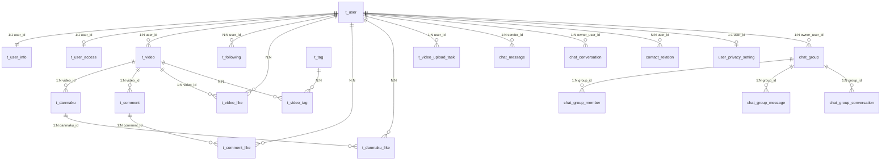

本页系统梳理 bilibili_SpringBoot 的数据库架构设计原则、核心表结构，以及 Flyway 增量迁移的完整工作机制。文档面向需要理解数据模型、参与数据库变更或排查数据层问题的后端开发者。

## 1. 数据库总体架构

项目采用 **MySQL 8.0** 作为唯一关系型数据源，字符集统一为 `utf8mb4`，存储引擎为 `InnoDB`。所有表的主键均采用 **BIGINT Snowflake ID**（由 MyBatis-Plus 的 `IdType.ASSIGN_ID` 分配），而非 MySQL 自增 ID，这一设计为后续分库分表预留了兼容性。表间关系不使用物理外键，而是在业务层维护"逻辑外键"约束。

数据库 schema 的管理分为 **两个互补层**：

| 层次 | 工具 | 文件位置 | 作用 | 运行时机 |
|------|------|----------|------|----------|
| **基线层** | Spring SQL Init | `bilibili.sql` | 定义核心业务表的完整建表语句 | 应用启动时，`mode=always`（dev）/`mode=never`（prod） |
| **增量层** | Flyway Migrations | `db/migration/V*.sql` | 对已有表执行结构变更与数据迁移 | 应用启动时，Flyway 自动执行 |

这种双层策略允许开发者在本地开发时通过 `bilibili.sql` 一步建好完整库表，而生产环境则依赖 Flyway 增量脚本保证每次部署的 schema 变更可追溯、可回滚。

Sources: [application.yaml](bilibili_SpringBoot/src/main/resources/application.yaml#L24-L33), [FlywayConfig.java](bilibili_SpringBoot/src/main/java/com/bilibili/config/db/FlywayConfig.java#L1-L22), [docker-compose.yml](bilibili_SpringBoot/docker-compose.yml#L1-L21)

## 2. 核心表结构总览

数据库中共有 **19 张业务表**（基线 13 张 + 迁移新增 6 张），按业务域划分为五组：

### 2.1 用户域

| 表名 | 用途 | 核心字段 | 关联关系 |
|------|------|----------|----------|
| `t_user` | 登录账号与账号状态 | `id`, `username`, `password`, `role_code`, `status` | 1:1 → `t_user_info` |
| `t_user_info` | 用户公开资料与计数器 | `user_id`, `nickname`, `avatar_url`, `following_count`, `follower_count` | 外键 → `t_user.id` |
| `t_user_access` | 用户功能权限开关 | `user_id`, `like_enabled`, `comment_enabled`, `im_message_send_enabled`, `video_upload_enabled`, `profile_edit_enabled` | 外键 → `t_user.id` |

### 2.2 视频与内容域

| 表名 | 用途 | 核心字段 | 关联关系 |
|------|------|----------|----------|
| `t_video` | 视频元信息与计数器 | `id`, `user_id`, `title`, `cover_url`, `video_url`, `view_count`, `like_count`, `comment_count` | N:1 → `t_user` |
| `t_danmaku` | 视频弹幕内容 | `video_id`, `user_id`, `content`, `show_time` | N:1 → `t_video`, `t_user` |
| `t_comment` | 评论与回复（树形结构） | `video_id`, `user_id`, `content`, `parent_id`, `root_id`, `reply_count` | N:1 → `t_video`, `t_user` |
| `t_tag` | 标签主数据 | `id`, `name`, `use_count` | N:N → `t_video`（经 `t_video_tag`） |
| `t_video_tag` | 视频-标签关联表 | `video_id`, `tag_id` | 桥接表 |

### 2.3 交互关系域

| 表名 | 用途 | 核心字段 |
|------|------|----------|
| `t_video_like` | 视频点赞关系 | `video_id`, `user_id`, `status` |
| `t_danmaku_like` | 弹幕点赞关系 | `danmaku_id`, `user_id`, `status` |
| `t_comment_like` | 评论点赞关系 | `comment_id`, `user_id`, `status` |
| `t_following` | 关注关系（A→B） | `user_id`, `following_user_id`, `status` |

### 2.4 上传域

| 表名 | 用途 | 核心字段 |
|------|------|----------|
| `t_video_upload_task` | 分片上传会话与状态机 | `upload_id`, `user_id`, `file_size`, `chunk_size`, `total_chunks`, `status`, `object_key`, `multipart_upload_id` |

### 2.5 IM 即时通信域（迁移脚本新增）

| 表名 | 用途 | 引入版本 |
|------|------|----------|
| `chat_message` | 全量聊天消息存储 | V3 |
| `chat_conversation` | 用户视角的会话窗口摘要 | V3 |
| `contact_relation` | 联系人关系（拉黑/屏蔽/私信资格） | V3 |
| `user_privacy_setting` | 用户隐私策略 | V3 |
| `chat_group` | 群资料表 | V12 |
| `chat_group_member` | 群成员关系表 | V12 |
| `chat_group_message` | 群消息序号映射表 | V12 |
| `chat_group_conversation` | 群会话窗口表 | V13 |
| `t_im_sensitive_word` | IM 敏感词库 | V17 |

Sources: [bilibili.sql](bilibili_SpringBoot/src/main/resources/bilibili.sql#L1-L208), [MySQL-数据库表结构说明.md](bilibili_SpringBoot/src/main/resources/doc/not-frontend-exposed/MySQL-数据库表结构说明.md#L1-L395)

## 3. 表间关系全景图

下图展示核心业务实体之间的逻辑关系。`t_user` 是全局中心实体，向外辐射出视频、评论、社交关系三大子图，IM 子系统则自成独立的表簇。



**关键设计原则**：所有点赞/关注/联系人关系表均采用 **`status` 软删除**（`0=normal, 1=deleted`），配合唯一索引实现"逻辑删除 + 重新操作"的幂等语义。

Sources: [bilibili.sql](bilibili_SpringBoot/src/main/resources/bilibili.sql#L87-L100), [V3__create_chat_tables.sql](bilibili_SpringBoot/src/main/resources/db/migration/V3__create_chat_tables.sql#L1-L55), [V12__create_group_chat_core_tables.sql](bilibili_SpringBoot/src/main/resources/db/migration/V12__create_group_chat_core_tables.sql#L1-L42)

## 4. Flyway 迁移机制详解

### 4.1 配置方式

项目采用 **双配置** 策略确保 Flyway 在任何部署环境下均可工作：

**Spring Boot 配置**（`application.yaml`）：
- `spring.flyway.enabled: true` — 启用 Flyway
- `spring.flyway.baseline-on-migrate: true` — 当数据库无 `flyway_schema_history` 表时自动创建基线
- `spring.flyway.baseline-version: 1` — 基线版本号设为 1
- `spring.flyway.locations: classpath:db/migration` — 迁移脚本扫描路径

**Java Bean 配置**（`FlywayConfig.java`）：
```java
@Bean(initMethod = "migrate")
public Flyway flyway(DataSource dataSource) {
    return Flyway.configure()
            .dataSource(dataSource)
            .baselineOnMigrate(true)
            .baselineVersion("1")
            .locations("classpath:db/migration")
            .load();
}
```
该 Bean 通过 `initMethod = "migrate"` 在 Spring 上下文初始化阶段自动触发迁移，与 YAML 配置形成冗余保障。

**为什么需要 `baseline-on-migrate: true`**：因为项目使用 `bilibili.sql`（Spring SQL Init）在 Flyway 之前就建好了核心表。当 Flyway 首次运行时，数据库中已存在大量表结构，但没有 `flyway_schema_history` 记录。`baseline-on-migrate` 会自动将当前数据库状态标记为基线版本 1，然后从 V2 开始执行后续迁移脚本，避免 Flyway 报错"检测到已有非空数据库"。

Sources: [application.yaml](bilibili_SpringBoot/src/main/resources/application.yaml#L29-L33), [FlywayConfig.java](bilibili_SpringBoot/src/main/java/com/bilibili/config/db/FlywayConfig.java#L9-L21)

### 4.2 迁移文件命名与版本策略

迁移脚本位于 `src/main/resources/db/migration/` 目录，遵循 Flyway 标准命名规范：

```
V{版本号}__{描述}.sql
```

项目中 **不存在 V1 迁移文件**，因为 V1 是通过 `baseline-on-migrate` 自动标记的基线版本——它对应 `bilibili.sql` 所创建的初始表结构。所有实际迁移脚本从 **V2** 开始，到 **V18** 共 **17 个增量脚本**。

| 版本 | 文件名 | 类型 | 影响表 | 说明 |
|------|--------|------|--------|------|
| V2 | `align_video_upload_task_for_minio_upload` | ALTER | `t_video_upload_task` | 移除 `temp_dir`，新增 `object_key`、`multipart_upload_id`（适配 MinIO 直传） |
| V3 | `create_chat_tables` | CREATE | `chat_message`, `chat_conversation`, `contact_relation`, `user_privacy_setting` | IM 子系统核心四表 |
| V4 | `create_chat_session_table` | CREATE | `chat_session` | 单聊会话配对表（后被 V5 废弃） |
| V5 | `migrate_chat_conversation_id_to_string_rule` | ALTER + DROP | `chat_message`, `chat_conversation`, `chat_session` | `conversation_id` 从 BIGINT 改为 VARCHAR(64)，规则 `single_{low}_{high}`；废弃 `chat_session` |
| V6 | `add_client_message_id_to_chat_message` | ALTER | `chat_message` | 新增 `client_message_id` + 唯一索引（客户端幂等） |
| V7 | `create_user_access_table` | CREATE | `t_user_access` | 用户功能权限控制表 |
| V8 | `add_is_dm_contact_to_contact_relation` | ALTER | `contact_relation` | 新增 `is_dm_contact`（私信资格标志） |
| V9 | `add_sender_location_to_chat_message` | ALTER | `chat_message` | 新增 `sender_location`（IP 属地快照） |
| V10 | `add_last_server_message_id_to_chat_conversation` | ALTER | `chat_conversation` | 新增 `last_server_message_id` |
| V11 | `add_server_message_id_to_chat_message` | ALTER | `chat_message` | 新增 `server_message_id` + 回填 + 唯一索引（全局消息排序游标） |
| V12 | `create_group_chat_core_tables` | CREATE | `chat_group`, `chat_group_member`, `chat_group_message` | 群聊核心三表 |
| V13 | `create_group_conversation_table` | CREATE | `chat_group_conversation` | 群会话窗口表 |
| V14 | `add_conversation_type_and_target_id_to_chat_message` | ALTER | `chat_message` | 新增 `conversation_type`（区分单聊/群聊消息） |
| V15 | `change_chat_group_message_to_use_message_id` | ALTER | `chat_group_message` | `server_message_id` → `message_id`（改用消息主键 ID） |
| V16 | `move_group_last_read_seq_to_conversation` | ALTER | `chat_group_conversation`, `chat_group_member` | 将 `last_read_seq` 从成员表迁移到会话窗口表 |
| V17 | `create_im_sensitive_word_table` | CREATE | `t_im_sensitive_word` | 敏感词库表 |
| V18 | `add_role_code_to_user` | ALTER | `t_user` | 新增 `role_code`（0 用户 / 1 审核员 / 2 管理员） |

Sources: [db/migration/](bilibili_SpringBoot/src/main/resources/db/migration/)

### 4.3 迁移模式分类

从 17 个迁移脚本中可以归纳出 **四种标准迁移模式**，开发者编写新迁移时应优先复用这些模式：

**模式 A — 新建表（CREATE TABLE）**：V3、V7、V12、V13、V17 采用。使用 `CREATE TABLE IF NOT EXISTS` 确保幂等，字段定义必须包含 `COMMENT`，索引命名遵循 `uk_`（唯一）/ `idx_`（普通）前缀。

**模式 B — 新增列（ALTER TABLE ADD COLUMN）**：V6、V8、V9、V10、V14、V16 采用。使用 `AFTER` 子句控制列位置，新列通常设置 `DEFAULT` 值保证向前兼容。

**模式 C — 条件性结构变更**：V2 采用。通过 `information_schema.columns` 检查列是否存在再执行 `ALTER`，适合处理可能存在多种历史状态的数据库。

**模式 D — 结构变更 + 数据迁移**：V5、V11、V15、V16 采用。先 `ALTER` 添加新列，再 `UPDATE` 回填数据，最后可能 `DROP` 旧列。这是最复杂的模式，需要在事务中保证数据一致性。

Sources: [V2__align_video_upload_task_for_minio_upload.sql](bilibili_SpringBoot/src/main/resources/db/migration/V2__align_video_upload_task_for_minio_upload.sql#L1-L51), [V11__add_server_message_id_to_chat_message.sql](bilibili_SpringBoot/src/main/resources/db/migration/V11__add_server_message_id_to_chat_message.sql#L1-L16), [V15__change_chat_group_message_to_use_message_id.sql](bilibili_SpringBoot/src/main/resources/db/migration/V15__change_chat_group_message_to_use_message_id.sql#L1-L18)

## 5. 数据库与 ORM 集成

### 5.1 MyBatis-Plus 配置

项目使用 **MyBatis-Plus** 作为 ORM 框架，通过 `MybatisPlusConfig` 统一配置：

- **分页插件**：`PaginationInnerInterceptor(DbType.MYSQL)`，最大单页限制 50 条
- **Mapper 扫描**：覆盖 6 个包路径（`admin.mapper`、`user.mapper`、`video.mapper`、`comment.mapper`、`following.mapper`、`upload.video.mapper`）
- **SQL 映射**：XML 文件位于 `classpath*:mapper/*.xml`

实体类遵循 **DO（Data Object）** 命名约定，使用 `@TableName` 注解绑定表名，`@TableId(type = IdType.ASSIGN_ID)` 注解启用 Snowflake ID 分配，`@TableLogic` 注解实现逻辑删除。

Sources: [MybatisPlusConfig.java](bilibili_SpringBoot/src/main/java/com/bilibili/config/data/MybatisPlusConfig.java#L1-L56), [VideoDO.java](bilibili_SpringBoot/src/main/java/com/bilibili/video/model/entity/VideoDO.java#L1-L54), [UserDO.java](bilibili_SpringBoot/src/main/java/com/bilibili/user/model/entity/UserDO.java#L1-L41)

### 5.2 SQL 初始化策略

`bilibili.sql` 的运行策略通过 `spring.sql.init.mode` 控制：

| 环境 | Profile | `init.mode` | 行为 |
|------|---------|-------------|------|
| 开发 | `dev` | `always` | 每次启动都执行（`CREATE TABLE IF NOT EXISTS` 保证幂等） |
| 生产 | 默认 | `never` | 不执行，完全依赖 Flyway 增量迁移 |

Docker Compose 中额外将 `bilibili.sql` 挂载到 `/docker-entrypoint-initdb.d/`，确保 MySQL 容器首次启动时也能通过 MySQL 原生入口点创建数据库和表。

Sources: [application.yaml](bilibili_SpringBoot/src/main/resources/application.yaml#L24-L28), [application-dev.yaml](bilibili_SpringBoot/src/main/resources/application-dev.yaml#L1-L5), [docker-compose.yml](bilibili_SpringBoot/docker-compose.yml#L20-L21)

## 6. 开发规范与最佳实践

编写新的 Flyway 迁移脚本时，需遵循以下规范：

**版本号连续递增**：当前最新版本为 V18，下一个迁移文件应命名为 `V19__描述.sql`。版本号一旦发布到生产环境，不可修改或删除已有的迁移文件。

**描述使用下划线分隔**：文件名中的描述部分使用双下划线 `__` 与版本号分隔，描述内部使用单下划线 `_` 连接单词，如 `V19__add_bio_to_user_info.sql`。

**幂等性要求**：`CREATE TABLE` 必须使用 `IF NOT EXISTS`；`ALTER TABLE ADD COLUMN` 在条件性变更场景下应先检查列是否存在（参考 V2 模式）。

**COMMENT 必填**：所有新建的表和字段必须包含中文 `COMMENT`，确保 `SHOW CREATE TABLE` 即可获得完整语义。

**索引命名规范**：唯一索引前缀 `uk_`，普通索引前缀 `idx_`，名称反映索引的列组合，如 `uk_user_video`、`idx_video_status_parent_create`。

**数据迁移安全**：包含 `UPDATE` 语句的迁移脚本应先验证条件（如 V11 先 `UPDATE` 再 `ALTER MODIFY NOT NULL`），必要时使用子查询限定影响范围。

```mermaid
flowchart TD
    A[识别 schema 变更需求] --> B{是否需要新表?}
    B -->|是| C[编写 CREATE TABLE IF NOT EXISTS]
    B -->|否| D{是否需要新列?}
    D -->|是| E{是否有历史数据需要迁移?}
    E -->|否| F[编写 ALTER TABLE ADD COLUMN]
    E -->|是| G[编写结构变更 + 数据迁移脚本]
    D -->|否| H{是否删除/修改列?}
    H -->|是| G
    H -->|否| I[评估是否真正需要迁移]
    C --> J[确定版本号: V{n+1}]
    F --> J
    G --> J
    J --> K[命名: V{n}__description.sql]
    K --> L[本地测试: 启动应用验证迁移]
    L --> M[提交代码, 纳入版本管理]
```