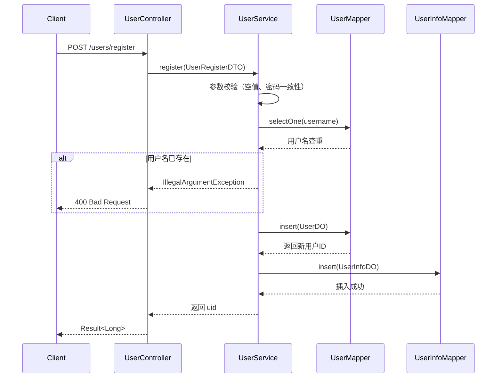
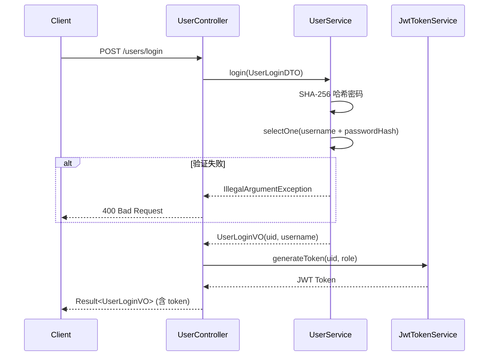
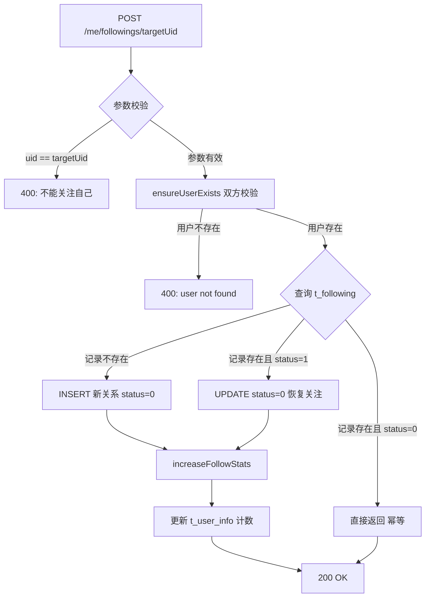
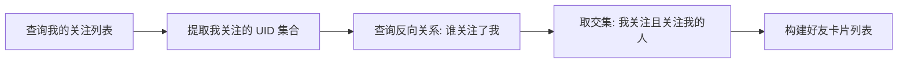
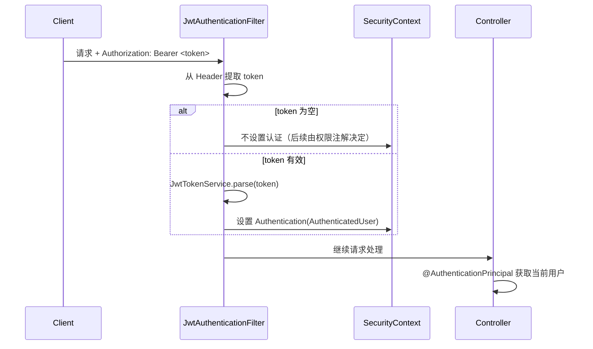

用户与社交关系模块是 Bilibili 平台的核心基础模块，负责用户身份管理、个人资料维护以及用户间的关注/粉丝关系。该模块采用典型的 **双表分离设计**（认证表 + 信息表），并通过**软状态**管理关注关系，实现了关注、取关、互关好友查询等社交功能。

## 模块架构总览

用户与社交关系模块由三个核心子模块组成：**用户模块**（身份与资料）、**关注关系模块**（社交图谱）和**访问控制模块**（权限边界）。三者协作形成完整的用户生命周期管理体系。

```mermaid
graph TB
    subgraph "前端层 (bilibili_web)"
        AuthView[AuthView 登录/注册]
        SettingsView[SettingsView 资料设置]
        UserSpaceView[UserSpaceView 用户空间]
    end

    subgraph "控制层 (Controller)"
        UserController[UserController<br/>/users]
        MeUserController[MeUserController<br/>/me]
        FollowingController[FollowingController<br/>/users/{uid}]
        MeFollowingController[MeFollowingController<br/>/me/followings]
    end

    subgraph "服务层 (Service)"
        UserService[UserService]
        FollowingService[FollowingService]
        UserAccessService[UserAccessService]
    end

    subgraph "数据访问层 (Mapper)"
        UserMapper[UserMapper]
        UserInfoMapper[UserInfoMapper]
        FollowingMapper[FollowingMapper]
        UserAccessMapper[UserAccessMapper]
    end

    subgraph "数据存储 (MySQL)"
        t_user[(t_user)]
        t_user_info[(t_user_info)]
        t_following[(t_following)]
        t_user_access[(t_user_access)]
    end

    AuthView -->|POST /users/login, /register| UserController
    SettingsView -->|PUT /me/profile| MeUserController
    UserSpaceView -->|GET /users/{uid}, /followers, /followings| FollowingController
    UserSpaceView -->|POST/DELETE /me/followings| MeFollowingController

    UserController --> UserService
    MeUserController --> UserService
    FollowingController --> FollowingService
    MeFollowingController --> FollowingService

    UserService --> UserMapper
    UserService --> UserInfoMapper
    FollowingService --> FollowingMapper
    FollowingService --> UserInfoMapper
    FollowingService --> UserMapper
    UserAccessService --> UserAccessMapper

    UserMapper --> t_user
    UserInfoMapper --> t_user_info
    FollowingMapper --> t_following
    UserAccessMapper --> t_user_access
```

Sources: [SecurityConfig.java](bilibili_SpringBoot/src/main/java/com/bilibili/config/security/SecurityConfig.java#L34-L59)

## 数据库设计

用户与社交关系涉及四张核心表，采用**主从分离**和**软状态**两种设计模式。

### 用户表结构

| 表名 | 职责 | 关键字段 | 索引策略 |
|------|------|----------|----------|
| `t_user` | 认证信息（登录凭据） | `id`, `username`, `password`, `role_code`, `status` | `uk_username` 唯一索引 |
| `t_user_info` | 公开资料（展示信息） | `user_id`, `nickname`, `avatar_url`, `sign`, `following_count`, `follower_count` | `uk_user_id` 唯一索引, `idx_nickname` |
| `t_following` | 关注关系 | `user_id`, `following_user_id`, `status` | `uk_user_following` 唯一索引, 双向覆盖索引 |
| `t_user_access` | 访问能力控制 | `user_id`, `like_enabled`, `comment_enabled`, `im_message_send_enabled` 等 | `PK(user_id)` |

**设计要点**：
- **双表分离**：`t_user` 存储认证信息（密码哈希），`t_user_info` 存储公开资料，职责分离便于安全审计
- **软状态关注关系**：`t_following.status` 字段（0=关注中, 1=已取消）实现逻辑删除，支持快速恢复关注关系
- **计数器冗余**：`following_count` 和 `follower_count` 冗余存储在 `t_user_info` 中，避免频繁 JOIN 查询

```sql
-- 关注关系表（软状态设计）
CREATE TABLE t_following (
    id BIGINT NOT NULL,
    user_id BIGINT NOT NULL,
    following_user_id BIGINT NOT NULL,
    status TINYINT(1) DEFAULT 0,  -- 0: 关注中, 1: 已取消
    create_time DATETIME DEFAULT CURRENT_TIMESTAMP,
    update_time DATETIME DEFAULT CURRENT_TIMESTAMP ON UPDATE CURRENT_TIMESTAMP,
    PRIMARY KEY (id),
    UNIQUE KEY uk_user_following (user_id, following_user_id),
    KEY idx_user_status_following (user_id, status, following_user_id),
    KEY idx_following_status_user (following_user_id, status, user_id)
);
```

Sources: [bilibili.sql](bilibili_SpringBoot/src/main/resources/bilibili.sql#L4-L33), [bilibili.sql](bilibili_SpringBoot/src/main/resources/bilibili.sql#L147-L158), [V7__create_user_access_table.sql](bilibili_SpringBoot/src/main/resources/db/migration/V7__create_user_access_table.sql#L1-L11)

## 用户模块详解

用户模块提供完整的用户生命周期管理，包括注册、登录、资料查询和修改。

### API 接口清单

| HTTP 方法 | 路径 | 控制器 | 鉴权要求 | 功能描述 |
|-----------|------|--------|----------|----------|
| `POST` | `/users/register` | `UserController` | 公开 | 用户注册 |
| `POST` | `/users/login` | `UserController` | 公开 | 用户登录，返回 JWT |
| `GET` | `/users/{uid}` | `UserController` | 公开 | 获取用户公开资料 |
| `PUT` | `/me/profile` | `MeUserController` | 需要登录 | 修改当前用户资料 |
| `POST` | `/me/uploads/avatar` | `AvatarUploadController` | 需要登录 | 上传头像 |

### 注册流程

用户注册采用**事务性双表写入**策略，确保 `t_user` 和 `t_user_info` 的数据一致性。



**关键实现细节**：
- 密码采用 **SHA-256** 哈希存储，不使用盐值（简化实现）
- 注册时初始化 `following_count=0`, `follower_count=0`
- 使用 `@Transactional(rollbackFor = Exception.class)` 保证事务原子性

Sources: [UserServiceImpl.java](bilibili_SpringBoot/src/main/java/com/bilibili/user/service/impl/UserServiceImpl.java#L39-L83)

### 登录流程

登录接口验证用户名密码后生成 JWT 令牌，令牌中包含用户 ID 和角色信息。



**JWT 令牌结构**：
- `sub`: 用户 ID（字符串形式）
- `role_code`: 角色代码（0=普通用户, 1=管理员）
- `iat`: 签发时间
- `exp`: 过期时间（默认 7 天）

Sources: [UserServiceImpl.java](bilibili_SpringBoot/src/main/java/com/bilibili/user/service/impl/UserServiceImpl.java#L85-L109), [JwtTokenService.java](bilibili_SpringBoot/src/main/java/com/bilibili/security/JwtTokenService.java#L39-L49)

### 资料管理

用户资料采用**选择性更新**策略，只更新传入的非空字段。

| 操作 | API | 可更新字段 | 业务规则 |
|------|-----|------------|----------|
| 查询公开资料 | `GET /users/{uid}` | - | 返回 `UserProfileVO`（含粉丝/关注数） |
| 修改个人资料 | `PUT /me/profile` | `nickname`, `sign` | 需要登录，受 `profile_edit_enabled` 权限控制 |
| 上传头像 | `POST /me/uploads/avatar` | `avatar_url` | 支持图片格式，存储至 MinIO |

Sources: [UserServiceImpl.java](bilibili_SpringBoot/src/main/java/com/bilibili/user/service/impl/UserServiceImpl.java#L125-L169), [SettingsView.vue](bilibili_web/src/views/SettingsView.vue#L23-L33)

## 关注关系模块详解

关注关系模块实现了用户间的社交图谱，支持关注、取关、查询粉丝/关注/互关好友等核心社交功能。

### API 接口清单

| HTTP 方法 | 路径 | 控制器 | 鉴权要求 | 功能描述 |
|-----------|------|--------|----------|----------|
| `GET` | `/users/{uid}/followers` | `FollowingController` | 公开 | 查询用户的粉丝列表 |
| `GET` | `/users/{uid}/followings` | `FollowingController` | 公开 | 查询用户的关注列表 |
| `GET` | `/users/{uid}/friends` | `FollowingController` | 公开 | 查询用户的互关好友 |
| `POST` | `/me/followings/{targetUid}` | `MeFollowingController` | 需要登录 | 关注目标用户 |
| `DELETE` | `/me/followings/{targetUid}` | `MeFollowingController` | 需要登录 | 取消关注目标用户 |

### 关注/取关流程

关注操作采用**幂等性设计**，支持三种场景：新建关注、恢复关注、重复关注（幂等返回）。



**计数器更新策略**：
- **关注时**：当前用户 `following_count + 1`，目标用户 `follower_count + 1`
- **取关时**：当前用户 `following_count - 1`（最小 0），目标用户 `follower_count - 1`（最小 0）
- 使用 `IFNULL(following_count, 0) + 1` 和 `GREATEST(IFNULL(following_count, 0) - 1, 0)` 防止 NULL 和负数

Sources: [FollowersService.java](bilibili_SpringBoot/src/main/java/com/bilibili/following/service/impl/FollowersService.java#L125-L166), [FollowersService.java](bilibili_SpringBoot/src/main/java/com/bilibili/following/service/impl/FollowersService.java#L168-L197)

### 互关好友查询

互关好友查询通过**两次关系查询 + 交集运算**实现，算法复杂度为 O(n + m)。



**实现逻辑**：
1. 查询 `t_following`：`user_id = uid AND status = 0`，获取我的关注列表
2. 提取关注的用户 ID 集合
3. 查询 `t_following`：`user_id IN (我的关注) AND following_user_id = uid AND status = 0`
4. 取交集得到互关好友

Sources: [FollowersService.java](bilibili_SpringBoot/src/main/java/com/bilibili/following/service/impl/FollowersService.java#L82-L123)

## 访问控制模块

访问控制模块通过 `t_user_access` 表实现细粒度的功能权限管理，支持对用户行为进行精细化控制。

### 权限矩阵

| 权限字段 | 功能描述 | 默认值 | 控制的 API |
|----------|----------|--------|------------|
| `like_enabled` | 点赞权限 | 1（允许） | 视频点赞、弹幕点赞、评论点赞 |
| `comment_enabled` | 评论权限 | 1（允许） | 发表评论 |
| `im_message_send_enabled` | 私信权限 | 1（允许） | 发送即时消息 |
| `video_upload_enabled` | 投稿权限 | 1（允许） | 上传视频 |
| `profile_edit_enabled` | 资料编辑权限 | 1（允许） | 修改个人资料 |

**权限检查示例**：
```java
// 在 MeUserController 中使用
@PutMapping("/profile")
@PreAuthorize("@accessAuthz.canEditProfile(authentication)")
public Result<Void> updateMyProfile(...) {
    // 只有 profile_edit_enabled=true 的用户才能执行
}
```

Sources: [UserAccessServiceImpl.java](bilibili_SpringBoot/src/main/java/com/bilibili/access/service/impl/UserAccessServiceImpl.java#L56-L59), [V7__create_user_access_table.sql](bilibili_SpringBoot/src/main/resources/db/migration/V7__create_user_access_table.sql#L1-L11)

## 前端集成

前端通过 Vue 3 组合式 API 与后端交互，实现用户空间展示和社交关系管理。

### 用户空间页面

`UserSpaceView.vue` 是用户主页的核心组件，采用**并行请求**策略同时加载用户资料、视频、粉丝、关注和互关好友数据。

```mermaid
graph LR
    subgraph "UserSpaceView.vue"
        ProfileHero[用户资料卡片]
        VideoGrid[视频网格]
        FollowersList[粉丝列表]
        FollowingsList[关注列表]
        FriendsList[好友列表]
        FollowButton[关注/取关按钮]
    end

    ProfileHero -->|GET /users/{uid}| API1[用户资料 API]
    VideoGrid -->|GET /users/{uid}/videos| API2[视频列表 API]
    FollowersList -->|GET /users/{uid}/followers| API3[粉丝列表 API]
    FollowingsList -->|GET /users/{uid}/followings| API4[关注列表 API]
    FriendsList -->|GET /users/{uid}/friends| API5[好友列表 API]
    FollowButton -->|POST/DELETE /me/followings| API6[关注操作 API]
```

**前端关注状态管理**：
- 通过查询当前用户的关注列表判断是否已关注目标用户
- 关注/取关操作后**乐观更新**本地状态和计数器
- 使用 `UserCard` 组件展示用户卡片（头像、昵称、签名）

Sources: [UserSpaceView.vue](bilibili_web/src/views/UserSpaceView.vue#L37-L65), [UserSpaceView.vue](bilibili_web/src/views/UserSpaceView.vue#L67-L88)

### 认证状态管理

前端通过 `auth.ts` 管理全局认证状态，支持 JWT 解析和本地持久化。

| 状态字段 | 类型 | 存储位置 | 说明 |
|----------|------|----------|------|
| `token` | `string` | localStorage | JWT 令牌 |
| `uid` | `string \| null` | localStorage | 用户 ID |
| `username` | `string` | localStorage | 用户名 |
| `profile` | `UserProfileVO \| null` | 内存 | 当前用户资料（运行时刷新） |
| `ready` | `boolean` | 内存 | 认证状态是否就绪 |

**JWT 解析逻辑**：
- 从 token 的 payload 中提取 `sub` 字段作为用户 ID
- 支持 Base64URL 解码和 JSON 解析
- 解析失败时降级为 localStorage 存储的 uid

Sources: [auth.ts](bilibili_web/src/lib/auth.ts#L21-L37)

## 安全设计

### 认证流程



### 权限控制层级

| 层级 | 机制 | 示例 |
|------|------|------|
| URL 级别 | `SecurityFilterChain` | `/me/**` 需要认证，`/admin/**` 需要 ADMIN 角色 |
| 方法级别 | `@PreAuthorize` | `@PreAuthorize("isAuthenticated()")` |
| 业务级别 | `AccessAuthzService` | `@PreAuthorize("@accessAuthz.canEditProfile(authentication)")` |

Sources: [SecurityConfig.java](bilibili_SpringBoot/src/main/java/com/bilibili/config/security/SecurityConfig.java#L83-L107)

## 设计模式与最佳实践

### 1. 幂等性设计
关注/取关操作均支持幂等调用，避免重复操作导致异常：
- 重复关注：直接返回成功
- 重复取关：直接返回成功

### 2. 软状态管理
关注关系采用软删除（`status` 字段），优势：
- 支持快速恢复关注关系
- 保留历史关系数据
- 便于数据分析和统计

### 3. 计数器冗余
`following_count` 和 `follower_count` 冗余存储在 `t_user_info` 中：
- 避免频繁 JOIN 查询
- 使用 SQL 原子操作保证一致性
- 使用 `IFNULL` 和 `GREATEST` 防御边界情况

### 4. 事务性保证
所有写操作使用 `@Transactional(rollbackFor = Exception.class)`：
- 注册：`t_user` 和 `t_user_info` 原子写入
- 关注：`t_following` 和 `t_user_info` 计数器原子更新

Sources: [FollowersService.java](bilibili_SpringBoot/src/main/java/com/bilibili/following/service/impl/FollowersService.java#L125-L166), [UserServiceImpl.java](bilibili_SpringBoot/src/main/java/com/bilibili/user/service/impl/UserServiceImpl.java#L39-L83)

## 与其他模块的集成关系

用户与社交关系模块作为基础模块，与多个业务模块存在集成关系：

| 集成模块 | 集成方式 | 说明 |
|----------|----------|------|
| [视频管理与弹幕系统](12-shi-pin-guan-li-yu-dan-mu-xi-tong) | `user_id` 外键 | 视频/弹幕关联用户 |
| [评论与搜索服务](13-ping-lun-yu-sou-suo-fu-wu) | `user_id` 外键 | 评论关联用户，支持用户搜索 |
| [即时通信系统](16-im-ling-yu-mo-xing-yu-ying-yong-ceng-bian-pai) | 私信权限控制 | `im_message_send_enabled` 控制私信功能 |
| [管理后台 API](15-guan-li-hou-tai-api) | 用户管理 | 管理员可查看/修改用户状态 |

## 当前实现边界与演进方向

### 当前限制
1. **查询不分页**：粉丝/关注/好友列表返回全量数据，数据量大时性能受限
2. **无缓存层**：用户资料和关注关系直接查询数据库，未使用 Redis 缓存
3. **互关查询效率**：通过两次查询 + 内存交集实现，数据量大时可考虑专用 SQL 优化
4. **密码哈希无盐**：使用纯 SHA-256，生产环境建议使用 BCrypt

### 潜在演进方向
1. **分页支持**：为列表接口添加游标分页
2. **Redis 缓存**：热点用户资料和关注关系缓存
3. **关注动态推送**：关注/取关事件发布到消息队列
4. **双向关系表**：优化互关查询，直接维护双向关系记录

## 下一步阅读

了解用户与社交关系模块后，建议按以下顺序继续阅读：

1. **[视频管理与弹幕系统](12-shi-pin-guan-li-yu-dan-mu-xi-tong)** — 了解用户如何发布和互动视频内容
2. **[评论与搜索服务](13-ping-lun-yu-sou-suo-fu-wu)** — 了解用户评论和内容搜索功能
3. **[JWT 认证与 Spring Security 权限体系](9-jwt-ren-zheng-yu-spring-security-quan-xian-ti-xi)** — 深入了解认证授权机制
4. **[即时通信（IM）前端集成](6-ji-shi-tong-xin-im-qian-duan-ji-cheng)** — 了解私信功能的前端实现