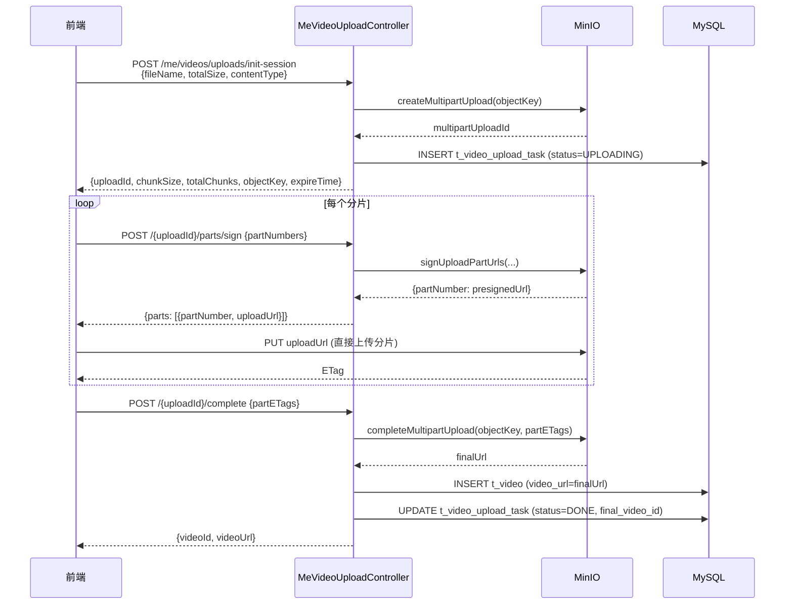
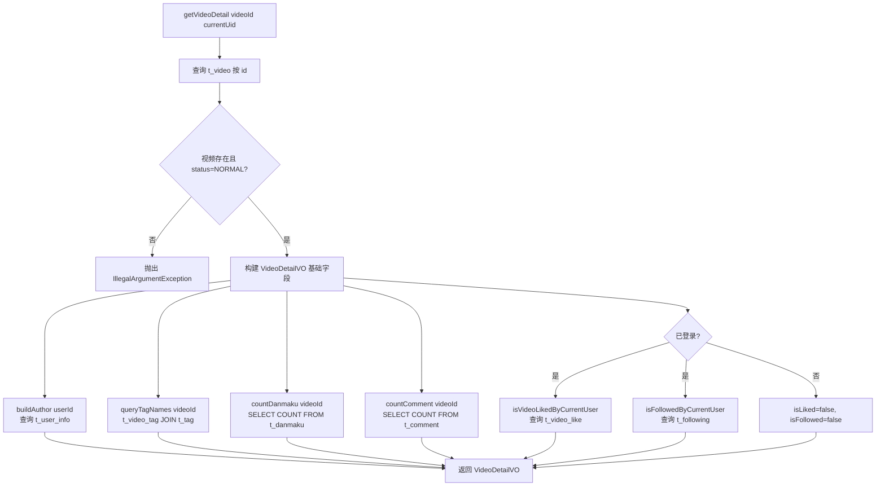
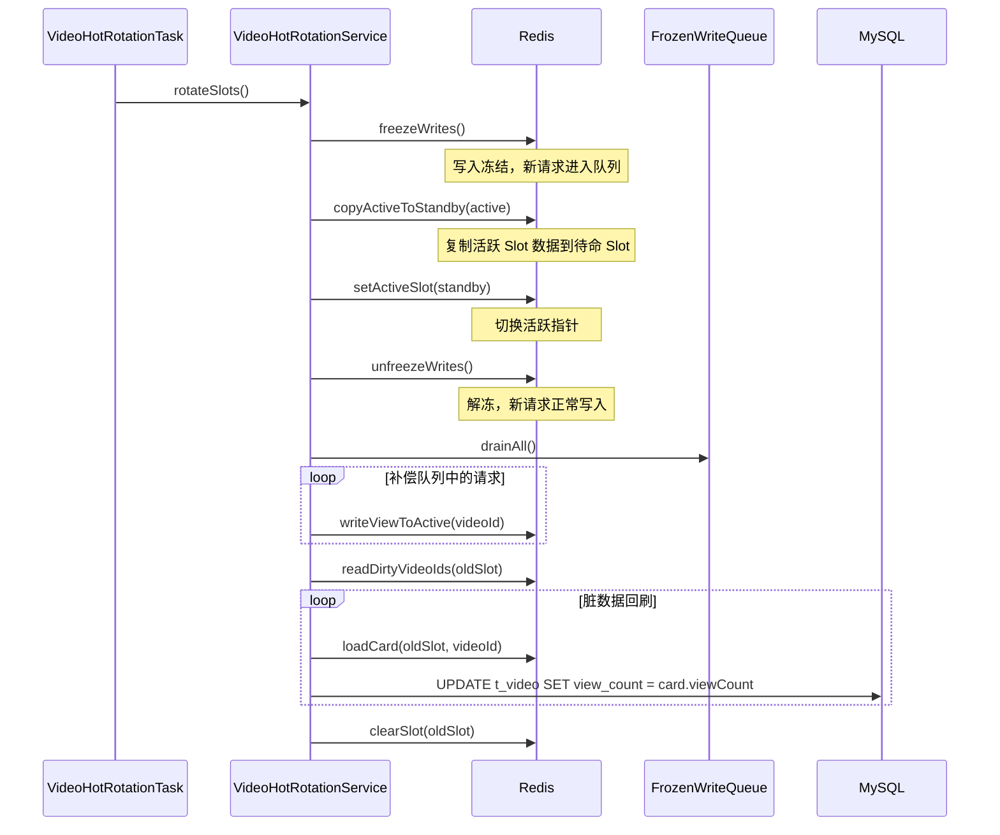

本文档深入解析 B 站项目中视频业务的核心模块：**视频生命周期管理**（上传→审核→发布→浏览→互动）、**弹幕数据模型**以及**基于 Redis Lua 脚本驱动的双 Slot 热度排行榜系统**。文档面向需要理解视频业务完整数据流与架构决策的后端/全栈开发者。

## 模块总览与分层架构

视频模块采用**经典三层分层架构**，各层职责清晰分离：Controller 层处理 HTTP 请求与参数校验；Application Service 层编排跨域操作；Domain Service 层封装核心业务规则与数据访问。热度排行榜作为独立子系统，通过 Facade 模式与主流程解耦。

```mermaid
flowchart TD
    subgraph 控制层
        VC[VideoController<br/>GET /videos, /videos/rank, /videos/{id}]
        UVC[UserVideoController<br/>GET /users/{uid}/videos]
        MVLC[MeVideoLikeController<br/>POST/DELETE /me/videos/{id}/likes]
        MVC[MeVideoUploadController<br/>POST /me/videos/uploads/*]
        AVC[AdminVideoController<br/>GET/PUT /admin/videos/*]
    end

    subgraph 应用层
        VAS[VideoApplicationService<br/>编排入口]
    end

    subgraph 领域层
        VDS[VideoDomainService<br/>视频查询/点赞/校验]
        VHF[VideoHotFacade<br/>热度排行榜门面]
        VHRS[VideoHotRotationService<br/>双 Slot 轮转]
    end

    subgraph 数据层
        MySQL[(MySQL<br/>t_video, t_danmaku,<br/>t_video_like, t_tag)]
        Redis[(Redis<br/>ZSET 排行榜<br/>HASH 视频卡片)]
        MinIO[(MinIO<br/>视频文件/封面)]
    end

    VC --> VAS
    UVC --> VAS
    MVLC --> VAS
    MVC --> MinIO
    AVC --> MySQL

    VAS --> VDS
    VAS --> VHF

    VDS --> MySQL
    VHF --> Redis
    VHF --> VDS
    VHRS --> Redis
    VHRS --> MySQL
```

Sources: [VideoApplicationServiceImpl.java](bilibili_SpringBoot/src/main/java/com/bilibili/video/service/application/impl/VideoApplicationServiceImpl.java#L14-L60), [VideoDomainServiceImpl.java](bilibili_SpringBoot/src/main/java/com/bilibili/video/service/domain/impl/VideoDomainServiceImpl.java#L38-L65), [VideoHotFacade.java](bilibili_SpringBoot/src/main/java/com/bilibili/video/service/hot/VideoHotFacade.java#L24-L45)

## 视频数据模型

视频模块涉及的核心数据表包括 `t_video`（视频主表）、`t_video_like`（点赞关系）、`t_tag`/`t_video_tag`（标签多对多）、`t_danmaku`（弹幕）和 `t_danmaku_like`（弹幕点赞）。所有实体 ID 均使用雪花算法生成，`status` 字段采用软删除策略（0=正常，1=已删除）。

| 表名 | 主键 | 核心字段 | 用途 |
|------|------|----------|------|
| `t_video` | `id` (BIGINT) | `user_id`, `title`, `video_url`, `cover_url`, `duration`, `view_count`, `like_count`, `comment_count` | 视频主表 |
| `t_video_like` | `id` (BIGINT) | `video_id`, `user_id`, `status` | 用户-视频点赞关系，UNIQUE(`user_id`, `video_id`) |
| `t_tag` | `id` (BIGINT) | `name`, `use_count`, `status` | 标签字典 |
| `t_video_tag` | `id` (BIGINT) | `video_id`, `tag_id`, `status` | 视频-标签关联 |
| `t_danmaku` | `id` (BIGINT) | `video_id`, `user_id`, `content`, `show_time`(ms), `like_count`, `status` | 弹幕内容 |
| `t_danmaku_like` | `id` (BIGINT) | `danmaku_id`, `user_id`, `status` | 弹幕点赞，UNIQUE(`user_id`, `danmaku_id`) |

`t_video` 表上建有覆盖高频查询的复合索引：`idx_user_status_create`(`user_id`, `status`, `create_time`) 用于按用户查询投稿；`idx_status_create`(`status`, `create_time`) 用于全局按时间排序；`idx_view_count` 用于按播放量排序。

Sources: [bilibili.sql](bilibili_SpringBoot/src/main/resources/bilibili.sql#L47-L113), [VideoDO.java](bilibili_SpringBoot/src/main/java/com/bilibili/video/model/entity/VideoDO.java#L10-L53), [DanmakuDO.java](bilibili_SpringBoot/src/main/java/com/bilibili/video/model/entity/DanmakuDO.java#L10-L30)

## 视频上传流程（MinIO Multipart 直传）

视频上传采用 **MinIO Multipart 直传**方案，前端直接向 MinIO 上传分片，后端仅负责会话管理和签名 URL 生成，避免了大文件经过 Spring Boot 中转的性能瓶颈。整个流程分为四个阶段：



上传任务状态机：`UPLOADING(0)` → `COMPLETING(1)` → `DONE(2)`，异常路径为 `EXPIRED(3)`/`FAILED(4)`/`CANCELLED(5)`。会话过期时间默认 24 小时，由 `MinioProperties.sessionExpireHours` 配置。

Sources: [MeVideoUploadController.java](bilibili_SpringBoot/src/main/java/com/bilibili/upload/video/controller/MeVideoUploadController.java#L31-L82), [VideoUploadServiceImpl.java](bilibili_SpringBoot/src/main/java/com/bilibili/upload/video/service/impl/VideoUploadServiceImpl.java#L54-L107), [bilibili.sql L160-L182](bilibili_SpringBoot/src/main/resources/bilibili.sql#L160-L182)

## 视频详情查询与互动

`GET /videos/{videoId}` 是视频播放页的核心接口，由 `VideoHotFacade.getVideoDetail` 委托 `VideoDomainService.getVideoDetail` 执行。该方法一次性聚合了视频元信息、作者信息、标签列表、弹幕计数、评论计数、当前用户点赞/关注状态等多维度数据。



**点赞操作**采用「先查后写」策略：查询 `t_video_like` 中是否存在记录，若不存在则插入新记录并递增 `t_video.like_count`；若存在但状态为 `DELETED` 则重新激活。取消点赞采用软删除 + 原子递减（`GREATEST(like_count - 1, 0)` 防止负数）。整个流程在 `@Transactional` 事务内执行。

Sources: [VideoDomainServiceImpl.java L94-L125](bilibili_SpringBoot/src/main/java/com/bilibili/video/service/domain/impl/VideoDomainServiceImpl.java#L94-L125), [VideoDomainServiceImpl.java L136-L205](bilibili_SpringBoot/src/main/java/com/bilibili/video/service/domain/impl/VideoDomainServiceImpl.java#L136-L205), [VideoDetailVO.java](bilibili_SpringBoot/src/main/java/com/bilibili/video/model/vo/VideoDetailVO.java#L11-L45)

## 弹幕系统设计

弹幕（Danmaku）是视频播放时从屏幕飘过的实时评论，在本项目中采用**持久化存储 + 数量聚合**的架构模式。弹幕内容存储在 `t_danmaku` 表，`show_time` 字段记录弹幕在视频中的出现时间（毫秒），用于前端播放时的精准定位。

### 弹幕数据结构

| 字段 | 类型 | 说明 |
|------|------|------|
| `id` | BIGINT (雪花) | 弹幕唯一标识 |
| `video_id` | BIGINT | 所属视频 ID |
| `user_id` | BIGINT | 发送者用户 ID |
| `content` | TEXT | 弹幕文本内容 |
| `show_time` | BIGINT | 视频播放时间点（毫秒） |
| `like_count` | BIGINT | 弹幕点赞数 |
| `status` | TINYINT | 0=正常, 1=已删除 |

`DanmakuLikeDO` 实体通过 `t_danmaku_like` 表实现弹幕点赞功能，`UNIQUE(user_id, danmaku_id)` 约束保证每个用户对同一条弹幕只能点赞一次。

### 弹幕计数与展示

视频详情接口中的 `danmakuCount` 字段通过 `countDanmaku(videoId)` 方法实时查询 `t_danmaku` 表获取：

```java
private Long countDanmaku(Long videoId) {
    LambdaQueryWrapper<DanmakuDO> query = new LambdaQueryWrapper<>();
    query.eq(DanmakuDO::getVideoId, videoId)
         .eq(DanmakuDO::getStatus, RecordStatus.NORMAL.code());
    Long count = danmakuMapper.selectCount(query);
    return count == null ? 0L : count;
}
```

弹幕计数直接走 MySQL 查询，未引入 Redis 缓存，因为弹幕数量属于低频读取场景（仅视频详情页加载时读取一次），且 `COUNT` 查询在 `idx_video_id` 索引上性能可接受。前端 `VideoDetailView.vue` 中 `danmakuCount` 字段已在 TypeScript 类型定义中声明，但当前模板层尚未渲染弹幕播放器组件——这表明弹幕播放器 UI 是一个待实现的功能扩展点。

Sources: [bilibili.sql L71-L99](bilibili_SpringBoot/src/main/resources/bilibili.sql#L71-L99), [DanmakuDO.java](bilibili_SpringBoot/src/main/java/com/bilibili/video/model/entity/DanmakuDO.java#L10-L30), [DanmakuLikeDO.java](bilibili_SpringBoot/src/main/java/com/bilibili/video/model/entity/DanmakuLikeDO.java#L10-L26), [VideoDomainServiceImpl.java L250-L256](bilibili_SpringBoot/src/main/java/com/bilibili/video/service/domain/impl/VideoDomainServiceImpl.java#L250-L256)

## Redis Lua 脚本驱动的双 Slot 热度排行榜

热度排行榜是视频首页和排行榜页的核心数据源，采用**双 Slot 轮转 + Lua 原子操作**的高并发设计方案。该系统将播放量数据完全托管在 Redis 中，通过定时任务周期性回刷 MySQL，实现了读写分离与性能最大化。

### 核心设计思想

传统方案中，每次播放量递增都需要同步更新 MySQL 和 Redis，高并发下会产生锁竞争。本方案的核心创新在于：

1. **双 Slot 轮转**：维护 `slot_a` 和 `slot_b` 两个排行榜，同一时刻只有一个活跃（Active），另一个待命（Standby）。轮转时将活跃 Slot 的数据复制到待命 Slot，然后切换活跃指针。
2. **Lua 原子脚本**：播放量递增、排行榜排名更新、卡片数据写入全部在一个 Lua 脚本中原子完成，避免了多次 Redis 调用的竞态问题。
3. **写入冻结与补偿队列**：轮转期间短暂冻结写入，冻结期间的播放量请求进入 `ConcurrentLinkedQueue` 补偿队列，轮转完成后 drain 并重新写入。

```mermaid
flowchart TD
    subgraph "播放量写入流程"
        A[POST /videos/{id}/views] --> B[VideoHotFacade.increaseViewCount]
        B --> C{isWriteFrozen?}
        C -- 是 --> D[offer 到 VideoFrozenWriteQueue]
        C -- 否 --> E[writeViewToActive]
        E --> F[ensureCardPresent<br/>若卡片不存在则从 MySQL 加载]
        F --> G[VideoHotLuaRepository.increaseView<br/>执行 Lua 脚本]
    end

    subgraph "Lua 脚本原子操作"
        G --> H[HINCRBY cardKey viewCount 1]
        H --> I[SADD dirtyKey videoId]
        I --> J[ZSCORE rankKey videoId]
        J --> K{已上榜?}
        K -- 是 --> L[ZADD rankKey newScore videoId]
        K -- 否 --> M{排行榜未满?}
        M -- 是 --> N[ZADD rankKey newScore videoId]
        M -- 否 --> O{超过最低分?}
        O -- 是 --> P[替换最低分条目]
        O -- 否 --> Q[标记为 ephemeral]
    end
```

### Redis Key 结构

| Key 模式 | 数据类型 | 用途 |
|----------|----------|------|
| `home:video:active-slot` | STRING | 当前活跃 Slot 标识（"a" 或 "b"） |
| `home:video:write-frozen` | STRING | 写入冻结标记（存在即冻结） |
| `rank:video:view:{slot}` | ZSET | 排行榜，member=videoId, score=viewCount |
| `video:card:{slot}:{videoId}` | HASH | 视频卡片缓存（title, coverUrl, viewCount 等） |
| `video:dirty:{slot}` | SET | 脏数据集合（需要回刷 MySQL 的 videoId） |
| `video:card:index:{slot}` | SET | 卡片索引集合 |

### 双 Slot 轮转机制

轮转由 `VideoHotRotationTask` 定时触发（默认每 5 分钟），执行流程如下：



Sources: [VideoHotRotationService.java](bilibili_SpringBoot/src/main/java/com/bilibili/video/service/hot/VideoHotRotationService.java#L12-L62), [VideoHotRotationTask.java](bilibili_SpringBoot/src/main/java/com/bilibili/video/task/VideoHotRotationTask.java#L8-L24), [VideoFrozenWriteQueue.java](bilibili_SpringBoot/src/main/java/com/bilibili/video/redis/VideoFrozenWriteQueue.java#L11-L29), [increase_video_view.lua](bilibili_SpringBoot/src/main/resources/scripts/redis/increase_video_view.lua#L1-L49)

### 热度排行榜配置

热度系统通过 `VideoHotProperties` 管理配置参数，所有参数均可通过 `application.yaml` 的 `app.video.*` 节点覆盖：

| 参数 | 默认值 | 说明 |
|------|--------|------|
| `rankSize` | 100 | 排行榜最大容量 |
| `switchIntervalMinutes` | 5 | Slot 轮转间隔（分钟） |
| `activeWindowMinutes` | 5 | 活跃窗口时长 |
| `copyBatchSize` | 100 | Slot 复制批次大小 |
| `flushBatchSize` | 100 | 脏数据回刷批次大小 |

系统启动时，`VideoHotBootstrapService` 实现 `ApplicationRunner` 接口，从 MySQL 按 `view_count DESC` 加载 Top N 视频初始化活跃 Slot，确保首次请求就有数据返回。

Sources: [VideoHotProperties.java](bilibili_SpringBoot/src/main/java/com/bilibili/config/properties/VideoHotProperties.java#L9-L53), [VideoHotBootstrapService.java](bilibili_SpringBoot/src/main/java/com/bilibili/video/service/hot/VideoHotBootstrapService.java#L15-L35), [VideoRedisKeys.java](bilibili_SpringBoot/src/main/java/com/bilibili/video/redis/VideoRedisKeys.java#L3-L35)

## 管理后台视频审核

管理员通过 `AdminVideoController` 对用户上传的视频进行审核。视频在上传完成后进入 `待审核` 状态（`status=0`），管理员可将其置为 `已上架`（`status=0`，与待审核共用同一状态值，通过业务逻辑区分）或 `已拒绝`（`status=1`）。

管理端前端 `AdminVideosView.vue` 提供三个 Tab：「待审核」「已通过」「已拒绝」，使用游标分页（Cursor-based Pagination）加载视频列表。审核操作通过 `PUT /admin/videos/{videoId}/status` 接口完成。

Sources: [AdminVideoController.java](bilibili_SpringBoot/src/main/java/com/bilibili/admin/controller/AdminVideoController.java#L19-L59), [AdminVideosView.vue](bilibili_admin_web/src/views/AdminVideosView.vue#L1-L117)

## 前端集成

### 用户端视频播放页

`VideoDetailView.vue` 是视频播放的核心页面，采用左右两栏布局：左侧为视频播放器、视频信息面板和评论区；右侧为作者信息卡片。页面加载时并发请求视频详情（`GET /videos/{id}`）和评论列表（`GET /videos/{id}/comments`），同时异步触发播放量递增（`POST /videos/{id}/views`）。

视频信息面板展示播放量、点赞数、评论数、上传时间、标签列表，以及点赞/关注操作按钮。点赞和关注操作均支持 toggle 模式，前端乐观更新 UI 状态，失败时回滚。

Sources: [VideoDetailView.vue](bilibili_web/src/views/VideoDetailView.vue#L1-L50), [types.ts L48-L69](bilibili_web/src/types.ts#L48-L69)

### 首页视频列表与排行榜

`HomeView.vue` 并发请求视频列表（`GET /videos`）和排行榜（`GET /videos/rank`）。视频列表由 `VideoHotFacade.listHomeVideos` 从 Redis 排行榜读取 Top N 视频 ID，再批量加载卡片数据；排行榜接口额外返回 `rank`（排名）和 `score`（播放量分数）字段。

Sources: [HomeView.vue](bilibili_web/src/views/HomeView.vue#L27-L43), [VideoHotFacade.java L47-L70](bilibili_SpringBoot/src/main/java/com/bilibili/video/service/hot/VideoHotFacade.java#L47-L70)

## API 接口速查

| 方法 | 路径 | 认证 | 说明 |
|------|------|------|------|
| GET | `/videos` | 可选 | 视频列表（热度排行榜驱动） |
| GET | `/videos/rank` | 可选 | 视频排行榜（带排名和分数） |
| GET | `/videos/{videoId}` | 可选 | 视频详情（聚合弹幕/评论计数、点赞/关注状态） |
| POST | `/videos/{videoId}/views` | 可选 | 递增播放量 |
| GET | `/users/{uid}/videos` | 可选 | 指定用户的已发布视频列表 |
| POST | `/me/videos/{videoId}/likes` | 必须 | 点赞视频 |
| DELETE | `/me/videos/{videoId}/likes` | 必须 | 取消点赞 |
| POST | `/me/videos/uploads/init-session` | 必须 | 初始化上传会话 |
| POST | `/me/videos/uploads/{uploadId}/parts/sign` | 必须 | 签名分片上传 URL |
| GET | `/me/videos/uploads/{uploadId}` | 必须 | 查询上传状态 |
| POST | `/me/videos/uploads/{uploadId}/complete` | 必须 | 完成上传 |
| DELETE | `/me/videos/uploads/{uploadId}` | 必须 | 取消上传 |
| GET | `/admin/videos/pending` | ADMIN | 待审核视频列表 |
| GET | `/admin/videos/published` | ADMIN | 已上架视频列表 |
| GET | `/admin/videos/deleted` | ADMIN | 已拒绝视频列表 |
| PUT | `/admin/videos/{videoId}/status` | ADMIN | 审核视频 |

Sources: [VideoController.java](bilibili_SpringBoot/src/main/java/com/bilibili/video/controller/VideoController.java#L25-L60), [MeVideoLikeController.java](bilibili_SpringBoot/src/main/java/com/bilibili/video/controller/MeVideoLikeController.java#L22-L48), [MeVideoUploadController.java](bilibili_SpringBoot/src/main/java/com/bilibili/upload/video/controller/MeVideoUploadController.java#L31-L82), [AdminVideoController.java](bilibili_SpringBoot/src/main/java/com/bilibili/admin/controller/AdminVideoController.java#L19-L59)

## 相关页面导航

- 要了解视频文件存储的底层实现，请参阅 [MinIO 对象存储服务](14-minio-dui-xiang-cun-chu-fu-wu)
- 要了解视频评论功能的设计，请参阅 [评论与搜索服务](13-ping-lun-yu-sou-suo-fu-wu)
- 要了解热度排行榜 Redis 设计的更多细节，请参阅 [Redis Lua 脚本驱动的双 Slot 热度排行榜](24-redis-lua-jiao-ben-qu-dong-de-shuang-slot-re-du-pai-xing-bang)
- 要了解管理后台的整体设计，请参阅 [管理后台 API](15-guan-li-hou-tai-api)
- 要了解数据库迁移策略，请参阅 [数据库设计与 Flyway 迁移管理](10-shu-ju-ku-she-ji-yu-flyway-qian-yi-guan-li)