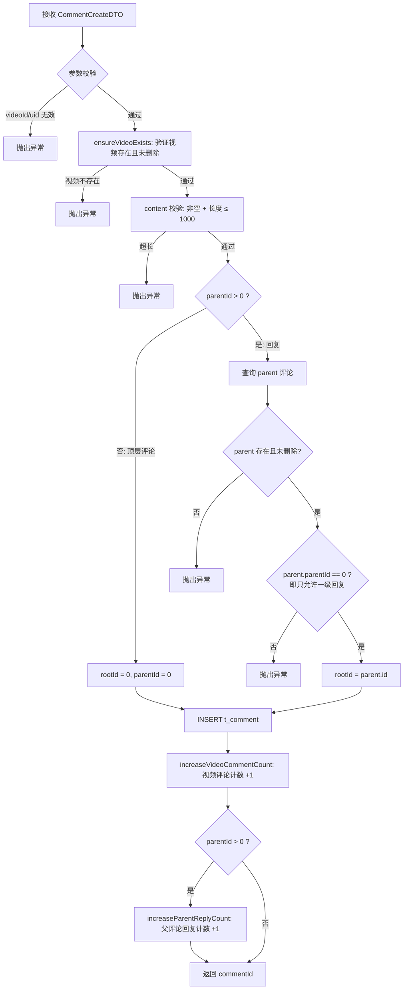
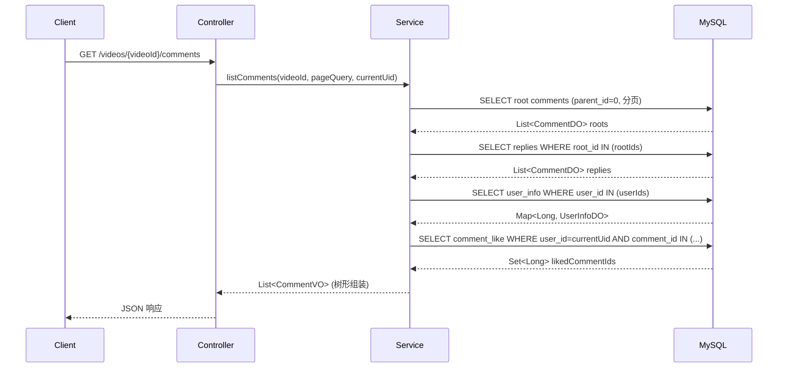
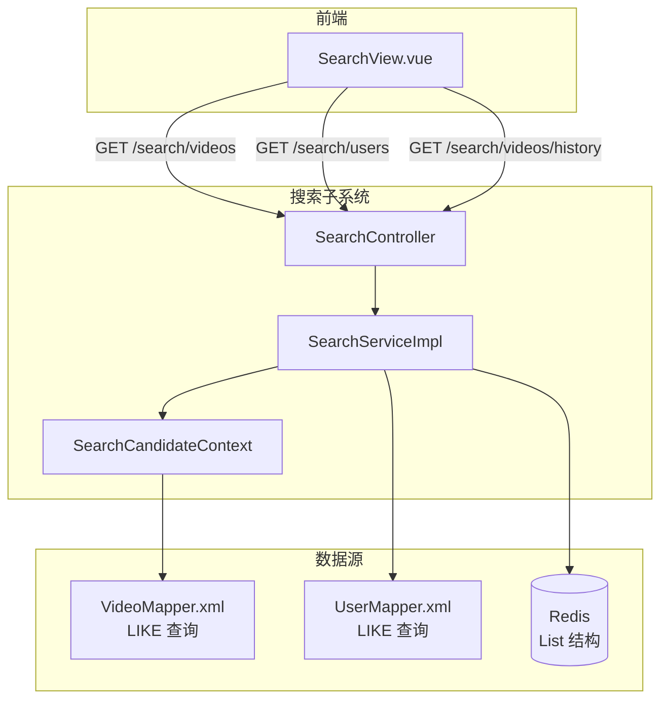
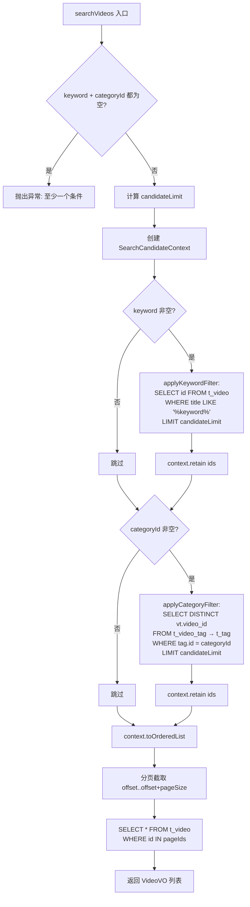
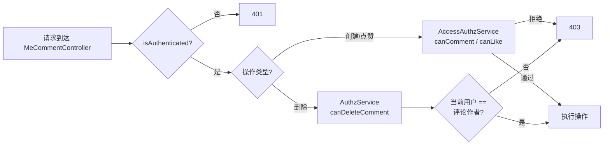

本页聚焦于 Bilibili 项目中**评论子系统**和**搜索子系统**的架构设计、数据模型与实现细节。两者同属后端业务模块（`com.bilibili.comment` 与 `com.bilibili.search`），各自独立编排、互不耦合，但通过 [JWT 认证与 Spring Security 权限体系](9-jwt-ren-zheng-yu-spring-security-quan-xian-ti-xi) 和 [数据库设计与 Flyway 迁移管理](10-shu-ju-ku-she-ji-yu-flyway-qian-yi-guan-li) 共享同一套基础设施。

---

## 整体模块定位与领域边界

在 [Spring Boot 后端架构分层与领域划分](8-spring-boot-hou-duan-jia-gou-fen-ceng-yu-ling-yu-hua-fen) 中，`comment` 和 `search` 各自遵循标准的 **Controller → Service → Mapper** 三层架构。两者在领域上完全解耦——评论服务围绕视频的用户互动展开，搜索服务围绕内容发现展开——但都依赖于 `video`、`user` 等核心领域的实体与 Mapper。

```mermaid
graph TB
    subgraph "评论子系统"
        CC[CommentController<br/>/videos/{id}/comments]
        MCC[MeCommentController<br/>/me/videos/{id}/comments<br/>/me/comments/{id}/likes]
        CS[CommentService]
        CM[CommentMapper]
        CLM[CommentLikeMapper]
    end

    subgraph "搜索子系统"
        SC[SearchController<br/>/search/videos, /search/users]
        SS[SearchService]
        VM[VideoMapper]
        UM[UserMapper]
        RD[(Redis<br/>搜索历史)]
    end

    subgraph "共享依赖"
        DB[(MySQL)]
        SEC[Spring Security]
        AAZ[AccessAuthzService]
        AUTH[AuthzService]
    end

    CC --> CS
    MCC --> CS
    CS --> CM
    CS --> CLM
    MCC --> SEC --> AAZ
    MCC --> SEC --> AUTH

    SC --> SS
    SS --> VM
    SS --> UM
    SS --> RD
    CM --> DB
    CLM --> DB
    VM --> DB
    UM --> DB
```

Sources: [CommentController.java](bilibili_SpringBoot/src/main/java/com/bilibili/comment/controller/CommentController.java#L20-L41), [MeCommentController.java](bilibili_SpringBoot/src/main/java/com/bilibili/comment/controller/MeCommentController.java#L20-L68), [SearchController.java](bilibili_SpringBoot/src/main/java/com/bilibili/search/controller/SearchController.java#L24-L64)

---

## 评论子系统

### 数据模型

评论系统的核心设计是**两级树形评论**结构：顶层评论（`parentId = 0`）与一级回复（`parentId > 0`，指向顶层评论 ID）。为了减少查询时的递归深度，引入了 `rootId` 字段，使回复始终携带其所属顶层评论的 ID，从而在查询回复时可直接通过 `rootId IN (...)` 批量获取。

**t_comment 表结构**：

| 字段 | 类型 | 说明 |
|------|------|------|
| `id` | BIGINT | Snowflake 主键 |
| `video_id` | BIGINT | 所属视频 ID |
| `user_id` | BIGINT | 评论者用户 ID |
| `content` | TEXT | 评论正文（最大 1000 字符） |
| `parent_id` | BIGINT | 父评论 ID，顶层评论为 0 |
| `root_id` | BIGINT | 顶层评论 ID，顶层评论自身为 0 |
| `like_count` | BIGINT | 点赞数（冗余计数器） |
| `reply_count` | INT | 回复数（仅顶层评论有意义） |
| `status` | TINYINT | 0=正常, 1=已删除 |
| `create_time` | DATETIME | 创建时间 |

索引策略：`idx_video_status_parent_create(video_id, status, parent_id, create_time)` 用于高效的分页查询；`idx_root_create(root_id, create_time)` 用于按顶层评论批量获取回复。

**t_comment_like 表结构**：

| 字段 | 类型 | 说明 |
|------|------|------|
| `id` | BIGINT | Snowflake 主键 |
| `comment_id` | BIGINT | 被点赞的评论 ID |
| `user_id` | BIGINT | 点赞者用户 ID |
| `status` | TINYINT | 0=有效, 1=已取消 |
| `create_time` | DATETIME | 首次点赞时间 |
| `update_time` | DATETIME | 最近更新时间 |

关键约束：`UNIQUE KEY uk_user_comment(user_id, comment_id)` 确保同一用户对同一评论只有一条点赞记录。取消点赞采用**软状态切换**（`status` 从 0 → 1），再次点赞时直接恢复原记录（1 → 0），避免频繁 DELETE/INSERT。

Sources: [bilibili.sql](bilibili_SpringBoot/src/main/resources/bilibili.sql#L115-L145), [CommentDO.java](bilibili_SpringBoot/src/main/java/com/bilibili/comment/model/entity/CommentDO.java#L1-L35), [CommentLikeDO.java](bilibili_SpringBoot/src/main/java/com/bilibili/comment/model/entity/CommentLikeDO.java#L1-L27)

### API 端点一览

| HTTP 方法 | 路径 | 权限要求 | 功能 |
|-----------|------|----------|------|
| `GET` | `/videos/{videoId}/comments` | 匿名可访问 | 分页列出视频评论（含回复） |
| `POST` | `/me/videos/{videoId}/comments` | `@accessAuthz.canComment` | 创建评论或回复 |
| `DELETE` | `/me/comments/{commentId}` | `@authz.canDeleteComment` | 删除自己的评论 |
| `POST` | `/me/comments/{commentId}/likes` | `@accessAuthz.canLike` | 点赞评论 |
| `DELETE` | `/me/comments/{commentId}/likes` | `@accessAuthz.canLike` | 取消点赞评论 |

`GET` 端点由 `CommentController` 承载（无需认证），其余写操作端点由 `MeCommentController` 承载，统一要求 `@PreAuthorize("isAuthenticated()")`。评论创建与点赞还额外经过 `AccessAuthzService` 检查用户的操作权限（如封禁状态等），删除则通过 `AuthzService.canDeleteComment()` 校验**评论所有权**。

Sources: [CommentController.java](bilibili_SpringBoot/src/main/java/com/bilibili/comment/controller/CommentController.java#L32-L39), [MeCommentController.java](bilibili_SpringBoot/src/main/java/com/bilibili/comment/controller/MeCommentController.java#L33-L67), [AccessAuthzService.java](bilibili_SpringBoot/src/main/java/com/bilibili/access/authorization/AccessAuthzService.java#L17-L25), [AuthzService.java](bilibili_SpringBoot/src/main/java/com/bilibili/authorization/AuthzService.java#L27-L37)

### 核心业务逻辑

#### 创建评论流程

`CommentServiceImpl.createComment()` 是一个事务性方法，完整流程如下：



关键设计决策：
1. **只支持一级回复**：`parent.parentId > 0` 时拒绝，避免深层嵌套带来的 UI 与查询复杂度。
2. **计数器原子更新**：使用 `SET comment_count = comment_count + 1` 的 SQL 原子操作，避免读-改-写竞态。
3. **GREATEST 兜底**：减少计数时使用 `GREATEST(comment_count - N, 0)` 防止负数。

Sources: [CommentServiceImpl.java](bilibili_SpringBoot/src/main/java/com/bilibili/comment/service/impl/CommentServiceImpl.java#L59-L117)

#### 评论列表查询

`listComments()` 方法采用**两步查询策略**：

**第一步**：分页查询顶层评论。通过 `parent_id = 0 AND status = 0` 过滤，按 `create_time DESC, id DESC` 排序，只取 `normalizedPageSize` 条顶层评论。

**第二步**：一次性批量获取所有回复。收集第一步返回的顶层评论 ID 列表（`rootIds`），通过 `root_id IN (...)` 查询所有 `parent_id != 0` 的回复，按 `create_time ASC, id ASC` 排序。

这种设计将数据库查询压缩到**2 次**（而非 N+1），适合评论回复数量可控的场景。



在组装 VO 时，系统会：
- 通过 `queryUserInfos()` 批量查询评论者的昵称和头像。
- 通过 `queryLikedCommentIds()` 批量查询当前用户已点赞的评论 ID 集合，用于前端渲染"已点赞"状态。
- 将回复按 `rootId` 归入对应顶层评论的 `childComments` 列表。

Sources: [CommentServiceImpl.java](bilibili_SpringBoot/src/main/java/com/bilibili/comment/service/impl/CommentServiceImpl.java#L119-L179)

#### 软删除与级联处理

评论删除采用**逻辑删除**策略（`status` 从 `NORMAL(0)` 改为 `DELETED(1)`）。对于顶层评论的删除，系统还会级联标记其所有回复为已删除，并**同步更新视频的 comment_count**。

删除逻辑区分两种情况：

| 场景 | 处理方式 |
|------|----------|
| 删除**顶层评论** | 标记自身为已删除 → 批量标记 `root_id = commentId` 的回复为已删除 → `video.comment_count -= (1 + 回复数)` |
| 删除**回复** | 标记自身为已删除 → `parent.reply_count -= 1` → `video.comment_count -= 1` |

Sources: [CommentServiceImpl.java](bilibili_SpringBoot/src/main/java/com/bilibili/comment/service/impl/CommentServiceImpl.java#L181-L223)

#### 点赞/取消点赞

点赞操作使用 `CommentLikeDO` 表的**状态切换**机制：

```mermaid
flowchart LR
    A[likeComment] --> B{记录存在?}
    B -->|不存在| C[INSERT 新记录<br/>status=0]
    C --> D[increaseCommentLikeCount]
    B -->|存在| E{status == ?}
    E -->|NORMAL(0)| F[幂等返回]
    E -->|DELETED(1)| G[UPDATE status → 0]
    G --> D

    H[unlikeComment] --> I[UPDATE status → 1<br/>WHERE status=0]
    I --> J[decreaseCommentLikeCount]
```

`uk_user_comment` 唯一约束防止重复插入。点赞/取消点赞分别通过 `like_count = like_count + 1` 和 `like_count = GREATEST(like_count - 1, 0)` 原子更新计数器。

Sources: [CommentServiceImpl.java](bilibili_SpringBoot/src/main/java/com/bilibili/comment/service/impl/CommentServiceImpl.java#L225-L296)

### 前端集成

前端评论功能集中在 `VideoDetailView.vue` 页面中。页面加载时并行请求视频详情与评论列表（`Promise.all`）。评论列表通过 `CommentList.vue` 组件渲染，该组件支持：

- 树形显示：顶层评论 + 嵌套回复（`.reply-stack` 区域）
- 操作按钮：点赞/取消赞、回复、删除（仅评论作者可见）
- 乐观更新：点赞操作直接修改本地 `isLiked` 和 `likeCount`，无需重新请求

Sources: [VideoDetailView.vue](bilibili_web/src/views/VideoDetailView.vue#L97-L163), [CommentList.vue](bilibili_web/src/components/CommentList.vue#L1-L152)

---

## 搜索子系统

### 架构概述

搜索子系统采用**数据库驱动**的方案，直接通过 SQL `LIKE` 查询实现关键词搜索，而非引入 Elasticsearch 等全文搜索引擎。这是一种适合中小规模项目的权衡策略——实现简单、无额外基础设施依赖，但在数据量增长后需考虑迁移到专业搜索引擎。

搜索历史则利用 **Redis List** 存储，提供快速的读写体验和自动过期能力。



Sources: [SearchController.java](bilibili_SpringBoot/src/main/java/com/bilibili/search/controller/SearchController.java#L24-L64), [SearchServiceImpl.java](bilibili_SpringBoot/src/main/java/com/bilibili/search/service/impl/SearchServiceImpl.java#L24-L206)

### API 端点一览

| HTTP 方法 | 路径 | 权限要求 | 功能 |
|-----------|------|----------|------|
| `GET` | `/search/videos` | 匿名可访问 | 按关键词和/或分类搜索视频 |
| `GET` | `/search/users` | 匿名可访问 | 按昵称搜索用户 |
| `GET` | `/search/videos/history` | 需要认证 | 列出当前用户的搜索历史 |

### 视频搜索的候选集策略

视频搜索的核心难点在于**多条件组合**——用户可能只输入关键词、只选择分类、或同时选择两者。`SearchServiceImpl` 通过内部类 `SearchCandidateContext` 实现了一套优雅的**交集过滤**机制：



**candidateLimit 的计算公式**：`min(pageNo × pageSize × 20, 2000)`，下限为 200。这个乘数因子 20 确保在多条件过滤后仍有足够的候选数据可分页。

`SearchCandidateContext.retain()` 的实现使用 `LinkedHashSet<Long>` 保持插入顺序，当多个条件依次应用时，执行**集合交集**操作（`removeIf(id -> !incomingLookup.contains(id))`），精确地保留同时满足所有条件的视频 ID。

Sources: [SearchServiceImpl.java](bilibili_SpringBoot/src/main/java/com/bilibili/search/service/impl/SearchServiceImpl.java#L43-L70), [SearchServiceImpl.java](bilibili_SpringBoot/src/main/java/com/bilibili/search/service/impl/SearchServiceImpl.java#L115-L205), [VideoMapper.xml](bilibili_SpringBoot/src/main/resources/mapper/VideoMapper.xml#L75-L93)

### 用户搜索

用户搜索实现相对简单，直接调用 `UserMapper.selectUsersByNickname()`，SQL 中使用 `CONCAT('%', #{nickname}, '%')` 模式匹配，支持按注册时间升序/降序排列。

Sources: [SearchServiceImpl.java](bilibili_SpringBoot/src/main/java/com/bilibili/search/service/impl/SearchServiceImpl.java#L72-L83), [UserMapper.xml](bilibili_SpringBoot/src/main/resources/mapper/UserMapper.xml#L5-L24)

### 搜索历史管理

搜索历史使用 Redis List 数据结构，配置参数集中定义在 `RedisSearchCacheTuning` 和 `RedisSearchKeys` 中：

| 参数 | 值 | 说明 |
|------|------|------|
| `SEARCH_HISTORY_MAX_SIZE` | 10 | 最大保存条目数 |
| `SEARCH_HISTORY_TTL_HOURS` | 1 小时 | 过期时间 |
| Key 格式 | `search:history:video:{uid}` | 按域（video/user）和用户 ID 隔离 |

记录搜索历史的流程：`LPUSH` 新关键词到列表头部 → `LTRIM` 截断到最大长度 → `EXPIRE` 重置过期时间。三个操作在方法内依次执行，非原子性——在极端高并发下可能短暂超出长度限制，但由于 Key 的 TTL 较短，影响可控。

搜索历史仅在**用户已登录且关键词非空**时才记录，由 `SearchController.searchVideos()` 在调用搜索逻辑之前判断。

Sources: [SearchServiceImpl.java](bilibili_SpringBoot/src/main/java/com/bilibili/search/service/impl/SearchServiceImpl.java#L85-L113), [RedisSearchKeys.java](bilibili_SpringBoot/src/main/java/com/bilibili/config/redis/RedisSearchKeys.java#L1-L23), [RedisSearchCacheTuning.java](bilibili_SpringBoot/src/main/java/com/bilibili/config/redis/RedisSearchCacheTuning.java#L1-L11)

### 前端集成

`SearchView.vue` 提供了统一的搜索入口，支持视频/用户两个 Tab 切换。搜索参数通过 URL query string 同步（`?q=关键词&tab=videos`），使得搜索结果页面可被书签或分享。页面加载时自动读取搜索历史并以标签（pill chip）形式展示在侧边栏，点击历史标签可直接触发搜索。

Sources: [SearchView.vue](bilibili_web/src/views/SearchView.vue#L1-L227)

---

## 分页与参数校验

评论和搜索模块共用 `PageQueryDTO` 作为分页参数容器，提供统一的参数归一化逻辑：

| 参数 | 默认值 | 范围约束 |
|------|--------|----------|
| `pageNo` | 1 | ≥ 1 |
| `pageSize` | 10 | 1 ~ 50 |

评论模块额外通过 `CommentCreateDTO` 校验评论内容（非空、长度 ≤ 1000 字符）。搜索模块通过 `StringTool.normalizeOptional()` / `normalizeRequired()` 对关键词进行 trim 处理，空字符串视为 null。

Sources: [PageQueryDTO.java](bilibili_SpringBoot/src/main/java/com/bilibili/common/page/PageQueryDTO.java#L1-L32), [StringTool.java](bilibili_SpringBoot/src/main/java/com/bilibili/tool/StringTool.java#L1-L39)

---

## 权限控制模型

评论子系统的权限检查分为两层：



- **AccessAuthzService**（Bean 名 `accessAuthz`）：检查用户是否有评论/点赞的**通用权限**，可扩展为封禁检查等。
- **AuthzService**（Bean 名 `authz`）：检查用户是否为资源的**所有者**，删除评论时查询 `t_comment` 验证 `userId == currentUid`。