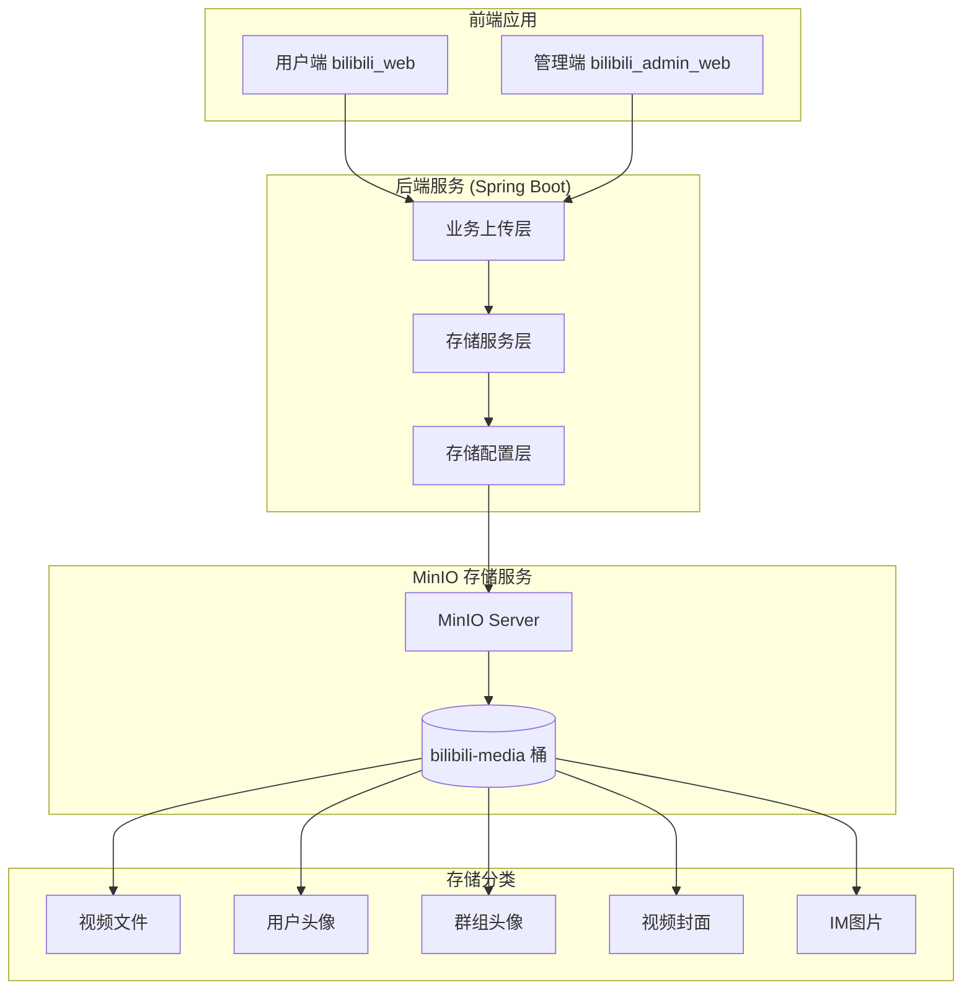
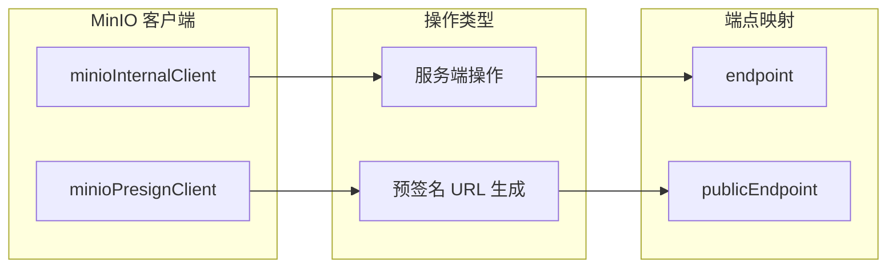
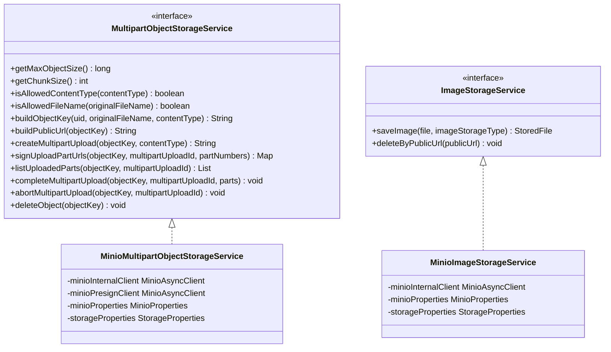
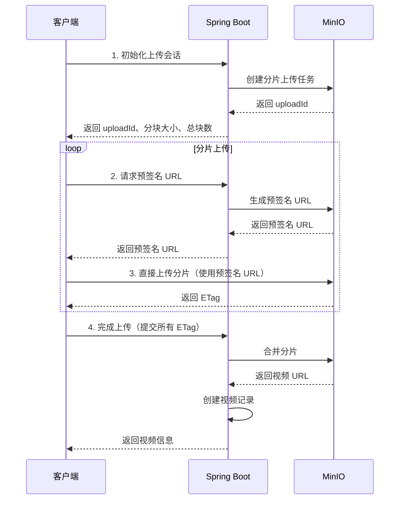
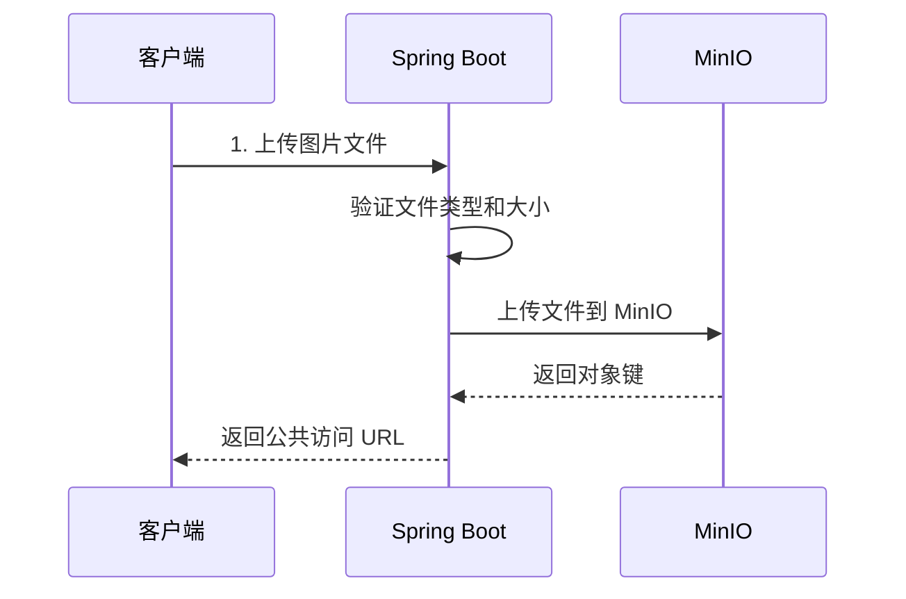
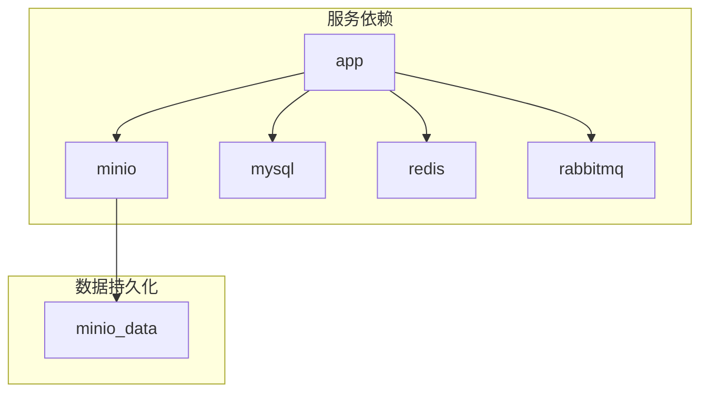

## MinIO 在项目中的角色

MinIO 作为本项目的**核心对象存储服务**，负责存储和管理所有用户生成的媒体内容，包括用户头像、视频文件、视频封面、群组头像以及即时通信中的图片消息。通过采用 S3 兼容的 MinIO 服务，项目实现了与云原生存储生态的无缝对接，同时保持了本地部署的灵活性和数据自主性。

**Sources: [MinioProperties.java](bilibili_SpringBoot/src/main/java/com/bilibili/config/properties/MinioProperties.java#L1-L137)**

## MinIO 架构概览



## MinIO 配置管理

### 配置属性定义

项目通过 `MinioProperties` 类集中管理所有 MinIO 配置，采用 `@ConfigurationProperties(prefix = "minio")` 注解实现与 Spring Boot 配置系统的集成。

**Sources: [MinioProperties.java](bilibili_SpringBoot/src/main/java/com/bilibili/config/properties/MinioProperties.java#L1-L137)**

### 核心配置参数

| 配置项 | 默认值 | 说明 |
|--------|--------|------|
| `endpoint` | `http://minio:9000` | 内部访问端点，用于服务端操作 |
| `publicEndpoint` | `http://localhost:9000` | 公共访问端点，用于生成预签名 URL |
| `accessKey` | `minioadmin` | 访问密钥 |
| `secretKey` | `minioadmin` | 访问密钥密码 |
| `region` | `us-east-1` | 存储区域 |
| `bucket` | `bilibili-media` | 默认存储桶名称 |
| `avatarPrefix` | `avatar` | 用户头像路径前缀 |
| `groupAvatarPrefix` | `group-avatar` | 群组头像路径前缀 |
| `coverPrefix` | `cover` | 视频封面路径前缀 |
| `imImagePrefix` | `im` | IM 图片路径前缀 |
| `videoPrefix` | `video` | 视频文件路径前缀 |
| `partUrlExpireSeconds` | `1800` | 预签名 URL 有效期（秒） |
| `sessionExpireHours` | `24` | 上传会话有效期（小时） |

**Sources: [application.yaml](bilibili_SpringBoot/src/main/resources/application.yaml#L100-L117)**

### 环境变量覆盖

配置支持通过环境变量覆盖，便于容器化部署和环境差异化配置：

```yaml
minio:
  endpoint: ${MINIO_ENDPOINT:http://minio:9000}
  public-endpoint: ${MINIO_PUBLIC_ENDPOINT:http://localhost:9000}
  access-key: ${MINIO_ACCESS_KEY:minioadmin}
  secret-key: ${MINIO_SECRET_KEY:minioadmin}
  region: ${MINIO_REGION:us-east-1}
  bucket: ${MINIO_BUCKET:bilibili-media}
```

**Sources: [docker-compose.yml](bilibili_SpringBoot/docker-compose.yml#L45-L55)**

## MinIO 客户端初始化

项目创建了两个独立的 MinIO 客户端实例，分别用于不同的操作场景：

**Sources: [MinioConfig.java](bilibili_SpringBoot/src/main/java/com/bilibili/storage/config/MinioConfig.java#L1-L63)**



| 客户端 | 用途 | 端点配置 |
|--------|------|----------|
| `minioInternalClient` | 服务端操作（创建桶、上传对象、删除对象等） | `minio.endpoint` |
| `minioPresignClient` | 生成预签名 URL（客户端直传） | `minio.publicEndpoint` |

**Sources: [MinioConfig.java](bilibili_SpringBoot/src/main/java/com/bilibili/storage/config/MinioConfig.java#L20-L55)**

## 存储桶初始化与配置

### 自动初始化机制

`MinioBucketInitializer` 实现了 `ApplicationRunner` 接口，在应用启动时自动执行存储桶初始化：

1. **检查桶是否存在**：不存在则自动创建
2. **设置公共读取策略**：允许匿名读取桶内所有对象
3. **配置 CORS 策略**：支持跨域访问，允许指定的源站进行 `GET`、`PUT`、`HEAD` 请求

**Sources: [MinioBucketInitializer.java](bilibili_SpringBoot/src/main/java/com/bilibili/storage/config/MinioBucketInitializer.java#L1-L126)**

### CORS 配置细节

CORS 配置通过 `minio.corsAllowedOrigins` 参数指定允许的源站，支持逗号分隔的多个值：

```java
private CORSConfiguration buildCorsConfiguration() {
    List<String> allowedOrigins = parseCsv(minioProperties.getCorsAllowedOrigins());
    List<CORSConfiguration.CORSRule> rules = new ArrayList<>();
    rules.add(new CORSConfiguration.CORSRule(
        List.of("*"),
        List.of("GET", "PUT", "HEAD"),
        allowedOrigins.isEmpty() ? List.of("*") : allowedOrigins,
        List.of("ETag", "x-amz-request-id", "x-amz-id-2"),
        "bilibili-upload-cors",
        3600
    ));
    return new CORSConfiguration(rules);
}
```

**Sources: [MinioBucketInitializer.java](bilibili_SpringBoot/src/main/java/com/bilibili/storage/config/MinioBucketInitializer.java#L65-L80)**

## 存储服务层设计

### 存储服务接口抽象

项目通过接口抽象实现了存储服务的可替换性，目前提供了基于 MinIO 的具体实现：

**Sources: [MultipartObjectStorageService.java](bilibili_SpringBoot/src/main/java/com/bilibili/storage/multipart/MultipartObjectStorageService.java#L1-L34)**
**Sources: [ImageStorageService.java](bilibili_SpringBoot/src/main/java/com/bilibili/storage/image/ImageStorageService.java#L1-L12)**



### 存储路径规划

MinIO 存储桶采用分层路径结构，便于对象管理和访问控制：

| 存储类型 | 路径格式 | 示例 |
|----------|----------|------|
| 视频文件 | `video/{uid}/{year}/{month}/{day}/{uuid}.ext` | `video/1001/2024/03/15/550e8400e29b41d4a716446655440000.mp4` |
| 用户头像 | `avatar/{year}/{month}/{day}/{uuid}.jpg` | `avatar/2024/03/15/550e8400e29b41d4a716446655440000.jpg` |
| 群组头像 | `group-avatar/{year}/{month}/{day}/{uuid}.jpg` | `group-avatar/2024/03/15/550e8400e29b41d4a716446655440000.jpg` |
| 视频封面 | `cover/{year}/{month}/{day}/{uuid}.jpg` | `cover/2024/03/15/550e8400e29b41d4a716446655440000.jpg` |
| IM 图片 | `im/{year}/{month}/{day}/{uuid}.jpg` | `im/2024/03/15/550e8400e29b41d4a716446655440000.jpg` |

**Sources: [MinioMultipartObjectStorageService.java](bilibili_SpringBoot/src/main/java/com/bilibili/storage/multipart/MinioMultipartObjectStorageService.java#L100-L115)**
**Sources: [MinioImageStorageService.java](bilibili_SpringBoot/src/main/java/com/bilibili/storage/image/MinioImageStorageService.java#L85-L100)**

## 视频文件分片上传

### 分片上传流程

视频文件采用分片上传机制，支持大文件上传和断点续传：

**Sources: [VideoUploadServiceImpl.java](bilibili_SpringBoot/src/main/java/com/bilibili/upload/video/service/impl/VideoUploadServiceImpl.java#L1-L402)**



### 分片上传配置

| 配置项 | 默认值 | 说明 |
|--------|--------|------|
| `storage.video.maxSize` | `2147483648` (2GB) | 视频最大文件大小 |
| `storage.video.chunkSize` | `10485760` (10MB) | 分片大小 |
| `minio.partUrlExpireSeconds` | `1800` (30分钟) | 预签名 URL 有效期 |
| `minio.sessionExpireHours` | `24` (24小时) | 上传会话有效期 |

**Sources: [StorageProperties.java](bilibili_SpringBoot/src/main/java/com/bilibili/config/properties/StorageProperties.java#L1-L65)**

### 上传 API 端点

| API | 方法 | 说明 |
|-----|------|------|
| `/me/videos/uploads/init-session` | POST | 初始化上传会话 |
| `/me/videos/uploads/{uploadId}/parts/sign` | POST | 获取分片预签名 URL |
| `/me/videos/uploads/{uploadId}` | GET | 查询上传状态 |
| `/me/videos/uploads/{uploadId}/complete` | POST | 完成上传 |
| `/me/videos/uploads/{uploadId}` | DELETE | 取消上传 |

**Sources: [MeVideoUploadController.java](bilibili_SpringBoot/src/main/java/com/bilibili/upload/video/controller/MeVideoUploadController.java#L1-L83)**

## 图片文件上传

### 图片上传类型

项目支持四种图片上传场景，每种场景有独立的大小限制和路径前缀：

| 上传类型 | 最大大小 | 路径前缀 | 控制器 |
|----------|----------|----------|--------|
| 用户头像 | 2MB | `avatar` | `MeAvatarUploadController` |
| 群组头像 | 2MB | `group-avatar` | `MeGroupAvatarUploadController` |
| 视频封面 | 5MB | `cover` | `MeVideoCoverUploadController` |
| IM 图片 | 5MB | `im` | `MeImImageUploadController` |

**Sources: [ImageStorageType.java](bilibili_SpringBoot/src/main/java/com/bilibili/storage/image/ImageStorageType.java#L1-L9)**
**Sources: [StorageProperties.java](bilibili_SpringBoot/src/main/java/com/bilibili/config/properties/StorageProperties.java#L1-L65)**

### 图片上传流程



**Sources: [MinioImageStorageService.java](bilibili_SpringBoot/src/main/java/com/bilibili/storage/image/MinioImageStorageService.java#L1-L197)**

## Docker 部署配置

### MinIO 服务配置

在 `docker-compose.yml` 中，MinIO 服务配置如下：

```yaml
minio:
  image: minio/minio:latest
  container_name: bilibili-minio
  restart: always
  command: server /data --console-address ":9001"
  environment:
    TZ: CST-8
    MINIO_ROOT_USER: ${MINIO_ACCESS_KEY:-huangnv}
    MINIO_ROOT_PASSWORD: ${MINIO_SECRET_KEY:-zxcvbnm123.0}
    MINIO_REGION: ${MINIO_REGION:-us-east-1}
  ports:
    - "9000:9000"
    - "9001:9001"
  volumes:
    - minio_data:/data
```

**Sources: [docker-compose.yml](bilibili_SpringBoot/docker-compose.yml#L100-L117)**

### 服务依赖关系



**Sources: [docker-compose.yml](bilibili_SpringBoot/docker-compose.yml#L30-L42)**

## 文件类型与大小限制

### 允许的文件类型

| 类型 | 允许的 MIME 类型 | 允许的扩展名 |
|------|-----------------|--------------|
| 图片 | `image/jpeg`, `image/png`, `image/webp` | `.jpg`, `.jpeg`, `.png`, `.webp` |
| 视频 | `video/mp4`, `video/quicktime`, `video/webm`, `video/x-m4v`, `video/x-matroska`, `video/ogg` | `.mp4`, `.mov`, `.webm`, `.m4v`, `.mkv`, `.ogv` |

**Sources: [StorageProperties.java](bilibili_SpringBoot/src/main/java/com/bilibili/config/properties/StorageProperties.java#L40-L65)**

### 文件大小限制

| 存储类型 | 最大大小 | 配置项 |
|----------|----------|--------|
| 用户头像 | 2MB | `storage.avatar.maxSize` |
| 群组头像 | 2MB | `storage.avatar.maxSize` |
| 视频封面 | 5MB | `storage.cover.maxSize` |
| IM 图片 | 5MB | `storage.imImage.maxSize` |
| 视频文件 | 2GB | `storage.video.maxSize` |

**Sources: [StorageProperties.java](bilibili_SpringBoot/src/main/java/com/bilibili/config/properties/StorageProperties.java#L15-L45)**

## 错误处理与重试机制

### 异常处理策略

MinIO 操作采用统一的异常处理模式：

1. **CompletionException 解包**：异步操作抛出的 `CompletionException` 被解包，提取根本原因
2. **操作失败忽略**：删除、中止等清理操作的失败被忽略，不影响主流程
3. **业务异常传播**：创建、上传等关键操作的异常被包装为 `RuntimeException` 抛出

```java
private static Throwable unwrap(Throwable throwable) {
    Throwable current = throwable;
    while (current instanceof CompletionException && current.getCause() != null) {
        current = current.getCause();
    }
    return current;
}
```

**Sources: [MinioMultipartObjectStorageService.java](bilibili_SpringBoot/src/main/java/com/bilibili/storage/multipart/MinioMultipartObjectStorageService.java#L285-L292)**

### 上传会话管理

上传会话具有明确的生命周期管理：

| 状态 | 说明 |
|------|------|
| `UPLOADING` | 正在上传 |
| `COMPLETING` | 正在完成 |
| `DONE` | 完成 |
| `FAILED` | 失败 |
| `CANCELLED` | 已取消 |
| `EXPIRED` | 已过期 |

**Sources: [VideoUploadServiceImpl.java](bilibili_SpringBoot/src/main/java/com/bilibili/upload/video/service/impl/VideoUploadServiceImpl.java#L250-L300)**

## 安全性设计

### 访问控制

1. **公共读取策略**：桶配置为公共读取，所有对象可匿名访问
2. **预签名 URL**：上传操作使用预签名 URL，避免暴露 MinIO 凭证
3. **权限校验**：所有上传 API 都有 Spring Security 权限校验
4. **资源所有权验证**：通过 `@authz.canAccessUploadTask` 验证用户对上传任务的所有权

**Sources: [MinioBucketInitializer.java](bilibili_SpringBoot/src/main/java/com/bilibili/storage/config/MinioBucketInitializer.java#L90-L105)**

### 预签名 URL 机制

预签名 URL 具有以下安全特性：

1. **时间限制**：默认 30 分钟过期
2. **操作限制**：仅允许指定的 HTTP 方法（PUT）
3. **资源限制**：绑定到特定的对象键和分片编号
4. **区域限制**：绑定到配置的 MinIO 区域

**Sources: [MinioMultipartObjectStorageService.java](bilibili_SpringBoot/src/main/java/com/bilibili/storage/multipart/MinioMultipartObjectStorageService.java#L130-L160)**

## 监控与运维

### 健康检查

MinIO 服务通过 Docker 健康检查确保可用性：

```yaml
healthcheck:
  test: ["CMD", "mc", "ready", "local"]
  interval: 30s
  timeout: 10s
  retries: 3
  start_period: 30s
```

### 日志记录

配置初始化过程会记录关键信息，便于调试：

```log
minio env raw MINIO_ACCESS_KEY=**** MINIO_SECRET_KEY=****
create minioInternalClient endpoint=http://minio:9000 accessKey=****
```

**Sources: [MinioConfig.java](bilibili_SpringBoot/src/main/java/com/bilibili/storage/config/MinioConfig.java#L25-L40)**

## 最佳实践建议

### 生产环境配置

1. **更改默认凭证**：务必修改默认的 `minioadmin` 用户名和密码
2. **启用 HTTPS**：在生产环境启用 TLS 加密
3. **定期备份**：定期备份 MinIO 数据卷
4. **监控存储使用**：监控桶大小和对象数量
5. **配置生命周期策略**：对过期的上传会话进行清理

### 性能优化

1. **调整分片大小**：根据网络条件调整 `storage.video.chunkSize`
2. **优化预签名 URL 有效期**：平衡安全性和用户体验
3. **启用 CDN**：在公共端点前配置 CDN 加速
4. **并行上传**：客户端可并行上传多个分片

## 相关页面

- [视频管理与弹幕系统](12-shi-pin-guan-li-yu-dan-mu-xi-tong) - 了解视频上传后的管理功能
- [即时通信（IM）前端集成](6-ji-shi-tong-xin-im-qian-duan-ji-cheng) - 了解 IM 图片消息的使用
- [Docker Compose 多服务编排](25-docker-compose-duo-fu-wu-bian-pai) - 了解完整的部署架构
- [数据库设计与 Flyway 迁移管理](10-shu-ju-ku-she-ji-yu-flyway-qian-yi-guan-li) - 了解上传任务表的设计