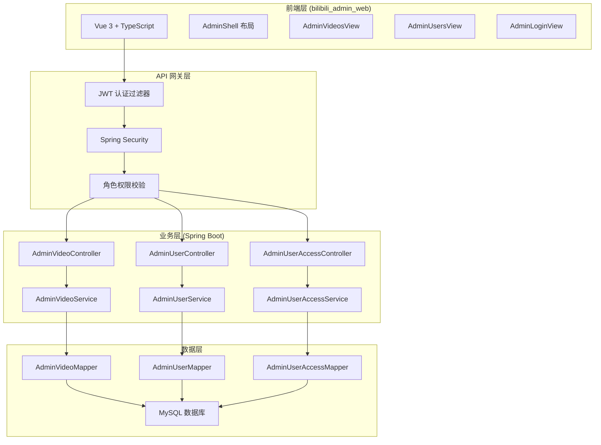
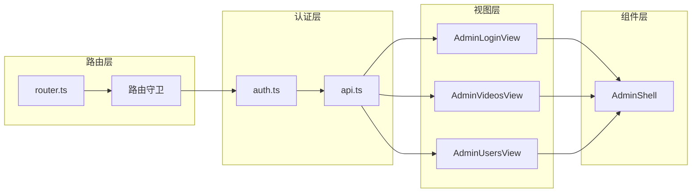

管理后台 API 是 Bilibili 项目中的核心管理模块，基于 **Spring Boot + Spring Security** 构建，为管理员提供用户管理和视频审核功能。该 API 采用 **JWT 无状态认证**，通过角色权限控制确保只有管理员（`role_code=1`）能够访问后台接口。

## 架构概览

管理后台 API 采用分层架构设计，从前端到后端形成清晰的职责分离：



**核心特性**：
- **无状态认证**：基于 JWT 令牌的认证机制，支持分布式部署
- **细粒度权限**：通过 `@PreAuthorize("hasRole('ADMIN')")` 确保接口安全
- **缓存优化**：用户权限变更时自动清除相关缓存
- **事务管理**：关键操作使用 `@Transactional` 保证数据一致性

Sources: [SecurityConfig.java](bilibili_SpringBoot/src/main/java/com/bilibili/config/security/SecurityConfig.java#L83-L107), [JwtTokenService.java](bilibili_SpringBoot/src/main/java/com/bilibili/security/JwtTokenService.java#L39-L50)

## 认证与授权机制

管理后台 API 的认证流程基于 JWT 令牌机制，管理员通过标准登录接口获取令牌后，在后续请求中携带该令牌进行身份验证。

### JWT 令牌生成与验证

JWT 令牌包含以下关键信息：
- **用户ID (uid)**：作为令牌的主体（Subject）
- **角色代码 (role_code)**：0 表示普通用户，1 表示管理员
- **过期时间**：默认 7 天（604800 秒）

**令牌生成示例**：
```java
// 生成管理员令牌
String token = jwtTokenService.generateToken(uid, UserRole.ADMIN);
```

**令牌验证流程**：
1. 前端在 `Authorization` 请求头中携带 `Bearer {token}`
2. `JwtAuthenticationFilter` 解析并验证令牌
3. Spring Security 根据令牌中的角色信息进行权限校验
4. 管理员接口要求 `role_code=1`

Sources: [JwtTokenService.java](bilibili_SpringBoot/src/main/java/com/bilibili/security/JwtTokenService.java#L39-L50), [JwtAuthenticationFilter.java](bilibili_SpringBoot/src/main/java/com/bilibili/security/JwtAuthenticationFilter.java#L1-L50)

### 角色权限模型

系统定义了两种用户角色：

| 角色 | 代码 | 描述 | 权限范围 |
|------|------|------|----------|
| 普通用户 | 0 | 标准用户 | 基础功能访问 |
| 管理员 | 1 | 系统管理员 | 后台管理功能 |

**数据库表结构**：
```sql
-- 用户表中的角色字段
ALTER TABLE t_user ADD COLUMN role_code TINYINT NOT NULL DEFAULT 0 COMMENT '0 user, 1 reviewer, 2 admin';
```

Sources: [UserRole.java](bilibili_SpringBoot/src/main/java/com/bilibili/common/enums/UserRole.java#L5-L8), [V18__add_role_code_to_user.sql](bilibili_SpringBoot/src/main/resources/db/migration/V18__add_role_code_to_user.sql#L1-L3)

## API 端点详解

### 1. 用户管理 API

**基础路径**: `/admin/users`

#### 1.1 分页查询用户列表

**端点**: `GET /admin/users`

**功能**: 查询所有用户及其权限状态，支持关键词搜索

**请求参数**:

| 参数 | 类型 | 必填 | 描述 |
|------|------|------|------|
| `pageNo` | Integer | 否 | 页码，默认 1 |
| `pageSize` | Integer | 否 | 每页数量，默认 10，最大 50 |
| `keyword` | String | 否 | 搜索关键词（用户名或UID） |

**响应示例**:
```json
{
  "code": 0,
  "message": "OK",
  "data": {
    "records": [
      {
        "uid": "1234567890",
        "username": "admin",
        "roleCode": 1,
        "status": 0,
        "nickname": "管理员",
        "avatar": "https://example.com/avatar.jpg",
        "sign": "系统管理员",
        "likeEnabled": true,
        "commentEnabled": true,
        "imMessageSendEnabled": true,
        "videoUploadEnabled": true,
        "profileEditEnabled": true,
        "videoBusinessBanned": false
      }
    ],
    "total": 100,
    "pageNo": 1,
    "pageSize": 10,
    "totalPages": 10
  }
}
```

**业务逻辑**:
- 支持按用户名模糊搜索和精确 UID 查询
- 自动解析数字关键词为 UID 查询
- 返回用户的完整权限状态信息

Sources: [AdminUserController.java](bilibili_SpringBoot/src/main/java/com/bilibili/admin/controller/AdminUserController.java#L28-L33), [AdminUserServiceImpl.java](bilibili_SpringBoot/src/main/java/com/bilibili/admin/service/impl/AdminUserServiceImpl.java#L22-L27)

#### 1.2 封禁用户视频业务能力

**端点**: `POST /admin/users/{userId}/video-business-ban`

**功能**: 封禁用户的视频相关业务能力（点赞、评论、投稿）

**路径参数**:

| 参数 | 类型 | 必填 | 描述 |
|------|------|------|------|
| `userId` | Long | 是 | 用户ID |

**响应示例**:
```json
{
  "code": 0,
  "message": "OK",
  "data": {
    "uid": "1234567890",
    "username": "user123",
    "videoBusinessBanned": true,
    "likeEnabled": false,
    "commentEnabled": false,
    "videoUploadEnabled": false
  }
}
```

**业务逻辑**:
- 同时禁止点赞、评论、视频上传三个能力
- 使用 `INSERT ... ON DUPLICATE KEY UPDATE` 实现幂等操作
- 自动清除用户权限缓存
- 事务保证数据一致性

Sources: [AdminUserAccessController.java](bilibili_SpringBoot/src/main/java/com/bilibili/admin/controller/AdminUserAccessController.java#L32-L43), [AdminUserAccessServiceImpl.java](bilibili_SpringBoot/src/main/java/com/bilibili/admin/service/impl/AdminUserAccessServiceImpl.java#L24-L41)

#### 1.3 解禁用户视频业务能力

**端点**: `DELETE /admin/users/{userId}/video-business-ban`

**功能**: 恢复用户的视频相关业务能力

**路径参数**:

| 参数 | 类型 | 必填 | 描述 |
|------|------|------|------|
| `userId` | Long | 是 | 用户ID |

**响应示例**:
```json
{
  "code": 0,
  "message": "OK",
  "data": {
    "uid": "1234567890",
    "username": "user123",
    "videoBusinessBanned": false,
    "likeEnabled": true,
    "commentEnabled": true,
    "videoUploadEnabled": true
  }
}
```

**业务逻辑**:
- 恢复点赞、评论、视频上传三个能力
- 使用 `INSERT ... ON DUPLICATE KEY UPDATE` 实现幂等操作
- 自动清除用户权限缓存

Sources: [AdminUserAccessController.java](bilibili_SpringBoot/src/main/java/com/bilibili/admin/controller/AdminUserAccessController.java#L45-L56), [AdminUserAccessServiceImpl.java](bilibili_SpringBoot/src/main/java/com/bilibili/admin/service/impl/AdminUserAccessServiceImpl.java#L43-L60)

### 2. 视频审核 API

**基础路径**: `/admin/videos`

#### 2.1 查询待审核视频列表

**端点**: `GET /admin/videos/pending`

**功能**: 查询所有待审核视频，支持游标分页

**请求参数**:

| 参数 | 类型 | 必填 | 描述 |
|------|------|------|------|
| `cursor` | Long | 否 | 游标，传上一页最后一条的ID，首页不传 |

**响应示例**:
```json
{
  "code": 0,
  "message": "OK",
  "data": {
    "records": [
      {
        "id": "9876543210",
        "authorUid": "1234567890",
        "title": "示例视频",
        "description": "视频描述",
        "coverUrl": "https://example.com/cover.jpg",
        "videoUrl": "https://example.com/video.mp4",
        "duration": 120,
        "createTime": "2026-04-21T10:30:00",
        "nickname": "用户昵称"
      }
    ],
    "nextCursor": "9876543200",
    "hasMore": true
  }
}
```

**业务逻辑**:
- 查询 `status=2`（PENDING）状态的视频
- 使用游标分页，避免深分页性能问题
- 默认每页 20 条记录
- 关联查询用户昵称信息

Sources: [AdminVideoController.java](bilibili_SpringBoot/src/main/java/com/bilibili/admin/controller/AdminVideoController.java#L27-L33), [AdminVideoServiceImpl.java](bilibili_SpringBoot/src/main/java/com/bilibili/admin/service/impl/AdminVideoServiceImpl.java#L28-L31)

#### 2.2 查询已删除视频列表

**端点**: `GET /admin/videos/deleted`

**功能**: 查询所有已删除视频，支持游标分页

**请求参数**:

| 参数 | 类型 | 必填 | 描述 |
|------|------|------|------|
| `cursor` | Long | 否 | 游标，传上一页最后一条的ID，首页不传 |

**业务逻辑**:
- 查询 `status=1`（DELETED）状态的视频
- 其他逻辑与待审核视频查询一致

Sources: [AdminVideoController.java](bilibili_SpringBoot/src/main/java/com/bilibili/admin/controller/AdminVideoController.java#L35-L41)

#### 2.3 查询已上架视频列表

**端点**: `GET /admin/videos/published`

**功能**: 查询所有已上架视频，支持游标分页

**请求参数**:

| 参数 | 类型 | 必填 | 描述 |
|------|------|------|------|
| `cursor` | Long | 否 | 游标，传上一页最后一条的ID，首页不传 |

**业务逻辑**:
- 查询 `status=0`（NORMAL）状态的视频
- 其他逻辑与待审核视频查询一致

Sources: [AdminVideoController.java](bilibili_SpringBoot/src/main/java/com/bilibili/admin/controller/AdminVideoController.java#L43-L49)

#### 2.4 审核视频

**端点**: `PUT /admin/videos/{videoId}/status`

**功能**: 审核视频，决定通过或拒绝

**路径参数**:

| 参数 | 类型 | 必填 | 描述 |
|------|------|------|------|
| `videoId` | Long | 是 | 视频ID |

**请求体**:
```json
{
  "status": 0,
  "reason": "审核理由"
}
```

**请求参数说明**:

| 参数 | 类型 | 必填 | 描述 |
|------|------|------|------|
| `status` | Integer | 是 | 目标状态：0=通过(NORMAL)，1=拒绝(DELETED) |
| `reason` | String | 否 | 审核理由 |

**响应示例**:
```json
{
  "code": 0,
  "message": "OK",
  "data": null
}
```

**业务逻辑**:
- 仅允许将待审核视频（status=2）审核为通过（0）或拒绝（1）
- 使用乐观锁机制，确保只有待审核状态的视频才能被审核
- 审核失败时抛出业务异常

Sources: [AdminVideoController.java](bilibili_SpringBoot/src/main/java/com/bilibili/admin/controller/AdminVideoController.java#L51-L58), [AdminVideoServiceImpl.java](bilibili_SpringBoot/src/main/java/com/bilibili/admin/service/impl/AdminVideoServiceImpl.java#L44-L56)

## 数据库设计

### 用户权限表 (t_user_access)

该表存储用户的业务能力状态，支持细粒度的权限控制：

```sql
CREATE TABLE IF NOT EXISTS t_user_access (
    user_id BIGINT NOT NULL COMMENT '用户ID',
    like_enabled TINYINT NOT NULL DEFAULT 1 COMMENT '是否允许点赞：1允许 0禁止',
    comment_enabled TINYINT NOT NULL DEFAULT 1 COMMENT '是否允许评论：1允许 0禁止',
    im_message_send_enabled TINYINT NOT NULL DEFAULT 1 COMMENT '是否允许发送IM消息：1允许 0禁止',
    video_upload_enabled TINYINT NOT NULL DEFAULT 1 COMMENT '是否允许投稿：1允许 0禁止',
    profile_edit_enabled TINYINT NOT NULL DEFAULT 1 COMMENT '是否允许修改资料：1允许 0禁止',
    create_time DATETIME NOT NULL DEFAULT CURRENT_TIMESTAMP COMMENT '创建时间',
    update_time DATETIME NOT NULL DEFAULT CURRENT_TIMESTAMP ON UPDATE CURRENT_TIMESTAMP COMMENT '更新时间',
    PRIMARY KEY (user_id)
) COMMENT='用户访问能力状态表';
```

**关键字段说明**:

| 字段 | 类型 | 默认值 | 描述 |
|------|------|--------|------|
| `user_id` | BIGINT | - | 主键，关联用户表 |
| `like_enabled` | TINYINT | 1 | 点赞权限 |
| `comment_enabled` | TINYINT | 1 | 评论权限 |
| `im_message_send_enabled` | TINYINT | 1 | IM消息权限 |
| `video_upload_enabled` | TINYINT | 1 | 视频上传权限 |
| `profile_edit_enabled` | TINYINT | 1 | 资料修改权限 |

**业务规则**:
- 权限字段使用 `1` 表示允许，`0` 表示禁止
- 使用 `INSERT ... ON DUPLICATE KEY UPDATE` 实现幂等操作
- 权限变更时自动清除相关缓存

Sources: [V7__create_user_access_table.sql](bilibili_SpringBoot/src/main/resources/db/migration/V7__create_user_access_table.sql#L1-L11), [AdminUserAccessMapper.java](bilibili_SpringBoot/src/main/java/com/bilibili/admin/mapper/AdminUserAccessMapper.java#L7-L24)

### 视频状态枚举 (RecordStatus)

系统使用统一的记录状态枚举管理数据生命周期：

```java
public enum RecordStatus {
    NORMAL(0),    // 正常状态
    DELETED(1),   // 已删除
    PENDING(2);   // 待审核
}
```

**状态转换规则**:
- **PENDING → NORMAL**: 视频审核通过
- **PENDING → DELETED**: 视频审核拒绝
- **NORMAL → DELETED**: 视频被删除

Sources: [RecordStatus.java](bilibili_SpringBoot/src/main/java/com/bilibili/common/enums/RecordStatus.java#L5-L8), [AdminVideoServiceImpl.java](bilibili_SpringBoot/src/main/java/com/bilibili/admin/service/impl/AdminVideoServiceImpl.java#L17-L20)

## 前端集成

### 管理端前端架构

管理端前端使用 Vue 3 + TypeScript 构建，采用组件化设计：



**核心特性**:
- **路由守卫**: 自动检查管理员权限，未登录或非管理员自动跳转登录页
- **JWT 令牌管理**: 自动在请求头中添加 Bearer 令牌
- **响应拦截**: 统一处理 API 响应和错误
- **大数字处理**: 使用 `json-bigint` 处理长整型 ID

Sources: [router.ts](bilibili_admin_web/src/router.ts#L40-L50), [api.ts](bilibili_admin_web/src/lib/api.ts#L43-L78)

### 前端 API 调用示例

**用户管理页面调用**:
```typescript
// 查询用户列表
const result = await api.get<PageVO<AdminUserVO>>('/admin/users', {
  pageNo: 1,
  pageSize: 10,
  keyword: '搜索关键词'
});

// 封禁用户
await api.post(`/admin/users/${uid}/video-business-ban`);

// 解禁用户
await api.delete(`/admin/users/${uid}/video-business-ban`);
```

**视频审核页面调用**:
```typescript
// 查询待审核视频
const result = await api.get<CursorPageVO<AdminVideoVO>>('/admin/videos/pending');

// 审核视频
await api.put(`/admin/videos/${videoId}/status`, { status: 0 });
```

Sources: [AdminUsersView.vue](bilibili_admin_web/src/views/AdminUsersView.vue#L40-L41), [AdminVideosView.vue](bilibili_admin_web/src/views/AdminVideosView.vue#L106)

## 错误处理与异常管理

### 异常响应格式

所有 API 错误响应遵循统一格式：

```json
{
  "code": 400,
  "message": "错误信息",
  "data": null
}
```

### 常见错误码

| HTTP 状态码 | 业务码 | 描述 | 处理建议 |
|------------|--------|------|----------|
| 401 | 1001 | 未认证 | 重新登录 |
| 403 | 1002 | 权限不足 | 检查用户角色 |
| 400 | 2001 | 参数错误 | 检查请求参数 |
| 404 | 2002 | 资源不存在 | 检查资源ID |
| 500 | 3001 | 服务器内部错误 | 联系管理员 |

### 异常处理机制

系统使用全局异常处理器统一处理异常：

```java
@RestControllerAdvice
public class GlobalExceptionHandler {
    
    @ExceptionHandler(IllegalArgumentException.class)
    public Result<Void> handleIllegalArgument(IllegalArgumentException e) {
        return Result.error(400, e.getMessage());
    }
    
    @ExceptionHandler(UnauthorizedException.class)
    public Result<Void> handleUnauthorized(UnauthorizedException e) {
        return Result.error(401, "未认证");
    }
    
    @ExceptionHandler(ForbiddenException.class)
    public Result<Void> handleForbidden(ForbiddenException e) {
        return Result.error(403, "权限不足");
    }
}
```

Sources: [GlobalExceptionHandler.java](bilibili_SpringBoot/src/main/java/com/bilibili/common/exception/GlobalExceptionHandler.java#L1-L50)

## 性能优化策略

### 1. 缓存机制

用户权限变更时自动清除缓存，确保权限实时生效：

```java
@CacheEvict(cacheNames = "USER_ACCESS_SNAPSHOT", key = "#userId")
@Transactional(rollbackFor = Exception.class)
public AdminUserVO banVideoBusiness(Long userId, Long operatorId) {
    // 业务逻辑
}
```

### 2. 游标分页

视频列表使用游标分页，避免深分页性能问题：

```sql
SELECT * FROM t_video 
WHERE status = #{status} AND id < #{cursor}
ORDER BY id DESC 
LIMIT #{size}
```

### 3. 乐观锁机制

视频审核使用乐观锁，确保只有待审核状态的视频才能被审核：

```sql
UPDATE t_video 
SET status = #{newStatus}
WHERE id = #{videoId} AND status = #{oldStatus}
```

Sources: [AdminUserAccessServiceImpl.java](bilibili_SpringBoot/src/main/java/com/bilibili/admin/service/impl/AdminUserAccessServiceImpl.java#L25-L26), [AdminVideoServiceImpl.java](bilibili_SpringBoot/src/main/java/com/bilibili/admin/service/impl/AdminVideoServiceImpl.java#L58-L72)

## 安全最佳实践

### 1. 输入验证

所有输入参数都进行严格验证：

```java
@PathVariable("userId")
@NotNull(message = "userId cannot be null")
@Positive(message = "userId must be positive") Long userId
```

### 2. 权限控制

使用 Spring Security 方法级权限控制：

```java
@PreAuthorize("hasRole('ADMIN')")
@RestController
@RequestMapping("/admin/users")
public class AdminUserController {
    // 管理员专属接口
}
```

### 3. 敏感操作日志

关键操作记录操作日志，便于审计追踪：

```java
@Aspect
@Component
public class ServiceLogAspect {
    @Around("@annotation(org.springframework.web.bind.annotation.PutMapping)")
    public Object logAdminOperation(ProceedingJoinPoint joinPoint) throws Throwable {
        // 记录操作日志
    }
}
```

Sources: [AdminUserAccessController.java](bilibili_SpringBoot/src/main/java/com/bilibili/admin/controller/AdminUserAccessController.java#L36-L38), [AdminUserController.java](bilibili_SpringBoot/src/main/java/com/bilibili/admin/controller/AdminUserController.java#L16-L19)

## 扩展与定制

### 1. 添加新的管理功能

要添加新的管理功能，需要：

1. **创建控制器**: 继承 `@RestController` 和 `@PreAuthorize("hasRole('ADMIN')")`
2. **定义服务接口**: 在 `admin.service` 包中定义接口
3. **实现业务逻辑**: 在 `admin.service.impl` 包中实现
4. **添加数据访问层**: 在 `admin.mapper` 包中定义 Mapper

### 2. 自定义权限粒度

系统支持更细粒度的权限控制：

```java
// 自定义权限检查
@PreAuthorize("hasRole('ADMIN') and @accessChecker.hasPermission(#userId, 'VIDEO_REVIEW')")
public Result<Void> reviewVideo(Long videoId, AdminVideoReviewDTO dto) {
    // 业务逻辑
}
```

### 3. 扩展审核流程

可以扩展视频审核流程，添加多级审核：

```java
public enum ReviewLevel {
    FIRST_REVIEW,   // 初审
    SECOND_REVIEW,  // 复审
    FINAL_REVIEW    // 终审
}
```

## 下一步阅读

完成管理后台 API 的学习后，建议继续阅读以下文档：

- [JWT 认证与 Spring Security 权限体系](9-jwt-ren-zheng-yu-spring-security-quan-xian-ti-xi) - 深入了解认证授权机制
- [数据库设计与 Flyway 迁移管理](10-shu-ju-ku-she-ji-yu-flyway-qian-yi-guan-li) - 了解数据库设计与迁移
- [管理端功能与权限设计](7-guan-li-duan-gong-neng-yu-quan-xian-she-ji) - 了解前端管理功能
- [用户与社交关系模块](11-yong-hu-yu-she-jiao-guan-xi-mo-kuai) - 了解用户相关业务