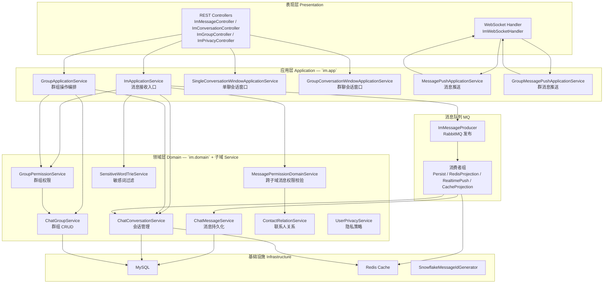
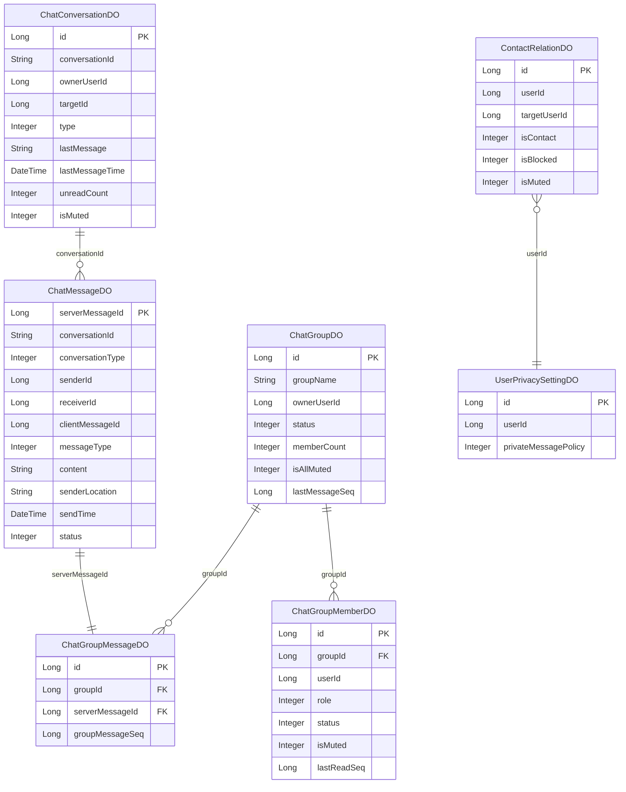
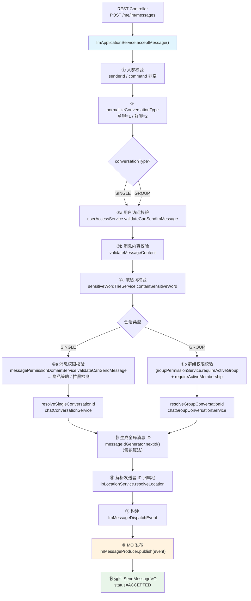
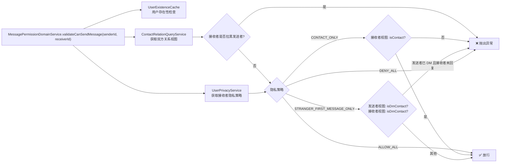

本文档深入解析 Bilibili IM 系统的**领域模型设计**与**应用层编排逻辑**，涵盖 DDD 分层架构、核心领域实体关系、应用服务协调流程，以及事件驱动的异步管线。阅读本文后，你将理解消息从接收到投递的完整链路中，每个模块承担的职责与协作方式。

## 整体架构分层

IM 模块采用**领域驱动设计（DDD）** 的分层策略，将代码按职责划分为应用层（Application）、领域层（Domain）、基础设施层（Infrastructure），以及面向各业务子域的聚合包。整体包结构如下：

> **设计原则**：应用层（`im.app`）不包含业务规则，仅负责**用例编排**——调用领域服务的正确顺序、组合校验与事务边界管理。领域层（`im.domain` + 各子域 `service`）承载所有业务逻辑与不变量（invariant）。

Sources: [package-info.java](bilibili_SpringBoot/src/main/java/com/bilibili/im/app/package-info.java#L1-L5), [package-info.java](bilibili_SpringBoot/src/main/java/com/bilibili/im/domain/package-info.java#L1-L5), [package-info.java](bilibili_SpringBoot/src/main/java/com/bilibili/im/package-info.java#L1-L5)

## 核心领域实体与子域划分

IM 模块按**限界上下文**（Bounded Context）拆分为六个子域，每个子域拥有独立的实体、值对象、服务和 Mapper：

| 子域 | 包路径 | 核心实体 | 职责 |
|------|--------|----------|------|
| **消息（Message）** | `im.message` | `ChatMessageDO` | 消息持久化、历史查询、最近消息缓存 |
| **会话（Conversation）** | `im.conversation` | `ChatConversationDO`, `ChatGroupConversationDO` | 会话窗口管理、未读计数、会话摘要投影 |
| **群组（Group）** | `im.group` | `ChatGroupDO`, `ChatGroupMemberDO`, `ChatGroupMessageDO` | 群 CRUD、成员管理、角色权限、禁言 |
| **联系人（Contact）** | `im.contact` | `ContactRelationDO` | 好友关系、拉黑、DM 联系人标记 |
| **隐私（Privacy）** | `im.privacy` | `UserPrivacySettingDO` | 私信策略（允许所有人 / 仅联系人 / 陌生人首条 / 全拒绝） |
| **内容审核（Moderation）** | `im.moderation` | `SensitiveWordDO` | 敏感词 Trie 树构建与文本过滤 |

### 实体关系总览

> **关键设计**：`ChatConversationDO` 采用**读扩散模型**——每个用户拥有独立的会话记录（`ownerUserId` 视角），发送消息时需同时更新发送方和接收方两条会话摘要。群聊会话通过 `ChatGroupConversationDO` 独立管理，每个群成员一条记录。

Sources: [ChatMessageDO.java](bilibili_SpringBoot/src/main/java/com/bilibili/im/message/model/entity/ChatMessageDO.java#L1-L28), [ChatConversationDO.java](bilibili_SpringBoot/src/main/java/com/bilibili/im/conversation/model/entity/ChatConversationDO.java#L1-L26), [ChatGroupDO.java](bilibili_SpringBoot/src/main/java/com/bilibili/im/group/model/entity/ChatGroupDO.java#L1-L27), [V3__create_chat_tables.sql](bilibili_SpringBoot/src/main/resources/db/migration/V3__create_chat_tables.sql#L1-L55), [V12__create_group_chat_core_tables.sql](bilibili_SpringBoot/src/main/resources/db/migration/V12__create_group_chat_core_tables.sql#L1-L42)

## 应用层服务编排

应用层位于 `com.bilibili.im.app` 包，共定义 **6 个应用服务接口**，分别对应 IM 系统的核心用例。它们是前端请求进入领域层的唯一入口，负责用例级别的**校验、编排、事务管理**。

| 应用服务接口 | 核心方法 | 编排职责 |
|---|---|---|
| `ImApplicationService` | `acceptMessage()` | 消息接收主流程：校验→会话解析→ID 生成→事件发布 |
| `GroupApplicationService` | `createGroup()`, `inviteGroupMember()`, `leaveGroup()`, `kickGroupMember()` | 群组操作编排：权限校验→群操作→会话初始化/隐藏 |
| `SingleConversationWindowApplicationService` | `listRecentConversations()`, `projectSingleMessageTo*()` | 单聊会话窗口：DB 查询、Redis 投影、WebSocket 推送 |
| `GroupConversationWindowApplicationService` | `listRecentGroupConversations()`, `projectGroupConversationCardToRedis()` | 群聊会话窗口：成员校验→卡片投影 |
| `MessagePushApplicationService` | `pushMessageToReceiver()`, `pushMessageToSender()` | 单聊实时推送：事件→DTO 转换→WebSocket 投递 |
| `GroupMessagePushApplicationService` | `pushGroupMessage()` | 群聊实时推送：遍历在线成员→逐个 WebSocket 投递 |

Sources: [ImApplicationService.java](bilibili_SpringBoot/src/main/java/com/bilibili/im/app/ImApplicationService.java#L1-L14), [GroupApplicationService.java](bilibili_SpringBoot/src/main/java/com/bilibili/im/app/GroupApplicationService.java#L1-L25), [SingleConversationWindowApplicationService.java](bilibili_SpringBoot/src/main/java/com/bilibili/im/app/SingleConversationWindowApplicationService.java#L1-L29), [GroupConversationWindowApplicationService.java](bilibili_SpringBoot/src/main/java/com/bilibili/im/app/GroupConversationWindowApplicationService.java#L1-L16), [MessagePushApplicationService.java](bilibili_SpringBoot/src/main/java/com/bilibili/im/app/MessagePushApplicationService.java#L1-L11), [GroupMessagePushApplicationService.java](bilibili_SpringBoot/src/main/java/com/bilibili/im/app/GroupMessagePushApplicationService.java#L1-L9)

## 消息发送主流程编排

`ImApplicationServiceImpl.acceptMessage()` 是整个 IM 系统最核心的编排方法，它协调了 **校验、权限、会话、ID 生成、MQ 发布** 五个阶段。以下是完整的执行流程：

### 各阶段详细说明

**阶段一：入参标准化**（L79-L81）。`normalizeConversationType` 对缺失或非法的会话类型做默认化处理——null 默认为单聊（1），非法值直接抛出 `IllegalArgumentException`。

**阶段二：三层校验链**（L82-L86）。通过 `observation.observeValidation()` 包裹，依次执行：用户是否有 IM 发送权限（`UserAccessService`，与用户角色绑定）、消息内容类型匹配性校验（文本消息必须有文本，图片消息必须有图片 URL）、敏感词 Trie 树全文扫描。

**阶段三：会话 ID 解析**（L88-L90）。单聊和群聊走不同路径：单聊调用 `MessagePermissionDomainService.validateCanSendMessage` 做端到端权限校验（隐私策略+拉黑检测），然后通过 `ChatConversationService.resolveSingleConversationId` 生成或获取会话 ID；群聊先校验群状态和成员资格，再通过 `ChatGroupConversationService.resolveGroupConversationId` 获取群会话 ID。

**阶段四：事件构建与发布**（L97-L107）。使用雪花算法生成全局唯一 `serverMessageId`，将所有上下文打包为 `ImMessageDispatchEvent`，通过 RabbitMQ 发布到交换机。发送成功即返回 `ACCEPTED` 状态——**消息的实际持久化和推送由 MQ 消费者异步完成**。

Sources: [ImApplicationServiceImpl.java](bilibili_SpringBoot/src/main/java/com/bilibili/im/app/impl/ImApplicationServiceImpl.java#L68-L119), [ImMessageDispatchEvent.java](bilibili_SpringBoot/src/main/java/com/bilibili/im/mq/event/ImMessageDispatchEvent.java#L1-L22)

## 领域服务的跨子域协作

IM 系统中的业务规则并非简单地落在某个单子域内，而是存在大量**跨子域校验**。为此，代码设计了 `im.domain` 包作为**跨子域规则的归属层**，同时各子域内部的服务接口保持内聚。

### 消息权限领域服务

`MessagePermissionDomainService` 是最典型的跨子域服务，它组合了三个子域的能力来判断"发送者是否可以向接收者发送私信"：

> **设计要点**：`ContactRelationDO` 是一个**视角关系表**——`(userId, targetUserId)` 对同一段关系在双方各存一条记录，分别记录各自视角下的联系人/拉黑/屏蔽状态。`isDmContact` 字段由消息持久化消费者在消息入库后自动标记，实现"陌生人允许首条消息"的语义。

Sources: [MessagePermissionDomainServiceImpl.java](bilibili_SpringBoot/src/main/java/com/bilibili/im/domain/impl/MessagePermissionDomainServiceImpl.java#L27-L83), [ImApplicationServiceImpl.java](bilibili_SpringBoot/src/main/java/com/bilibili/im/app/impl/ImApplicationServiceImpl.java#L121-L130)

### 群组操作编排

`GroupApplicationServiceImpl` 展示了另一个典型的编排模式——在群组生命周期操作中同时协调**群组服务**和**会话服务**：

| 操作 | 编排逻辑 | 事务边界 |
|------|---------|---------|
| **创建群** | `chatGroupService.createGroup` → `chatGroupConversationService.initializeGroupConversation`（群主初始化会话） | 单事务 |
| **邀请成员** | `groupPermissionService.requireActiveMembership` → `userService.validateUserExists` → `chatGroupService.inviteMember` → `chatGroupConversationService.initializeGroupConversation`（新成员初始化会话） | 单事务 |
| **退出群**（普通成员） | `chatGroupService.leaveGroup` → `chatGroupConversationService.hideGroupConversation`（隐藏会话） | 单事务 |
| **退出群**（群主） | `chatGroupService.dismissGroup` → `chatGroupConversationService.hideAllGroupConversations`（隐藏所有成员会话） | 单事务 |
| **踢人** | `chatGroupService.kickGroupMember` → `chatGroupConversationService.hideGroupConversation`（目标成员） | 单事务 |

> **编排原则**：群操作与会话投影在**同一事务**内完成，保证群状态变更和会话可见性的原子性。初始 `lastReadSeq` 设置为群当前最新消息序号，避免新成员看到历史未读。

Sources: [GroupApplicationServiceImpl.java](bilibili_SpringBoot/src/main/java/com/bilibili/im/app/impl/GroupApplicationServiceImpl.java#L40-L193)

## 事件驱动的异步管线

消息从 `acceptMessage` 发布到 MQ 后，进入**扇出（Fan-out）管线**。单聊和群聊各自拥有独立的队列和消费者组，通过 `ImMqProperties` 统一配置队列名称。

```mermaid
flowchart TB
    PUB["ImMessageProducer<br/>RabbitMQ Publisher<br/>exchange: im.message.exchange"]

    subgraph "单聊路由 Key: im.message.single.dispatch"
        SQ1["im.message.realtime.queue<br/>RealtimePushConsumer"]
        SQ2["im.message.persist.queue<br/>ChatMessagePersistConsumer"]
        SQ3["im.message.conversation.queue<br/>ConversationWindowPersistConsumer"]
        SQ4["im.message.conversation.redis.queue<br/>ConversationWindowRedisProjectionConsumer"]
        SQ5["im.message.recent.cache.queue<br/>RecentMessageCacheProjectionConsumer"]
    end

    subgraph "群聊路由 Key: im.message.group.dispatch"
        GQ1["im.message.group.realtime.queue<br/>GroupRealtimePushConsumer"]
        GQ2["im.message.group.persist.queue<br/>GroupMessagePersistConsumer"]
        GQ3["im.message.group.conversation.redis.queue<br/>GroupConversationRedisProjectionConsumer"]
        GQ4["im.message.group.recent.cache.queue<br/>GroupRecentMessageCacheProjectionConsumer"]
    end

    PUB -->|singleRoutingKey| SQ1 & SQ2 & SQ3 & SQ4 & SQ5
    PUB -->|groupRoutingKey| GQ1 & GQ2 & GQ3 & GQ4

    SQ1 -->|"WebSocket 推送"| CLIENT_A["在线客户端"]
    SQ2 -->|"MySQL 写入 + isDmContact 标记"| DB_A["ChatMessageDO / ContactRelationDO"]
    SQ3 -->|"MySQL 会话摘要更新"| DB_B["ChatConversationDO"]
    SQ4 -->|"Redis 会话窗口投影"| REDIS_A["ConversationWindow Cache"]
    SQ5 -->|"Redis 最近消息缓存"| REDIS_B["RecentMessage Cache"]

    GQ1 -->|"遍历在线成员 → WebSocket 推送"| CLIENT_B["群成员客户端"]
    GQ2 -->|"MySQL 群消息写入"| DB_C["ChatMessageDO + ChatGroupMessageDO"]
    GQ3 -->|"Redis 群会话卡片投影"| REDIS_C["GroupConversation Cache"]
    GQ4 -->|"Redis 群最近消息缓存"| REDIS_D["GroupRecentMessage Cache"]

    style PUB fill:#fff3e0
    style SQ1 fill:#e8f5e9
    style GQ1 fill:#e8f5e9
```

### 消费者职责矩阵

| 消费者 | 持久化 | 缓存投影 | 实时推送 | 附加逻辑 |
|--------|--------|----------|----------|---------|
| `ChatMessagePersistConsumer` | ✅ MySQL | — | — | 标记 `isDmContact` |
| `ConversationWindowPersistConsumer` | ✅ MySQL 会话摘要 | — | — | — |
| `ConversationWindowRedisProjectionConsumer` | — | ✅ Redis 会话窗口 | — | — |
| `RecentMessageCacheProjectionConsumer` | — | ✅ Redis 最近消息 | — | — |
| `RealtimePushConsumer` | — | — | ✅ WebSocket | — |
| `GroupMessagePersistConsumer` | ✅ MySQL + 序号映射 | — | — | — |
| `GroupConversationRedisProjectionConsumer` | — | ✅ Redis 群会话卡片 | — | — |
| `GroupRecentMessageCacheProjectionConsumer` | — | ✅ Redis 群最近消息 | — | — |
| `GroupRealtimePushConsumer` | — | — | ✅ WebSocket（遍历成员） | — |

> **扇出设计优势**：每个消费者职责单一，失败互不影响。持久化失败不阻塞实时推送，缓存投影失败不影响消息入库。消费者通过 `ImMqConsumerMetrics` 统一接入监控指标。

Sources: [ImMqProperties.java](bilibili_SpringBoot/src/main/java/com/bilibili/config/properties/ImMqProperties.java#L1-L111), [ChatMessagePersistConsumer.java](bilibili_SpringBoot/src/main/java/com/bilibili/im/mq/consumer/single/ChatMessagePersistConsumer.java#L1-L68)

## 应用服务依赖全景

以下表格汇总了每个应用服务对领域层和基础设施层的依赖关系，帮助你理解编排边界：

| 应用服务 | 依赖的领域服务 | 依赖的基础设施 | 依赖的公共组件 |
|----------|---------------|---------------|---------------|
| `ImApplicationServiceImpl` | `MessagePermissionDomainService`, `ChatConversationService`, `ChatGroupConversationService`, `GroupPermissionService`, `SensitiveWordTrieService` | `ImMessageProducer` | `MessageIdGenerator`, `ImTimeService`, `IpLocationService`, `UserAccessService`, `ImSendObservation` |
| `GroupApplicationServiceImpl` | `ChatGroupService`, `GroupPermissionService`, `ChatGroupConversationService` | — | `UserService` |
| `SingleConversationWindowApplicationServiceImpl` | `ChatConversationService`, `ConversationWindowCacheService` | — | — |
| `GroupConversationWindowApplicationServiceImpl` | `GroupConversationQueryService`, `GroupConversationCardCacheService` | — | — |
| `MessagePushApplicationServiceImpl` | — | — | `MessagePushService`（WebSocket 层） |
| `GroupMessagePushApplicationServiceImpl` | — | — | `MessagePushService`（WebSocket 层） |

> **依赖方向规则**：应用层 → 领域服务 → Mapper/Cache 基础设施。应用层绝不直接操作 Mapper 或 Redis，所有数据访问通过领域服务暴露的接口完成。

Sources: [ImApplicationServiceImpl.java](bilibili_SpringBoot/src/main/java/com/bilibili/im/app/impl/ImApplicationServiceImpl.java#L44-L66), [GroupApplicationServiceImpl.java](bilibili_SpringBoot/src/main/java/com/bilibili/im/app/impl/GroupApplicationServiceImpl.java#L30-L38)

## 全局唯一 ID 生成

IM 系统使用自研**雪花算法**（Snowflake）生成消息 ID，确保分布式场景下的全局唯一性：

| 位段 | 长度 | 含义 |
|------|------|------|
| 符号位 | 1 bit | 固定 0 |
| 时间戳 | 41 bit | 相对于自定义纪元 `2025-01-01 00:00:00 UTC` 的毫秒偏移 |
| 数据中心 ID | 5 bit | 预留，默认 0 |
| 工作节点 ID | 5 bit | 预留，默认 0 |
| 序列号 | 12 bit | 同毫秒内递增，每毫秒最多 4096 个 ID |

> **serverMessageId** 作为消息的全局标识，在消息表、群消息序号映射表、MQ 事件、缓存投影中全程透传，是端到端消息追踪的核心锚点。客户端消息 ID（`clientMessageId`）由前端生成，用于发送端的乐观 UI 更新和幂等去重。

Sources: [SnowflakeMessageIdGenerator.java](bilibili_SpringBoot/src/main/java/com/bilibili/im/common/id/impl/SnowflakeMessageIdGenerator.java#L1-L69)

## 阅读导航

本文聚焦于领域模型结构与应用层编排逻辑。以下是相关主题的延伸阅读建议：

- **WebSocket 连接管理与自定义协议**：[WebSocket 连接管理与自定义协议](17-websocket-lian-jie-guan-li-yu-zi-ding-yi-xie-yi) — 了解消息如何从服务端通过 WebSocket 推送到客户端
- **RabbitMQ 消息队列与消费者设计**：[RabbitMQ 消息队列与消费者设计](18-rabbitmq-xiao-xi-dui-lie-yu-xiao-fei-zhe-she-ji) — 深入理解 MQ 扇出管线的配置与实现
- **会话窗口与 Redis 缓存策略**：[会话窗口与 Redis 缓存策略](19-hui-hua-chuang-kou-yu-redis-huan-cun-ce-lue) — 探索会话窗口的多级缓存设计
- **群聊功能设计与权限模型**：[群聊功能设计与权限模型](21-qun-liao-gong-neng-she-ji-yu-quan-xian-mo-xing) — 深入群组角色与权限体系
- **即时通信（IM）前端集成**：[即时通信（IM）前端集成](6-ji-shi-tong-xin-im-qian-duan-ji-cheng) — 了解前端如何与后端 IM 系统对接