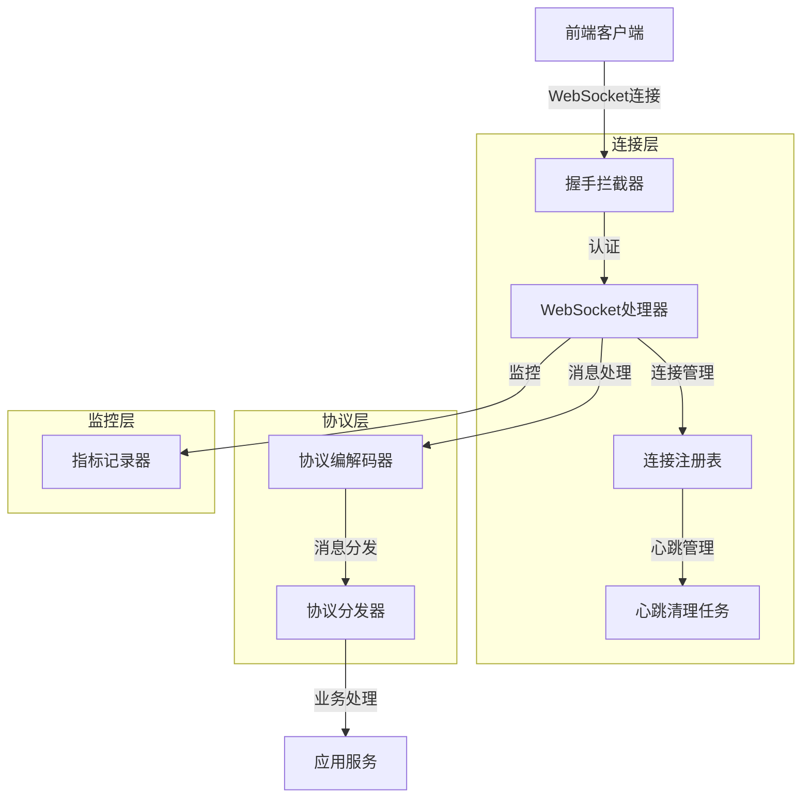

本文档深入解析B站视频网站项目中即时通信系统（IM）的WebSocket连接管理与自定义协议设计。通过分析后端Spring Boot实现和前端Vue 3集成，我们将揭示实时消息传输的核心架构。

## 架构概览

WebSocket连接管理采用**分层架构设计**，将连接生命周期、协议编解码、消息分发和监控指标分离到独立组件中。这种设计确保了高内聚低耦合，便于维护和扩展。



## WebSocket配置与启动

WebSocket服务通过Spring Boot的`@EnableWebSocket`注解启用，配置参数通过`ImWebSocketProperties`管理。默认配置在`application.yaml`中定义。

```yaml
app:
  im:
    websocket:
      enabled: true
      path: /ws/im
      allowedOrigins: http://localhost:63342,http://127.0.0.1:63342,http://localhost:8080,http://127.0.0.1:8080,http://localhost:5174,http://127.0.0.1:5174,http://150.158.146.80:5174
      heartbeatTimeoutMillis: 90000
      heartbeatCleanupIntervalMillis: 30000
```

**关键配置参数说明**：

| 参数 | 默认值 | 说明 |
|------|--------|------|
| `enabled` | `true` | 是否启用WebSocket服务 |
| `path` | `/ws/im` | WebSocket端点路径 |
| `allowedOrigins` | 多个localhost地址 | 允许的跨域来源 |
| `heartbeatTimeoutMillis` | `90000` (90秒) | 心跳超时时间 |
| `heartbeatCleanupIntervalMillis` | `30000` (30秒) | 心跳清理任务执行间隔 |

配置类`ImWebSocketConfig`实现了`WebSocketConfigurer`接口，注册WebSocket处理器和拦截器：

```java
@Configuration
@EnableWebSocket
@ConditionalOnProperty(prefix = "app.im.websocket", name = "enabled", havingValue = "true", matchIfMissing = true)
public class ImWebSocketConfig implements WebSocketConfigurer {
    @Override
    public void registerWebSocketHandlers(WebSocketHandlerRegistry registry) {
        registry.addHandler(imWebSocketHandler, properties.getPath())
                .addInterceptors(imWebSocketHandshakeInterceptor)
                .setAllowedOrigins(resolveAllowedOrigins(properties.getAllowedOrigins()));
    }
}
```

Sources: [ImWebSocketConfig.java](bilibili_SpringBoot/src/main/java/com/bilibili/config/web/ImWebSocketConfig.java#L1-L44) [ImWebSocketProperties.java](bilibili_SpringBoot/src/main/java/com/bilibili/config/properties/ImWebSocketProperties.java#L1-L43) [application.yaml](bilibili_SpringBoot/src/main/resources/application.yaml#L149-L152)

## 连接生命周期管理

连接生命周期由`ImWebSocketHandler`管理，它继承自Spring的`TextWebSocketHandler`，处理连接建立、消息接收和连接关闭三个核心阶段。

### 连接建立阶段

当客户端发起WebSocket连接时，首先经过`ImWebSocketHandshakeInterceptor`进行身份验证：

```java
@Component
public class ImWebSocketHandshakeInterceptor implements HandshakeInterceptor {
    @Override
    public boolean beforeHandshake(ServerHttpRequest request, ServerHttpResponse response,
                                   WebSocketHandler wsHandler, Map<String, Object> attributes) {
        String token = tokenResolver.resolve(request);
        if (token == null || token.isBlank()) {
            response.setStatusCode(HttpStatus.UNAUTHORIZED);
            return false;
        }
        
        AuthenticatedUser authenticatedUser = authenticatedUserResolver.resolve(token);
        attributes.put(ImWebSocketAttributes.USER_ID, authenticatedUser.getUid());
        attributes.put(ImWebSocketAttributes.CLIENT_IP, clientIpResolver.resolve(request));
        attributes.put(ImWebSocketAttributes.TRACE_ID, resolveTraceId());
        return true;
    }
}
```

验证通过后，`ImWebSocketHandler.afterConnectionEstablished()`方法创建连接对象并注册到连接注册表：

```java
@Override
public void afterConnectionEstablished(WebSocketSession session) {
    Long userId = resolveUserId(session);
    if (userId == null || userId <= 0) {
        throw new IllegalArgumentException("websocket userId is invalid");
    }
    
    WebSocketSession concurrentSession = new ConcurrentWebSocketSessionDecorator(
            session, SEND_TIME_LIMIT_MILLIS, SEND_BUFFER_SIZE_LIMIT_BYTES);
    ImSessionConnection connection = new SpringSessionConnection(userId, concurrentSession);
    connectionRegistry.register(connection);
    metricsRecorder.recordConnectionOpened();
}
```

**连接装饰器配置**：
- `SEND_TIME_LIMIT_MILLIS = 10_000`：发送超时时间10秒
- `SEND_BUFFER_SIZE_LIMIT_BYTES = 512 * 1024`：发送缓冲区大小512KB

### 消息处理阶段

消息处理采用**管线模式**，包含以下步骤：

1. **消息解码**：`ImProtocolCodec.decodeInbound()`将JSON字符串转换为`ImWebSocketInboundMessageDTO`
2. **协议分发**：`ImProtocolDispatcher.dispatch()`根据消息类型路由到对应处理器
3. **响应编码**：`ImProtocolCodec.encodeOutbound()`将响应对象序列化为JSON
4. **消息发送**：通过`ImSessionConnection.sendText()`发送给客户端

```java
@Override
protected void handleTextMessage(WebSocketSession session, TextMessage message) {
    Long userId = resolveUserId(session);
    long handleStartNanos = System.nanoTime();
    
    try {
        // 1. 验证用户ID
        if (userId == null || userId <= 0) return;
        
        // 2. 解码消息
        ImWebSocketInboundMessageDTO inboundMessage = protocolCodec.decodeInbound(payload);
        
        // 3. 分发处理
        ImWebSocketOutboundMessageDTO outboundMessage = protocolDispatcher.dispatch(userId, clientIp, inboundMessage);
        
        // 4. 发送响应
        sendOutboundMessage(session, userId, outboundMessage);
    } finally {
        metricsRecorder.recordInboundHandle(inboundType, outcome, System.nanoTime() - handleStartNanos);
    }
}
```

### 连接关闭阶段

连接关闭时，`afterConnectionClosed()`方法从注册表中移除连接并记录指标：

```java
@Override
public void afterConnectionClosed(WebSocketSession session, CloseStatus status) {
    Long userId = resolveUserId(session);
    if (userId != null && userId > 0) {
        connectionRegistry.unregister(userId, session.getId());
    }
    metricsRecorder.recordConnectionClosed(status == null ? "unknown" : "code_" + status.getCode());
}
```

Sources: [ImWebSocketHandler.java](bilibili_SpringBoot/src/main/java/com/bilibili/im/websocket/handler/ImWebSocketHandler.java#L1-L202) [ImWebSocketHandshakeInterceptor.java](bilibili_SpringBoot/src/main/java/com/bilibili/im/websocket/interceptor/ImWebSocketHandshakeInterceptor.java#L1-L86)

## 自定义协议设计

WebSocket消息采用**JSON格式的自定义协议**，包含明确的类型标识和结构化数据。

### 消息类型枚举

`ImWebSocketMessageType`定义了所有支持的消息类型：

| 类型代码 | 方向 | 说明 |
|----------|------|------|
| `heartbeat` | 客户端→服务端 | 心跳请求 |
| `heartbeat_ack` | 服务端→客户端 | 心跳响应 |
| `send_message` | 客户端→服务端 | 发送消息 |
| `send_message_accepted` | 服务端→客户端 | 消息发送确认 |
| `message_received` | 服务端→客户端 | 接收新消息 |
| `conversation_updated` | 服务端→客户端 | 单聊会话更新 |
| `group_conversation_updated` | 服务端→客户端 | 群聊会话更新 |
| `error` | 服务端→客户端 | 错误响应 |

### 消息结构定义

**入站消息结构**（客户端→服务端）：

```typescript
interface ImWebSocketInboundMessageDTO {
    type: string;                    // 消息类型
    conversationType?: number;       // 会话类型：1-单聊，2-群聊
    receiverId?: number;            // 接收者ID
    clientMessageId?: number;       // 客户端消息ID（用于幂等）
    messageType?: number;           // 消息内容类型：1-文本，2-图片，3-富文本
    content?: MessageContentDTO;    // 消息内容
}
```

**出站消息结构**（服务端→客户端）：

```typescript
interface ImWebSocketOutboundMessageDTO {
    type: string;        // 消息类型
    code: number;        // 状态码：0-成功，1-失败
    message: string;     // 状态消息
    data?: any;          // 业务数据
}
```

### 协议编解码器

`ImProtocolCodec`负责消息的序列化和反序列化，使用Jackson的`ObjectMapper`：

```java
@Component
public class ImProtocolCodec {
    private final ObjectMapper objectMapper;
    
    public ImWebSocketInboundMessageDTO decodeInbound(String payload) throws Exception {
        return objectMapper.readValue(payload, ImWebSocketInboundMessageDTO.class);
    }
    
    public String encodeOutbound(Object payload) throws Exception {
        return objectMapper.writeValueAsString(payload);
    }
}
```

### 协议分发器

`ImProtocolDispatcher`根据消息类型路由到对应的处理器：

```java
@Component
public class ImProtocolDispatcher {
    public ImWebSocketOutboundMessageDTO dispatch(Long userId, String clientIp, 
                                                  ImWebSocketInboundMessageDTO inboundMessage) {
        String type = inboundMessage.getType();
        
        // 心跳处理
        if (ImWebSocketMessageType.matches(type, ImWebSocketMessageType.HEARTBEAT)) {
            return responseFactory.heartbeatAck();
        }
        
        // 发送消息处理
        if (ImWebSocketMessageType.matches(type, ImWebSocketMessageType.SEND_MESSAGE)) {
            Long clientMessageId = inboundMessage.getClientMessageId();
            
            // 幂等性检查
            boolean acquired = realtimePushIdempotencyService.tryAcquire(userId, clientMessageId);
            if (!acquired) {
                return responseFactory.error("websocket message is duplicated", clientMessageId);
            }
            
            // 调用应用服务处理消息
            SendMessageVO sendMessageVO = imApplicationService.acceptMessage(
                    userId, clientIp, toSendMessageCommand(inboundMessage));
            return responseFactory.sendMessageAccepted(sendMessageVO);
        }
        
        return responseFactory.error("websocket message type is unsupported");
    }
}
```

### 响应工厂

`ImProtocolResponseFactory`提供标准化的响应创建方法：

```java
@Component
public class ImProtocolResponseFactory {
    public ImWebSocketOutboundMessageDTO heartbeatAck() {
        return simpleMessage(ImWebSocketMessageType.HEARTBEAT_ACK, "OK", 0, null);
    }
    
    public ImWebSocketOutboundMessageDTO sendMessageAccepted(Object data) {
        return simpleMessage(ImWebSocketMessageType.SEND_MESSAGE_ACCEPTED, "OK", 0, data);
    }
    
    public ImWebSocketOutboundMessageDTO error(String message, Long clientMessageId) {
        return simpleMessage(ImWebSocketMessageType.ERROR, message, 1,
                clientMessageId != null ? Map.of("clientMessageId", clientMessageId) : null);
    }
}
```

Sources: [ImWebSocketMessageType.java](bilibili_SpringBoot/src/main/java/com/bilibili/im/websocket/model/enums/ImWebSocketMessageType.java#L1-L38) [ImWebSocketInboundMessageDTO.java](bilibili_SpringBoot/src/main/java/com/bilibili/im/websocket/model/dto/ImWebSocketInboundMessageDTO.java#L1-L20) [ImWebSocketOutboundMessageDTO.java](bilibili_SpringBoot/src/main/java/com/bilibili/im/websocket/model/dto/ImWebSocketOutboundMessageDTO.java#L1-L15) [ImProtocolCodec.java](bilibili_SpringBoot/src/main/java/com/bilibili/im/websocket/protocol/ImProtocolCodec.java#L1-L23) [ImProtocolDispatcher.java](bilibili_SpringBoot/src/main/java/com/bilibili/im/websocket/protocol/ImProtocolDispatcher.java#L1-L100) [ImProtocolResponseFactory.java](bilibili_SpringBoot/src/main/java/com/bilibili/im/websocket/protocol/ImProtocolResponseFactory.java#L1-L42)

## 连接注册表与会话管理

连接注册表`ImConnectionRegistry`是WebSocket连接管理的核心组件，负责维护用户与连接的映射关系。

### 接口设计

```java
public interface ImConnectionRegistry {
    void register(ImSessionConnection connection);
    void unregister(Long userId, String connectionId);
    void touch(Long userId, String connectionId);
    ImSessionConnection getConnection(Long userId, String connectionId);
    List<ImSessionConnection> getConnections(Long userId);
    boolean isOnline(Long userId);
    List<ImSessionConnection> removeExpiredConnections(long expireBeforeEpochMillis);
    int countOpenConnections();
    int countOnlineUsers();
}
```

### 内存实现

`InMemoryImConnectionRegistry`使用`ConcurrentHashMap`实现线程安全的连接存储：

```java
@Component
public class InMemoryImConnectionRegistry implements ImConnectionRegistry {
    private final Map<Long, Map<String, ConnectionRecord>> connectionsByUser = new ConcurrentHashMap<>();
    
    @Override
    public void register(ImSessionConnection connection) {
        Long userId = connection.getUserId();
        String connectionId = connection.getId();
        
        connectionsByUser.computeIfAbsent(userId, key -> new ConcurrentHashMap<>())
                .put(connectionId, ConnectionRecord.fromConnection(connection));
    }
    
    @Override
    public void unregister(Long userId, String connectionId) {
        Map<String, ConnectionRecord> connections = connectionsByUser.get(userId);
        if (connections != null) {
            connections.remove(connectionId);
            if (connections.isEmpty()) {
                connectionsByUser.remove(userId);
            }
        }
    }
}
```

### 连接抽象

`ImSessionConnection`接口抽象了WebSocket会话的操作：

```java
public interface ImSessionConnection {
    String getId();
    Long getUserId();
    boolean isOpen();
    void sendText(String text) throws Exception;
    void close(String reason) throws Exception;
}
```

`SpringSessionConnection`是基于Spring `WebSocketSession`的实现：

```java
public class SpringSessionConnection implements ImSessionConnection {
    private final Long userId;
    private final WebSocketSession session;
    
    @Override
    public void close(String reason) throws Exception {
        if ("heartbeat_timeout".equals(reason)) {
            session.close(CloseStatus.SESSION_NOT_RELIABLE);
            return;
        }
        session.close();
    }
}
```

### 心跳管理

心跳机制通过`ImWebSocketHeartbeatCleanupTask`实现，定期清理超时连接：

```java
@Component
public class ImWebSocketHeartbeatCleanupTask {
    @Scheduled(fixedDelayString = "#{@imWebSocketProperties.getHeartbeatCleanupIntervalMillis()}")
    public void cleanupExpiredSessions() {
        long expireBeforeEpochMillis = System.currentTimeMillis() - properties.getHeartbeatTimeoutMillis();
        List<ImSessionConnection> expiredConnections = connectionRegistry.removeExpiredConnections(expireBeforeEpochMillis);
        
        for (ImSessionConnection expiredConnection : expiredConnections) {
            if (expiredConnection != null && expiredConnection.isOpen()) {
                expiredConnection.close("heartbeat_timeout");
            }
        }
    }
}
```

**心跳工作流程**：
1. 客户端每30秒发送`heartbeat`类型消息
2. 服务端收到后返回`heartbeat_ack`响应
3. 连接注册表记录最后一次活跃时间
4. 清理任务定期检查并关闭超时连接

Sources: [ImConnectionRegistry.java](bilibili_SpringBoot/src/main/java/com/bilibili/im/websocket/connection/ImConnectionRegistry.java#L1-L24) [InMemoryImConnectionRegistry.java](bilibili_SpringBoot/src/main/java/com/bilibili/im/websocket/connection/impl/InMemoryImConnectionRegistry.java#L1-L200) [ImSessionConnection.java](bilibili_SpringBoot/src/main/java/com/bilibili/im/websocket/connection/ImSessionConnection.java#L1-L14) [SpringSessionConnection.java](bilibili_SpringBoot/src/main/java/com/bilibili/im/websocket/connection/impl/SpringSessionConnection.java#L1-L52) [ImWebSocketHeartbeatCleanupTask.java](bilibili_SpringBoot/src/main/java/com/bilibili/im/websocket/task/ImWebSocketHeartbeatCleanupTask.java#L1-L45)

## 前端集成实现

前端使用原生WebSocket API与后端通信，通过Vue 3的Composition API封装连接逻辑。

### 连接管理

前端在`useMessagesPage.ts`中管理WebSocket连接：

```typescript
const wsUrl = computed(() => {
    const protocol = window.location.protocol === 'https:' ? 'wss:' : 'ws:'
    return `${protocol}//${window.location.host}/ws/im`
})

function connectSocket() {
    if (!currentToken.value) return
    if (socket.value && (socket.value.readyState === WebSocket.OPEN || 
                         socket.value.readyState === WebSocket.CONNECTING)) {
        return
    }
    
    const url = new URL(wsUrl.value)
    url.searchParams.set('token', currentToken.value)
    
    const ws = new WebSocket(url.toString())
    socket.value = ws
    
    ws.addEventListener('open', () => {
        connectionState.value = 'live'
        startHeartbeat()
    })
    
    ws.addEventListener('message', (event) => {
        handleSocketMessage(String(event.data || ''))
    })
    
    ws.addEventListener('close', () => {
        stopHeartbeat()
        socket.value = null
        connectionState.value = 'idle'
    })
}
```

### 心跳实现

前端每30秒发送一次心跳：

```typescript
function startHeartbeat() {
    stopHeartbeat()
    heartbeatTimer.value = window.setInterval(() => {
        if (!socket.value || socket.value.readyState !== WebSocket.OPEN) {
            return
        }
        socket.value.send(JSON.stringify({ type: 'heartbeat' }))
    }, 30000)
}
```

### 消息发送

发送消息时包含完整的业务数据：

```typescript
async function sendMessage() {
    const text = messageDraft.value.trim()
    const imageUrls = draftImages.value.map((item) => item.uploadedUrl).filter(Boolean)
    
    const clientMessageId = Date.now()
    const receiverId = activeTargetType.value === 'group' ? groupId : peerUid
    
    socket.value.send(
        JSON.stringify({
            type: 'send_message',
            conversationType: activeTargetType.value === 'group' ? 2 : 1,
            receiverId,
            clientMessageId,
            messageType,
            content: { text, imageUrls },
        }),
    )
}
```

### 消息处理

前端根据消息类型处理不同的响应：

```typescript
function handleSocketMessage(raw: string) {
    let packet: WsPacket
    try {
        packet = JSON.parse(raw)
    } catch {
        return
    }
    
    const type = packet.type || 'unknown'
    
    if (type === 'heartbeat_ack') return
    if (type === 'send_message_accepted') {
        handleAccepted(packet.data as AcceptedPayload | undefined)
        return
    }
    if (type === 'message_received') {
        void handleReceived(packet.data as MessagePushPayload | undefined)
        return
    }
    // ... 其他消息类型处理
}
```

Sources: [useMessagesPage.ts](bilibili_web/src/features/messages/composables/useMessagesPage.ts#L760-L1100) [types.ts](bilibili_web/src/features/messages/types.ts#L1-L185)

## 监控指标体系

WebSocket服务集成了完整的监控指标体系，通过Micrometer收集性能数据。

### 指标分类

| 指标名称 | 类型 | 说明 |
|----------|------|------|
| `im.ws.handshake.attempts` | Counter | 握手尝试次数 |
| `im.ws.handshake.success` | Counter | 握手成功次数 |
| `im.ws.handshake.duration` | Timer | 握手耗时（按outcome标签） |
| `im.ws.connection.opened` | Counter | 打开的连接数 |
| `im.ws.heartbeat.received` | Counter | 收到的心跳数 |
| `im.ws.heartbeat.ack.sent` | Counter | 发送的心跳响应数 |
| `im.ws.heartbeat.ack.failed` | Counter | 心跳响应失败数 |
| `im.ws.inbound.payload.invalid` | Counter | 无效入站消息数 |
| `im.ws.inbound.type.invalid` | Counter | 无效消息类型数 |
| `im.ws.inbound.type.unsupported` | Counter | 不支持的消息类型数 |
| `im.ws.cleanup.expired_sessions` | Counter | 清理的过期会话数 |
| `im.ws.sessions.active` | Gauge | 活跃会话数 |
| `im.ws.users.online` | Gauge | 在线用户数 |
| `im.ws.inbound.handle` | Timer | 入站消息处理耗时 |
| `im.ws.inbound.decode` | Timer | 入站消息解码耗时 |
| `im.ws.protocol.dispatch` | Timer | 协议分发耗时 |
| `im.ws.protocol.idempotency` | Timer | 幂等检查耗时 |
| `im.ws.protocol.accept` | Timer | 业务处理耗时 |
| `im.ws.outbound.encode` | Timer | 出站消息编码耗时 |
| `im.ws.outbound.send` | Timer | 出站消息发送耗时 |

### 指标实现

`MicrometerImWebSocketMetricsRecorder`实现了`ImWebSocketMetricsRecorder`接口：

```java
@Component
public class MicrometerImWebSocketMetricsRecorder implements ImWebSocketMetricsRecorder {
    private final Counter handshakeAttempts;
    private final Timer handshakeSuccessTimer;
    // ... 其他指标
    
    public MicrometerImWebSocketMetricsRecorder(MeterRegistry meterRegistry,
                                                ImConnectionRegistry connectionRegistry) {
        this.handshakeAttempts = Counter.builder("im.ws.handshake.attempts")
                .description("Total websocket handshake attempts")
                .register(meterRegistry);
        
        Gauge.builder("im.ws.sessions.active", connectionRegistry, ImConnectionRegistry::countOpenConnections)
                .description("Current active websocket sessions")
                .register(meterRegistry);
    }
}
```

Sources: [ImWebSocketMetricsRecorder.java](bilibili_SpringBoot/src/main/java/com/bilibili/im/websocket/metrics/ImWebSocketMetricsRecorder.java#L1-L46) [MicrometerImWebSocketMetricsRecorder.java](bilibili_SpringBoot/src/main/java/com/bilibili/im/websocket/metrics/impl/MicrometerImWebSocketMetricsRecorder.java#L1-L200)

## 总结

WebSocket连接管理与自定义协议设计体现了**高可用、可扩展、可观测**的架构原则：

1. **分层架构**：连接层、协议层、监控层职责清晰
2. **连接管理**：基于ConcurrentHashMap的线程安全实现，支持多设备登录
3. **协议设计**：JSON格式的自定义协议，类型安全，易于扩展
4. **可靠性保障**：幂等性检查、心跳机制、超时清理
5. **全面监控**：从握手到消息处理的全链路指标收集

通过本文档的分析，开发者可以深入理解WebSocket实时通信的核心实现，为后续的功能扩展和性能优化提供基础。