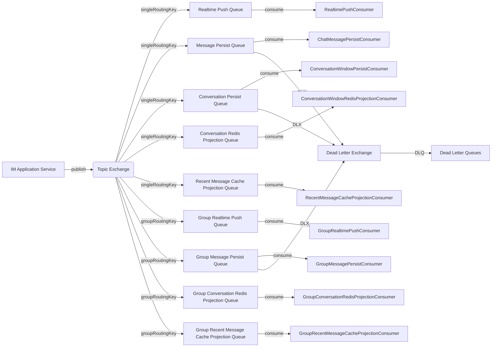

本文档深入解析 bilibili 即时通信（IM）系统中 RabbitMQ 消息队列的架构设计、生产者与消费者实现、可靠性保障机制以及可观测性集成。该系统通过 RabbitMQ 实现了消息的异步解耦，将消息持久化、会话窗口更新、Redis 缓存投影、实时推送等操作分发给不同的消费者并行处理，确保了系统的高吞吐和低延迟。

## 整体架构与消息流

IM 消息队列的核心设计采用 **发布-订阅（Pub-Sub）** 模式，结合 **Topic Exchange** 实现消息的灵活路由。生产者（`RabbitImMessageProducer`）在应用层接收到用户消息后，构建 `ImMessageDispatchEvent` 事件并发布到 RabbitMQ。该事件随后被路由到多个队列，每个队列由专门的消费者处理，完成不同的业务逻辑。



该架构的核心优势在于：
1. **职责分离**：每个消费者专注于单一职责，如持久化、缓存更新或实时推送。
2. **可扩展性**：不同队列可独立配置消费者并发数和预取数量，根据负载进行水平扩展。
3. **故障隔离**：单个消费者失败不会影响其他处理流程，死信队列（DLX/DLQ）用于捕获失败消息。
4. **可观测性**：每个消费者和生产者都集成了详细的 Micrometer 指标，便于监控和告警。

## 配置与队列定义

RabbitMQ 的配置通过 `ImMqProperties` 类集中管理，并由 `ImRabbitMqConfig` 类初始化所有必要的交换机、队列和绑定关系。所有配置均可通过 `application.yaml` 的 `app.im.mq` 前缀进行覆盖。

### 交换机与路由键
- **交换机类型**：`TopicExchange`，名称为 `im.message.exchange`（可通过 `app.im.mq.exchange` 配置）。
- **路由键**：
  - `singleRoutingKey`（默认 `im.message.single.dispatch`）：用于单聊消息。
  - `groupRoutingKey`（默认 `im.message.group.dispatch`）：用于群聊消息。

### 队列列表与用途
下表列出了所有队列及其对应消费者的详细信息：

| 队列名称 | 默认值 | 消费者类 | 处理逻辑 | 容器工厂 |
|----------|--------|----------|----------|----------|
| `realtimePushQueue` | `im.message.realtime.queue` | `RealtimePushConsumer` | 向发送方和接收方实时推送消息 | `imRealtimePushListenerContainerFactory` |
| `messagePersistQueue` | `im.message.persist.queue` | `ChatMessagePersistConsumer` | 持久化单聊消息到数据库，并标记联系人 | `imPersistListenerContainerFactory` |
| `conversationPersistQueue` | `im.message.conversation.queue` | `ConversationWindowPersistConsumer` | 更新单聊会话窗口（数据库投影） | `imConversationListenerContainerFactory` |
| `conversationRedisProjectionQueue` | `im.message.conversation.redis.queue` | `ConversationWindowRedisProjectionConsumer` | 更新单聊会话窗口（Redis 缓存投影） | `imRedisProjectionListenerContainerFactory` |
| `recentMessageCacheProjectionQueue` | `im.message.recent.cache.queue` | `RecentMessageCacheProjectionConsumer` | 更新单聊最近消息缓存（Redis List） | `imRedisProjectionListenerContainerFactory` |
| `groupRealtimePushQueue` | `im.message.group.realtime.queue` | `GroupRealtimePushConsumer` | 向群成员实时推送群消息 | `imGroupRealtimePushListenerContainerFactory` |
| `groupMessagePersistQueue` | `im.message.group.persist.queue` | `GroupMessagePersistConsumer` | 持久化群消息到数据库 | `imGroupPersistListenerContainerFactory` |
| `groupConversationRedisProjectionQueue` | `im.message.group.conversation.redis.queue` | `GroupConversationRedisProjectionConsumer` | 更新群会话窗口（Redis 缓存投影） | `imRedisProjectionListenerContainerFactory` |
| `groupRecentMessageCacheProjectionQueue` | `im.message.group.recent.cache.queue` | `GroupRecentMessageCacheProjectionConsumer` | 更新群最近消息缓存（Redis List） | `imRedisProjectionListenerContainerFactory` |

### 死信队列（DLX/DLQ）
为保障消息可靠性，部分关键队列配置了死信交换机（`im.message.dlx`，类型为 `DirectExchange`）和对应的死信队列：
- `messagePersistQueue` → `messagePersistQueue.dlq`
- `conversationPersistQueue` → `conversationPersistQueue.dlq`
- `groupMessagePersistQueue` → `groupMessagePersistQueue.dlq`

当消息在原始队列中消费失败且重试耗尽后，将被路由到对应的死信队列，便于人工干预或后续处理。

### 监听容器工厂配置
系统为不同业务场景创建了多个 `SimpleRabbitListenerContainerFactory`，每个工厂配置了不同的并发数和预取数量，以优化资源使用和吞吐量：

| 容器工厂名称 | 默认并发数 | 最大并发数 | 预取数量 | 适用队列 |
|--------------|------------|------------|----------|----------|
| `imPersistListenerContainerFactory` | 2 | 4 | 20 | 消息持久化队列 |
| `imConversationListenerContainerFactory` | 2 | 6 | 20 | 会话持久化队列 |
| `imRedisProjectionListenerContainerFactory` | 4 | 8 | 100 | Redis 投影队列 |
| `imRealtimePushListenerContainerFactory` | 2 | 4 | 50 | 实时推送队列 |
| `imGroupPersistListenerContainerFactory` | 1 | 2 | 10 | 群消息持久化队列 |
| `imGroupRealtimePushListenerContainerFactory` | 2 | 6 | 50 | 群实时推送队列 |

这些配置可通过环境变量（如 `IM_MQ_PERSIST_CONCURRENCY`）动态调整。

## 生产者实现：RabbitImMessageProducer

`RabbitImMessageProducer` 是生产者接口 `ImMessageProducer` 的核心实现，负责将消息事件发布到 RabbitMQ。它集成了发布确认（Publisher Confirms）和返回（Returns）机制，确保消息可靠投递。

### 发布流程与可靠性保障
1. **消息构建**：生产者接收 `ImMessageDispatchEvent`，根据 `conversationType` 决定路由键（`singleRoutingKey` 或 `groupRoutingKey`）。
2. **发布确认**：通过 `CorrelationData` 实现异步确认。消息发送后，RabbitMQ 的 ACK/NACK 回调会触发 `handleConfirm` 方法。
3. **重试机制**：若确认超时（5秒）或收到 NACK，生产者会进行重试，最多重试 3 次。重试通过 `@Scheduled` 定时任务 `retryTimedOutConfirms` 扫描待确认消息。
4. **指标记录**：每次发布都会记录发送耗时、确认耗时、确认状态（ACK/NACK/超时）等指标，便于监控。

```java
// 生产者核心逻辑伪代码
public void publish(ImMessageDispatchEvent event) {
    PendingConfirm pending = new PendingConfirm(event);
    pendingConfirms.put(pending.correlationId(), pending);
    sendAttempt(pending, true); // 首次发送
}

private void sendAttempt(PendingConfirm pending, boolean initial) {
    CorrelationData correlationData = new CorrelationData(pending.correlationId());
    rabbitTemplate.convertAndSend(exchange, routingKey, event, headers, correlationData);
    correlationData.getFuture().whenComplete((confirm, ex) -> handleConfirm(...));
}
```

### 日志上下文传播
生产者通过 `MessagePostProcessor` 将 `traceId` 和 `uid` 注入到消息头中，确保分布式链路追踪的连续性。消费者在处理消息时可从消息头中提取这些上下文信息。

## 消费者设计模式

所有消费者均遵循统一的设计模式，通过 `@RabbitListener` 注解订阅队列，并使用独立的容器工厂。每个消费者都集成了 `ImMqConsumerMetrics` 以记录处理指标。

### 单聊消息处理流程
以单聊消息为例，一条消息会触发以下消费者并行处理：
1. **实时推送**（`RealtimePushConsumer`）：通过 WebSocket 向发送方和接收方推送消息。
2. **消息持久化**（`ChatMessagePersistConsumer`）：将消息存储到数据库，并更新联系人关系。
3. **会话窗口持久化**（`ConversationWindowPersistConsumer`）：更新数据库中的会话窗口（最后一条消息、未读数等）。
4. **会话窗口 Redis 投影**（`ConversationWindowRedisProjectionConsumer`）：将会话窗口信息缓存到 Redis。
5. **最近消息缓存**（`RecentMessageCacheProjectionConsumer`）：将消息追加到 Redis List 缓存。

### 群聊消息处理流程
群聊消息类似，但增加了群组特有的逻辑：
- **群实时推送**（`GroupRealtimePushConsumer`）：向群内所有在线成员推送消息。
- **群消息持久化**（`GroupMessagePersistConsumer`）：持久化群消息，并验证会话类型。
- **群会话 Redis 投影**（`GroupConversationRedisProjectionConsumer`）：更新群会话缓存。
- **群最近消息缓存**（`GroupRecentMessageCacheProjectionConsumer`）：更新群最近消息缓存。

### 幂等性保障
部分消费者（如 `ConversationWindowPersistConsumer`）实现了幂等性保障，防止重复消费：
- **Redis 分布式锁**：通过 `ImMqConsumerIdempotencyService` 使用 `setIfAbsent` 实现去重。
- **事务回滚释放**：若事务回滚，会释放已获取的锁，避免死锁。

```java
// 幂等性检查示例
if (!imMqConsumerIdempotencyService.tryAcquire(DEDUPE_CONSUMER, event.getServerMessageId())) {
    return; // 重复消息，跳过处理
}
try {
    // 业务处理
} catch (RuntimeException ex) {
    imMqConsumerIdempotencyService.release(DEDUPE_CONSUMER, event.getServerMessageId());
    throw ex;
}
```

## 可观测性与监控

系统通过 Micrometer 集成了全面的监控指标，分为生产者指标和消费者指标。

### 生产者指标（ImSendMetrics）
- **发布耗时**：`im.mq.publish.total`、`im.mq.publish.send`、`im.mq.publish.confirm`。
- **确认状态**：`im.mq.publish.confirm.ack`、`im.mq.publish.confirm.nack`、`im.mq.publish.confirm.timeout`。
- **重试与放弃**：`im.mq.publish.confirm.retry`、`im.mq.publish.confirm.giveup`。
- **待确认队列**：`im.mq.publish.confirm.pending`（仪表盘）。
- **慢操作日志**：当 `acceptMessage` 耗时超过 1 秒时，记录慢日志。

### 消费者指标（ImMqConsumerMetrics）
- **处理计数**：`im.mq.consumer.messages`（按消费者、队列、状态分组）。
- **处理耗时**：`im.mq.consumer.duration`（包含百分位直方图）。
- **错误计数**：`im.mq.consumer.errors`（按异常类型分组）。
- **消费延迟**：`im.mq.consumer.lag`（消息发送时间到消费完成的时间差）。

这些指标可集成到 Prometheus 和 Grafana 中，实现以下监控场景：
1. **吞吐量监控**：各队列的消息处理速率。
2. **延迟监控**：端到端消息处理延迟（P50/P95/P99）。
3. **错误监控**：消费失败率、重试率、死信队列积压。
4. **资源监控**：消费者线程池使用情况、待确认消息堆积。

## 配置与调优建议

### 环境变量配置
所有关键配置均可通过环境变量覆盖，便于不同环境部署：

| 配置项 | 环境变量 | 默认值 | 说明 |
|--------|----------|--------|------|
| 启用 MQ | `APP_IM_MQ_ENABLED` | `false` | 是否启用消息队列 |
| 并发数 | `IM_MQ_PERSIST_CONCURRENCY` | `2` | 持久化消费者初始并发数 |
| 最大并发数 | `IM_MQ_PERSIST_MAX_CONCURRENCY` | `4` | 持久化消费者最大并发数 |
| 预取数量 | `IM_MQ_PERSIST_PREFETCH` | `20` | 持久化消费者预取消息数 |

### 调优策略
1. **高吞吐场景**：增加 Redis 投影消费者的并发数和预取数量（如 `IM_MQ_REDIS_PROJECTION_CONCURRENCY=8`）。
2. **低延迟场景**：减少持久化消费者的预取数量，增加并发数。
3. **可靠性优先**：确保死信队列配置正确，并设置告警监控死信队列积压。
4. **资源限制**：根据服务器 CPU 和内存调整并发数，避免过度上下文切换。

## 与其他模块的交互

### 与 WebSocket 模块的集成
实时推送消费者（`RealtimePushConsumer` 和 `GroupRealtimePushConsumer`）通过 `MessagePushApplicationService` 和 `GroupMessagePushApplicationService` 与 WebSocket 模块交互，将消息推送到在线用户的 WebSocket 连接。

### 与 Redis 缓存模块的集成
Redis 投影消费者通过 `SingleConversationWindowApplicationService`、`GroupConversationWindowApplicationService`、`RecentMessageCacheService` 和 `GroupRecentMessageCacheService` 更新 Redis 缓存，确保会话窗口和最近消息的快速访问。

### 与数据库模块的集成
持久化消费者通过 `ChatMessageService`、`GroupMessagePersistService`、`SingleConversationWindowApplicationService` 等服务将数据写入 MySQL 数据库，实现消息的持久化存储。

## 总结

bilibili IM 系统的 RabbitMQ 消息队列设计体现了**高内聚、低耦合**的架构原则。通过精细的队列划分、独立的消费者处理、完善的可靠性机制和全面的可观测性集成，系统能够高效处理海量即时消息。该设计不仅支持单聊和群聊场景，还为未来的功能扩展（如消息回执、已读状态同步等）预留了良好的扩展点。

## 下一步阅读

- [会话窗口与 Redis 缓存策略](19-hui-hua-chuang-kou-yu-redis-huan-cun-ce-lue)：深入了解会话窗口的缓存设计和更新机制。
- [消息可靠性、幂等与顺序性保障](20-xiao-xi-ke-kao-xing-mi-deng-yu-shun-xu-xing-bao-zhang)：探讨消息可靠投递、幂等消费和顺序性保证的完整方案。
- [WebSocket 连接管理与自定义协议](17-websocket-lian-jie-guan-li-yu-zi-ding-yi-xie-yi)：了解实时推送的底层 WebSocket 实现。