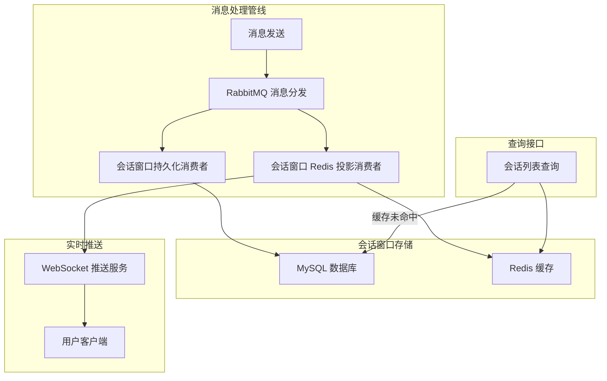
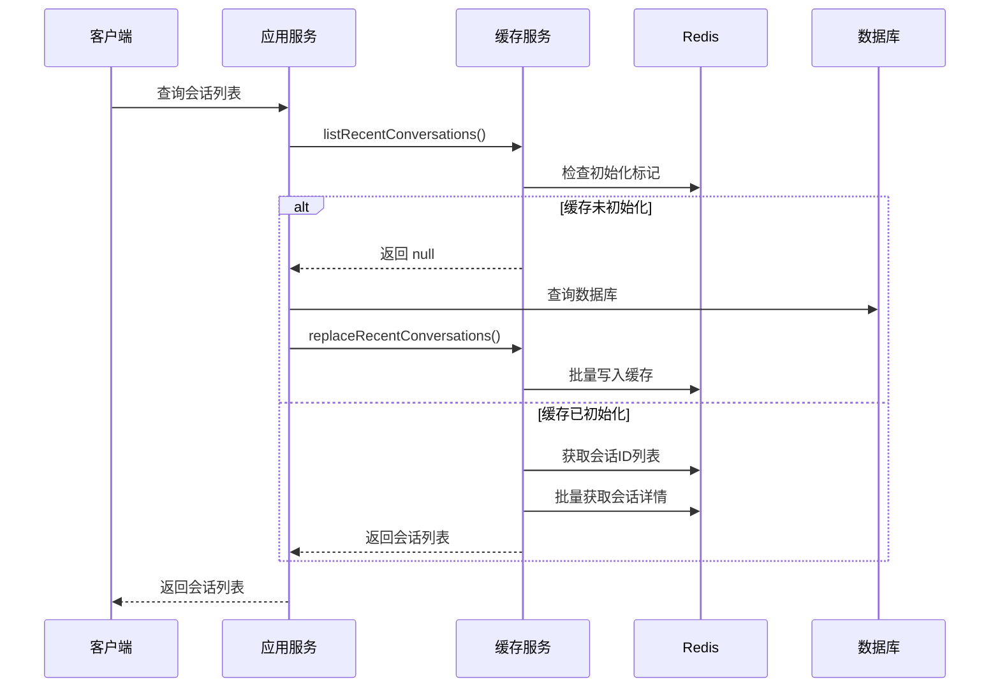
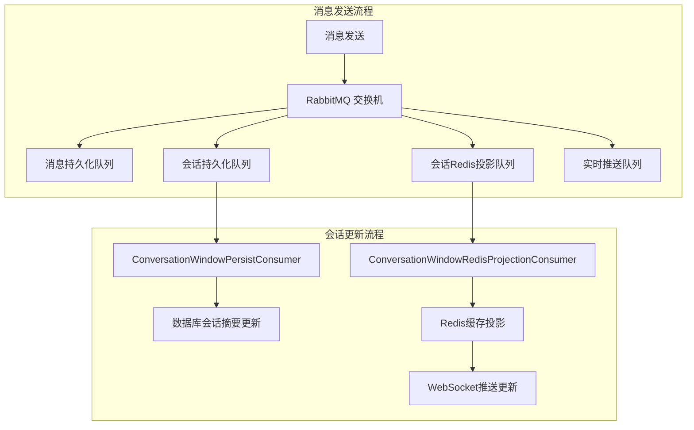
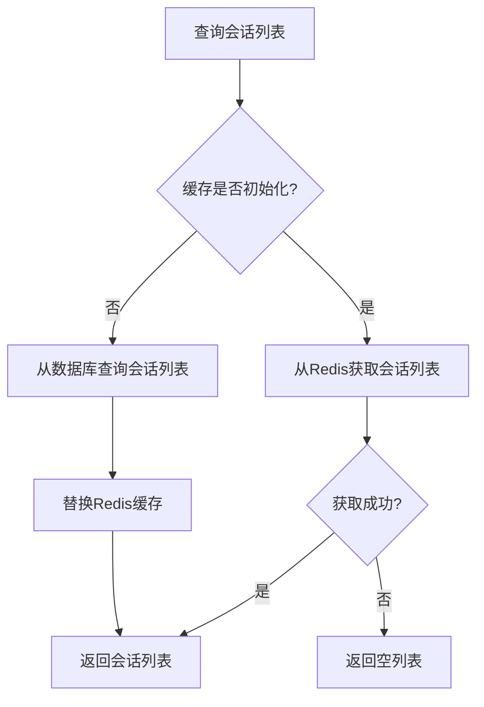
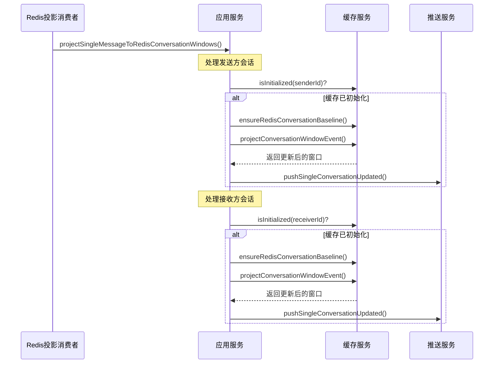
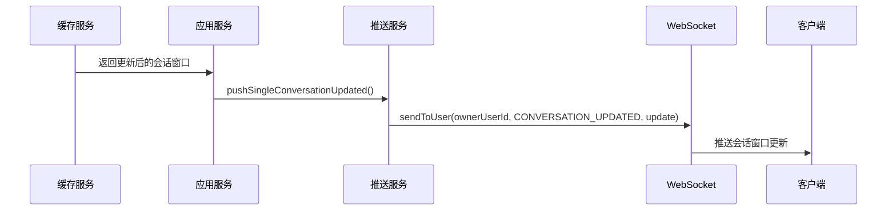

本页面深入解析即时通信系统中会话窗口的架构设计与 Redis 缓存策略。会话窗口作为用户会话列表的聚合展示，承载着最后消息、未读计数等关键信息，其缓存策略直接影响会话列表的加载性能和实时更新体验。

## 会话窗口架构概览

会话窗口是 IM 系统中用户会话列表的数据抽象，分为单聊会话窗口和群聊会话窗口两种类型。系统采用 **"数据库持久化 + Redis 缓存投影 + WebSocket 实时推送"** 的三层架构，确保会话数据的可靠性和实时性。



会话窗口的核心数据结构包含以下字段，定义在 `ConversationWindowCacheValue` 中：

| 字段名 | 类型 | 说明 |
|--------|------|------|
| `conversationId` | String | 会话唯一标识，单聊格式为 `single_{lowUserId}_{highUserId}` |
| `targetId` | Long | 目标用户ID（单聊）或群组ID（群聊） |
| `lastMessage` | String | 最后一条消息内容摘要 |
| `lastMessageTime` | LocalDateTime | 最后消息时间 |
| `lastServerMessageId` | Long | 最后消息的服务器ID，用于消息顺序保证 |
| `unreadBaselineServerMessageIdText` | String | 未读计数基准消息ID，用于增量未读计数 |
| `unreadCount` | Integer | 未读消息数量 |
| `isMuted` | Integer | 是否静音（0-否，1-是） |

Sources: [ConversationWindowCacheValue.java](bilibili_SpringBoot/src/main/java/com/bilibili/im/conversation/cache/model/ConversationWindowCacheValue.java#L1-L22)

## Redis 缓存数据结构设计

系统采用 **ZSet + Hash** 的组合数据结构来存储会话窗口，这种设计既保证了按时间排序的列表查询效率，又支持单个会话的快速访问。

```mermaid
graph LR
    subgraph "Redis 数据结构"
        A[ZSet: im:conv:list:{userId}] -->|存储会话ID| B[按最后消息时间排序]
        C[Hash: im:conv:meta:{userId}] -->|存储会话详情| D[JSON 序列化的会话数据]
        E[String: im:conv:init:{userId}] -->|初始化标记| F["缓存是否已初始化"]
        G[String: im:conv:processed:{userId}:{conversationId}] -->|已处理消息ID| H[幂等性保证]
    end
```

缓存键的设计遵循统一前缀规范，便于管理和监控：

| 缓存键模式 | 数据类型 | 用途 | TTL |
|------------|----------|------|-----|
| `im:conv:list:{ownerUserId}` | ZSet | 存储会话ID列表，score为最后消息时间戳 | 12小时 |
| `im:conv:meta:{ownerUserId}` | Hash | 存储会话详情，field为会话ID，value为JSON | 12小时 |
| `im:conv:init:{ownerUserId}` | String | 标记缓存是否已初始化，值为"1" | 12小时 |
| `im:conv:processed:{ownerUserId}:{conversationId}` | Set | 存储已处理的消息ID，用于未读计数幂等性 | 12小时 |
| `im:group:card:{groupId}` | String | 群组会话卡片缓存 | 24小时 |

Sources: [ConversationWindowCacheKeys.java](bilibili_SpringBoot/src/main/java/com/bilibili/im/conversation/cache/ConversationWindowCacheKeys.java#L1-L29), [GroupConversationCacheKeys.java](bilibili_SpringBoot/src/main/java/com/bilibili/im/conversation/cache/group/GroupConversationCacheKeys.java#L1-L14)

## 会话窗口缓存服务实现

`RedisConversationWindowCacheService` 是会话窗口缓存的核心实现类，提供了完整的缓存生命周期管理。该服务通过 **Lua 脚本** 保证操作的原子性，避免并发场景下的数据不一致问题。

缓存服务的主要功能包括：

1. **缓存初始化检查**：通过 `isInitialized` 方法检查用户会话缓存是否已初始化
2. **会话列表查询**：`listRecentConversations` 方法从 ZSet 中获取最近的会话ID，再批量获取会话详情
3. **缓存替换**：`replaceRecentConversations` 方法用于缓存未命中时的全量替换
4. **增量更新**：`projectConversationWindowEvent` 方法通过 Lua 脚本原子性更新单个会话
5. **基线缓存**：`cacheConversationWindowBaselineIfAbsent` 方法用于首次访问时的基线缓存



缓存调优参数在 `ConversationWindowCacheTuning` 中定义：

| 参数 | 值 | 说明 |
|------|-----|------|
| `CACHE_TTL` | 12小时 | 单聊会话缓存过期时间 |
| `INIT_VALUE` | "1" | 初始化标记值 |
| `RECENT_WINDOW_LIMIT` | 50 | 最大会话窗口数量 |

Sources: [RedisConversationWindowCacheService.java](bilibili_SpringBoot/src/main/java/com/bilibili/im/conversation/cache/impl/RedisConversationWindowCacheService.java#L1-L415), [ConversationWindowCacheTuning.java](bilibili_SpringBoot/src/main/java/com/bilibili/im/conversation/cache/ConversationWindowCacheTuning.java#L1-L13), [ConversationWindowTuning.java](bilibili_SpringBoot/src/main/java/com/bilibili/im/conversation/ConversationWindowTuning.java#L1-L10)

## Lua 脚本的原子性保证

系统使用两个关键的 Lua 脚本来保证会话窗口更新的原子性，这是高并发场景下的核心设计。

### 1. 会话窗口事件投影脚本

`project_conversation_window_event.lua` 脚本处理消息到达时的会话窗口更新，主要逻辑包括：

1. **检查缓存初始化**：如果缓存未初始化则直接返回
2. **未读计数更新**：基于消息ID的幂等性检查，避免重复计数
3. **最后消息更新**：比较消息ID，确保只更新最新的消息
4. **原子性写入**：单个 Redis 事务中完成所有更新操作

```lua
-- 核心逻辑片段
if redis.call("EXISTS", initKey) == 0 then
    return nil
end

local window = {}
local rawWindow = redis.call("HGET", metaKey, conversationId)
-- 解析现有窗口数据

if incrementUnread == "1" and (baseline == nil or idGreater(serverMessageId, baseline)) then
    local added = redis.call("SADD", processedKey, serverMessageId)
    if added == 1 then
        window["unreadCount"] = (window["unreadCount"] or 0) + 1
    end
end

if idGreater(serverMessageId, currentLast) then
    window["lastMessage"] = lastMessage
    window["lastMessageTime"] = lastMessageTime
    window["lastServerMessageId"] = serverMessageId
end

-- 原子性写入
redis.call("HSET", metaKey, conversationId, cjson.encode(window))
redis.call("ZADD", listKey, score, conversationId)
```

### 2. 基线缓存脚本

`cache_conversation_window_baseline_if_absent.lua` 脚本用于首次访问时的基线缓存，采用 **"存在则返回，不存在则写入"** 的策略：

```lua
local existing = redis.call("HGET", metaKey, conversationId)
if existing ~= false and existing ~= nil and existing ~= "" then
    -- 已存在，只刷新TTL
    redis.call("EXPIRE", listKey, ttlSeconds)
    redis.call("EXPIRE", metaKey, ttlSeconds)
    return existing
end

-- 不存在，写入基线数据
redis.call("HSET", metaKey, conversationId, baselineJson)
redis.call("ZADD", listKey, score, conversationId)
```

Sources: [project_conversation_window_event.lua](bilibili_SpringBoot/src/main/resources/scripts/redis/project_conversation_window_event.lua#L1-L119), [cache_conversation_window_baseline_if_absent.lua](bilibili_SpringBoot/src/main/resources/scripts/redis/cache_conversation_window_baseline_if_absent.lua#L1-L24)

## 消息处理管线中的会话窗口更新

会话窗口更新是消息处理管线的重要环节，通过 **"数据库持久化"** 和 **"Redis 投影"** 两个并行消费者实现：



### 数据库持久化消费者

`ConversationWindowPersistConsumer` 负责将消息投影到数据库会话摘要中，采用以下策略：

1. **幂等性保证**：通过 `ImMqConsumerIdempotencyService` 检查消息是否已处理
2. **事务管理**：使用 `@Transactional` 注解确保数据一致性
3. **失败重试**：RabbitMQ 消费者配置了重试机制，最大重试次数为4次

```java
@RabbitListener(queues = "#{@imMqProperties.conversationPersistQueue}")
@Transactional(rollbackFor = Exception.class)
public void consume(ImMessageDispatchEvent event, ...) {
    if (!imMqConsumerIdempotencyService.tryAcquire(DEDUPE_CONSUMER, event.getServerMessageId())) {
        return; // 消息已处理，跳过
    }
    singleConversationWindowApplicationService.projectSingleMessageToConversationWindows(
        event.getConversationId(), event.getSenderId(), event.getReceiverId(),
        buildConversationSummary(event.getContent()), event.getSendTime(), event.getServerMessageId()
    );
}
```

### Redis 投影消费者

`ConversationWindowRedisProjectionConsumer` 负责将消息投影到 Redis 缓存，采用以下策略：

1. **延迟基线加载**：首次访问时从数据库加载基线数据
2. **增量更新**：通过 Lua 脚本原子性更新会话窗口
3. **实时推送**：更新成功后通过 WebSocket 推送更新

```java
@RabbitListener(queues = "#{@imMqProperties.conversationRedisProjectionQueue}")
public void consume(ImMessageDispatchEvent event, ...) {
    singleConversationWindowApplicationService.projectSingleMessageToRedisConversationWindows(
        event.getConversationId(), event.getSenderId(), event.getReceiverId(),
        buildConversationSummary(event.getContent()), event.getSendTime(), event.getServerMessageId()
    );
}
```

Sources: [ConversationWindowPersistConsumer.java](bilibili_SpringBoot/src/main/java/com/bilibili/im/mq/consumer/single/ConversationWindowPersistConsumer.java#L1-L111), [ConversationWindowRedisProjectionConsumer.java](bilibili_SpringBoot/src/main/java/com/bilibili/im/mq/consumer/single/ConversationWindowRedisProjectionConsumer.java#L1-L78)

## 应用服务层编排

`SingleConversationWindowApplicationService` 是会话窗口管理的核心应用服务，协调数据库、缓存和推送三个维度的操作。

### 会话列表查询流程

查询会话列表采用 **"缓存优先，数据库兜底"** 的策略：



### 会话窗口投影流程

消息到达时的会话窗口投影流程：



Sources: [SingleConversationWindowApplicationServiceImpl.java](bilibili_SpringBoot/src/main/java/com/bilibili/im/app/impl/SingleConversationWindowApplicationServiceImpl.java#L1-L240)

## 群聊会话缓存策略

群聊会话采用不同的缓存策略，主要差异在于：

1. **缓存粒度**：群聊会话以群组为单位缓存，而不是按用户
2. **数据结构**：使用简单的 String 类型存储群组会话卡片
3. **缓存时间**：群聊会话缓存时间为24小时，比单聊更长

群聊会话卡片缓存包含以下字段：

| 字段名 | 类型 | 说明 |
|--------|------|------|
| `groupId` | Long | 群组ID |
| `groupName` | String | 群组名称 |
| `groupAvatar` | String | 群组头像 |
| `status` | Integer | 群组状态 |
| `memberCount` | Integer | 成员数量 |
| `isAllMuted` | Integer | 是否全体禁言 |
| `lastMessage` | String | 最后消息内容 |
| `lastMessageTime` | LocalDateTime | 最后消息时间 |
| `lastServerMessageId` | Long | 最后消息服务器ID |
| `lastMessageSeq` | Long | 最后消息序列号 |

Sources: [GroupConversationCardCacheValue.java](bilibili_SpringBoot/src/main/java/com/bilibili/im/conversation/cache/group/model/GroupConversationCardCacheValue.java#L1-L21), [RedisGroupConversationCardCacheService.java](bilibili_SpringBoot/src/main/java/com/bilibili/im/conversation/cache/group/impl/RedisGroupConversationCardCacheService.java#L1-L124)

## 缓存溢出与内存管理

系统通过 **"溢出修剪"** 机制控制会话窗口数量，避免内存无限增长：

1. **数量限制**：每个用户最多缓存50个会话窗口
2. **修剪策略**：当会话数量超过限制时，移除最旧的会话
3. **双向清理**：同时从 ZSet 和 Hash 中移除数据

```java
private void trimOverflow(String listKey, String metaKey) {
    Long size = stringRedisTemplate.opsForZSet().zCard(listKey);
    if (size == null || size <= ConversationWindowTuning.RECENT_WINDOW_LIMIT) {
        return;
    }
    long removeCount = size - ConversationWindowTuning.RECENT_WINDOW_LIMIT;
    Set<String> expiredIds = stringRedisTemplate.opsForZSet().range(listKey, 0, removeCount - 1L);
    if (expiredIds == null || expiredIds.isEmpty()) {
        return;
    }
    stringRedisTemplate.opsForZSet().remove(listKey, expiredIds.toArray());
    stringRedisTemplate.opsForHash().delete(metaKey, expiredIds.toArray());
}
```

## 会话窗口推送机制

会话窗口更新通过 WebSocket 实时推送到客户端，采用以下策略：

1. **增量推送**：只推送更新的会话窗口数据
2. **消息类型**：单聊使用 `CONVERSATION_UPDATED`，群聊使用 `GROUP_CONVERSATION_UPDATED`
3. **推送时机**：缓存更新成功后立即推送



Sources: [ConversationWindowPushServiceImpl.java](bilibili_SpringBoot/src/main/java/com/bilibili/im/websocket/service/impl/ConversationWindowPushServiceImpl.java#L1-L41)

## 性能优化与监控

### 并发配置

会话窗口相关的消费者配置了独立的并发参数：

| 消费者 | 初始并发 | 最大并发 | 预取数量 |
|--------|----------|----------|----------|
| 会话持久化 | 2 | 6 | 20 |
| 会话Redis投影 | 4 | 8 | 100 |
| 群组持久化 | 1 | 2 | 10 |

### 监控指标

系统通过 `ImMqConsumerMetrics` 监控会话窗口相关的消息处理性能，包括：

1. **消费延迟**：消息从发送到处理的延迟时间
2. **处理成功率**：消息处理的成功率统计
3. **重试次数**：消息处理失败的重试次数

## 最佳实践与设计原则

1. **缓存优先原则**：优先从缓存读取，缓存未命中时从数据库加载并回填缓存
2. **延迟加载策略**：缓存采用延迟初始化，避免无效的缓存预热
3. **原子性保证**：通过 Lua 脚本保证复杂操作的原子性
4. **幂等性设计**：通过消息ID和处理标记保证消息处理的幂等性
5. **内存控制**：通过数量限制和溢出修剪机制控制内存使用

## 相关页面导航

- **[消息可靠性、幂等与顺序性保障](20-xiao-xi-ke-kao-xing-mi-deng-yu-shun-xu-xing-bao-zhang)** - 了解消息处理管线中的可靠性保证
- **[RabbitMQ 消息队列与消费者设计](18-rabbitmq-xiao-xi-dui-lie-yu-xiao-fei-zhe-she-ji)** - 了解消息队列的整体架构
- **[WebSocket 连接管理与自定义协议](17-websocket-lian-jie-guan-li-yu-zi-ding-yi-xie-yi)** - 了解实时推送的底层实现
- **[IM 领域模型与应用层编排](16-im-ling-yu-mo-xing-yu-ying-yong-ceng-bian-pai)** - 了解 IM 系统的整体架构