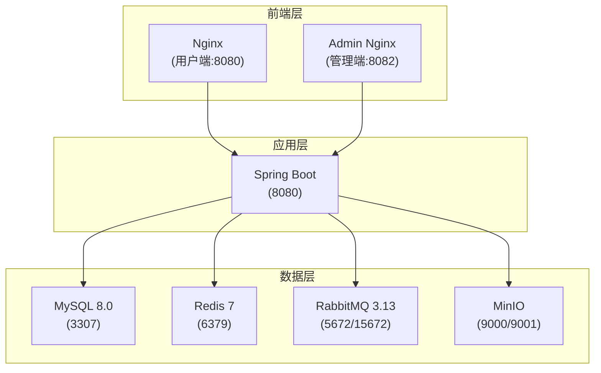

本页面为开发者提供从零开始搭建 Bilibili 仿站项目开发环境的完整指南，涵盖技术栈要求、依赖安装、配置说明以及多种启动方式。项目采用前后端分离架构，后端基于 Spring Boot 4.0.3，前端包含用户端和管理端两个 Vue 3 应用，所有服务均可通过 Docker Compose 一键编排启动。

## 技术栈概览

项目采用现代化的技术栈，前后端均基于主流框架构建。下表列出了核心组件及其版本要求：

| 组件 | 技术栈 | 版本要求 | 用途 |
|------|--------|----------|------|
| **后端框架** | Spring Boot | 4.0.3 | 核心业务服务 |
| **开发语言** | Java | 17+ | 后端开发 |
| **构建工具** | Maven | 3.9+ | 项目构建与依赖管理 |
| **数据库** | MySQL | 8.0 | 主数据存储 |
| **缓存** | Redis | 7.x | 缓存与会话存储 |
| **消息队列** | RabbitMQ | 3.13+ | 异步消息处理（IM系统） |
| **对象存储** | MinIO | latest | 视频、图片等媒体文件存储 |
| **前端框架** | Vue 3 | 3.5+ | 用户端与管理端 |
| **构建工具** | Vite | 8.0+ | 前端开发与构建 |
| **容器编排** | Docker Compose | 2.x | 多服务一键启动 |

## 环境准备

### 系统要求

项目支持 macOS、Linux 和 Windows（WSL2）操作系统。开发环境需要以下基础软件：

1. **JDK 17+**：推荐使用 Eclipse Temurin 发行版
2. **Maven 3.9+**：项目包含 `mvnw` 包装器脚本
3. **Node.js 18+**：推荐使用 LTS 版本
4. **Docker 与 Docker Compose**：用于容器化部署

### 获取项目代码

克隆项目仓库后，目录结构如下：

```bash
git clone <repository-url>
cd biliibli
```

项目根目录包含三个主要子模块：
- `bilibili_SpringBoot/`：后端服务
- `bilibili_web/`：用户端前端
- `bilibili_admin_web/`：管理端前端

## 配置详解

### 后端配置

后端配置采用分层设计，主配置文件 [application.yaml](bilibili_SpringBoot/src/main/resources/application.yaml) 定义了所有默认值，开发专用配置 [application-dev.yaml](bilibili_SpringBoot/src/main/resources/application-dev.yaml) 覆盖了开发环境特有设置。

核心配置项说明：

| 配置类别 | 环境变量 | 默认值 | 说明 |
|----------|----------|--------|------|
| **数据库** | `DB_URL` | `jdbc:mysql://mysql:3306/bilibili` | MySQL连接地址 |
| **数据库** | `DB_USERNAME` | 无 | 数据库用户名 |
| **数据库** | `DB_PASSWORD` | 无 | 数据库密码 |
| **Redis** | `REDIS_HOST` | `redis` | Redis主机地址 |
| **Redis** | `REDIS_PORT` | `6379` | Redis端口 |
| **RabbitMQ** | `RABBITMQ_HOST` | `rabbitmq` | RabbitMQ主机地址 |
| **MinIO** | `MINIO_ENDPOINT` | `http://minio:9000` | MinIO内部访问地址 |
| **MinIO** | `MINIO_PUBLIC_ENDPOINT` | `http://localhost:9000` | MinIO外部访问地址 |
| **JWT** | `JWT_SECRET` | `change-this-secret...` | JWT签名密钥（需修改） |

开发环境启用的特殊功能包括：SQL初始化模式设为 `always`、Swagger UI 可访问、IM消息队列开启。

### 前端配置

前端项目通过 Vite 的环境变量机制进行配置。用户端 [vite.config.ts](bilibili_web/vite.config.ts) 配置了开发服务器运行在 `5173` 端口，并代理 API 请求到后端：

```typescript
proxy: {
  '^/(users|me|videos|search|ws)': {
    target: proxyTarget,  // 默认 http://127.0.0.1:8080
    changeOrigin: true,
    ws: true,
  },
}
```

管理端 [vite.config.ts](bilibili_admin_web/vite.config.ts) 运行在 `5174` 端口，代理管理相关的 API 路径。两个前端项目共享相同的技术栈和依赖版本。

### Docker Compose 编排

项目提供 [bilibili_SpringBoot/docker-compose.yml](bilibili_SpringBoot/docker-compose.yml) 定义完整的服务编排，包含以下服务：



各服务端口映射与健康检查配置如下表所示：

| 服务 | 容器端口 | 宿主机端口 | 健康检查方式 |
|------|----------|------------|--------------|
| MySQL | 3306 | 127.0.0.1:3307 | `mysqladmin ping` |
| Redis | 6379 | 127.0.0.1:6379 | `redis-cli ping` |
| RabbitMQ | 5672, 15672 | 127.0.0.1:5672, 15672 | `rabbitmq-diagnostics ping` |
| MinIO | 9000, 9001 | 9000, 9001 | 无（启动即就绪） |
| Nginx | 80 | 8080 | 无 |
| Admin Nginx | 80 | 8082 | 无 |

## 启动方式

### 方式一：Docker Compose 一键启动（推荐）

这是最简单的启动方式，适用于快速体验和生产部署：

```bash
cd bilibili_SpringBoot

# 构建并启动所有服务
docker compose up -d --build

# 查看服务状态
docker compose ps

# 查看应用日志
docker compose logs -f app
```

启动完成后，访问地址：
- **用户端**：http://localhost:8080
- **管理端**：http://localhost:8082
- **RabbitMQ 管理界面**：http://localhost:15672（guest/guest）
- **MinIO 控制台**：http://localhost:9001（huangnv/zxcvbnm123.0）

### 方式二：本地开发模式

适用于需要频繁修改代码的开发场景，分步骤启动各个组件：

**1. 启动基础设施**

使用 Docker Compose 仅启动依赖服务：

```bash
cd bilibili_SpringBoot

# 仅启动数据库和中间件
docker compose up -d mysql redis rabbitmq minio

# 等待服务就绪
docker compose ps
```

**2. 启动后端服务**

```bash
cd bilibili_SpringBoot

# 使用 Maven 包装器启动
./mvnw spring-boot:run

# 或者使用本地 Maven
mvn spring-boot:run
```

后端服务默认运行在 `8080` 端口，可通过 `--server.port=8081` 修改。

**3. 启动前端服务**

打开新的终端窗口，分别启动用户端和管理端：

```bash
# 启动用户端（端口 5173）
cd bilibili_web
npm install
npm run dev

# 启动管理端（端口 5174）
cd bilibili_admin_web
npm install
npm run dev
```

前端开发服务器配置了热模块替换（HMR），修改代码后自动刷新。

### 方式三：IDE 集成启动

**IntelliJ IDEA 配置**

1. 导入 `bilibili_SpringBoot/pom.xml` 作为 Maven 项目
2. 运行主类 `com.bilibili.BilibiliSpringBootApplication`
3. 在 Run Configuration 中添加环境变量：
   - `DB_URL=jdbc:mysql://127.0.0.1:3307/bilibili?useSSL=false&serverTimezone=Asia/Shanghai&allowPublicKeyRetrieval=true&useUnicode=true&characterEncoding=utf8`
   - `DB_USERNAME=huangnv`
   - `DB_PASSWORD=11447`
   - `REDIS_HOST=127.0.0.1`
   - `RABBITMQ_HOST=127.0.0.1`

**VS Code 配置**

前端项目支持 VS Code 开箱即用，安装 Volar 扩展即可获得完整的 Vue 3 类型支持。

## 监控系统启动

项目提供独立的监控栈，位于 [monitoring/](monitoring/) 目录，包含 Prometheus、Grafana 和各种 Exporter：

```bash
cd monitoring

# 复制环境变量模板
cp .env.example .env

# 根据实际情况修改 .env 文件
# 主要修改 BUSINESS_DOCKER_NETWORK 和数据库密码

# 启动监控栈
docker compose up -d
```

监控服务访问地址：
- **Grafana**：http://localhost:3000（admin/admin）
- **Prometheus**：http://localhost:9090
- **Node Exporter**：http://localhost:9100

## 验证安装

### 后端服务验证

1. **健康检查**：访问 http://localhost:8080/actuator/health
2. **API 文档**：开发模式下访问 http://localhost:8080/swagger-ui.html
3. **数据库连接**：检查 Flyway 迁移是否自动执行

### 前端服务验证

1. **用户端**：访问 http://localhost:5173，应显示首页
2. **管理端**：访问 http://localhost:5174，应显示登录页面
3. **API 代理**：在浏览器开发者工具中检查网络请求是否正确代理

### 中间件验证

```bash
# 测试 Redis 连接
docker compose exec redis redis-cli ping

# 测试 MySQL 连接
docker compose exec mysql mysql -u huangnv -p11447 -e "SHOW DATABASES;"

# 测试 RabbitMQ 管理界面
curl http://localhost:15672/api/overview
```

## 常见问题排查

| 问题现象 | 可能原因 | 解决方案 |
|----------|----------|----------|
| MySQL 启动失败 | 端口 3307 被占用 | 修改 `docker-compose.yml` 中的端口映射 |
| 数据库连接拒绝 | 服务未完全就绪 | 等待健康检查通过或增加重试间隔 |
| MinIO 上传失败 | 权限配置错误 | 检查 Access Key 和 Secret Key |
| 前端 API 代理失败 | 后端服务未启动 | 确保后端在 8080 端口运行 |
| RabbitMQ 连接超时 | 防火墙阻止 | 检查端口 5672 是否开放 |
| JWT 认证失败 | 密钥不匹配 | 确保前后端使用相同的 JWT Secret |

## 开发工具推荐

项目提供了辅助开发工具，位于 `bilibili_SpringBoot/tools/` 目录：

- **simulator/**：WebSocket 模拟客户端，用于测试 IM 功能
- **websocket_metrics_snapshot.sh**：WebSocket 性能指标采集脚本

此外，`bilibili_SpringBoot/src/main/resources/static/` 目录下提供了浏览器端 IM 测试工具，可直接通过 http://localhost:8080/im-lab/ 访问。

## 下一步

环境搭建完成后，建议按照以下顺序阅读文档：

1. **[项目概览](1-xiang-mu-gai-lan)**：了解整体架构和功能模块
2. **[项目目录结构总览](3-xiang-mu-mu-lu-jie-gou-zong-lan)**：熟悉代码组织方式
3. **[Spring Boot 后端架构分层与领域划分](8-spring-boot-hou-duan-jia-gou-fen-ceng-yu-ling-yu-hua-fen)**：深入理解后端设计

如需进行前端开发，请参考：
- **[用户端路由与页面体系](4-yong-hu-duan-lu-you-yu-ye-mian-ti-xi)**
- **[管理端功能与权限设计](7-guan-li-duan-gong-neng-yu-quan-xian-she-ji)**

如需进行 IM 系统开发，请参考：
- **[IM 领域模型与应用层编排](16-im-ling-yu-mo-xing-yu-ying-yong-ceng-bian-pai)**

## Sources

- [bilibili_SpringBoot/pom.xml](bilibili_SpringBoot/pom.xml#L1-L197)
- [bilibili_SpringBoot/docker-compose.yml](bilibili_SpringBoot/docker-compose.yml#L1-L143)
- [bilibili_SpringBoot/src/main/resources/application.yaml](bilibili_SpringBoot/src/main/resources/application.yaml#L1-L159)
- [bilibili_SpringBoot/src/main/resources/application-dev.yaml](bilibili_SpringBoot/src/main/resources/application-dev.yaml#L1-L18)
- [bilibili_SpringBoot/Dockerfile](bilibili_SpringBoot/Dockerfile#L1-L18)
- [bilibili_web/package.json](bilibili_web/package.json#L1-L30)
- [bilibili_web/vite.config.ts](bilibili_web/vite.config.ts#L1-L23)
- [bilibili_admin_web/package.json](bilibili_admin_web/package.json#L1-L30)
- [bilibili_admin_web/vite.config.ts](bilibili_admin_web/vite.config.ts#L1-L22)
- [bilibili_SpringBoot/deploy/nginx/default.conf](bilibili_SpringBoot/deploy/nginx/default.conf#L1-L73)
- [bilibili_SpringBoot/deploy/nginx/admin.conf](bilibili_SpringBoot/deploy/nginx/admin.conf#L1-L35)
- [monitoring/docker-compose.yml](monitoring/docker-compose.yml#L1-L138)
- [monitoring/.env.example](monitoring/.env.example#L1-L36)
- [bilibili_SpringBoot/src/main/java/com/bilibili/BilibiliSpringBootApplication.java](bilibili_SpringBoot/src/main/java/com/bilibili/BilibiliSpringBootApplication.java#L1-L17)
- [bilibili_SpringBoot/settings.xml](bilibili_SpringBoot/settings.xml#L1-L14)