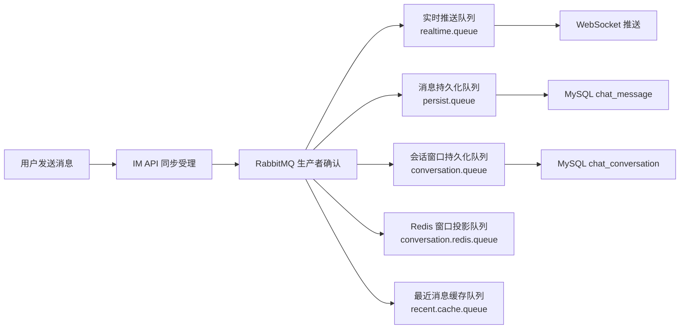
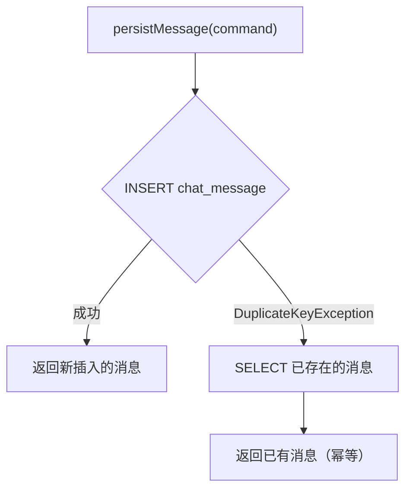
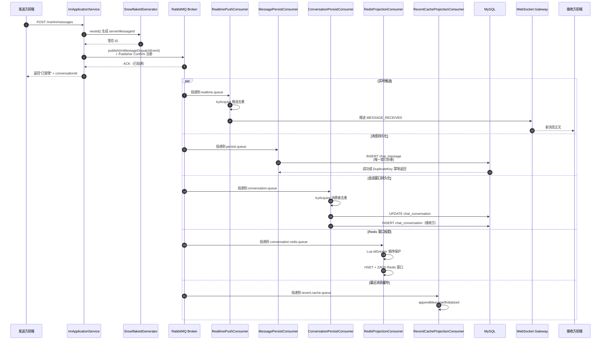

本页详细解析即时通信系统中消息从生产到消费全链路的三大质量保障维度——**消息不丢失（可靠性）**、**消息不重复（幂等性）**、**消息有序（顺序性）**。三者共同构成了 IM 系统数据一致性的基石。

## 消息可靠性保障总览

在本项目中，消息可靠性并非依赖单一机制，而是通过**多层防御体系**贯穿消息的完整生命周期：从用户发送到 HTTP 接口受理、经 RabbitMQ 投递到异步消费、再到最终持久化与推送。整个链路采用**三阶段事件驱动管线**，每个阶段独立承担不同的保障职责。

来源：[RabbitImMessageProducer.java](bilibili_SpringBoot/src/main/java/com/bilibili/im/mq/producer/impl/RabbitImMessageProducer.java#L1-L323)、[ImMqProperties.java](bilibili_SpringBoot/src/main/java/com/bilibili/config/properties/ImMqProperties.java#L1-L111)

## 生产端可靠性：Publisher Confirm 与重试

消息从应用层进入 RabbitMQ 的过程中，系统采用**发布确认（Publisher Confirm）** 机制保障消息不丢。生产者 `RabbitImMessageProducer` 在每条消息投递时，会创建一个 `PendingConfirm` 记录并存入内存 `ConcurrentMap`，然后通过 `CorrelationData` 注册确认回调。

当 RabbitMQ Broker 返回 ACK 时，该记录从待确认映射中移除；当返回 NACK 或确认超时（5 秒）时，系统自动发起重试，**最多重试 3 次**。如果 3 次全部失败则放弃并记录错误日志。该重试逻辑通过 `@Scheduled(fixedDelay = 1000)` 定时任务驱动，每秒扫描一次超时的待确认消息。

**关键设计细节**：每条待确认消息携带唯一的 `correlationId`（UUID），使得重试时能精确追踪消息的投递状态；同时在 AMQP 消息头中注入 `traceId` 和 `uid`，保证链路追踪在异步消费时不断裂。

| 保障机制 | 作用 | 超时/上限 |
|---|---|---|
| Publisher Confirm 回调 | 感知 Broker 收到消息的状态 | — |
| 确认超时检测 | 发现 ACK 丢失或网络分区 | 5 秒 |
| 自动重试 | 重新投递未确认的消息 | 最多 3 次 |
| CorrelationData 追踪 | 精确关联请求与确认 | — |
| MDC Header 传播 | 链路追踪贯穿异步边界 | — |

来源：[RabbitImMessageProducer.java](bilibili_SpringBoot/src/main/java/com/bilibili/im/mq/producer/impl/RabbitImMessageProducer.java#L35-L180)

## 消费端幂等性保障

消息到达消费端后面临的核心挑战是**重复消费**——RabbitMQ 在网络抖动、消费者重连等场景下可能重复投递消息。本项目在两个层面构建幂等防线：

### 消费者去重服务（ImMqConsumerIdempotencyService）

`ImMqConsumerIdempotencyService` 是消费端的第一道幂等屏障，基于 **Redis SETNX** 实现。每个消费者在处理消息前，先调用 `tryAcquire(consumerName, serverMessageId)` 以 `serverMessageId` 作为幂等键尝试获取分布式锁。Redis Key 的格式为 `im:consumer:dedupe:{consumerName}:{serverMessageId}`，TTL 为 **1 天**。

只有当 `SETNX` 返回 `true`（即首次获取）时，消费者才会继续执行业务逻辑。如果 `SETNX` 返回 `false`，说明该消息已被消费过，直接跳过。

**事务回滚时的补偿机制**：在 `ConversationWindowPersistConsumer` 中，当幂等锁获取成功后，会通过 `TransactionSynchronizationManager` 注册 `afterCompletion` 回调。如果事务最终回滚（`status != STATUS_COMMITTED`），则主动调用 `release()` 删除 Redis 中的幂等键，允许后续重试时重新处理该消息。这避免了"事务失败但幂等键已存在"导致消息永久丢失的极端情况。

| 机制 | 实现方式 | Key 模式 | TTL |
|---|---|---|---|
| 消费者去重 | Redis SETNX | `im:consumer:dedupe:{consumerName}:{serverMessageId}` | 1 天 |
| 事务回滚补偿 | Spring TransactionSynchronization | 删除已获取的幂等键 | — |

来源：[ImMqConsumerIdempotencyService.java](bilibili_SpringBoot/src/main/java/com/bilibili/im/message/cache/ImMqConsumerIdempotencyService.java#L1-L45)、[ConversationWindowPersistConsumer.java](bilibili_SpringBoot/src/main/java/com/bilibili/im/mq/consumer/single/ConversationWindowPersistConsumer.java#L1-L111)

### 实时推送去重服务（ImRealtimePushIdempotencyService）

实时 WebSocket 推送层有独立的幂等机制，防止同一条消息被重复推送到用户客户端。`RedisImRealtimePushIdempotencyService` 同样基于 Redis SETNX，其幂等键由 `senderId` 和 `clientMessageId` 组合而成，Key 格式为 `im:push:{senderId}:{clientMessageId}`，TTL 为 **1 分钟**。

TTL 较短是因为实时推送属于"最佳努力"（best-effort）语义：只要保证短时间内不重复推送即可，即使 1 分钟后幂等键过期导致极端重复，客户端也可以通过 `clientMessageId` 自行去重。

| 机制 | 实现方式 | Key 模式 | TTL |
|---|---|---|---|
| 推送去重 | Redis SETNX | `im:push:{senderId}:{clientMessageId}` | 1 分钟 |

来源：[RedisImRealtimePushIdempotencyService.java](bilibili_SpringBoot/src/main/java/com/bilibili/im/websocket/service/impl/RedisImRealtimePushIdempotencyService.java#L1-L43)

## 数据库层幂等：唯一索引防护

在消息持久化环节，`chat_message` 表通过两组**唯一索引**作为最后一道幂等防线，防止任何原因导致的重复写入：

**第一组：`uk_sender_client_message (sender_id, client_message_id)`**
这对组合索引确保同一发送者的同一条客户端消息不会被重复插入。当 `INSERT` 触发 `DuplicateKeyException` 时，`ChatMessageServiceImpl.persistMessage()` 会捕获该异常，通过 `selectBySenderAndClientMessageId` 查询已存在的消息并直接返回，而不是抛出异常导致消费失败。

**第二组：`uk_chat_message_server_message_id (server_message_id)`**
基于雪花算法生成的 `serverMessageId` 也具有全局唯一性，进一步加固了防重复写入的能力。

这种"先 INSERT 再查"的模式比"先查再 INSERT"更高效且线程安全，因为**唯一索引本身就充当了分布式锁的角色**。

来源：[ChatMessageServiceImpl.java](bilibili_SpringBoot/src/main/java/com/bilibili/im/message/service/impl/ChatMessageServiceImpl.java#L1-L107)、[V6__add_client_message_id_to_chat_message.sql](bilibili_SpringBoot/src/main/resources/db/migration/V6__add_client_message_id_to_chat_message.sql#L1-L6)、[V11__add_server_message_id_to_chat_message.sql](bilibili_SpringBoot/src/main/resources/db/migration/V11__add_server_message_id_to_chat_message.sql#L1-L16)

## 消息顺序性保障

消息顺序性在 IM 场景中至关重要：用户期望在会话窗口中看到的消息严格按照发送时间排列。本项目通过**Snowflake ID** 和**数据库排序**两层机制保障顺序。

### Snowflake ID 全局有序

`SnowflakeMessageIdGenerator` 采用经典雪花算法生成 64 位 `serverMessageId`，其二进制结构为：**41 位时间戳 | 5 位数据中心 ID | 5 位工作节点 ID | 12 位序列号**。时间戳以自定义纪元 `1735689600000L`（2025-01-01 00:00:00 UTC）为基准，序列号在同一毫秒内通过原子递增保证单调性，同一毫秒序列号溢出时自旋等待下一毫秒。

**关键设计特点**：`nextId()` 方法使用 `synchronized` 关键字保护，在单实例部署场景下保证线程安全。这避免了并发场景下 ID 碰撞或乱序的风险。

| 组成部分 | 位数 | 含义 |
|---|---|---|
| 时间戳 | 41 位 | 相对于纪元的毫秒偏移 |
| 数据中心 ID | 5 位 | 固定为 0（单机部署） |
| 工作节点 ID | 5 位 | 固定为 0（单机部署） |
| 序列号 | 12 位 | 同毫秒内递增，最大 4095 |

来源：[SnowflakeMessageIdGenerator.java](bilibili_SpringBoot/src/main/java/com/bilibili/im/common/id/impl/SnowflakeMessageIdGenerator.java#L1-L69)

### 游标分页与排序

`serverMessageId` 同时承担**消息排序**和**游标分页**的职责。在 `ChatMessageMapper.selectHistoryByConversationId` 中，查询条件 `server_message_id < #{beforeServerMessageId}` 配合 `ORDER BY server_message_id DESC` 实现了基于服务端消息 ID 的稳定分页。数据库层的复合索引 `idx_conversation_server_message_id (conversation_id, server_message_id)` 保证该查询的高效执行。

来源：[ChatMessageMapper.java](bilibili_SpringBoot/src/main/java/com/bilibili/im/message/mapper/ChatMessageMapper.java#L95-L115)、[V11__add_server_message_id_to_chat_message.sql](bilibili_SpringBoot/src/main/resources/db/migration/V11__add_server_message_id_to_chat_message.sql#L14-L16)

### Redis 缓存层的顺序保护

在会话窗口的 Redis 投影中，Lua 脚本 `project_conversation_window_event` 内嵌了 `idGreater` 函数，用于比较 `serverMessageId` 的大小。只有当新消息的 `serverMessageId` 大于当前窗口记录的 `lastServerMessageId` 时，才会更新窗口的最后一条消息摘要。这保证了即使 Redis 投影事件到达顺序与消息发送顺序不一致，窗口状态也不会倒退。

来源：[project_conversation_window_event.lua](bilibili_SpringBoot/src/main/resources/scripts/redis/project_conversation_window_event.lua#L28-L44)

## 五消费者异步管线架构

单聊场景下，一条消息事件从生产者发出后，会被五类独立消费者并行消费，各自承担不同的职责。这种"多队列扇出"模式既实现了职责分离，也保证了各环节可独立伸缩。

| 消费者 | 队列 | 职责 | 幂等机制 | 事务 |
|---|---|---|---|---|
| RealtimePushConsumer | `im.message.realtime.queue` | 尽快将消息正文通过 WebSocket 推送给在线接收方 | 推送去重（Redis SETNX） | 无 |
| ChatMessagePersistConsumer | `im.message.persist.queue` | 持久化消息到 `chat_message` | 数据库唯一索引 | @Transactional |
| ConversationWindowPersistConsumer | `im.message.conversation.queue` | 更新双方 `chat_conversation` 的最后消息和未读数 | 消费者去重（Redis SETNX + 事务补偿） | @Transactional |
| ConversationWindowRedisProjectionConsumer | `im.message.conversation.redis.queue` | 投影会话窗口到 Redis 缓存 | Lua 脚本内的 `idGreater` 比较 | 无 |
| RecentMessageCacheProjectionConsumer | `im.message.recent.cache.queue` | 将消息追加到最近消息 Redis 缓存 | 缓存初始化检查（`isInitialized`） | 无 |

这种设计遵循了**事件链分层原则**：实时推送追求最快到达，消息持久化是主事实必须成功，会话窗口是派生投影允许稍后收敛。三者解耦后，即使推送失败也不影响数据一致性，即使窗口投影延迟也不影响消息已落库的事实。

来源：[RealtimePushConsumer.java](bilibili_SpringBoot/src/main/java/com/bilibili/im/mq/consumer/single/RealtimePushConsumer.java#L1-L47)、[ChatMessagePersistConsumer.java](bilibili_SpringBoot/src/main/java/com/bilibili/im/mq/consumer/single/ChatMessagePersistConsumer.java#L1-L68)、[ConversationWindowPersistConsumer.java](bilibili_SpringBoot/src/main/java/com/bilibili/im/mq/consumer/single/ConversationWindowPersistConsumer.java#L1-L111)、[ConversationWindowRedisProjectionConsumer.java](bilibili_SpringBoot/src/main/java/com/bilibili/im/mq/consumer/single/ConversationWindowRedisProjectionConsumer.java#L1-L78)、[RecentMessageCacheProjectionConsumer.java](bilibili_SpringBoot/src/main/java/com/bilibili/im/mq/consumer/single/RecentMessageCacheProjectionConsumer.java#L1-L65)

## 消息全链路时序

综合以上保障机制，一条消息从发送到送达的完整链路如下：

## 可靠性、幂等性与顺序性保障对照表

| 维度 | 保障目标 | 实现机制 | 失败时行为 |
|---|---|---|---|
| **消息不丢失** | 消息成功进入 Broker | Publisher Confirm + 超时重试（最多 3 次） | 放弃并记录错误日志 |
| **消息不丢失** | 消息持久化到数据库 | @Transactional 事务保护 | 事务回滚，MQ 重试消费 |
| **消息不重复** | 消费端幂等 | Redis SETNX 去重 + 事务回滚补偿 | 跳过已处理的消息 |
| **消息不重复** | 推送端幂等 | Redis SETNX 短 TTL 去重 | 跳过已推送的消息 |
| **消息不重复** | 持久化层幂等 | 数据库唯一索引 + DuplicateKeyException 捕获 | 返回已有消息 |
| **消息有序** | ID 全局单调递增 | Snowflake ID（时间戳 + 序列号） | 时钟回拨抛异常 |
| **窗口有序** | 缓存投影不倒退 | Lua 脚本 `idGreater` 比较 | 丢弃旧事件 |
| **查询有序** | 游标分页稳定 | `ORDER BY server_message_id DESC` + 复合索引 | — |

## 关键设计决策与权衡

**为什么消费者去重使用 serverMessageId 而不是 clientMessageId？** 在消费端，消息事件已经由服务端分配了唯一的 `serverMessageId`，使用它作为幂等键更直接、更可靠。`clientMessageId` 是客户端生成的，在极端情况下可能存在碰撞（尽管概率极低），而 `serverMessageId` 通过雪花算法在服务端生成，唯一性有更强保障。

**为什么实时推送去重使用 clientMessageId 而不是 serverMessageId？** 实时推送发生在消息被 MQ 分发时，此时消息可能尚未持久化。使用 `senderId + clientMessageId` 组合可以覆盖发送端的原始意图去重，即使服务端 ID 尚未确认，也能防止同一客户端消息被重复推送。

**为什么会话窗口投影需要事务回滚补偿？** 普通的消息持久化消费者依赖数据库唯一索引即可实现幂等，不需要 Redis 去重键。但会话窗口更新是对已有记录的 `UPDATE` 操作，不具备天然幂等性，因此需要额外的 Redis 去重键来避免"未读数重复累加"。当事务回滚时，必须释放去重键，否则该消息的窗口更新将永远丢失。

来源：[ConversationWindowPersistConsumer.java](bilibili_SpringBoot/src/main/java/com/bilibili/im/mq/consumer/single/ConversationWindowPersistConsumer.java#L60-L75)