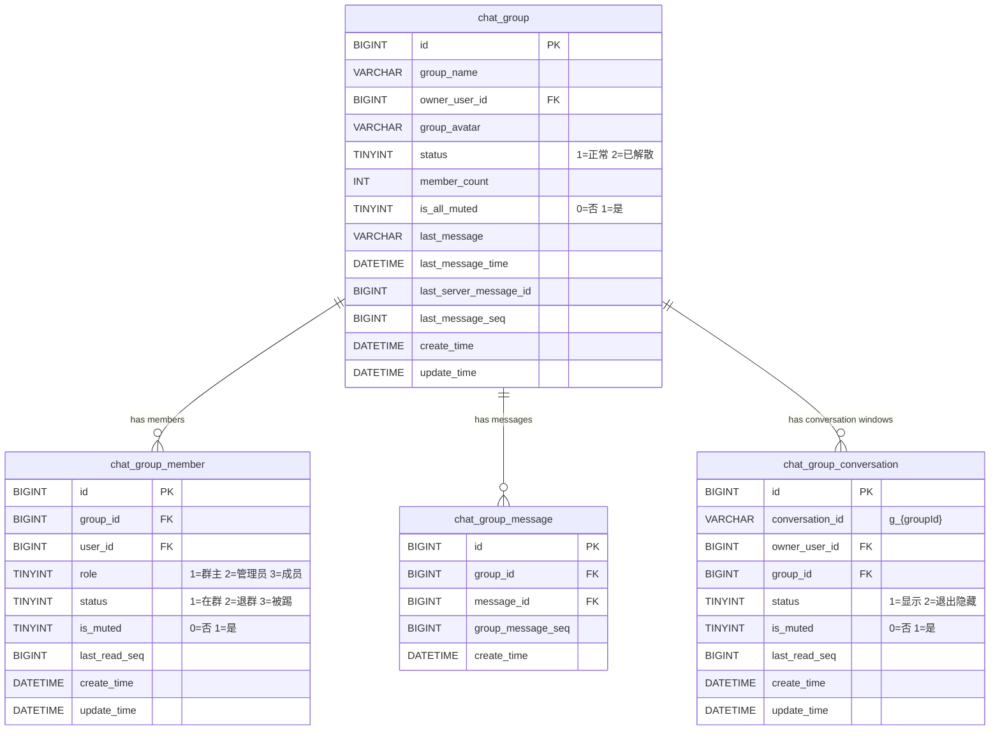
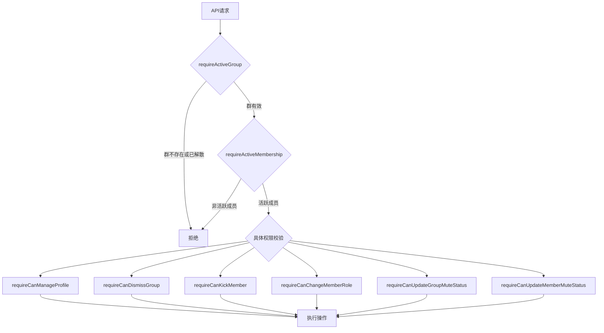
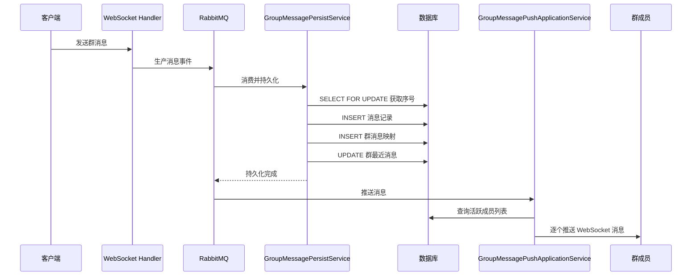

本文档详细剖析 B 站 IM 系统中群聊功能的架构设计、数据模型与权限控制体系。群聊模块作为 IM 领域模型的核心子域之一，采用 **基于角色的访问控制（RBAC）** 模型，通过三级角色层次实现精细化的权限管理。本文将从数据层、业务层、缓存层三个维度展开，帮助开发者快速理解群聊功能的完整实现。

## 数据库设计：三表核心结构

群聊功能的数据存储围绕三张核心表展开，各表职责明确、边界清晰。`chat_group` 表存储群组元数据，包括群名、群头像、群主 ID、成员总数及最近消息摘要；`chat_group_member` 表维护用户与群组的多对多关系，记录每个成员的角色、状态和禁言属性；`chat_group_message` 表作为群消息的序号映射层，将全局递增的 `server_message_id` 转换为群内递增的 `group_message_seq`，为客户端的消息顺序展示和已读同步提供基础。

会话窗口表 `chat_group_conversation` 是面向用户视角的视图层，每个群成员拥有独立的会话窗口记录，用于管理未读状态、免打扰设置以及退出后的隐藏逻辑。会话 ID 的生成规则为 `g_{groupId}`，保证同一群组在不同用户间共享同一会话标识。

Sources: [V12__create_group_chat_core_tables.sql](bilibili_SpringBoot/src/main/resources/db/migration/V12__create_group_chat_core_tables.sql#L1-L42), [V13__create_group_conversation_table.sql](bilibili_SpringBoot/src/main/resources/db/migration/V13__create_group_conversation_table.sql#L1-L14)

## 角色权限模型：三级层次体系

群聊权限模型采用经典的三级角色结构：**群主（Owner）**、**管理员（Admin）** 和 **普通成员（Member）**。角色枚举定义在 `ChatGroupMemberRole` 中，分别对应编码 1、2、3。权限检查的核心逻辑封装在 `GroupPermissionService` 接口及其 `GroupPermissionServiceImpl` 实现类中，该服务通过 `ChatGroupSnapshotCache` 和 `ChatGroupMemberSnapshotCache` 获取缓存快照，避免频繁的数据库查询。

| 角色 | 编码 | 可管理群资料 | 可解散群 | 可踢人 | 可设管理员 | 可禁言他人 |
|------|------|-------------|---------|-------|-----------|-----------|
| **群主 (Owner)** | 1 | ✅ | ✅ | ✅（除自己） | ✅ | ✅（除自己） |
| **管理员 (Admin)** | 2 | ✅ | ❌ | ✅（仅普通成员） | ❌ | ✅（仅普通成员） |
| **普通成员 (Member)** | 3 | ❌ | ❌ | ❌ | ❌ | ❌ |

权限校验方法在 `GroupPermissionServiceImpl` 中实现，每个方法均遵循 **"先验证存在性，再验证权限"** 的双层防护模式。例如 `requireCanKickMember` 方法会依次检查操作者和目标用户均为活跃成员，然后基于角色层级判断操作合法性。该服务抛出 `IllegalArgumentException` 异常而非自定义异常，保持与 Spring Validation 体系的一致性。

Sources: [ChatGroupMemberRole.java](bilibili_SpringBoot/src/main/java/com/bilibili/im/group/model/enums/ChatGroupMemberRole.java#L1-L20), [GroupPermissionServiceImpl.java](bilibili_SpringBoot/src/main/java/com/bilibili/im/group/permission/impl/GroupPermissionServiceImpl.java#L1-L235)

## 权限校验方法详解

`GroupPermissionService` 接口定义了八个核心权限校验方法，覆盖群聊的全部管理操作。每个方法的职责单一、命名语义明确，形成完整的权限守卫链。

**requireCanManageProfile** 方法校验用户是否有权修改群名称或群头像，仅群主和管理员通过。**requireCanDismissGroup** 方法最为严格，要求操作者既是群主角色又是群主用户本人。**requireCanKickMember** 和 **requireCanUpdateMemberMuteStatus** 方法采用相同的角色层级逻辑：管理员只能操作普通成员，群主可以操作除自己外的所有成员。**requireCanChangeMemberRole** 方法限制为仅群主可执行，且不能修改自身的群主角色。

Sources: [GroupPermissionService.java](bilibili_SpringBoot/src/main/java/com/bilibili/im/group/permission/GroupPermissionService.java#L1-L32)

## 群组生命周期管理

群组的完整生命周期包含创建、运营和解散三个阶段，由 `ChatGroupService` 和 `GroupApplicationService` 协同管理。`ChatGroupService` 负责核心业务逻辑和事务控制，`GroupApplicationService` 负责跨服务编排和视图转换。

**创建阶段**：调用 `createGroup` 方法时，系统在同一个事务内完成群组记录插入和群主成员记录创建。群主自动获得 `OWNER` 角色，初始成员数为 1。创建完成后，`GroupApplicationService` 会调用 `ChatGroupConversationService.initializeGroupConversation` 为群主初始化会话窗口。

**运营阶段**：支持邀请成员（`inviteMember`）、踢出成员（`kickGroupMember`）、成员主动退出（`leaveGroup`）、修改群名（`updateGroupName`）、修改群头像（`updateGroupAvatar`）、全员禁言（`updateGroupMuteStatus`）、单人禁言（`updateGroupMemberMuteStatus`）和角色变更（`updateGroupMemberRole`）等操作。每次成员变动后，系统会通过 `syncMemberCount` 方法重新计算活跃成员数并更新群组记录。

**解散阶段**：仅群主可执行 `dismissGroup` 操作，该操作在事务内完成三步：将群状态设为 `DISMISSED`、将所有活跃成员状态批量更新为 `REMOVED`、清空成员数。解散后，`GroupApplicationService` 调用 `hideAllGroupConversations` 隐藏所有成员的会话窗口。值得注意的是，群主执行"退出群聊"操作时，系统会自动将其转换为"解散群聊"，避免群主离群后的孤儿群组问题。

Sources: [ChatGroupServiceImpl.java](bilibili_SpringBoot/src/main/java/com/bilibili/im/group/service/impl/ChatGroupServiceImpl.java#L1-L380), [GroupApplicationServiceImpl.java](bilibili_SpringBoot/src/main/java/com/bilibili/im/app/impl/GroupApplicationServiceImpl.java#L1-L194)

## 缓存策略与快照机制

群聊权限校验的性能优化依赖于 **Spring Cache 抽象层** 配合 **快照记录模式**。系统使用两个缓存命名空间：`im:group-snapshot` 存储群组快照，`im:group-member-snapshot` 存储成员快照。快照对象 `ChatGroupSnapshot` 和 `ChatGroupMemberSnapshot` 均为不可变记录（record），仅包含权限校验所需的最小字段集，降低序列化开销。

缓存的写入通过 `@Cacheable` 注解实现，读取时自动填充。缓存的失效则通过 `GroupPermissionCacheEvictor` 组件管理，该组件利用 `TransactionSynchronizationManager` 注册事务提交后的回调，确保缓存失效操作在数据库事务成功提交后才执行，避免读到脏数据。批量失效场景（如解散群组）通过 `evictGroupMembers` 方法一次性清除多个成员的缓存条目。

Sources: [SpringChatGroupSnapshotCache.java](bilibili_SpringBoot/src/main/java/com/bilibili/im/group/cache/impl/SpringChatGroupSnapshotCache.java#L1-L47), [SpringChatGroupMemberSnapshotCache.java](bilibili_SpringBoot/src/main/java/com/bilibili/im/group/cache/impl/SpringChatGroupMemberSnapshotCache.java#L1-L53), [GroupPermissionCacheEvictor.java](bilibili_SpringBoot/src/main/java/com/bilibili/im/group/cache/GroupPermissionCacheEvictor.java#L1-L83)

## 群消息发送与推送流程

群消息的处理管线遵循 **"校验 → 持久化 → 推送"** 的三阶段模式。消息发送请求首先经过 WebSocket 协议层进入 `ImMessageProducer`，由 RabbitMQ 异步消费后进入 `GroupMessagePersistService.persistGroupMessage` 方法。该方法使用 `SELECT ... FOR UPDATE` 锁定群组记录以获取当前最大序号，然后在同一事务内完成消息记录插入、群消息映射表插入和群组最近消息摘要更新。

消息推送由 `GroupMessagePushApplicationService.pushGroupMessage` 方法负责，该方法查询群内所有活跃成员，遍历调用 `MessagePushService.pushMessageReceived` 将消息推送到每个成员的 WebSocket 连接。推送过程中不区分成员角色，所有活跃成员（包括发送者自身）均会收到推送，保证消息的广播一致性。

Sources: [GroupMessagePersistServiceImpl.java](bilibili_SpringBoot/src/main/java/com/bilibili/im/message/service/impl/GroupMessagePersistServiceImpl.java#L1-L96), [GroupMessagePushApplicationServiceImpl.java](bilibili_SpringBoot/src/main/java/com/bilibili/im/app/impl/GroupMessagePushApplicationServiceImpl.java#L1-L65)

## API 接口总览

群聊功能对外暴露两个 Controller：`ImGroupController` 负责群组管理操作，`ImGroupMessageController` 负责群消息查询。所有接口均要求 `@PreAuthorize("isAuthenticated()")` 认证，并通过 `@AuthenticationPrincipal` 注入当前用户身份。

| HTTP 方法 | 路径 | 功能 | 角色要求 |
|-----------|------|------|---------|
| POST | `/me/im/create-group` | 创建群聊 | 任意已认证用户 |
| GET | `/me/im/groups/{groupId}` | 获取群资料 | 群成员 |
| POST | `/me/im/groups/{groupId}/members` | 邀请成员 | 群成员 |
| PUT | `/me/im/groups/{groupId}/name` | 修改群名 | 群主/管理员 |
| PUT | `/me/im/groups/{groupId}/mute` | 全员禁言 | 群主/管理员 |
| POST | `/me/im/groups/{groupId}/leave` | 退出群聊 | 群成员 |
| DELETE | `/me/im/groups/{groupId}/members/{targetUserId}` | 踢出成员 | 群主/管理员 |
| PUT | `/me/im/groups/{groupId}/members/{targetUserId}/role` | 修改成员角色 | 仅群主 |
| PUT | `/me/im/groups/{groupId}/members/{targetUserId}/mute` | 单人禁言 | 群主/管理员 |
| GET | `/me/im/groups/{groupId}/members` | 列出活跃成员 | 群成员 |
| GET | `/me/im/groups/{groupId}/messages/history` | 查询群消息历史 | 群成员 |

Sources: [ImGroupController.java](bilibili_SpringBoot/src/main/java/com/bilibili/im/group/controller/ImGroupController.java#L1-L163), [ImGroupMessageController.java](bilibili_SpringBoot/src/main/java/com/bilibili/im/message/controller/ImGroupMessageController.java#L1-L46)

## 与单聊系统的差异对比

群聊模块在设计上与单聊模块共享部分基础设施（如 `chat_message` 通用消息表、WebSocket 连接管理、消息推送管线），但在会话模型、权限体系和消息路由三个维度存在本质差异。

| 维度 | 单聊 | 群聊 |
|------|------|------|
| **会话 ID** | 由双方用户 ID 按序拼接生成 | `g_{groupId}` 固定格式 |
| **会话窗口** | 每用户独立记录，按最近消息时间排序 | 每用户独立记录，共享群组消息 |
| **权限模型** | 基于隐私设置（允许所有人/仅联系人/陌生人首条/不允许） | 基于角色的 RBAC（群主/管理员/成员） |
| **消息路由** | 直接推送给接收者 | 查询活跃成员列表后逐个推送 |
| **消息序号** | 全局递增 `server_message_id` | 群内递增 `group_message_seq` |
| **成员管理** | 无 | 支持邀请、踢出、角色变更、禁言 |

Sources: [V3__create_chat_tables.sql](bilibili_SpringBoot/src/main/resources/db/migration/V3__create_chat_tables.sql#L1-L55)

## Next Steps

本文档聚焦于群聊功能的设计与权限模型。如需深入了解群聊消息的敏感词过滤与内容审核机制，请参阅 [敏感词过滤与内容审核](22-min-gan-ci-guo-lu-yu-nei-rong-shen-he)；如需了解用户隐私设置如何影响消息投递，请参阅 [用户隐私设置与消息屏蔽](23-yong-hu-yin-si-she-zhi-yu-xiao-xi-ping-bi)；如需从全局视角理解 IM 领域模型的应用层编排，请参阅 [IM 领域模型与应用层编排](16-im-ling-yu-mo-xing-yu-ying-yong-ceng-bian-pai)。