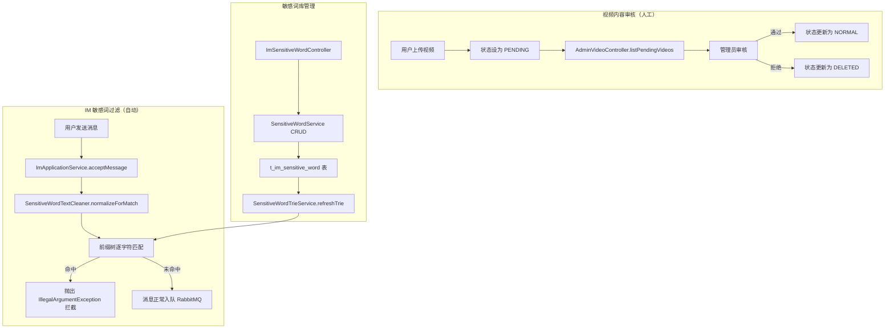
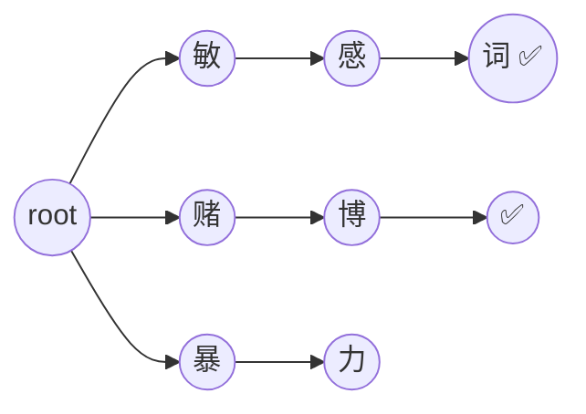
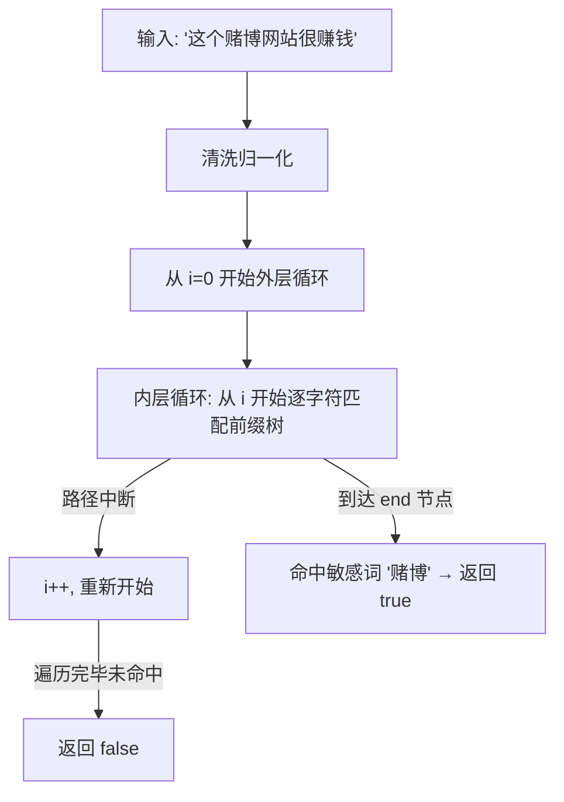
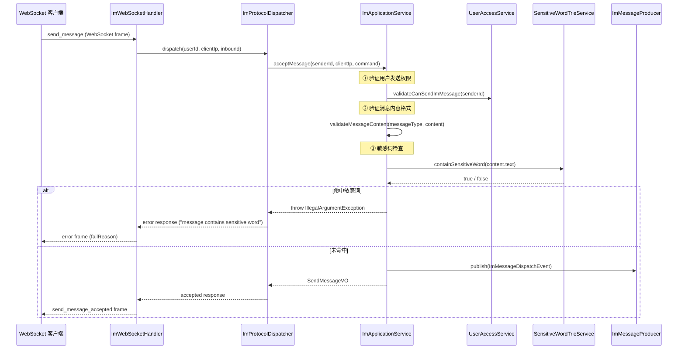
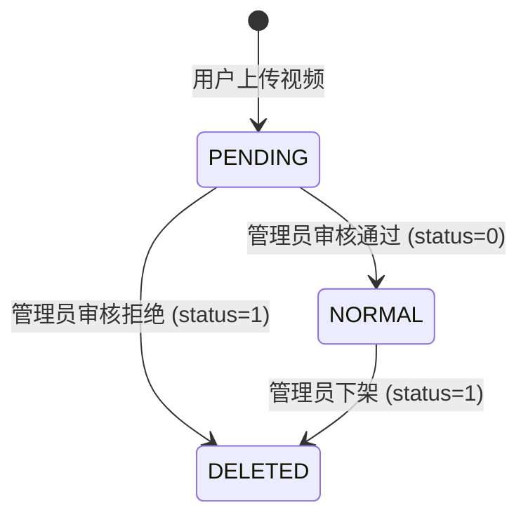

本页面详细解析 Bilibili 平台的内容安全防线：**IM 敏感词过滤**采用基于前缀树（Trie）的实时匹配机制，对即时通信中的文本消息进行发送时拦截；**视频内容审核**则依赖管理员人工审核流程，通过待审核 → 通过/拒绝状态机实现内容上架管控。两者共同构成平台内容安全的"自动拦截 + 人工复核"双层防护体系。

## 内容安全架构总览

平台的内容安全分为两个维度。**自动过滤维度**：用户发送 IM 消息时，文本经过清洗归一化后，在内存前缀树中进行敏感词匹配，命中即拦截，全程无需数据库查询，延迟可忽略。**人工审核维度**：视频上传后进入 PENDING 状态，管理员通过管理后台进行人工审核，决定是否上架。这两个维度覆盖了平台最核心的 UGC 内容——消息与视频。



Sources: [ImApplicationServiceImpl.java](bilibili_SpringBoot/src/main/java/com/bilibili/im/app/impl/ImApplicationServiceImpl.java#L69-L195), [AdminVideoController.java](bilibili_SpringBoot/src/main/java/com/bilibili/admin/controller/AdminVideoController.java#L1-L60)

## 前缀树（Trie）数据结构

敏感词匹配的核心数据结构是 `SensitiveWordTrieNode`，它是一个标准的**多叉树节点**，每个节点通过 `Map<Character, SensitiveWordTrieNode>` 维护字符到子节点的映射关系。当 `end` 标记为 `true` 时表示从根到当前节点的路径构成了一个完整敏感词。



该结构的核心操作有两个：`insert(String word)` 将一个敏感词逐字符插入树中，路径末端节点的 `end` 标记设为 `true`；`Iscontains(String word)` 判断某个完整词是否恰好匹配某个敏感词（必须到达 `end` 节点）。前缀树的查找时间复杂度为 O(m)，其中 m 为待匹配词的长度，与敏感词库的总量无关。

**关键设计要点**：`currentTrie` 字段使用 `volatile` 修饰，保证多线程下对 Trie 引用的可见性。`refreshTrie()` 方法构建一棵全新的 Trie 并通过原子引用替换，实现了无锁的读写分离——读取方始终拿到一致的快照，无需加锁。

Sources: [SensitiveWordTrieNode.java](bilibili_SpringBoot/src/main/java/com/bilibili/im/moderation/tool/SensitiveWordTrieNode.java#L1-L50), [SensitiveWordTrieServiceImpl.java](bilibili_SpringBoot/src/main/java/com/bilibili/im/moderation/service/impl/SensitiveWordTrieServiceImpl.java#L20-L78)

## 文本清洗管线（Text Cleaner）

在执行敏感词匹配之前，原始文本需经过 `SensitiveWordTextCleaner.normalizeForMatch()` 进行六步归一化处理，以应对用户通过各种手段绕过过滤的常见策略。清洗管线按固定顺序串联执行：

| 步骤 | 方法 | 作用 | 典型对抗场景 |
|------|------|------|-------------|
| 1 | `trimEdgeWhitespace()` | 去除首尾空白 | `" 敏感词 "` → `"敏感词"` |
| 2 | `toHalfWidth()` | 全角字符转半角 | `"敏�感词"`（全角） → `"敏感词"` |
| 3 | `toLowerCaseEnglish()` | 英文统一小写 | `"SeNsItIvE"` → `"sensitive"` |
| 4 | `removeInvisibleChars()` | 去除零宽/控制字符 | `"敏\u200B感词"`（插入零宽空格）→ `"敏感词"` |
| 5 | `removeInterferenceSymbols()` | 去除标点与符号 | `"敏*感-词"` → `"敏感词"` |
| 6 | `removeWhitespace()` | 删除全部空白 | `"敏 感 词"` → `"敏感词"` |

每一步都是对上一步输出的纯函数变换，不存在回溯。步骤 4 中，`isInvisibleChar()` 会判断字符是否为 `Character.FORMAT` 类型、ISO 控制字符或软连字符（`\u00AD`）。步骤 5 中，`isInterferenceSymbol()` 涵盖了连接符、破折号、括号、引号、数学符号、货币符号、修饰符号等所有非字母数字非空白的 Unicode 字符类别。

最后一步 `StringTool.normalizeOptional()` 执行 `trim()` 并将空串归一为 `null`，确保空文本不会进入匹配流程。

Sources: [SensitiveWordTextCleaner.java](bilibili_SpringBoot/src/main/java/com/bilibili/im/moderation/tool/SensitiveWordTextCleaner.java#L14-L182), [StringTool.java](bilibili_SpringBoot/src/main/java/com/bilibili/tool/StringTool.java#L1-L39)

## 敏感词匹配算法

`SensitiveWordTrieServiceImpl.containSensitiveWord()` 实现了一个**滑动窗口 + 前缀树**的组合匹配算法，可以检测文本中任意位置出现的敏感词子串（不要求完整词边界）：



算法的核心逻辑是一个双重循环：外层循环 `i` 控制起始位置，内层循环 `j` 从位置 `i` 开始在前缀树中逐字符匹配。如果某个分支路径中断（`currentNode == null`），则 `break` 跳出内层循环，外层 `i` 前移一位重新开始。如果在内层循环中命中了某个 `end` 节点，立即返回 `true`，整个匹配流程就此终止。这意味着**一旦发现第一个敏感词即刻拦截**，不会继续扫描剩余文本——在正常消息占绝大多数的场景下，这是一种高效的设计。

与简单的字符串遍历相比，前缀树匹配避免了对每个子串都执行字符串比较的开销；与正则表达式相比，前缀树匹配在词库增长时性能保持稳定（仅影响内存占用）。

Sources: [SensitiveWordTrieServiceImpl.java](bilibili_SpringBoot/src/main/java/com/bilibili/im/moderation/service/impl/SensitiveWordTrieServiceImpl.java#L37-L58)

## IM 消息发送流程中的过滤拦截

敏感词检查被嵌入 `ImApplicationServiceImpl.acceptMessage()` 的消息受理管线中，处于验证阶段的最后一个环节。完整的消息受理流程如下：



拦截发生的位置位于 `acceptMessage()` 方法的 `observation.observeValidation()` 块中（第 82-86 行），三个验证步骤——权限检查、内容格式验证、敏感词检查——被组合在同一个事务性的验证阶段。当 `sensitiveWordTrieService.containSensitiveWord()` 返回 `true` 时，方法抛出 `IllegalArgumentException("message contains sensitive word")`。

异常在 `ImProtocolDispatcher.dispatch()` 中被捕获，通过 `responseFactory.error(ex.getMessage(), clientMessageId)` 构造一个 `type=error` 的 WebSocket 响应帧返回给客户端。客户端在 `useMessagesPage.ts` 的 `handleSendError()` 中接收此错误，将对应的 pending 消息标记为 `failed: true` 并显示 `failReason`。

Sources: [ImApplicationServiceImpl.java](bilibili_SpringBoot/src/main/java/com/bilibili/im/app/impl/ImApplicationServiceImpl.java#L69-L195), [ImProtocolDispatcher.java](bilibili_SpringBoot/src/main/java/com/bilibili/im/websocket/protocol/ImProtocolDispatcher.java#L71-L79), [useMessagesPage.ts](bilibili_web/src/features/messages/composables/useMessagesPage.ts#L859-L882)

## 敏感词库管理 API

敏感词库的维护通过 `ImSensitiveWordController` 提供 RESTful 接口，所有端点均要求认证用户身份。API 支持完整的 CRUD 操作以及 Trie 刷新：

| 端点 | 方法 | 功能 | 权限 |
|------|------|------|------|
| `/me/im/sensitive-words` | POST | 创建敏感词 | 认证用户 |
| `/me/im/sensitive-words` | GET | 列出所有敏感词 | 认证用户 |
| `/me/im/sensitive-words/active` | GET | 列出激活状态敏感词 | 认证用户 |
| `/me/im/sensitive-words/refresh` | POST | 刷新内存前缀树 | 认证用户 |
| `/me/im/sensitive-words/{id}` | PUT | 更新敏感词 | 认证用户 |
| `/me/im/sensitive-words/{id}` | DELETE | 软删除敏感词 | 认证用户 |

**敏感词的创建流程**：`CreateSensitiveWordDTO` 仅接受 `word` 字段（最长 255 字符），通过 `StringTool.normalizeRequired()` 去除首尾空白后写入数据库。`word` 字段在 `t_im_sensitive_word` 表上有唯一约束（`uk_word`），重复创建会捕获 `DuplicateKeyException` 并抛出业务异常。

**软删除机制**：`deleteSensitiveWord()` 并不物理删除记录，而是将 `status` 从 `0`（normal）更新为 `1`（deleted），同时附带 `update_time` 时间戳更新。`selectActiveOrderByIdAsc()` 查询仅返回 `status=0` 的记录，因此已删除的敏感词会自动从 Trie 中消失。

**Trie 刷新**：`refreshSensitiveWordTrie()` 端点触发 `refreshTrie()`，该方法从数据库加载所有激活状态的敏感词，构建一棵全新的 Trie 并原子替换 `currentTrie` 引用。应用启动时（`@PostConstruct`）也会自动执行一次刷新。

Sources: [ImSensitiveWordController.java](bilibili_SpringBoot/src/main/java/com/bilibili/im/moderation/controller/ImSensitiveWordController.java#L26-L87), [SensitiveWordServiceImpl.java](bilibili_SpringBoot/src/main/java/com/bilibili/im/moderation/service/impl/SensitiveWordServiceImpl.java#L26-L107)

## 敏感词库数据库设计

`t_im_sensitive_word` 表通过 Flyway 迁移脚本 `V17__create_im_sensitive_word_table.sql` 创建：

```sql
CREATE TABLE IF NOT EXISTS t_im_sensitive_word (
    id          BIGINT       NOT NULL AUTO_INCREMENT COMMENT '敏感词主键',
    word        VARCHAR(255) NOT NULL COMMENT '敏感词',
    status      TINYINT(1)   NOT NULL DEFAULT 0 COMMENT '0 normal, 1 deleted',
    create_time DATETIME     NOT NULL DEFAULT CURRENT_TIMESTAMP COMMENT '创建时间',
    update_time DATETIME     NOT NULL DEFAULT CURRENT_TIMESTAMP ON UPDATE CURRENT_TIMESTAMP COMMENT '更新时间',
    PRIMARY KEY (id),
    UNIQUE KEY uk_word (word),
    KEY idx_status_create (status, create_time),
    KEY idx_update_time (update_time)
) COMMENT = 'IM敏感词库表';
```

索引设计说明：`uk_word` 唯一索引确保敏感词不重复，同时为精确查找提供了 O(log n) 性能。`idx_status_create` 组合索引服务于 `WHERE status = 0 ORDER BY id ASC` 这类 Trie 刷新时的查询模式。`idx_update_time` 支持按更新时间排序的运维查询场景。

Sources: [V17__create_im_sensitive_word_table.sql](bilibili_SpringBoot/src/main/resources/db/migration/V17__create_im_sensitive_word_table.sql#L1-L12), [SensitiveWordMapper.java](bilibili_SpringBoot/src/main/java/com/bilibili/im/moderation/mapper/SensitiveWordMapper.java#L1-L67)

## 视频内容审核（人工审核流程）

视频内容审核是一个独立于敏感词过滤的人工审核机制，由管理员通过 `AdminVideoController` 操作。视频上传后的状态流转遵循三态状态机：



| 状态 | 枚举值 | 含义 | 查询端点 |
|------|--------|------|----------|
| `PENDING` | 2 | 待审核 | `GET /admin/videos/pending` |
| `NORMAL` | 0 | 已上架 | `GET /admin/videos/published` |
| `DELETED` | 1 | 已下架 | `GET /admin/videos/deleted` |

管理后台提供游标分页查询（每页 20 条）和审核操作（`PUT /admin/videos/{videoId}/status`）。审核操作通过 `AdminVideoMapper.updateVideoStatus()` 执行 `UPDATE ... WHERE status = PENDING`，保证只有处于待审核状态的视频才能被审核，避免重复操作。`AdminVideoReviewDTO` 支持 `status` 和可选的 `reason` 字段，但当前实现中 `reason` 尚未持久化。

**值得注意的是**：当前视频审核完全依赖人工，尚未集成敏感词自动检测。视频标题和描述中的内容合规性由管理员人工判断。

Sources: [AdminVideoController.java](bilibili_SpringBoot/src/main/java/com/bilibili/admin/controller/AdminVideoController.java#L27-L59), [AdminVideoServiceImpl.java](bilibili_SpringBoot/src/main/java/com/bilibili/admin/service/impl/AdminVideoServiceImpl.java#L28-L56), [RecordStatus.java](bilibili_SpringBoot/src/main/java/com/bilibili/common/enums/RecordStatus.java#L1-L24)

## 模块职责边界与包结构

`im.moderation` 包严格聚焦于 IM 场景的内容合规能力，内部按层次划分为以下子包：

| 子包 | 职责 | 核心类 |
|------|------|--------|
| `controller` | 敏感词管理 REST API | `ImSensitiveWordController` |
| `service` | 敏感词 CRUD + Trie 管理 | `SensitiveWordService`, `SensitiveWordTrieService` |
| `service.impl` | 服务实现 | `SensitiveWordServiceImpl`, `SensitiveWordTrieServiceImpl` |
| `mapper` | MyBatis 数据访问 | `SensitiveWordMapper` |
| `model` | DTO / VO / Entity 三层模型 | `CreateSensitiveWordDTO`, `SensitiveWordVO`, `SensitiveWordDO` |
| `tool` | 文本清洗 + Trie 数据结构 | `SensitiveWordTextCleaner`, `SensitiveWordTrieNode` |

敏感词过滤仅应用于 `ImApplicationServiceImpl.acceptMessage()` 这一个调用点。评论模块（`CommentServiceImpl`）和弹幕模块当前未接入敏感词过滤，这些场景是潜在的扩展方向。