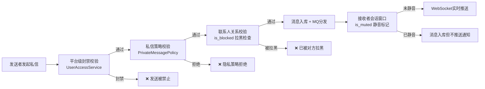
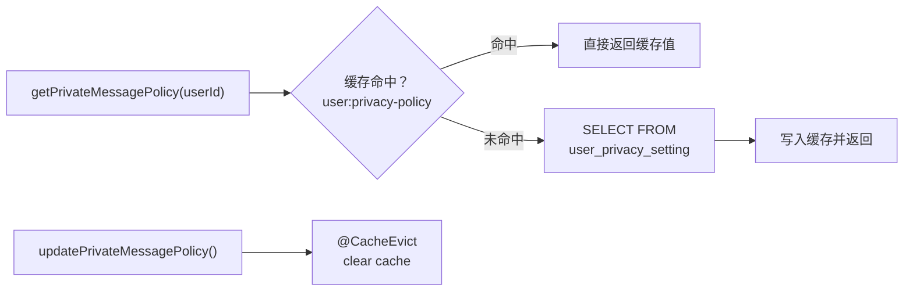

本页完整梳理系统中与用户隐私控制和消息屏蔽相关的全部机制：从私信策略的用户自主配置、联系人级别的拉黑与静音、会话窗口级的消息免打扰，到群聊中的全局禁言与成员禁言，以及管理员的封禁强制力。每一层防护协同工作，确保用户在即时通信场景中拥有对消息接收的自主控制权。

## 整体架构：多层消息过滤管线

用户隐私设置并非孤立功能，而是贯穿消息发送全链路的**多层过滤管线**。当一条私信从发送到最终推送给接收者，会经过至少四层权限校验：平台级封禁 → 私信策略 → 联系人关系阻断 → 会话级静音。

Sources: [ImApplicationServiceImpl.java](bilibili_SpringBoot/src/main/java/com/bilibili/im/app/impl/ImApplicationServiceImpl.java#L68-L119), [MessagePermissionDomainServiceImpl.java](bilibili_SpringBoot/src/main/java/com/bilibili/im/domain/impl/MessagePermissionDomainServiceImpl.java#L27-L83), [UserAccessServiceImpl.java](bilibili_SpringBoot/src/main/java/com/bilibili/access/service/impl/UserAccessServiceImpl.java#L76-L80)

## 私信策略（Private Message Policy）

私信策略是**用户自主可控**的核心隐私设置，决定"谁可以给我发私信"。系统通过 `PrivateMessagePolicy` 枚举定义了四种策略级别，对应不同的消息接收权限范围。

| 枚举值 | Code | 含义 | 生效逻辑 |
|--------|------|------|----------|
| `ALLOW_ALL` | 1 | 所有人都可以私信我 | 无条件放行，任何用户均可发送 |
| `CONTACT_ONLY` | 2 | 仅联系人可以私信我 | 仅当 `contact_relation.is_contact = 1` 时放行 |
| `STRANGER_FIRST_MESSAGE_ONLY` | 3 | 陌生人只能先发一条 | 陌生用户可发首条消息，但接收者未回复前不允许多发 |
| `DENY_ALL` | 4 | 不接受私信 | 无条件拒绝（不区分是否为联系人） |

**默认策略为 `ALLOW_ALL`（code=1）**，在用户首次访问 IM 功能时通过 `initializeDefaultPrivacySetting` 方法自动写入数据库。

Sources: [PrivateMessagePolicy.java](bilibili_SpringBoot/src/main/java/com/bilibili/im/privacy/model/enums/PrivateMessagePolicy.java#L8-L39), [UserPrivacyServiceImpl.java](bilibili_SpringBoot/src/main/java/com/bilibili/im/privacy/service/impl/UserPrivacyServiceImpl.java#L25-L32)

### 数据模型与持久化

私信策略持久化在 `user_privacy_setting` 表中，与用户主表通过 `user_id` 一对一关联。写入采用 `ON DUPLICATE KEY UPDATE` 的 upsert 语义，确保首次设置和后续更新使用同一入口。

| 字段 | 类型 | 说明 |
|------|------|------|
| `id` | BIGINT AUTO_INCREMENT | 主键 |
| `user_id` | BIGINT UNIQUE | 用户ID，唯一索引 |
| `private_message_policy` | TINYINT DEFAULT 1 | 策略 code，默认允许所有人 |
| `create_time` / `update_time` | DATETIME | 时间戳，更新时自动刷新 |

Sources: [V3__create_chat_tables.sql](bilibili_SpringBoot/src/main/resources/db/migration/V3__create_chat_tables.sql#L47-L54), [UserPrivacySettingMapper.java](bilibili_SpringBoot/src/main/java/com/bilibili/im/privacy/mapper/UserPrivacySettingMapper.java#L1-L33)

### 缓存策略

为避免每次消息发送都查询数据库，系统通过 Spring Cache 将用户的私信策略缓存至内存（缓存名 `user:privacy-policy`，key 为 `userId`）。当用户更新策略时，使用 `@CacheEvict` 注解自动清除对应缓存条目，下次访问时重新从数据库加载。

Sources: [SpringUserPrivacyPolicyCache.java](bilibili_SpringBoot/src/main/java/com/bilibili/im/privacy/cache/impl/SpringUserPrivacyPolicyCache.java#L19-L27), [UserPrivacyServiceImpl.java](bilibili_SpringBoot/src/main/java/com/bilibili/im/privacy/service/impl/UserPrivacyServiceImpl.java#L48-L65), [UserPrivacyCacheNames.java](bilibili_SpringBoot/src/main/java/com/bilibili/im/privacy/cache/UserPrivacyCacheNames.java#L1-L9)

### API 接口

私信策略的读取和更新通过 `ImPrivacyController` 暴露，路径前缀为 `/me/im/privacy`，要求用户已完成认证。

| 方法 | 路径 | 功能 | 请求体 |
|------|------|------|--------|
| GET | `/me/im/privacy` | 查询当前用户的隐私设置 | 无 |
| PUT | `/me/im/privacy` | 更新私信策略 | `{ "privateMessagePolicy": <1\|2\|3\|4> }` |

Sources: [ImPrivacyController.java](bilibili_SpringBoot/src/main/java/com/bilibili/im/privacy/controller/ImPrivacyController.java#L20-L47)

### 前端交互

隐私设置页面位于 `ProfilePrivacyView.vue`，采用单选按钮组让用户直观选择四种策略之一。页面在挂载时调用 GET 接口加载当前设置，保存时调用 PUT 接口更新。四种策略在前端以中文描述呈现，帮助用户理解每种策略的实际效果。

| Code | 前端展示标题 | 前端描述文案 |
|------|-------------|-------------|
| 1 | 所有人都可以私信我 | 任何用户都可以直接给你发私信。 |
| 2 | 仅联系人可以私信我 | 只有已经建立联系的人才能直接发消息。 |
| 3 | 陌生人只能先发一条 | 陌生用户可以先打一次招呼，后续再决定是否继续。 |
| 4 | 不接受私信 | 关闭新的私信入口，避免被陌生消息打扰。 |

Sources: [ProfilePrivacyView.vue](bilibili_web/src/views/ProfilePrivacyView.vue#L1-L57), [types.ts](bilibili_web/src/types.ts#L127-L130)

## 消息发送权限校验（Message Permission Domain）

`MessagePermissionDomainService` 是私信发送的核心守门层，在 `ImApplicationServiceImpl.resolveConversationId` 方法中被调用，仅对**单聊（SINGLE）**消息生效。该服务按以下顺序执行校验：

1. **接收者存在性校验**：通过 `UserExistenceCache` 验证接收者用户是否存在
2. **自发送防护**：拒绝 `senderId == receiverId` 的情况
3. **拉黑检查**：从接收者视角查询 `contact_relation`，若 `is_blocked = 1` 则拒绝
4. **私信策略匹配**：根据接收者的 `PrivateMessagePolicy` 执行对应的策略逻辑

`STRANGER_FIRST_MESSAGE_ONLY` 策略的校验逻辑尤为精细：它检查发送者视角的 `is_dm_contact` 标记——如果发送者已有私信资格（曾经被回复过），则允许继续发送；如果发送者没有资格但接收者视角的 `is_dm_contact` 为真（接收者曾回复），说明双方已建立双向私信通道，同样放行；否则拒绝。

Sources: [MessagePermissionDomainServiceImpl.java](bilibili_SpringBoot/src/main/java/com/bilibili/im/domain/impl/MessagePermissionDomainServiceImpl.java#L26-L83), [ImApplicationServiceImpl.java](bilibili_SpringBoot/src/main/java/com/bilibili/im/app/impl/ImApplicationServiceImpl.java#L121-L130)

## 联系人关系与拉黑（Contact Relation）

`contact_relation` 表是用户间社交关系的多维快照，每个维度独立控制一种交互权限。关系记录以 `(user_id, target_user_id)` 为唯一键，即**每个用户视角独立维护**一份关系状态。

| 字段 | 类型 | 默认值 | 说明 |
|------|------|--------|------|
| `user_id` | BIGINT | - | 关系所属用户（观察者视角） |
| `target_user_id` | BIGINT | - | 目标用户 |
| `is_contact` | TINYINT | 0 | 是否为联系人（互相关注） |
| `is_dm_contact` | TINYINT | 0 | 是否已建立私信资格（曾被回复） |
| `is_blocked` | TINYINT | 0 | 是否拉黑对方 |
| `is_muted` | TINYINT | 0 | 是否屏蔽对方 |

**拉黑（is_blocked）的效果**：当用户 A 将用户 B 拉黑后，B 视角的 `contact_relation` 记录中 `is_blocked = 1`。此后 B 尝试向 A 发送消息时，`MessagePermissionDomainService` 会先从 A 的视角查询关系记录，发现 `is_blocked = 1` 直接拒绝。这比私信策略更优先执行——即使 A 的策略为 `ALLOW_ALL`，被拉黑的用户也无法发送消息。

Sources: [V3__create_chat_tables.sql](bilibili_SpringBoot/src/main/resources/db/migration/V3__create_chat_tables.sql#L34-L45), [ContactRelationDO.java](bilibili_SpringBoot/src/main/java/com/bilibili/im/contact/model/entity/ContactRelationDO.java#L1-L18), [MessagePermissionDomainServiceImpl.java](bilibili_SpringBoot/src/main/java/com/bilibili/im/domain/impl/MessagePermissionDomainServiceImpl.java#L41-L44)

## 会话窗口静音（Conversation Mute）

会话窗口静音是**消息接收端的细粒度控制**，不影响消息是否发送成功，仅控制接收者是否收到实时推送通知。`chat_conversation` 表中的 `is_muted` 字段标记该会话是否被当前用户静音。

会话窗口数据通过 Redis 缓存加速访问，缓存对象 `ConversationWindowCacheValue` 包含 `isMuted` 字段。当消息推送到接收者时，系统可以基于此标记决定是否触发 WebSocket 推送通知。

| 层级 | 表/字段 | 作用 | 影响范围 |
|------|---------|------|----------|
| 单聊会话 | `chat_conversation.is_muted` | 单聊窗口免打扰 | 仅影响通知推送，消息照常入库 |
| 群聊会话 | `chat_group_conversation.is_muted` | 群聊窗口免打扰 | 仅影响通知推送 |

Sources: [V3__create_chat_tables.sql](bilibili_SpringBoot/src/main/resources/db/migration/V3__create_chat_tables.sql#L17-L32), [ChatConversationDO.java](bilibili_SpringBoot/src/main/java/com/bilibili/im/conversation/model/entity/ChatConversationDO.java#L1-L25), [ConversationWindowCacheValue.java](bilibili_SpringBoot/src/main/java/com/bilibili/im/conversation/cache/model/ConversationWindowCacheValue.java#L1-L21)

## 群聊屏蔽与禁言

群聊场景中的"屏蔽"分为三个层级，分别对应不同的管理权限和影响范围：

### 群全员禁言（All Muted）

群主或管理员可开启全局禁言，此时除群主和管理员外的所有成员无法发送消息。该状态存储在 `chat_group` 表的 `is_all_muted` 字段中，并通过 `ChatGroupSnapshotCache` 缓存。

### 成员级禁言（Member Mute）

针对特定成员的禁言，存储在 `chat_group_member` 表的 `is_muted` 字段中。被禁言的成员无法在群内发送消息，但仍然可以查看群消息。权限控制要求：群主可以禁言任何非群主成员，管理员可以禁言普通成员。

### 群会话静音（Conversation Mute）

与单聊类似，`chat_group_conversation.is_muted` 控制的是群消息通知是否推送，不影响消息的发送和接收。

| 层级 | 控制方 | 受影响方 | 持久化位置 | 效果 |
|------|--------|----------|-----------|------|
| 群全员禁言 | 群主/管理员 | 全体非管理成员 | `chat_group.is_all_muted` | 阻止消息发送 |
| 成员禁言 | 群主/管理员 | 被禁言成员 | `chat_group_member.is_muted` | 阻止消息发送 |
| 群会话静音 | 用户本人 | 仅自己 | `chat_group_conversation.is_muted` | 屏蔽通知推送 |

群全员禁言和成员禁言的更新通过 `PUT /me/im/groups/{groupId}/mute` 接口暴露，在前端由 `GroupSettingsDrawer.vue` 的"群管理"标签页提供开关控件。

Sources: [ChatGroupServiceImpl.java](bilibili_SpringBoot/src/main/java/com/bilibili/im/group/service/impl/ChatGroupServiceImpl.java#L249-L299), [GroupPermissionServiceImpl.java](bilibili_SpringBoot/src/main/java/com/bilibili/im/group/permission/impl/GroupPermissionServiceImpl.java#L30-L69), [ImGroupController.java](bilibili_SpringBoot/src/main/java/com/bilibili/im/group/controller/ImGroupController.java#L86-L96)

## 平台级封禁（Admin Access Restriction）

平台管理员可通过 `UserAccessAdminService` 对用户施加 IM 消息发送封禁，这是**最高优先级**的屏蔽机制，在所有其他校验之前执行。封禁状态存储在 `user_access` 表中，通过 `UserAccessSnapshotCache` 缓存，并以 `imMessageSendEnabled` 字段标记。

当 `ImApplicationServiceImpl.acceptMessage` 方法在处理消息时，首先调用 `userAccessService.validateCanSendImMessage(senderId)` 检查发送者的平台级权限。如果发送者被封禁，直接抛出 `AccessDeniedException`，消息不会进入后续任何处理管线。

| 封禁类型 | 枚举值 | 效果 |
|----------|--------|------|
| `IM_MESSAGE_SEND_BANNED` | 唯一值 | 完全禁止用户发送任何IM消息 |

Sources: [UserAccessServiceImpl.java](bilibili_SpringBoot/src/main/java/com/bilibili/access/service/impl/UserAccessServiceImpl.java#L76-L80), [UserAccessRestrictionType.java](bilibili_SpringBoot/src/main/java/com/bilibili/access/model/enums/UserAccessRestrictionType.java#L1-L5), [ImApplicationServiceImpl.java](bilibili_SpringBoot/src/main/java/com/bilibili/im/app/impl/ImApplicationServiceImpl.java#L82-L86)

## 各层优先级与交互关系

将所有屏蔽/过滤机制按执行优先级排列，可以清晰看到每层的拦截时机和影响范围：

| 优先级 | 机制 | 执行时机 | 可控方 | 影响 |
|--------|------|----------|--------|------|
| 1（最高） | 平台级封禁 | 消息接收入口 | 平台管理员 | 阻止消息发送 |
| 2 | 私信策略（DENY_ALL） | 发送权限校验 | 接收者本人 | 阻止所有非联系人消息 |
| 3 | 拉黑（is_blocked） | 发送权限校验 | 接收者本人 | 阻止被拉黑用户消息 |
| 4 | 私信策略（CONTACT_ONLY） | 发送权限校验 | 接收者本人 | 仅放行联系人消息 |
| 5 | 私信策略（STRANGER_FIRST_MESSAGE_ONLY） | 发送权限校验 | 接收者本人 | 限制陌生人消息频率 |
| 6 | 群全员禁言 | 群消息发送 | 群主/管理员 | 阻止非管理成员发送 |
| 7 | 成员禁言 | 群消息发送 | 群主/管理员 | 阻止被禁言成员发送 |
| 8（最低） | 会话/群会话静音 | 消息推送阶段 | 用户本人 | 仅屏蔽通知，不阻止消息 |

值得注意的是，**会话静音与其他机制存在本质区别**：前七层均为"是否允许消息发送/入库"的硬拦截，而会话静音仅影响"消息到达后是否推送实时通知"，消息本身仍会正常入库并被记录。这确保了用户不会遗漏任何消息，只是可以选择在特定时间段内不被打扰。