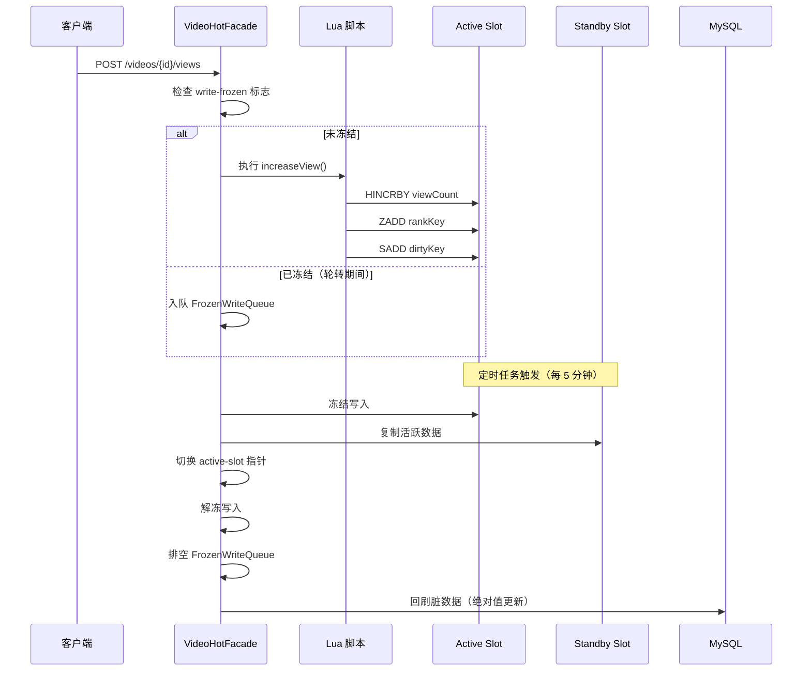
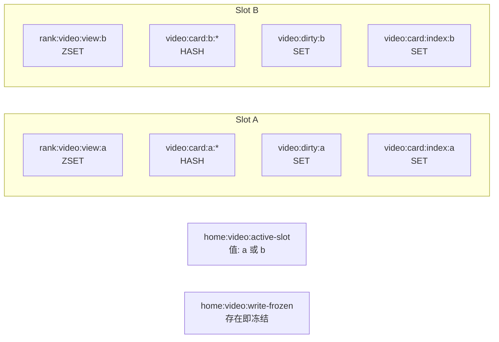
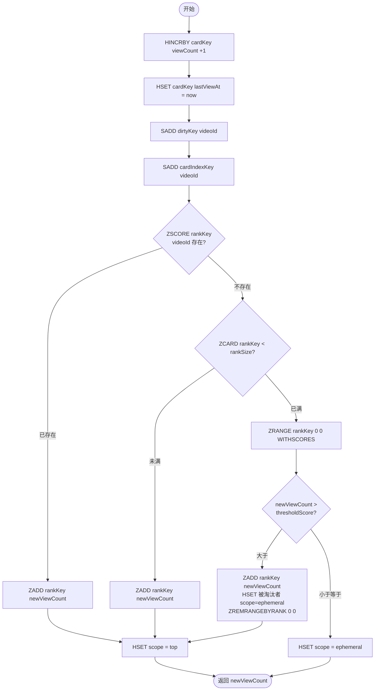
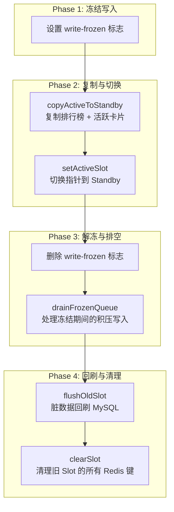

本文档深入解析 Bilibili 视频热度排行榜系统的核心架构——基于 Redis Lua 脚本的双 Slot（双槽位）设计。该系统通过原子性 Lua 脚本实现高并发观看计数，借助双 Slot 交替机制保障数据一致性，是整个视频首页和排行榜功能的数据基石。

## 整体架构概览

热度排行榜采用**双 Slot 轮转 + Lua 原子写入 + 延迟回刷 MySQL**的三段式架构。系统维护两个 Redis Slot（Slot A 和 Slot B），任意时刻只有一个 Slot 接收用户写入（称为 **Active Slot**），另一个 Slot 处于待命状态（称为 **Standby Slot**）。定时任务按可配置的间隔（默认 5 分钟）触发轮转，将 Active Slot 切换为 Standby，并将旧 Active Slot 中的脏数据批量回刷到 MySQL。

Sources: [VideoHotFacade.java](bilibili_SpringBoot/src/main/java/com/bilibili/video/service/hot/VideoHotFacade.java#L121-L140), [VideoHotRotationService.java](bilibili_SpringBoot/src/main/java/com/bilibili/video/service/hot/VideoHotRotationService.java#L29-L42)

## Redis 数据模型与键命名

系统使用五类 Redis 键来支撑排行榜功能，所有键都通过 `slot` 参数（`a` 或 `b`）实现物理隔离：

| 键类型 | 键格式 | Redis 类型 | 用途 |
|--------|--------|-----------|------|
| 排行榜 | `rank:video:view:{slot}` | ZSET | 按观看量排序的视频 ID 集合，score 为 viewCount |
| 视频卡片 | `video:card:{slot}:{videoId}` | HASH | 视频元信息缓存（标题、封面、作者等） |
| 脏数据集 | `video:dirty:{slot}` | SET | 被修改过的视频 ID，用于轮转后回刷 MySQL |
| 卡片索引 | `video:card:index:{slot}` | SET | 某 Slot 下所有已缓存卡片的 ID 索引 |
| 活跃槽位 | `home:video:active-slot` | STRING | 当前接收写入的 Slot 标识（`a` 或 `b`） |
| 写冻结标志 | `home:video:write-frozen` | STRING | 轮转期间的写入冻结信号 |

Sources: [VideoRedisKeys.java](bilibili_SpringBoot/src/main/java/com/bilibili/video/redis/VideoRedisKeys.java#L1-L36)

## Lua 脚本核心逻辑详解

`increase_video_view.lua` 是整个热度系统的原子操作核心。该脚本在 Redis 服务端单线程执行，保证了高并发场景下的数据一致性，无需额外的分布式锁。

脚本接受四个 KEYS 和四个 ARGV 参数：

| 参数 | 说明 | 示例值 |
|------|------|--------|
| KEYS[1] rankKey | 排行榜 ZSET 键 | `rank:video:view:a` |
| KEYS[2] dirtyKey | 脏数据集合键 | `video:dirty:a` |
| KEYS[3] cardKey | 当前视频卡片键 | `video:card:a:123456` |
| KEYS[4] cardIndexKey | 卡片索引键 | `video:card:index:a` |
| ARGV[1] videoId | 视频 ID | `123456` |
| ARGV[2] nowMillis | 当前时间戳（毫秒） | `1714000000000` |
| ARGV[3] rankSize | 排行榜容量上限 | `100` |
| ARGV[4] cardKeyPrefix | 卡片键前缀 | `video:card:a:` |

**双 Slot 的「top」与「ephemeral」作用域**是本设计的精妙之处：`top` 表示视频在排行榜 ZSET 中占有一席之地；`ephemeral` 表示视频虽未进入排行榜，但其卡片数据仍在 Slot 中活跃（最近被访问过）。轮转时，只有 `top` 视频的排行榜位置会被复制到 Standby Slot，而 `ephemeral` 视频仅在活跃窗口期内才会被保留。

Sources: [increase_video_view.lua](bilibili_SpringBoot/src/main/resources/scripts/redis/increase_video_view.lua#L1-L49), [VideoHotLuaRepository.java](bilibili_SpringBoot/src/main/java/com/bilibili/video/redis/VideoHotLuaRepository.java#L27-L41)

## 写入流程：从 HTTP 请求到 Redis 原子操作

当用户观看视频时，前端发起 `POST /videos/{videoId}/views` 请求，后端经历以下处理链路：

1. **VideoController** 接收请求，调用 `VideoApplicationService.increaseViewCount()`
2. **VideoApplicationServiceImpl** 先通过 `VideoDomainService.validateViewableVideo()` 校验视频是否存在且可访问
3. **VideoHotFacade.increaseViewCount()** 检查 `write-frozen` 标志：
   - 若未冻结：获取 Active Slot → 确保卡片存在 → 执行 Lua 脚本
   - 若已冻结（轮转期间）：将 videoId 入队到 `VideoFrozenWriteQueue`
4. **Lua 脚本**在 Redis 服务端原子执行：自增 viewCount、更新排行榜、标记脏数据

卡片的懒加载机制值得注意：`ensureCardPresent()` 方法检查视频卡片是否已缓存在 Redis 中，若不存在则从 MySQL 查询并写入。这确保了即使是首次被观看的视频也能正确参与排行。

Sources: [VideoController.java](bilibili_SpringBoot/src/main/java/com/bilibili/video/controller/VideoController.java#L54-L59), [VideoHotFacade.java](bilibili_SpringBoot/src/main/java/com/bilibili/video/service/hot/VideoHotFacade.java#L121-L140)

## Slot 轮转机制与数据一致性保障

双 Slot 轮转由 `VideoHotRotationTask` 定时触发，间隔由 `app.video.switchIntervalMinutes` 配置（默认 5 分钟）。轮转过程分为以下阶段：

**复制阶段的过滤逻辑**是关键设计点：`copyActiveToStandby()` 遍历旧 Active Slot 的所有卡片索引，仅复制满足以下条件之一的视频到 Standby Slot：

1. **在排行榜中**（`top` 作用域）：保留完整的排行榜位置和分数
2. **在活跃窗口内**（`ephemeral` 作用域）：`lastViewAt` 距当前时间不超过 `activeWindowMinutes`（默认 5 分钟）

这种过滤策略避免了冷数据的无效复制，同时确保了近期活跃的「潜力股」视频不会在轮转中丢失。

**写冻结期间的请求积压**通过 `VideoFrozenWriteQueue`（基于 `ConcurrentLinkedQueue`）实现无锁队列。轮转完成后，`drainFrozenQueue()` 一次性排空队列，将积压的写入应用到新的 Active Slot。这保证了轮转期间的观看请求不会丢失。

Sources: [VideoHotRotationService.java](bilibili_SpringBoot/src/main/java/com/bilibili/video/service/hot/VideoHotRotationService.java#L29-L42), [VideoHotRedisRepository.java](bilibili_SpringBoot/src/main/java/com/bilibili/video/redis/VideoHotRedisRepository.java#L206-L233), [VideoFrozenWriteQueue.java](bilibili_SpringBoot/src/main/java/com/bilibili/video/redis/VideoFrozenWriteQueue.java#L1-L29)

## 脏数据回刷策略

旧 Active Slot 中被标记为「脏」的视频（即在该 Slot 生命周期内 viewCount 发生过变化的视频）需要回刷到 MySQL。回刷逻辑在 `flushOldSlot()` 中实现，它读取 `video:dirty:{slot}` 集合中的所有 videoId，逐个将 Redis 中的绝对 viewCount 写回数据库。

**回刷采用绝对值更新而非增量更新**：SQL 语句为 `UPDATE t_video SET view_count = #{viewCount} WHERE id = #{videoId}`。这意味着 Redis 中的 viewCount 是权威数据源，MySQL 直接覆盖而非累加。这种设计避免了分布式环境下的增量计数竞态问题，但要求 Redis 数据的完整性——这也是双 Slot 机制存在的根本原因。

回刷过程支持批量控制（`app.video.flushBatchSize`，默认 100），防止单次事务过大影响数据库性能。

Sources: [VideoHotRotationService.java](bilibili_SpringBoot/src/main/java/com/bilibili/video/service/hot/VideoHotRotationService.java#L44-L61), [VideoMapper.xml](bilibili_SpringBoot/src/main/resources/mapper/VideoMapper.xml)

## 应用启动与初始化

系统启动时，`VideoHotBootstrapService`（实现 `ApplicationRunner`）负责初始化排行榜：

1. 从 MySQL 查询按 viewCount 降序排列的前 N 条视频（N = `rankSize`，默认 100）
2. 清空 Slot A 和 Slot B 的所有数据
3. 将查询结果写入 Slot A 的 ZSET 和卡片缓存
4. 设置 Slot A 为 Active Slot

这确保了系统冷启动后排行榜立即可用，无需等待用户观看产生数据。

Sources: [VideoHotBootstrapService.java](bilibili_SpringBoot/src/main/java/com/bilibili/video/service/hot/VideoHotBootstrapService.java#L29-L34)

## 读取路径与前端展示

排行榜的读取路径完全从 Active Slot 的 Redis ZSET 中获取数据，无需访问 MySQL。`listVideoRank()` 方法通过 `ZREVRANGE WITHSCORES` 获取排行榜 ID 和分数，再批量加载卡片信息组装为 `VideoRankVO` 返回给前端。

前端 `HomeView.vue` 组件通过 `GET /videos/rank` 接口获取排行榜数据，渲染为首页侧边栏的热门视频排行列表。排行榜数据的实时性取决于 Slot 的存活周期——在最坏情况下，用户看到的数据可能有最多 5 分钟的延迟。

Sources: [VideoHotFacade.java](bilibili_SpringBoot/src/main/java/com/bilibili/video/service/hot/VideoHotFacade.java#L82-L119)

## 配置参数一览

| 配置项 | 默认值 | 说明 |
|--------|--------|------|
| `app.video.rankSize` | 100 | 排行榜容量上限，即 ZSET 最大成员数 |
| `app.video.switchIntervalMinutes` | 5 | Slot 轮转间隔（分钟） |
| `app.video.activeWindowMinutes` | 5 | ephemeral 视频的活跃窗口期（分钟） |
| `app.video.copyBatchSize` | 100 | 复制到 Standby Slot 的批量大小 |
| `app.video.flushBatchSize` | 100 | 回刷 MySQL 的批量大小 |

所有配置项均有最小值保护（`Math.max(value, 1)`），防止误配置导致系统异常。

Sources: [VideoHotProperties.java](bilibili_SpringBoot/src/main/java/com/bilibili/config/properties/VideoHotProperties.java#L1-L54), [application.yaml](bilibili_SpringBoot/src/main/resources/application.yaml#L153-L158)

## 设计权衡与潜在风险

**优势**：
- Lua 脚本的原子性消除了分布式锁的开销，单次 Redis 调用完成所有写入操作
- 双 Slot 轮转实现了读写分离，轮转期间读取不受影响
- 写冻结 + 无锁队列的组合避免了数据竞争，同时保证请求不丢失
- 绝对值回刷简化了增量同步的复杂性

**潜在风险与缓解措施**：
- **Redis 宕机数据丢失**：最长可能丢失一个 Slot 生命周期（5 分钟）内的观看量。可通过缩短轮转间隔缓解
- **排行榜容量饱和**：当 rankSize 不足以容纳所有热门视频时，低分视频会被淘汰为 ephemeral。可通过调大 rankSize 或引入分层排行榜扩展
- **轮转期间的短暂延迟**：写冻结窗口通常在毫秒级别（复制 + 切换），对用户体验影响极小

## 相关文件索引

| 文件 | 职责 |
|------|------|
| [increase_video_view.lua](bilibili_SpringBoot/src/main/resources/scripts/redis/increase_video_view.lua) | Lua 原子操作脚本 |
| [VideoRedisKeys.java](bilibili_SpringBoot/src/main/java/com/bilibili/video/redis/VideoRedisKeys.java) | Redis 键命名常量 |
| [VideoHotLuaRepository.java](bilibili_SpringBoot/src/main/java/com/bilibili/video/redis/VideoHotLuaRepository.java) | Lua 脚本执行器 |
| [VideoHotRedisRepository.java](bilibili_SpringBoot/src/main/java/com/bilibili/video/redis/VideoHotRedisRepository.java) | Redis 读写操作封装 |
| [VideoHotFacade.java](bilibili_SpringBoot/src/main/java/com/bilibili/video/service/hot/VideoHotFacade.java) | 业务编排门面 |
| [VideoHotRotationService.java](bilibili_SpringBoot/src/main/java/com/bilibili/video/service/hot/VideoHotRotationService.java) | Slot 轮转服务 |
| [VideoHotBootstrapService.java](bilibili_SpringBoot/src/main/java/com/bilibili/video/service/hot/VideoHotBootstrapService.java) | 启动初始化 |
| [VideoHotRotationTask.java](bilibili_SpringBoot/src/main/java/com/bilibili/video/task/VideoHotRotationTask.java) | 定时轮转任务 |
| [VideoHotProperties.java](bilibili_SpringBoot/src/main/java/com/bilibili/config/properties/VideoHotProperties.java) | 配置属性 |
| [VideoFrozenWriteQueue.java](bilibili_SpringBoot/src/main/java/com/bilibili/video/redis/VideoFrozenWriteQueue.java) | 冻结期间写入队列 |
| [VideoHotCardCache.java](bilibili_SpringBoot/src/main/java/com/bilibili/video/model/hot/VideoHotCardCache.java) | 视频卡片缓存模型 |
| [VideoRankVO.java](bilibili_SpringBoot/src/main/java/com/bilibili/video/model/vo/VideoRankVO.java) | 排行榜视图对象 |