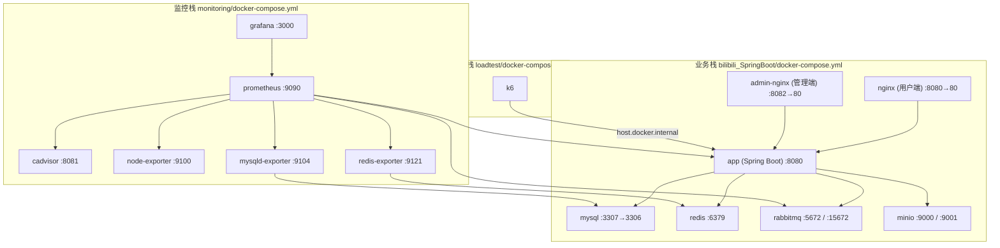
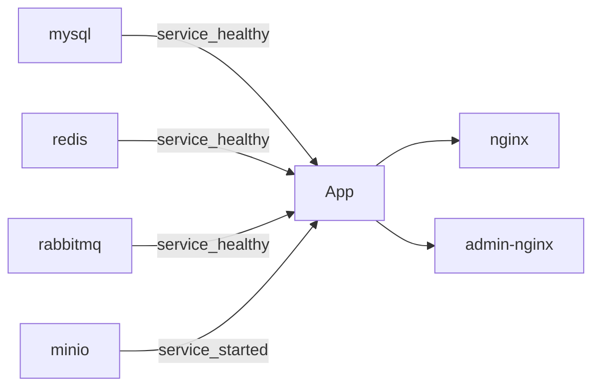
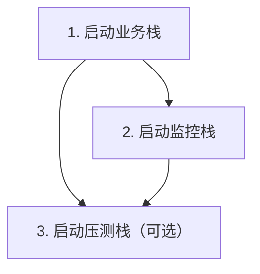

本文档全面梳理 Bilibili 项目的容器化编排架构。项目采用**三套独立 Compose 文件**分别管理业务服务、监控栈和压测工具，通过 Docker 网络实现跨栈服务发现。

## 编排架构总览

项目包含三套 Docker Compose 编排，各司其职、独立生命周期管理：

| 编排文件 | 服务数 | 职责 | 网络模式 |
|---|---|---|---|
| `bilibili_SpringBoot/docker-compose.yml` | 7 | 核心业务全栈 | 默认 bridge |
| `monitoring/docker-compose.yml` | 6 | 可观测性监控栈 | 自建 `monitoring` + 外部 `business` |
| `loadtest/docker-compose.yml` | 1 | k6 负载测试 | host 网关注入 |

三套栈之间通过**共享 Docker 网络**实现互通：监控栈的 `redis-exporter`、`mysqld-exporter` 等组件加入业务栈的默认网络（`bilibili_springboot_default`），即可直接访问 MySQL、Redis、RabbitMQ 等业务服务的容器 DNS 名称。



## 业务栈服务详解

业务栈是整个系统的核心编排，定义在 [bilibili_SpringBoot/docker-compose.yml](bilibili_SpringBoot/docker-compose.yml#L1-L143) 中，包含 **7 个服务**、**4 个命名卷**，形成完整的 Bilibili 应用运行环境。

### 服务依赖与启动顺序

业务栈通过 `depends_on` + `healthcheck` 实现**有序启动**：只有当依赖服务的健康检查通过后，下游服务才会启动。



**关键设计**：MySQL、Redis、RabbitMQ 三个基础设施均配置了 `healthcheck`，App 必须等待它们全部进入 healthy 状态后才启动；而 MinIO 仅要求 `service_started`（容器已启动即可），因为应用层对 MinIO 的连接有重试机制。Sources: [docker-compose.yml](bilibili_SpringBoot/docker-compose.yml#L44-L52)

### 各服务职责与配置

#### mysql — 关系数据库

MySQL 8.0 提供持久化数据存储，使用自定义 InnoDB 参数优化写入性能。启动时自动执行 `bilibili.sql` 初始化脚本创建数据库和基础表结构。

| 配置项 | 值 | 说明 |
|---|---|---|
| 容器名 | `bilibili-mysql` | 固定容器名便于 `docker exec` 调试 |
| 宿主端口 | `127.0.0.1:3307` | 仅绑定 loopback，禁止外部直连 |
| 时区 | `Asia/Shanghai` | `--default-time-zone=+08:00` |
| InnoDB 优化 | `flush-log-at-trx-commit=2`, `sync-binlog=0` | 牺牲少量持久性换取写入吞吐 |
| 健康检查 | `mysqladmin ping` | 10s 间隔，最多重试 5 次 |
| 数据卷 | `mysql_data:/var/lib/mysql` | 命名卷持久化 |

**用户凭证**：`root/root`、`huangnv/11447`（数据库 `bilibili`）。生产环境应通过环境变量替换。

Sources: [docker-compose.yml](bilibili_SpringBoot/docker-compose.yml#L3-L28)

#### redis — 缓存与 IM 投影

Redis 7 Alpine 镜像，开启 AOF 持久化（`--appendonly yes`）。承担会话缓存、IM 会话窗口投影、视频热度排行榜等多类角色。

| 配置项 | 值 |
|---|---|
| 容器名 | `bilibili-redis` |
| 宿主端口 | `127.0.0.1:6379` |
| 健康检查 | `redis-cli ping`，10s 间隔 |
| 数据卷 | `redis_data:/data` |

Sources: [docker-compose.yml](bilibili_SpringBoot/docker-compose.yml#L60-L75)

#### rabbitmq — 消息队列

RabbitMQ 3.13 带管理插件，用于 IM 消息异步处理管线。管理控制台在 `127.0.0.1:15672`。

| 配置项 | 值 |
|---|---|
| 容器名 | `bilibili-rabbitmq` |
| AMQP 端口 | `127.0.0.1:5672` |
| 管理端口 | `127.0.0.1:15672` |
| 默认凭证 | `guest/guest` |
| 健康检查 | `rabbitmq-diagnostics -q ping`，最多重试 10 次 |

**注意**：如果需要暴露 RabbitMQ 指标给 Prometheus，需额外启用 `rabbitmq_prometheus` 插件（详见 [Prometheus + Grafana 监控栈搭建](27-prometheus-grafana-jian-kong-zhan-da-jian)）。

Sources: [docker-compose.yml](bilibili_SpringBoot/docker-compose.yml#L77-L92)

#### minio — 对象存储

MinIO 提供视频、封面、头像等文件的 S3 兼容存储。控制台端口 9001 用于管理操作。

| 配置项 | 值 |
|---|---|
| 容器名 | `bilibili-minio` |
| API 端口 | `9000`（外部可达） |
| 控制台端口 | `9001`（外部可达） |
| Root 凭证 | 由 `MINIO_ACCESS_KEY` / `MINIO_SECRET_KEY` 环境变量控制 |
| 数据卷 | `minio_data:/data` |

**与 App 的交互**：App 通过内部网络访问 `http://minio:9000`，而前端通过外部 IP 的 `MINIO_PUBLIC_ENDPOINT`（如 `http://150.158.146.80:9000`）直接进行分片上传。

Sources: [docker-compose.yml](bilibili_SpringBoot/docker-compose.yml#L94-L109), [application.yaml](bilibili_SpringBoot/src/main/resources/application.yaml#L93-L111)

#### app — Spring Boot 应用

核心后端服务，通过多阶段 Dockerfile 构建：Maven 编译阶段 → JRE 运行阶段。不直接暴露端口给宿主机（仅 `expose: 8080`），由 Nginx 反向代理对外提供服务。

**环境变量注入策略**：所有外部依赖连接信息（DB、Redis、RabbitMQ、MinIO）均通过环境变量注入，Spring Boot 配置文件使用 `${VAR:default}` 语法做回退。

```mermaid
graph LR
    Env["环境变量"] -->|注入| App["app 容器"]
    App -->|读取| Yaml["application.yaml"]
    Yaml -->|${DB_URL}| MySQL
    Yaml -->|${REDIS_HOST:redis}| Redis
    Yaml -->|${RABBITMQ_HOST:rabbitmq}| RabbitMQ
    Yaml -->|${MINIO_ENDPOINT}| MinIO
```

| 环境变量 | 默认值 | 说明 |
|---|---|---|
| `SPRING_PROFILES_ACTIVE` | `dev` | 激活开发配置（启用 Swagger、MQ、SQL init） |
| `DB_URL` | `jdbc:mysql://mysql:3306/bilibili?...` | 容器内 DNS 解析 |
| `DB_USERNAME` / `DB_PASSWORD` | `huangnv` / `11447` | MySQL 凭证 |
| `MINIO_ENDPOINT` | `http://minio:9000` | 内部 MinIO 地址 |
| `MINIO_PUBLIC_ENDPOINT` | `http://150.158.146.80:9000` | 外部 MinIO 地址，供前端直传 |

**Dockerfile 多阶段构建**：第一阶段使用 `maven:3.9.9-eclipse-temurin-17` 执行 `mvn clean package`，第二阶段仅复制生成的 JAR 到 `eclipse-temurin:17-jre` 基础镜像，大幅缩减最终镜像体积。

Sources: [docker-compose.yml](bilibili_SpringBoot/docker-compose.yml#L30-L57), [Dockerfile](bilibili_SpringBoot/Dockerfile#L1-L18), [application.yaml](bilibili_SpringBoot/src/main/resources/application.yaml#L1-L159)

#### nginx — 用户端 Web 服务

Nginx 1.28 Alpine 承担双重职责：**静态资源服务** + **API 反向代理**。宿主机端口 `8080` 映射到容器端口 `80`。

请求路由规则：

| 路径模式 | 处理方式 | 说明 |
|---|---|---|
| `/assets/*` | 直接返回静态文件 | 7 天强缓存（immutable） |
| `/media/*` | 代理到存储卷 `/data/bilibili-data/` | 添加 CORS 头 |
| `/users\|/videos\|/search\|...` | 反向代理到 `http://app:8080` | 后端 API |
| `/ws/im` | WebSocket 代理到 `app:8080` | 升级连接、长超时 |
| `/actuator/*` | 代理到 `app:8080` | Prometheus 指标端点 |
| `/*`（其他） | `try_files $uri /index.html` | Vue SPA 回退路由 |

**卷挂载**：
- `../bilibili_web/dist` → 前端构建产物（只读）
- `./deploy/nginx/default.conf` → Nginx 配置（只读）
- `bilibili_storage:/data/bilibili-data:ro` → 共享存储卷（只读）

Sources: [docker-compose.yml](bilibili_SpringBoot/docker-compose.yml#L111-L123), [default.conf](bilibili_SpringBoot/deploy/nginx/default.conf#L1-L73)

#### admin-nginx — 管理端 Web 服务

与用户端 Nginx 同构，但独立端口 `8082` 和独立配置文件。路由规则更精简：仅代理 `/users|/admin|/swagger-ui` 到后端，其余全部回退到 SPA。

Sources: [docker-compose.yml](bilibili_SpringBoot/docker-compose.yml#L125-L137), [admin.conf](bilibili_SpringBoot/deploy/nginx/admin.conf#L1-L35)

### 数据持久化

业务栈定义 4 个命名卷，由 Docker 管理存储位置，容器重建不丢失数据：

| 卷名 | 挂载目标 | 用途 |
|---|---|---|
| `mysql_data` | `/var/lib/mysql` | MySQL 数据文件 |
| `redis_data` | `/data` | Redis AOF 持久化 |
| `minio_data` | `/data` | MinIO 对象存储 |
| `bilibili_storage` | `/data/bilibili-data` | App 与 Nginx 共享的媒体文件 |

**共享卷设计**：`bilibili_storage` 被 App 和 Nginx 同时挂载（App 读写、Nginx 只读），避免了文件通过网络传输，实现高效的媒体文件服务。

Sources: [docker-compose.yml](bilibili_SpringBoot/docker-compose.yml#L138-L143)

## 监控栈编排

监控栈独立于业务栈，定义在 [monitoring/docker-compose.yml](monitoring/docker-compose.yml#L1-L138)。它不修改业务代码，通过**外部 Docker 网络**加入业务栈的服务发现空间。

### 网络隔离策略

监控栈创建两个网络：

| 网络名 | 类型 | 用途 |
|---|---|---|
| `bilibili-monitoring` | 内部创建 | 监控组件间通信（Prometheus ↔ Grafana） |
| `${BUSINESS_DOCKER_NETWORK}` | 外部（已存在） | 访问业务服务（Redis、MySQL、App） |

`redis-exporter` 和 `mysqld-exporter` 同时加入两个网络：通过 `monitoring` 网络被 Prometheus 抓取，通过 `business` 网络访问后端数据源。

Sources: [docker-compose.yml](monitoring/docker-compose.yml#L125-L136), [.env.example](monitoring/.env.example#L1-L3)

### 监控服务清单

| 服务 | 镜像 | 宿主端口 | 抓取目标 |
|---|---|---|---|
| `prometheus` | `prom/prometheus:v2.55.1` | `9090` | 所有 exporter + App actuator |
| `grafana` | `grafana/grafana:11.3.1` | `3000` | 数据源 → Prometheus |
| `cadvisor` | `ghcr.io/google/cadvisor:0.55.1` | `8081` | Docker 容器资源指标 |
| `node-exporter` | `prom/node-exporter:v1.8.2` | `9100` | 宿主机资源指标 |
| `redis-exporter` | `oliver006/redis_exporter:v1.66.0` | `9121` | Redis 指标 |
| `mysqld-exporter` | `prom/mysqld-exporter:v0.16.0` | `9104` | MySQL 指标 |

Sources: [docker-compose.yml](monitoring/docker-compose.yml#L1-L138), [prometheus.yml](monitoring/prometheus/prometheus.yml#L1-L75)

### Prometheus 采集配置

Prometheus 配置使用**模板变量替换**：启动时通过 `sed` 将环境变量注入 `prometheus.yml`，支持自定义抓取间隔。

| 采集任务 | 目标 | 指标路径 |
|---|---|---|
| `spring-boot-app` | `app:8080` | `/actuator/prometheus` |
| `redis` | `redis-exporter:9121` | `/metrics` |
| `mysql` | `mysqld-exporter:9104` | `/metrics` |
| `rabbitmq` | `rabbitmq:15692` | `/metrics` |
| `rabbitmq-detailed` | `rabbitmq:15692` | `/metrics/detailed` |
| `cadvisor` | `cadvisor:8080` | `/metrics` |
| `node` | `node-exporter:9100` | `/metrics` |
| `grafana` | `grafana:3000` | `/metrics` |
| `prometheus` | `prometheus:9090` | 自监控 |

Sources: [prometheus.yml](monitoring/prometheus/prometheus.yml#L1-L75)

## 压测栈编排

压测栈定义在 [loadtest/docker-compose.yml](loadtest/docker-compose.yml#L1-L14)，仅包含一个 `k6` 服务，用于执行各类负载测试场景。

| 配置项 | 值 | 说明 |
|---|---|---|
| 镜像 | `grafana/k6:0.49.0` | 官方 k6 镜像 |
| 工作目录 | `/work` | 容器内工作根 |
| 环境变量 | `.env` 文件注入 | 控制并发、超时、场景参数 |
| 网络 | `extra_hosts: host.docker.internal:host-gateway` | 访问宿主机服务 |
| 卷挂载 | `scripts`, `data`, `results` | 脚本只读，结果可写 |

**设计要点**：压测脚本和测试数据以只读方式挂载，测试结果目录可写。通过 `host.docker.internal` 特殊 DNS 名称访问宿主机上运行的业务服务，避免直接加入业务 Docker 网络。

Sources: [docker-compose.yml](loadtest/docker-compose.yml#L1-L14), [.env.example](loadtest/.env.example#L1-L21)

## 启动与运维操作指南

### 启动顺序

三套栈有明确的依赖关系，必须按序启动：



**步骤一：启动业务栈**
```bash
cd bilibili_SpringBoot
docker compose up -d
```
等待所有服务健康：`docker compose ps` 确认 `healthy` 状态。

**步骤二：启动监控栈**
```bash
cd monitoring
cp .env.example .env
cp mysql/.my.cnf.example mysql/.my.cnf
# 修改 .env 中 BUSINESS_DOCKER_NETWORK 为实际值
docker compose up -d
```

**步骤三：创建 MySQL 监控账号**
```bash
docker exec -it bilibili-mysql mysql -uroot -proot
```
```sql
CREATE USER IF NOT EXISTS 'exporter'@'%' IDENTIFIED BY 'exporter_password';
GRANT PROCESS, REPLICATION CLIENT, SELECT ON *.* TO 'exporter'@'%';
FLUSH PRIVILEGES;
```

**步骤四（可选）：启用 RabbitMQ Prometheus 插件**
```bash
docker exec bilibili-rabbitmq rabbitmq-plugins enable rabbitmq_prometheus
```

### 停止与清理

```bash
# 停止监控栈
cd monitoring && docker compose down

# 停止业务栈（保留数据卷）
cd bilibili_SpringBoot && docker compose down

# 彻底清理（删除数据卷，慎用）
docker compose down -v
```

### 常见问题排查

| 问题现象 | 排查方向 | 解决方案 |
|---|---|---|
| App 启动失败 | 检查 MySQL/Redis/RabbitMQ 健康状态 | `docker compose logs app` 查看连接错误 |
| Prometheus target 全部 down | 检查 Docker 网络名称是否匹配 | `docker network ls` 确认 `.env` 中 `BUSINESS_DOCKER_NETWORK` 值 |
| Spring Boot target 为 down | 检查 actuator 端点 | `docker exec bilibili-prometheus wget -qO- http://app:8080/actuator/prometheus` |
| MySQL target 为 down | 检查 exporter 凭证 | 确认 `mysql/.my.cnf` 中账号与 SQL 授权一致 |
| Grafana 面板无数据 | 先检查 Prometheus targets | 所有 target 必须显示 `up` |
| RabbitMQ target 为 down | 未启用 Prometheus 插件 | 执行 `rabbitmq-plugins enable rabbitmq_prometheus` |

## 端口映射总览

所有业务端口均绑定 `127.0.0.1`，仅 Nginx 和监控端口暴露对外：

| 服务 | 宿主端口 | 绑定地址 | 外部可达 |
|---|---|---|---|
| MySQL | 3307 | `127.0.0.1` | ❌ |
| Redis | 6379 | `127.0.0.1` | ❌ |
| RabbitMQ AMQP | 5672 | `127.0.0.1` | ❌ |
| RabbitMQ 管理 | 15672 | `127.0.0.1` | ❌ |
| MinIO API | 9000 | `0.0.0.0` | ✅ |
| MinIO 控制台 | 9001 | `0.0.0.0` | ✅ |
| 用户端 Nginx | 8080 | `0.0.0.0` | ✅ |
| 管理端 Nginx | 8082 | `0.0.0.0` | ✅ |
| Prometheus | 9090 | `0.0.0.0` | ✅ |
| Grafana | 3000 | `0.0.0.0` | ✅ |
| cAdvisor | 8081 | `0.0.0.0` | ✅ |
| Node Exporter | 9100 | `0.0.0.0` | ✅ |

**安全建议**：生产环境中，MySQL、Redis、RabbitMQ 的端口不应映射到宿主机；Prometheus、Grafana 等监控端口应通过防火墙或 VPN 限制访问。

## 后续阅读

掌握 Docker Compose 编排后，建议按以下顺序继续：

- [Nginx 反向代理与前端静态资源部署](26-nginx-fan-xiang-dai-li-yu-qian-duan-jing-tai-zi-yuan-bu-shu) — 深入理解 Nginx 路由配置与前端部署细节
- [Prometheus + Grafana 监控栈搭建](27-prometheus-grafana-jian-kong-zhan-da-jian) — 配置与验证完整的可观测性栈
- [k6 独立压测框架使用指南](29-k6-du-li-ya-ce-kuang-jia-shi-yong-zhi-nan) — 使用压测栈执行负载测试