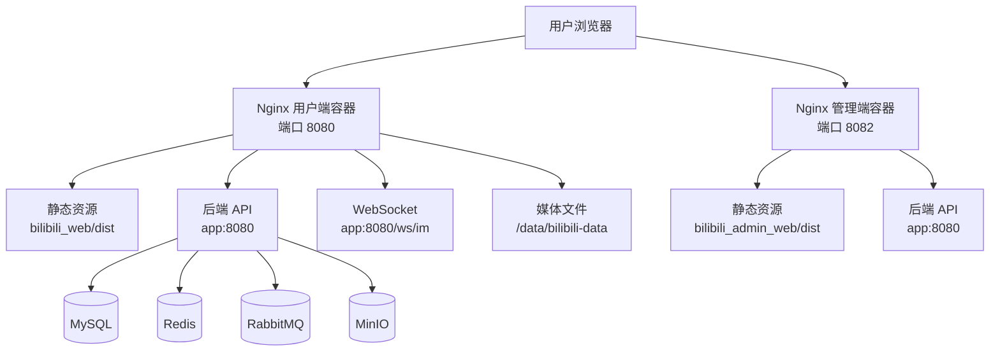

本文档详细说明本项目中 Nginx 反向代理的配置原理与前端静态资源的部署方案。本项目采用双前端应用架构（用户端 `bilibili_web` 与管理端 `bilibili_admin_web`），通过独立的 Nginx 容器分别提供服务，并统一反向代理后端 API 请求，形成清晰的流量分发模型。

## 整体架构与流量模型

本项目部署架构采用 Docker Compose 编排，其中 Nginx 作为唯一的对外入口，负责承载用户浏览器的全部 HTTP 请求。流量进入后，Nginx 根据请求路径与域名，将其精准分发至对应的静态资源或后端服务。



**Sources: [docker-compose.yml](bilibili_SpringBoot/docker-compose.yml#L109-L136)**

该架构的核心设计原则是 **关注点分离**：用户端与管理端部署在独立的 Nginx 容器中，拥有独立的域名（或端口）、独立的静态资源目录和独立的代理规则，从而实现部署、运维与故障隔离上的独立性。

## Nginx 配置详解

本项目为两个前端应用分别提供了独立的 Nginx 配置文件，存放于 `bilibili_SpringBoot/deploy/nginx/` 目录下。

### 用户端配置 (`default.conf`)

用户端配置服务于主站 `bilibili_web`，是功能最完整的配置，涵盖了静态资源、API 代理、WebSocket 代理及媒体文件服务。

**Sources: [default.conf](bilibili_SpringBoot/deploy/nginx/default.conf#L1-L73)**

#### 1. 静态资源与缓存策略

```nginx
location /assets/ {
    try_files $uri =404;
    expires 7d;
    add_header Cache-Control "public, max-age=604800, immutable";
}

location = /favicon.ico {
    try_files $uri =404;
    access_log off;
}
```

此配置将 `/assets/` 目录下的文件（Vite 构建产物）设置为 **7 天强缓存**。`immutable` 指令告诉浏览器，在缓存有效期内，即使用户刷新页面，也无需向服务器验证资源是否过期。这是基于 Vite 构建时生成的 **内容哈希文件名**（如 `index-COgu2T1E.js`）的特性——文件内容变化必然导致文件名变化，因此缓存是安全的。

**Sources: [default.conf](bilibili_SpringBoot/deploy/nginx/default.conf#L9-L18)**

#### 2. 后端 API 反向代理

```nginx
location ~ ^/(users|admin|me|videos|search|swagger-ui|v3/api-docs|doc\.html)(/|$) {
    proxy_pass http://app:8080;
    proxy_http_version 1.1;
    proxy_set_header Host $http_host;
    proxy_set_header X-Real-IP $remote_addr;
    proxy_set_header X-Forwarded-For $proxy_add_x_forwarded_for;
    proxy_set_header X-Forwarded-Proto $scheme;
    proxy_set_header X-Forwarded-Host $http_host;
    proxy_set_header Forwarded "proto=$scheme;host=$http_host";
    proxy_read_timeout 300s;
    proxy_send_timeout 300s;
}
```

此配置使用正则表达式匹配所有后端 API 路径（用户、管理、视频、搜索、API 文档等），并将请求代理到 `http://app:8080`。关键的请求头设置确保了后端服务能获取真实的客户端 IP、协议和原始主机信息，这对于日志记录、安全审计和分布式会话至关重要。`proxy_read_timeout` 和 `proxy_send_timeout` 设置为 300 秒，以支持可能耗时较长的操作（如视频上传处理）。

**Sources: [default.conf](bilibili_SpringBoot/deploy/nginx/default.conf#L29-L53)**

#### 3. WebSocket 代理

```nginx
location /ws/im {
    proxy_pass http://app:8080/ws/im;
    proxy_http_version 1.1;
    proxy_set_header Upgrade $http_upgrade;
    proxy_set_header Connection "upgrade";
    proxy_set_header Host $http_host;
    proxy_set_header X-Real-IP $remote_addr;
    proxy_set_header X-Forwarded-For $proxy_add_x_forwarded_for;
    proxy_set_header X-Forwarded-Proto $scheme;
    proxy_set_header X-Forwarded-Host $http_host;
    proxy_read_timeout 300s;
    proxy_send_timeout 300s;
}
```

WebSocket 连接需要特殊的头信息 `Upgrade` 和 `Connection` 来将 HTTP 连接升级为 WebSocket 协议。此配置确保了即时通信（IM）功能的 WebSocket 连接能正确建立并保持长连接。超时时间同样设置为 300 秒，以维持聊天会话的持久性。

**Sources: [default.conf](bilibili_SpringBoot/deploy/nginx/default.conf#L55-L67)**

#### 4. 媒体文件服务与跨域

```nginx
location /media/ {
    alias /data/bilibili-data/;
    autoindex off;

    add_header Access-Control-Allow-Origin *;
    add_header Access-Control-Allow-Methods "GET,OPTIONS";
    add_header Access-Control-Allow-Headers "Content-Type,Authorization";
}
```

此配置将 `/media/` 路径映射到宿主机的 `/data/bilibili-data/` 目录（通过 Docker 卷 `bilibili_storage` 挂载）。`alias` 指令实现了路径重写，使得 `/media/videos/foo.mp4` 实际访问的是 `/data/bilibili-data/videos/foo.mp4`。**跨域头** 的添加允许前端从不同源请求媒体资源，这是视频播放、图片加载等场景的必要配置。

**Sources: [default.conf](bilibili_SpringBoot/deploy/nginx/default.conf#L20-L27)**

#### 5. SPA 路由回退

```nginx
location / {
    try_files $uri $uri/ /index.html;
}
```

这是单页应用（SPA）的标准配置。当用户直接访问 `/video/123` 或刷新页面时，Nginx 会首先尝试查找对应的静态文件，如果找不到，则回退到 `index.html`，由前端路由（Vue Router）接管路由逻辑。

**Sources: [default.conf](bilibili_SpringBoot/deploy/nginx/default.conf#L69-L71)**

### 管理端配置 (`admin.conf`)

管理端配置结构更简单，专注于管理后台的特定需求。

**Sources: [admin.conf](bilibili_SpringBoot/deploy/nginx/admin.conf#L1-L34)**

其核心差异在于：
1.  **API 代理路径不同**：仅代理 `/users|admin|swagger-ui|v3/api-docs|doc\.html`，因为管理端只与用户管理和后台管理 API 交互。
2.  **无媒体文件服务**：管理端通常不直接提供媒体文件下载，因此省略了 `/media/` 配置。
3.  **无 WebSocket 代理**：管理后台无需实时聊天功能。

## Docker Compose 部署配置

Nginx 容器在 `docker-compose.yml` 中的定义体现了前述的架构设计。

**Sources: [docker-compose.yml](bilibili_SpringBoot/docker-compose.yml#L109-L136)**

### 用户端 Nginx 容器

```yaml
nginx:
  image: nginx:1.28-alpine
  container_name: bilibili-nginx
  restart: always
  environment:
    TZ: Asia/Shanghai
  depends_on:
    - app
  ports:
    - "8080:80"
  volumes:
    - ./deploy/nginx/default.conf:/etc/nginx/conf.d/default.conf:ro
    - ../bilibili_web/dist:/usr/share/nginx/html:ro
    - bilibili_storage:/data/bilibili-data:ro
```

关键点：
- **端口映射**：将容器的 80 端口映射到宿主机的 8080 端口。
- **配置文件挂载**：将本地 `default.conf` 以只读方式挂载到容器的 Nginx 配置目录。
- **静态资源挂载**：将宿主机上的 `bilibili_web/dist` 目录挂载到容器的 `/usr/share/nginx/html`，这是 Nginx 默认的根目录。
- **媒体数据卷**：将 `bilibili_storage` 命名卷挂载到 `/data/bilibili-data`，供 `/media/` 路径使用。
- **服务依赖**：`depends_on: - app` 确保后端应用容器先于 Nginx 启动，尽管 Nginx 会在后端未就绪时返回 502 错误，但依赖声明有助于 Docker Compose 的启动顺序管理。

### 管理端 Nginx 容器

```yaml
admin-nginx:
  image: nginx:1.28-alpine
  container_name: bilibili-admin-nginx
  restart: always
  environment:
    TZ: Asia/Shanghai
  depends_on:
    - app
  ports:
    - "8082:80"
  volumes:
    - ./deploy/nginx/admin.conf:/etc/nginx/conf.d/default.conf:ro
    - ../bilibili_admin_web/dist:/usr/share/nginx/html:ro
```

配置逻辑与用户端类似，但使用独立的端口（8082）和独立的配置文件与静态资源目录。

## 前端构建与部署流程

前端应用的构建产物是 Nginx 托管的静态资源。两个前端项目均使用 Vite 构建。

### 构建命令

**Sources: [package.json](bilibili_web/package.json#L6-L10)**

```bash
# 用户端构建
cd bilibili_web
npm run build

# 管理端构建
cd bilibili_admin_web
npm run build
```

构建命令 `vue-tsc -b && vite build` 会先执行 TypeScript 类型检查，然后生成优化后的生产环境代码到 `dist/` 目录。

### 构建产物结构

**Sources: [dist/](bilibili_web/dist/)**

构建后的 `dist/` 目录结构如下：
```
dist/
├── assets/          # 带内容哈希的 JS/CSS 文件
├── favicon.svg
├── icons.svg
└── index.html       # SPA 入口文件
```

Vite 构建会自动为 JS/CSS 文件名添加内容哈希（如 `index-COgu2T1E.js`），这与 Nginx 的 `immutable` 缓存策略完美配合，实现了 **长期缓存 + 即时更新** 的平衡。

### 开发环境代理

在开发模式下，Vite 内置的开发服务器提供了代理功能，避免了跨域问题。

**Sources: [vite.config.ts](bilibili_web/vite.config.ts#L13-L19)**

```typescript
proxy: {
  '^/(users|me|videos|search|ws)': {
    target: proxyTarget, // 默认为 'http://127.0.0.1:8080'
    changeOrigin: true,
    ws: true,
  },
},
```

此配置将匹配的 API 请求代理到后端开发服务器，`ws: true` 启用了 WebSocket 代理。`proxyTarget` 可通过环境变量 `VITE_API_PROXY_TARGET` 覆盖，便于对接不同的后端环境。

## 关键配置参数说明

下表总结了 Nginx 配置中的关键参数及其作用：

| 参数 | 值 | 作用 | 场景 |
|------|-----|------|------|
| `client_max_body_size` | 2048m (2GB) | 限制请求体最大尺寸 | 视频上传 |
| `proxy_read_timeout` | 300s | 代理读取超时 | 长时间 API 请求 |
| `proxy_send_timeout` | 300s | 代理发送超时 | 大文件下载 |
| `expires` / `Cache-Control` | 7d / max-age=604800 | 静态资源缓存时间 | 性能优化 |
| `immutable` | - | 缓存期内不验证 | 内容哈希文件 |
| `Access-Control-Allow-Origin` | * | 允许跨域访问 | 媒体文件加载 |

**Sources: [default.conf](bilibili_SpringBoot/deploy/nginx/default.conf#L7-L13)**

## 故障排查与最佳实践

### 常见问题

1.  **502 Bad Gateway**：通常意味着后端应用容器未启动或健康检查失败。检查 `app` 容器日志：`docker logs bilibili-app`。
2.  **静态资源 404**：确认前端是否已构建（`npm run build`），以及 `dist` 目录是否正确挂载。
3.  **WebSocket 连接失败**：检查 Nginx 是否正确配置了 `Upgrade` 和 `Connection` 头，以及后端 WebSocket 端点是否正确。
4.  **CORS 错误**：确认媒体文件请求路径是否以 `/media/` 开头，以及后端 API 是否也配置了 CORS。

### 本地开发与调试

在本地开发环境中，可以单独重启 Nginx 容器以应用配置变更：

```bash
# 重启用户端 Nginx
docker-compose restart nginx

# 查看 Nginx 配置是否正确
docker exec bilibili-nginx nginx -t

# 重新加载配置（无需重启）
docker exec bilibili-nginx nginx -s reload
```

## 总结

本项目的 Nginx 部署方案体现了现代前端部署的最佳实践：
1.  **关注点分离**：用户端与管理端独立部署，便于独立扩展与维护。
2.  **性能优化**：利用内容哈希与长期缓存策略，最大化静态资源加载性能。
3.  **安全隔离**：API 代理与静态服务分离，隐藏后端真实地址。
4.  **开发友好**：开发环境与生产环境保持一致的代理逻辑，降低环境差异导致的 bug。

通过 Docker Compose 编排，整个部署过程实现了 **基础设施即代码**，任何配置变更都可通过版本控制追溯，确保了部署的可重复性与可靠性。

## 下一步

在理解了 Nginx 反向代理的配置后，您可能希望深入了解：
- [Docker Compose 多服务编排](25-docker-compose-duo-fu-wu-bian-pai) 以掌握整个应用栈的部署细节。
- [Prometheus + Grafana 监控栈搭建](27-prometheus-grafana-jian-kong-zhan-da-jian) 以学习如何监控 Nginx 和后端服务的运行状态。
- [前端测试](32-vitest-dan-yuan-ce-shi-yu-lu-you-shou-wei-yan-zheng) 以了解如何在前端代码中验证路由守卫等逻辑，这些逻辑与 Nginx 的 SPA 回退配置紧密相关。