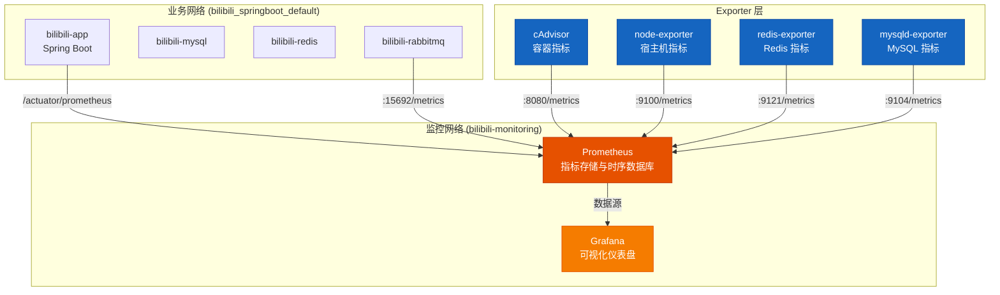
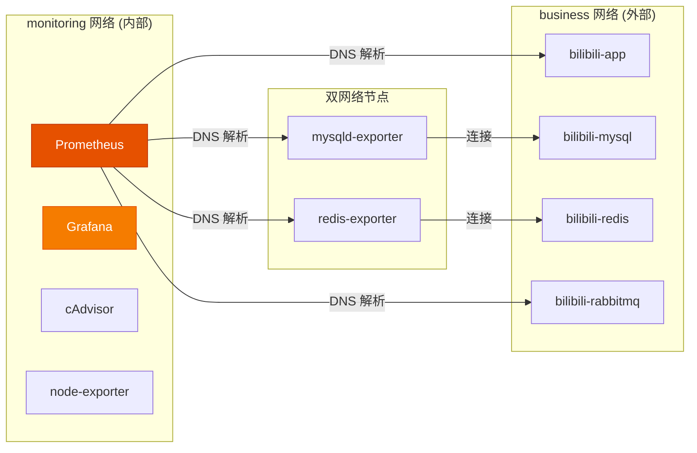

本文档介绍项目中独立部署的 Prometheus + Grafana 监控栈的架构设计、组件说明、配置细节和启动流程。该监控栈采用**非侵入式**设计，不修改任何 Java 业务代码，与业务 Docker Compose 完全解耦，可独立启停。

## 架构总览

监控栈由以下组件组成，形成完整的可观测性数据链路：



数据流路径：**业务服务 → Exporter/Actuator → Prometheus → Grafana**

Prometheus 通过**拉取模式 (Pull)** 周期性从各目标的 HTTP 端点抓取指标，Grafana 再从 Prometheus 查询并渲染可视化面板。

## 目录结构

监控栈的所有配置文件集中在 `monitoring/` 目录下：

```
monitoring/
├── docker-compose.yml          # 监控服务编排
├── prometheus/
│   └── prometheus.yml          # Prometheus 采集目标配置（模板）
├── grafana/
│   ├── provisioning/
│   │   ├── datasources/
│   │   │   └── prometheus.yml  # Grafana 数据源配置（模板）
│   │   └── dashboards/
│   │       └── dashboards.yml  # Dashboard 自动加载配置
│   ├── dashboards/             # 预置 Dashboard JSON（9 个）
│   └── doc/                    # Dashboard 说明文档（9 个）
├── mysql/
│   ├── .my.cnf                 # MySQL exporter 连接配置
│   └── .my.cnf.example         # 示例文件
├── .env                        # 环境变量（不入库）
├── .env.example                # 环境变量示例
└── README.md                   # 快速指南
```

Sources: [docker-compose.yml](monitoring/docker-compose.yml#L1-L138), [prometheus.yml](monitoring/prometheus/prometheus.yml#L1-L75)

## 组件清单与职责

| 组件 | 镜像 | 容器名 | 默认端口 | 职责 |
|------|------|--------|----------|------|
| **Prometheus** | `prom/prometheus:v2.55.1` | `bilibili-prometheus` | 9090 | 指标采集、存储、查询引擎 |
| **Grafana** | `grafana/grafana:11.3.1` | `bilibili-grafana` | 3000 | 可视化仪表盘、告警面板 |
| **cAdvisor** | `ghcr.io/google/cadvisor:0.55.1` | `bilibili-cadvisor` | 8081 | Docker 容器 CPU/内存/网络/IO 指标 |
| **node-exporter** | `prom/node-exporter:v1.8.2` | `bilibili-node-exporter` | 9100 | 宿主机 CPU/内存/磁盘/网络指标 |
| **redis-exporter** | `oliver006/redis_exporter:v1.66.0` | `bilibili-redis-exporter` | 9121 | Redis 运行指标 |
| **mysqld-exporter** | `prom/mysqld-exporter:v0.16.0` | `bilibili-mysqld-exporter` | 9104 | MySQL 运行指标 |

此外，RabbitMQ 指标通过内置的 `rabbitmq_prometheus` 插件直接暴露，无需额外 Exporter。

Sources: [docker-compose.yml](monitoring/docker-compose.yml#L3-L127)

## Prometheus 配置详解

Prometheus 使用模板化的 `prometheus.yml`，在容器启动时通过 `sed` 注入环境变量，避免硬编码采集间隔：

```yaml
global:
  scrape_interval: __PROMETHEUS_SCRAPE_INTERVAL__      # 默认 1s
  evaluation_interval: __PROMETHEUS_EVALUATION_INTERVAL__ # 默认 1s
  external_labels:
    project: bilibili
    environment: local
```

### 采集目标列表

| Job 名称 | 采集端点 | 对应服务 | 说明 |
|----------|----------|----------|------|
| `prometheus` | `prometheus:9090` | Prometheus 自身 | 运行状态监控 |
| `grafana` | `grafana:3000/metrics` | Grafana 自身 | 运行状态监控 |
| `spring-boot-app` | `app:8080/actuator/prometheus` | bilibili-app | 应用指标（JVM、HTTP、IM 业务埋点） |
| `rabbitmq` | `rabbitmq:15692/metrics` | bilibili-rabbitmq | RabbitMQ broker 指标 |
| `rabbitmq-detailed` | `rabbitmq:15692/metrics/detailed` | bilibili-rabbitmq | 队列维度精细指标 |
| `redis` | `redis-exporter:9121/metrics` | redis-exporter | Redis 指标 |
| `mysql` | `mysqld-exporter:9104/metrics` | mysqld-exporter | MySQL 指标 |
| `cadvisor` | `cadvisor:8080/metrics` | cAdvisor | 容器资源指标 |
| `node` | `node-exporter:9100/metrics` | node-exporter | 宿主机资源指标 |

Sources: [prometheus.yml](monitoring/prometheus/prometheus.yml#L1-L75)

## Grafana 配置详解

Grafana 采用 **Provisioning 机制** 实现数据源和 Dashboard 的自动化配置，无需手动导入。

### 数据源自动配置

启动时自动创建 Prometheus 数据源：

```yaml
datasources:
  - name: Prometheus
    uid: Prometheus
    type: prometheus
    access: proxy
    url: http://prometheus:9090
    jsonData:
      timeInterval: __GRAFANA_PROMETHEUS_TIME_INTERVAL__  # 默认 1s
    isDefault: true
```

Sources: [prometheus.yml](monitoring/grafana/provisioning/datasources/prometheus.yml#L1-L13)

### 预置 Dashboard 一览

监控栈包含 **9 个预置 Dashboard**，覆盖从应用到基础设施的完整监控维度：

| Dashboard 文件 | 监控范围 | 对应文档 |
|---------------|----------|----------|
| `im-minimal-overview.json` | **全局总览**：聚合所有分类的核心图表 | `im-minimal-overview.md` |
| `im-health-status.json` | 核心容器健康状态 | `im-health-status.md` |
| `im-spring-boot-application.json` | Spring Boot JVM、HTTP 请求 | `im-spring-boot-application.md` |
| `im-websocket-realtime.json` | WebSocket 连接、心跳、消息处理 | `im-websocket-realtime.md` |
| `im-send-pipeline.json` | 消息发送链路 | `im-send-pipeline.md` |
| `im-mq-rabbitmq.json` | RabbitMQ 队列、broker 指标 | `im-mq-rabbitmq.md` |
| `im-mysql-redis.json` | MySQL、Redis 运行指标 | `im-mysql-redis.md` |
| `im-host-container.json` | 宿主机与容器网络 | `im-host-container.md` |
| `im-monitoring-system.json` | Prometheus、Grafana 自身 | `im-monitoring-system.md` |

这些 Dashboard 文件在启动时被复制到临时目录，通过 `sed` 替换刷新间隔变量，确保配置灵活：

```bash
# docker-compose.yml 中 grafana 的启动命令（简化）
cp /var/lib/grafana/dashboard-templates/*.json /tmp/grafana-dashboards/
find /tmp/grafana-dashboards -name '*.json' -exec sed -i \
  "s/\"refresh\": \"1s\"/\"refresh\": \"${GRAFANA_DASHBOARD_REFRESH:-1s}\"/g" {} \;
```

Sources: [docker-compose.yml](monitoring/docker-compose.yml#L48-L68), [im-minimal-overview.md](monitoring/grafana/doc/im-minimal-overview.md#L1-L60)

## Spring Boot 应用集成

Spring Boot 通过 **Actuator + Micrometer** 暴露 Prometheus 格式的指标端点，无需编写额外代码。

### 依赖配置

在 `pom.xml` 中已包含以下依赖：

```xml
<dependency>
    <groupId>org.springframework.boot</groupId>
    <artifactId>spring-boot-starter-actuator</artifactId>
</dependency>
<dependency>
    <groupId>io.micrometer</groupId>
    <artifactId>micrometer-registry-prometheus</artifactId>
</dependency>
```

### 端点暴露

在 `application.yaml` 中配置 Actuator 端点：

```yaml
management:
  endpoints:
    web:
      exposure:
        include: health,metrics,prometheus  # 暴露 health、metrics、prometheus 端点
  endpoint:
    health:
      show-details: never
```

配置完成后，应用会在 `/actuator/prometheus` 路径暴露 JVM、HTTP 请求、自定义业务指标等所有时序数据。

Sources: [pom.xml](bilibili_SpringBoot/pom.xml#L58-L63), [application.yaml](bilibili_SpringBoot/src/main/resources/application.yaml#L102-L107)

## Docker 网络设计

监控栈采用**双网络架构**，通过 `external` 网络实现跨栈服务发现：



- **monitoring 网络**：监控栈内部通信，Prometheus 与 Grafana、Exporters 之间
- **business 网络**：业务栈的 Docker 网络（默认 `bilibili_springboot_default`），Exporters 通过此网络访问 MySQL、Redis

**关键点**：`redis-exporter` 和 `mysqld-exporter` 同时加入两个网络，既能被 Prometheus 访问，又能连接业务数据库。

Sources: [docker-compose.yml](monitoring/docker-compose.yml#L129-L137), [.env](monitoring/.env#L1-L2)

## 环境变量配置

通过 `.env` 文件控制监控栈行为，敏感文件不入库：

| 变量名 | 默认值 | 说明 |
|--------|--------|------|
| `BUSINESS_DOCKER_NETWORK` | `bilibili_springboot_default` | 业务 Docker 网络名 |
| `GRAFANA_ADMIN_USER` | `admin` | Grafana 管理员用户名 |
| `GRAFANA_ADMIN_PASSWORD` | `admin` | Grafana 管理员密码 |
| `GRAFANA_PORT` | `3000` | Grafana 宿主机端口 |
| `PROMETHEUS_PORT` | `9090` | Prometheus 宿主机端口 |
| `PROMETHEUS_SCRAPE_INTERVAL` | `1s` | Prometheus 抓取间隔 |
| `PROMETHEUS_EVALUATION_INTERVAL` | `1s` | Prometheus 规则评估间隔 |
| `GRAFANA_DASHBOARD_REFRESH` | `1s` | Dashboard 自动刷新间隔 |
| `REDIS_ADDR` | `redis://redis:6379` | Redis 连接地址 |
| `REDIS_PASSWORD` | *(空)* | Redis 密码 |
| `MYSQL_EXPORTER_USER` | `exporter` | MySQL exporter 账号 |
| `MYSQL_EXPORTER_PASSWORD` | `exporter_password` | MySQL exporter 密码 |

Sources: [.env.example](monitoring/.env.example#L1-L36), [.env](monitoring/.env#L1-L29)

## 启动流程

### 前置条件

1. 业务栈已启动
2. Docker 网络已创建

### 步骤一：启动业务栈

```bash
cd bilibili_SpringBoot
docker compose up -d
```

验证业务网络存在：

```bash
docker network ls | grep bilibili_springboot_default
```

### 步骤二：配置环境变量

```bash
cd monitoring
cp .env.example .env
cp mysql/.my.cnf.example mysql/.my.cnf
```

编辑 `.env` 文件，确认 `BUSINESS_DOCKER_NETWORK` 与实际业务网络名一致。

### 步骤三：创建 MySQL 监控账号

```bash
docker exec -it bilibili-mysql mysql -uroot -proot
```

执行以下 SQL：

```sql
CREATE USER IF NOT EXISTS 'exporter'@'%' IDENTIFIED BY 'exporter_password';
GRANT PROCESS, REPLICATION CLIENT, SELECT ON *.* TO 'exporter'@'%';
FLUSH PRIVILEGES;
```

### 步骤四：启用 RabbitMQ Prometheus 插件

```bash
docker exec bilibili-rabbitmq rabbitmq-plugins enable rabbitmq_prometheus
```

启用后 RabbitMQ 指标端点 `:15692/metrics` 才可用。

### 步骤五：启动监控栈

```bash
cd monitoring
docker compose up -d
```

### 步骤六：验证部署

| 验证项 | 访问地址 | 预期结果 |
|--------|----------|----------|
| Prometheus 状态 | `http://localhost:9090/targets` | 所有 target 显示 `UP` |
| Grafana 登录 | `http://localhost:3000` | 使用 admin/admin 登录 |
| Dashboard 预览 | Grafana → Bilibili 文件夹 | 可见 9 个预置 Dashboard |
| cAdvisor 指标 | `http://localhost:8081` | 容器指标可视化页面 |
| 应用指标 | `http://localhost:8080/actuator/prometheus` | Prometheus 格式指标输出 |

Sources: [README.md](monitoring/README.md#L1-L192)

## 常见问题排查

### Prometheus targets 显示 down

| 目标 | 排查命令 | 可能原因 |
|------|----------|----------|
| `spring-boot-app` | `curl http://localhost:8080/actuator/prometheus` | 应用未启动或未暴露端点 |
| `rabbitmq` | `docker exec bilibili-rabbitmq rabbitmq-plugins list` | Prometheus 插件未启用 |
| `redis` | `docker logs bilibili-redis-exporter` | Redis 连接失败 |
| `mysql` | `docker logs bilibili-mysqld-exporter` | `.my.cnf` 配置错误或账号权限不足 |

### Docker 网络不存在

错误提示：`network bilibili_springboot_default not found`

解决方案：

```bash
docker network ls
# 找到实际的业务网络名，修改 .env 中的 BUSINESS_DOCKER_NETWORK
```

### Grafana Dashboard 面板为空

Dashboard 面板为空通常是因为底层 scrape target 为 down。先确认 Prometheus targets 页面所有目标为 UP 状态。

### 后续合并进业务 Compose

如果需要将监控栈合并到 `bilibili_SpringBoot/docker-compose.yml` 中：

1. 将监控服务移动到业务 compose 文件
2. 删除 `external` 网络配置，统一使用业务网络
3. 保持相同的容器服务名，确保 Prometheus target 无需修改
4. 调整文件挂载的相对路径

该迁移**不需要修改 Java 业务代码**。

Sources: [README.md](monitoring/README.md#L155-L192)

## 下一步

监控栈搭建完成后，可继续深入了解：

- **[Grafana Dashboard 与关键指标解读](28-grafana-dashboard-yu-guan-jian-zhi-biao-jie-du)**：各 Dashboard 的图表含义、关键指标解读和告警阈值建议
- **[k6 独立压测框架使用指南](29-k6-du-li-ya-ce-kuang-jia-shi-yong-zhi-nan)**：压测时如何与监控栈联动观测
- **[WebSocket 与 IM 场景压测脚本](30-websocket-yu-im-chang-jing-ya-ce-jiao-ben)**：IM 链路压测时的监控重点
- **[监控系统改造计划](docs/改造计划/监控系统改造计划-20260421-140650.md)**：后续埋点补强和压测联动的演进规划