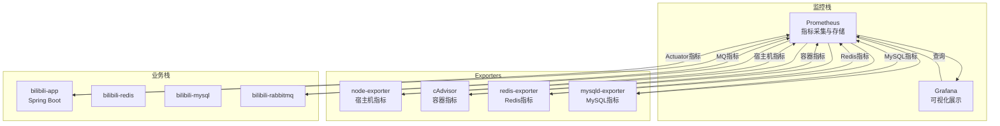
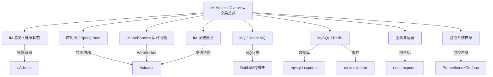

本文档详细解读 Bilibili 项目监控栈中 Grafana Dashboard 的架构设计、各仪表板功能定位以及关键监控指标的含义与查询方式。通过系统性的指标解读，帮助开发者快速定位系统瓶颈、监控服务健康状态，并理解从基础设施到业务层的完整监控体系。

## 监控栈整体架构

Bilibili 监控栈采用 **Prometheus + Grafana** 经典组合，通过独立的 Docker Compose 文件与业务栈解耦部署。整体架构包含七个核心监控目标，形成从宿主机到应用业务层的完整监控链路。



**Sources**: [monitoring/docker-compose.yml](monitoring/docker-compose.yml#L1-L138), [monitoring/prometheus/prometheus.yml](monitoring/prometheus/prometheus.yml#L1-L75)

## Dashboard 分类体系

Grafana Dashboard 按照监控维度和业务深度分为 **八个独立仪表板**，形成从全局总览到细分领域的层次化监控体系。所有仪表板均通过 Prometheus 数据源统一查询，支持 **1 秒级实时刷新**。



**Sources**: [monitoring/grafana/doc/im-minimal-overview.md](monitoring/grafana/doc/im-minimal-overview.md#L1-L60)

## 仪表板详细解读

### 1. IM Minimal Overview（全局总览）

**定位**：作为监控入口，聚合所有分类页面的核心图表，提供系统整体健康状态快照。适合快速排查和运维巡检。

**监控范围**：覆盖容器资源、Spring Boot、WebSocket、发送链路、RabbitMQ、MySQL、Redis、宿主机和监控系统自身。

**图表分组**：
| 分组 | 监控对象 | 对应分类文档 |
|------|----------|--------------|
| 一、总览 / 健康状态 | 核心容器 CPU、内存 | `im-health-status.md` |
| 二、应用层 / Spring Boot | JVM、进程、HTTP | `im-spring-boot-application.md` |
| 三、IM WebSocket 实时链路 | WebSocket 连接、心跳、消息处理 | `im-websocket-realtime.md` |
| 四、IM 发送链路 | 发送入口、MQ 发布确认 | `im-send-pipeline.md` |
| 五、MQ / RabbitMQ | RabbitMQ 队列、broker、IM MQ consumer | `im-mq-rabbitmq.md` |
| 六、MySQL / Redis | MySQL、Redis、IM DB 操作 | `im-mysql-redis.md` |
| 七、主机与容器 | 宿主机、容器网络 | `im-host-container.md` |
| 八、监控系统自身 | Prometheus、Grafana | `im-monitoring-system.md` |

**Sources**: [monitoring/grafana/dashboards/im-minimal-overview.json](monitoring/grafana/dashboards/im-minimal-overview.json#L3000-L3026)

### 2. IM 总览 / 健康状态

**定位**：快速判断核心业务容器是否存在明显资源异常，只关注容器级别的 CPU 和内存。

**监控对象**：
- `bilibili-app`：Spring Boot 应用容器
- `bilibili-mysql`：MySQL 数据库容器
- `bilibili-redis`：Redis 缓存容器
- `bilibili-rabbitmq`：RabbitMQ 消息队列容器

**关键指标**：
| 图表 | 指标来源 | 含义 |
|------|----------|------|
| 核心容器 CPU 使用率 | `container_cpu_usage_seconds_total` | 按容器统计 CPU 使用速率 |
| 核心容器内存 | `container_memory_working_set_bytes` | 容器当前工作集内存 |

**Sources**: [monitoring/grafana/doc/im-health-status.md](monitoring/grafana/doc/im-health-status.md#L1-L44)

### 3. 应用层 / Spring Boot

**定位**：观察 Spring Boot 应用自身运行状态和 HTTP 接口表现，反映应用内部健康状况。

**监控对象**：
- Spring Boot 应用容器：`bilibili-app`
- JVM 内存和线程
- 进程 CPU
- HTTP 请求吞吐和延迟

**关键指标**：
| 图表 | 指标来源 | 含义 |
|------|----------|------|
| Spring Boot JVM 内存 | `jvm_memory_used_bytes`、`jvm_memory_committed_bytes` | JVM heap/nonheap 已用和已提交内存 |
| Spring Boot CPU 与线程 | `process_cpu_usage`、`jvm_threads_live_threads` | 应用进程 CPU 使用率、活跃线程数 |
| HTTP 请求吞吐 | `http_server_requests_seconds_count` | 按 method、uri、status 统计 HTTP 请求速率 |
| HTTP 平均延迟 | `http_server_requests_seconds_sum` | HTTP 平均耗时和最大耗时 |

**Sources**: [monitoring/grafana/doc/im-spring-boot-application.md](monitoring/grafana/doc/im-spring-boot-application.md#L1-L46)

### 4. IM WebSocket 实时链路

**定位**：观察 IM WebSocket 连接、心跳、消息处理和异常输入，是 IM 系统核心监控面板。

**监控对象**：
- Spring Boot WebSocket 连接管理
- WebSocket 握手流程
- 心跳收发
- WebSocket 协议分发和下行发送
- 非法 payload、非法类型、未支持类型、过期 session 清理

**关键指标**：
| 图表 | 指标来源 | 含义 |
|------|----------|------|
| IM WebSocket 在线状态 | `im_ws_sessions_active`、`im_ws_users_online` | 当前活跃 session 数和在线用户数 |
| IM WebSocket 握手与心跳 | `im_ws_handshake_attempts_total`、`im_ws_heartbeat_received_total` | 握手尝试/成功速率、心跳收发和失败速率 |
| IM WebSocket 消息处理延迟 | `im_ws_protocol_dispatch_seconds_*`、`im_ws_outbound_send_seconds_*` | 上行协议分发和下行发送平均耗时 |
| IM WebSocket 异常输入 | `im_ws_inbound_payload_invalid_total`、`im_ws_inbound_type_invalid_total` | 非法输入、未支持类型和过期连接清理速率 |

**Micrometer 埋点实现**：这些指标由 `MicrometerImWebSocketMetricsRecorder` 类实现，通过 `ImConnectionRegistry` 提供实时连接数统计。

**Sources**: [monitoring/grafana/doc/im-websocket-realtime.md](monitoring/grafana/doc/im-websocket-realtime.md#L1-L47), [bilibili_SpringBoot/src/main/java/com/bilibili/im/websocket/metrics/impl/MicrometerImWebSocketMetricsRecorder.java](bilibili_SpringBoot/src/main/java/com/bilibili/im/websocket/metrics/impl/MicrometerImWebSocketMetricsRecorder.java#L1-L303)

### 5. IM 发送链路

**定位**：观察 IM 消息发送入口和 MQ 发布确认链路，监控消息发送的完整流程。

**监控对象**：
- Spring Boot 发送入口埋点：`im.send.accept.*`
- Spring Boot RabbitMQ 发布确认埋点：`im.mq.publish.confirm.*`

**关键指标**：
| 图表 | 指标来源 | 含义 |
|------|----------|------|
| IM 发送接入耗时 | `im_send_accept_total_seconds_*`、`im_send_accept_validation_seconds_*` | 发送请求整体耗时、校验耗时、会话解析耗时、发布调用耗时 |
| IM MQ 发布确认 | `im_mq_publish_confirm_ack_total`、`im_mq_publish_confirm_nack_total` | RabbitMQ publisher confirm 的 ack、nack、超时、重试和待确认数 |

**Sources**: [monitoring/grafana/doc/im-send-pipeline.md](monitoring/grafana/doc/im-send-pipeline.md#L1-L41)

### 6. MQ / RabbitMQ

**定位**：观察 IM 消息队列的积压、发布、投递和消费情况，监控消息队列健康状态。

**监控对象**：
- RabbitMQ 服务：`bilibili-rabbitmq`
- IM 业务队列：`im.message.*`
- Spring Boot 内部 MQ 消费埋点：`im.mq.consumer.*`

**关键指标**：
| 图表 | 指标来源 | 含义 |
|------|----------|------|
| RabbitMQ IM 队列积压 | `rabbitmq_queue_messages_ready`、`rabbitmq_queue_messages_unacked` | 队列待消费和已投递未确认消息数 |
| IM MQ 消费吞吐 | `im_mq_consumer_messages_total`、`im_mq_consumer_errors_total` | 各 consumer 的消费速率和错误速率 |
| IM MQ 消费耗时与滞后 | `im_mq_consumer_duration_seconds_*`、`im_mq_consumer_lag_seconds_*` | 消费处理耗时和从发送到消费完成的滞后 |
| RabbitMQ 发布与投递 | `rabbitmq_global_messages_received_total` | broker 全局消息接收、路由、投递、确认速率 |

**MQ Consumer 枚举**：系统定义了九个 MQ 消费者，涵盖单聊和群聊的完整消息处理链路：
- 单聊：`single_message_persist`、`single_conversation_persist`、`single_conversation_redis_projection`、`single_recent_message_cache_projection`、`single_realtime_push`
- 群聊：`group_message_persist`、`group_conversation_redis_projection`、`group_recent_message_cache_projection`、`group_realtime_push`

**Sources**: [monitoring/grafana/doc/im-mq-rabbitmq.md](monitoring/grafana/doc/im-mq-rabbitmq.md#L1-L55), [bilibili_SpringBoot/src/main/java/com/bilibili/im/mq/metrics/ImMqConsumerMetrics.java](bilibili_SpringBoot/src/main/java/com/bilibili/im/mq/metrics/ImMqConsumerMetrics.java#L1-L126)

### 7. MySQL / Redis

**定位**：观察数据库、缓存和应用内部 DB 操作状态，监控数据存储层健康状况。

**监控对象**：
- MySQL 服务：`bilibili-mysql`
- Redis 服务：`bilibili-redis`
- Spring Boot 内部 DB 操作埋点：`im.db.operation.*`

**关键指标**：
| 图表 | 指标来源 | 含义 |
|------|----------|------|
| MySQL 连接状态 | `mysql_global_status_threads_connected`、`mysql_global_status_threads_running` | 当前连接数和正在运行线程数 |
| MySQL 查询吞吐 | `mysql_global_status_questions` | MySQL 查询请求速率 |
| IM DB 操作吞吐 | `im_db_operation_calls_total`、`im_db_operation_errors_total` | IM 业务 DB 操作调用速率和错误速率 |
| IM DB 操作耗时 | `im_db_operation_duration_seconds_*` | IM 业务 DB 操作平均耗时 |
| Redis 命令吞吐 | `redis_commands_processed_total` | Redis 命令处理速率 |
| Redis 内存与连接 | `redis_memory_used_bytes`、`redis_connected_clients` | Redis 内存使用和客户端连接数 |

**Sources**: [monitoring/grafana/doc/im-mysql-redis.md](monitoring/grafana/doc/im-mysql-redis.md#L1-L66)

### 8. 主机与容器

**定位**：观察宿主机资源和业务容器网络流量，监控基础设施层健康状况。

**监控对象**：
- 宿主机 CPU、Load、磁盘、网络
- 业务容器网络 IO：`bilibili-app`、`bilibili-mysql`、`bilibili-redis`、`bilibili-rabbitmq`、`bilibili-nginx`、`bilibili-minio`

**关键指标**：
| 图表 | 指标来源 | 含义 |
|------|----------|------|
| 主机 CPU 与负载 | `node_cpu_seconds_total`、`node_load1`、`node_load5` | 宿主机 CPU 使用率和负载 |
| 主机磁盘与网络 | `node_filesystem_*`、`node_network_*` | 宿主机磁盘占用、网卡收发速率 |
| 容器网络 IO | `container_network_receive_bytes_total`、`container_network_transmit_bytes_total` | 每个业务容器的网络收发速率 |

**Sources**: [monitoring/grafana/doc/im-host-container.md](monitoring/grafana/doc/im-host-container.md#L1-L58)

### 9. 监控系统自身

**定位**：判断监控系统本身是否正常，确保监控数据的可信度。

**监控对象**：
- Prometheus
- Grafana

**关键指标**：
| 图表 | 指标来源 | 含义 |
|------|----------|------|
| Prometheus 与 Grafana 自身 | `up`、`prometheus_tsdb_head_samples_appended_total`、`grafana_stat_active_users` | 监控目标是否存活、Prometheus 写入速率、Grafana 活跃用户数 |

**Sources**: [monitoring/grafana/doc/im-monitoring-system.md](monitoring/grafana/doc/im-monitoring-system.md#L1-L49)

## 数据源与采集配置

### Prometheus 数据源配置

Grafana 通过 provisioning 机制自动配置 Prometheus 数据源，支持 **1 秒级刷新间隔**：

```yaml
# monitoring/grafana/provisioning/datasources/prometheus.yml
apiVersion: 1
datasources:
  - name: Prometheus
    uid: Prometheus
    type: prometheus
    access: proxy
    url: http://prometheus:9090
    jsonData:
      timeInterval: __GRAFANA_PROMETHEUS_TIME_INTERVAL__
    isDefault: true
    editable: true
```

### Dashboard 自动加载

Dashboard 通过文件提供者自动加载到 `Bilibili` 文件夹：

```yaml
# monitoring/grafana/provisioning/dashboards/dashboards.yml
apiVersion: 1
providers:
  - name: Bilibili Monitoring
    orgId: 1
    folder: Bilibili
    type: file
    disableDeletion: false
    editable: true
    options:
      path: /var/lib/grafana/dashboards
```

**Sources**: [monitoring/grafana/provisioning/datasources/prometheus.yml](monitoring/grafana/provisioning/datasources/prometheus.yml#L1-L13), [monitoring/grafana/provisioning/dashboards/dashboards.yml](monitoring/grafana/provisioning/dashboards/dashboards.yml#L1-L12)

## 指标来源与采集机制

### 采集接口总表

| 监控对象 | Prometheus job | 采集接口 | 说明 |
|----------|----------------|----------|------|
| Spring Boot 应用 | `spring-boot-app` | `app:8080/actuator/prometheus` | Actuator + Micrometer 暴露 JVM、HTTP、IM 业务埋点 |
| RabbitMQ | `rabbitmq` | `rabbitmq:15692/metrics` | RabbitMQ Prometheus 插件暴露 broker 和队列指标 |
| Redis | `redis` | `redis-exporter:9121/metrics` | redis-exporter 连接 `redis://redis:6379` 后暴露 Redis 指标 |
| MySQL | `mysql` | `mysqld-exporter:9104/metrics` | mysqld-exporter 连接 `mysql:3306` 后暴露 MySQL 指标 |
| 容器资源 | `cadvisor` | `cadvisor:8080/metrics` | cAdvisor 暴露 Docker 容器 CPU、内存、网络等指标 |
| 宿主机资源 | `node` | `node-exporter:9100/metrics` | node-exporter 暴露宿主机 CPU、负载、磁盘、网络等指标 |
| Prometheus | `prometheus` | `prometheus:9090/metrics` | Prometheus 自身运行指标 |
| Grafana | `grafana` | `grafana:3000/metrics` | Grafana 自身运行指标 |

**Sources**: [monitoring/prometheus/prometheus.yml](monitoring/prometheus/prometheus.yml#L1-L75)

## 业务埋点实现

### IM 业务指标分类

系统通过 **四个核心 Metrics 类** 实现全面的业务监控：

1. **ImWebSocketMetricsRecorder**：WebSocket 连接、握手、心跳、协议处理指标
2. **ImSendMetrics**：消息发送入口、MQ 发布确认指标  
3. **ImMqConsumerMetrics**：MQ 消费吞吐、耗时、滞后指标
4. **ImDbOperationMetrics**：DB 操作调用、错误、耗时指标

**Sources**: [bilibili_SpringBoot/src/main/java/com/bilibili/im/metrics/ImSendMetrics.java](bilibili_SpringBoot/src/main/java/com/bilibili/im/metrics/ImSendMetrics.java#L1-L169), [bilibili_SpringBoot/src/main/java/com/bilibili/im/metrics/ImDbOperationMetrics.java](bilibili_SpringBoot/src/main/java/com/bilibili/im/metrics/ImDbOperationMetrics.java#L1-L53)

## 排查问题指南

### 1. Dashboard 面板为空

**可能原因**：
- Prometheus targets 显示 `down`
- 指标尚未产生（无业务流量）
- 数据源配置错误

**排查步骤**：
1. 访问 `http://localhost:9090/targets` 检查 target 状态
2. 确认业务栈已启动且正常运行
3. 检查 `monitoring/.env` 中的 `BUSINESS_DOCKER_NETWORK` 配置

### 2. MySQL target 为 down

**可能原因**：
- MySQL exporter 账号权限不足
- `.my.cnf` 配置错误

**排查步骤**：
```bash
# 检查 exporter 日志
docker logs bilibili-mysqld-exporter

# 验证 MySQL 账号
docker exec -it bilibili-mysql mysql -uexporter -pexporter_password -e "SELECT 1"
```

### 3. Redis target 为 down

**可能原因**：
- Redis 无密码时 `REDIS_PASSWORD` 未留空
- 网络连接问题

**排查步骤**：
```bash
# 检查 exporter 日志
docker logs bilibili-redis-exporter

# 验证 Redis 连接
docker exec bilibili-redis-exporter wget -qO- http://redis-exporter:9121/metrics
```

**Sources**: [monitoring/README.md](monitoring/README.md#L150-L192)

## 最佳实践

### 1. 监控维度分层

遵循 **从基础设施到业务应用** 的监控层次：
- **L1 基础设施**：宿主机、容器资源
- **L2 中间件**：MySQL、Redis、RabbitMQ
- **L3 应用层**：Spring Boot、JVM、HTTP
- **L4 业务层**：WebSocket、消息发送、MQ 消费、DB 操作

### 2. 指标解读原则

- **先看全局，再看细节**：从 `IM Minimal Overview` 开始，定位异常区域
- **关注趋势，而非瞬时值**：观察指标变化趋势，避免过度关注单点数据
- **关联分析**：结合多个维度指标进行根因分析（如 CPU 高 + MQ 积压）

### 3. 告警阈值建议

| 指标类别 | 告警阈值 | 说明 |
|----------|----------|------|
| 容器 CPU 使用率 | > 80% 持续 5 分钟 | 考虑扩容或优化 |
| 容器内存使用率 | > 90% | 存在 OOM 风险 |
| MQ 队列积压 | > 1000 消息 | 消费能力不足 |
| HTTP 错误率 | > 5% | 接口异常 |
| WebSocket 心跳失败率 | > 10% | 连接质量问题 |

### 4. 压测场景监控

在压测期间重点关注：
1. **实时面板**：使用 `IM Minimal Overview` 的 1 秒刷新
2. **关键指标**：MQ 积压、WebSocket 连接数、HTTP 响应时间
3. **资源瓶颈**：CPU、内存、网络 IO 的同步监控
4. **事后复盘**：利用 Grafana 的时间范围选择功能回溯压测过程

## 后续扩展建议

1. **告警集成**：配置 Prometheus Alertmanager 实现自动化告警
2. **自定义 Dashboard**：基于现有指标创建特定业务场景的监控面板
3. **指标扩展**：补充更细粒度的业务埋点（如 Redis Lua 脚本执行耗时）
4. **容量规划**：基于历史监控数据建立容量模型

## 相关文档

- [Prometheus + Grafana 监控栈搭建](27-prometheus-grafana-jian-kong-zhan-da-jian)：监控栈部署和配置详情
- [Docker Compose 多服务编排](25-docker-compose-duo-fu-wu-bian-pai)：容器化部署架构
- [WebSocket 连接管理与自定义协议](17-websocket-lian-jie-guan-li-yu-zi-ding-yi-xie-yi)：WebSocket 技术实现
- [RabbitMQ 消息队列与消费者设计](18-rabbitmq-xiao-xi-dui-lie-yu-xiao-fei-zhe-she-ji)：消息队列架构