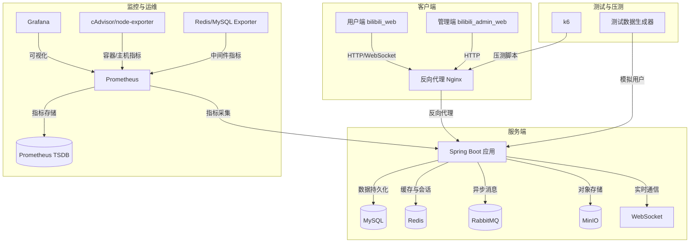
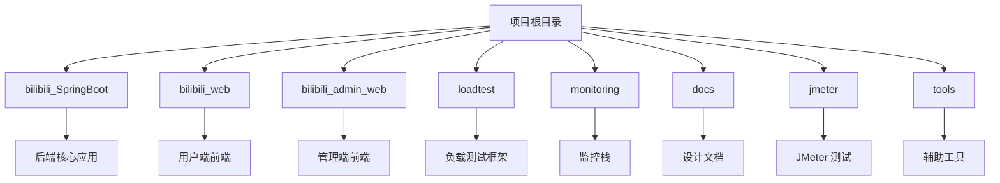
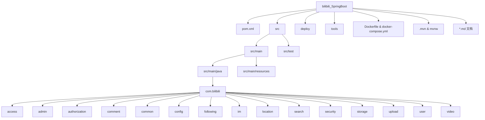
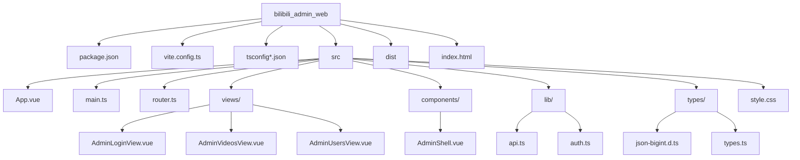
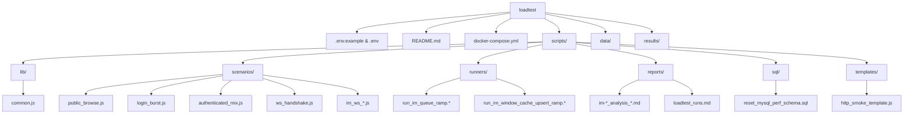
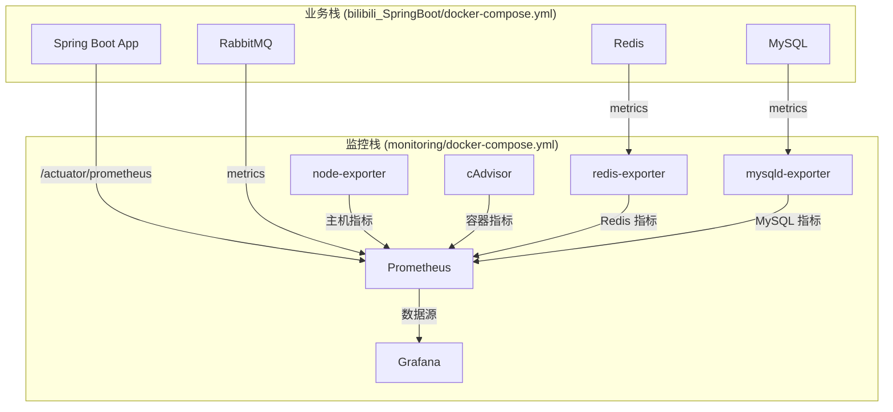
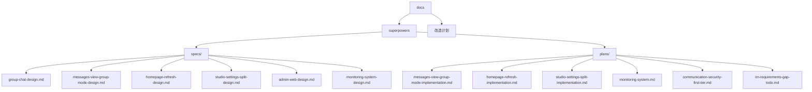
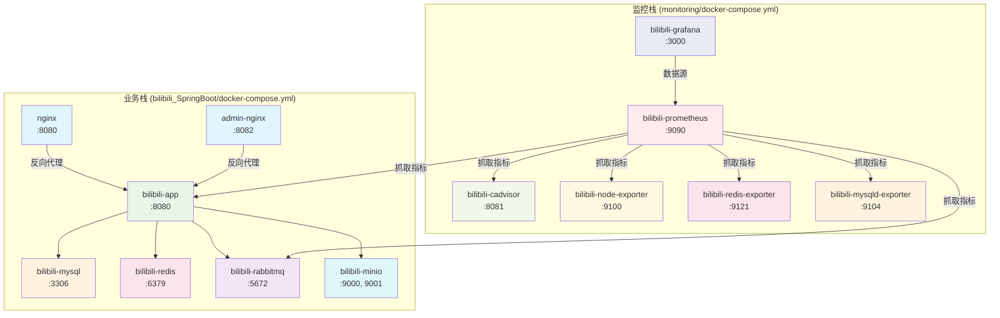

本页面为开发者提供整个 Bilibili 项目的全景式导览，系统性地梳理根目录、各子项目以及支撑性模块的组织逻辑、技术栈选型与核心交互关系。通过理解目录结构，开发者可以快速定位代码、把握架构全貌，并为后续深入特定模块（如 IM、视频热度、监控）建立清晰的心智模型。

## 1. 项目整体架构

本项目是一个采用**前后端分离**、**容器化部署**的全栈应用，模拟 Bilibili 的核心功能，包括用户系统、视频管理、弹幕、评论、即时通信（IM）以及管理后台。整体架构遵循**微服务思想**，但以**单体应用**形式部署，便于开发和演示。

## 2. 顶层目录结构

项目根目录包含以下核心子目录和文件，每个目录都有明确的职责边界。

| 目录/文件 | 核心职责 | 技术栈 | 关键文件 |
|-----------|----------|--------|----------|
| `bilibili_SpringBoot/` | **后端单体应用**，包含所有业务逻辑、API、WebSocket 服务 | Spring Boot 4.0, Java 17, MyBatis-Plus, Redis, RabbitMQ, MinIO | `pom.xml`, `src/main/java`, `docker-compose.yml` |
| `bilibili_web/` | **用户端前端**，提供视频浏览、弹幕、IM 等用户交互界面 | Vue 3, TypeScript, Vite, Vue Router | `package.json`, `src/`, `vite.config.ts` |
| `bilibili_admin_web/` | **管理端前端**，提供用户管理、视频审核等后台功能 | Vue 3, TypeScript, Vite, Vue Router | `package.json`, `src/`, `vite.config.ts` |
| `loadtest/` | **独立负载测试框架**，基于 k6 进行性能压测 | k6, Docker Compose, JavaScript | `docker-compose.yml`, `scripts/`, `data/` |
| `monitoring/` | **独立监控栈**，提供应用、中间件、容器的指标采集与可视化 | Prometheus, Grafana, cAdvisor, node-exporter | `docker-compose.yml`, `grafana/`, `prometheus/` |
| `docs/` | **设计文档与演进记录**，包含功能规格、实施计划、技术方案 | Markdown | `specs/`, `plans/` |
| `jmeter/` | **JMeter 测试脚本**，用于 WebSocket 等场景的压测 | JMeter | `bilibili_webscoket_hand.jmx` |
| `tools/` | **辅助工具**，如测试数据生成器、模拟器 | Python, Shell | `simulator/`, `websocket_metrics_snapshot.sh` |
| `.gitignore` | **全局 Git 忽略规则** | Git | `.gitignore` |

## 3. 后端模块详解 (bilibili_SpringBoot)

这是整个项目的**核心后端服务**，采用**领域驱动设计（DDD）**的分层思想组织代码，但实现上更偏向**模块化单体**。

### 3.1 顶层结构

### 3.2 核心包结构与职责
| 包路径 | 核心职责 | 关键子包/类 |
|--------|----------|-------------|
| `com.bilibili.access` | **访问控制与限流**，管理用户对 IM 等功能的访问权限 | `authorization`, `cache`, `mapper`, `model`, `service` |
| `com.bilibili.admin` | **管理后台 API**，提供用户管理、视频审核等管理功能 | `controller`, `mapper`, `model`, `service` |
| `com.bilibili.comment` | **评论系统**，处理视频评论的创建、查询、点赞 | `controller`, `mapper`, `model`, `service` |
| `com.bilibili.common` | **公共基础组件**，包含 AOP、认证模型、异常处理、分页、结果封装 | `aop`, `auth`, `enums`, `exception`, `logging`, `page`, `result` |
| `com.bilibili.config` | **配置类**，管理数据源、MQ、安全、WebSocket、MinIO 等配置 | `data`, `db`, `mq`, `openapi`, `properties`, `redis`, `security`, `web` |
| `com.bilibili.following` | **关注关系**，处理用户关注、粉丝关系 | `controller`, `mapper`, `model`, `service` |
| **`com.bilibili.im`** | **即时通信核心领域**，包含完整的 IM 业务逻辑 | `app`, `cache`, `common`, `constant`, `contact`, `conversation`, `domain`, `group`, `message`, `moderation`, `mq`, `privacy`, `upload`, `websocket` |
| `com.bilibili.location` | **IP 地理位置解析**，基于 ip2region 实现 | `service` |
| `com.bilibili.search` | **搜索服务**，提供用户搜索功能 | `controller`, `service` |
| `com.bilibili.security` | **安全框架**，集成 JWT、Spring Security，处理认证授权 | `JwtAuthenticationFilter`, `JwtTokenService`, `resolver` |
| `com.bilibili.storage` | **对象存储抽象**，封装 MinIO 的图片、视频存储操作 | `common`, `config`, `image`, `multipart` |
| `com.bilibili.upload` | **文件上传**，处理头像、群头像、视频、视频封面的上传 | `avatar`, `group`, `video` |
| `com.bilibili.user` | **用户模块**，处理用户注册、登录、信息查询与更新 | `controller`, `mapper`, `model`, `service` |
| `com.bilibili.video` | **视频核心模块**，处理视频管理、弹幕、点赞、热度排行 | `controller`, `mapper`, `model`, `redis`, `service`, `task` |

### 3.3 关键配置文件
- **`pom.xml`**: Maven 项目对象模型，定义依赖、构建配置。依赖 Spring Boot 4.0.3、Java 17、MyBatis-Plus、Redis、RabbitMQ、MinIO、JWT 等。
- **`src/main/resources/application.yaml`**: 主配置文件，定义数据源、Redis、RabbitMQ、MinIO、JWT、CORS、IM、视频热度等核心配置。
- **`src/main/resources/application-dev.yaml`**: 开发环境配置，可覆盖主配置。
- **`src/main/resources/bilibili.sql`**: 数据库初始化脚本，包含建表语句。
- **`src/main/resources/db/migration/`**: **Flyway 数据库迁移脚本**，版本化管理数据库 schema 变更（V2-V18）。
- **`src/main/resources/mapper/`**: **MyBatis XML 映射文件**，定义复杂 SQL 查询。
- **`src/main/resources/scripts/redis/`**: **Redis Lua 脚本**，用于视频热度计算、会话窗口操作等原子操作。
- **`src/main/resources/ip2region/`**: IP 地理位置数据库文件。
- **`src/main/resources/static/`**: 静态资源，包含 IM 调试页面（`im-lab/`）和消息调试页面（`messages/`）。
- **`src/main/resources/doc/`**: **内部技术文档**，包含接口说明、架构设计、方案文档。

### 3.4 部署与运维配置
- **`Dockerfile`**: 后端应用的 Docker 镜像构建文件。
- **`docker-compose.yml`**: **业务服务编排文件**，定义 MySQL、Redis、RabbitMQ、MinIO、Nginx（用户端/管理端）等容器服务，以及应用本身的部署。
- **`deploy/nginx/default.conf`**: 用户端 Nginx 配置，反向代理 API 请求、WebSocket、静态资源。
- **`deploy/nginx/admin.conf`**: 管理端 Nginx 配置。
- **`tools/simulator/`**: **测试数据生成工具**，通过 API 批量注册用户、上传视频，生成压测所需数据。
- **`tools/websocket_metrics_snapshot.sh`**: WebSocket 指标快照脚本。

## 4. 用户端前端详解 (bilibili_web)

这是面向最终用户的前端应用，采用 **Vue 3 + TypeScript + Vite** 技术栈，提供视频浏览、弹幕、评论、个人中心、即时通信等完整功能。

### 4.1 目录结构

```mermaid
graph TD
    BW[bilibili_web] --> PKG[package.json]
    BW --> VITE[vite.config.ts]
    BW --> TS[tsconfig*.json]
    BW --> SRC[src]
    BW --> DIST[dist]
    BW --> PUB[public]
    BW --> HTML[index.html]
    
    SRC --> APP[App.vue]
    SRC --> MAIN[main.ts]
    SRC --> ROUTER[router.ts]
    SRC --> VIEWS[views/]
    SRC --> COMP[components/]
    SRC --> FEAT[features/]
    SRC --> LIB[lib/]
    SRC --> TYPES[types/]
    SRC --> ASSETS[assets/]
    SRC --> CSS[style.css]
    
    VIEWS --> AUTH[AuthView.vue]
    VIEWS --> HOME[HomeView.vue]
    VIEWS --> SEARCH[SearchView.vue]
    VIEWS --> VIDEO[VideoDetailView.vue]
    VIEWS --> USER[UserSpaceView.vue]
    VIEWS --> STUDIO[StudioView.vue]
    VIEWS --> PROFILE[ProfileView.vue]
    VIEWS --> SETTINGS[SettingsView.vue]
    VIEWS --> PRIVACY[ProfilePrivacyView.vue]
    VIEWS --> MSG[MessagesView.vue]
    
    COMP --> HEADER[SiteHeader.vue]
    COMP --> VIDEO_CARD[VideoCard.vue]
    COMP --> USER_CARD[UserCard.vue]
    COMP --> COMMENT[CommentList.vue]
    
    FEAT --> MSG_FEAT[messages/]
    MSG_FEAT --> MSG_COMP[components/]
    MSG_FEAT --> MSG_COMPOSABLE[composables/]
    
    LIB --> API[api.ts]
    LIB --> AUTH_LIB[auth.ts]
    LIB --> FORMAT[format.ts]
    
    TYPES --> JSON_BIG[json-bigint.d.ts]
    TYPES --> TYPES_TS[types.ts]
```

### 4.2 核心功能模块
| 目录/文件 | 功能描述 | 对应后端接口 |
|-----------|----------|--------------|
| `views/HomeView.vue` | 首页，展示热门视频、推荐内容 | `/videos/**`, `/videos/hot` |
| `views/VideoDetailView.vue` | 视频详情页，播放视频、发送弹幕、查看评论 | `/videos/{id}`, `/danmaku/**`, `/comments/**` |
| `views/AuthView.vue` | 登录/注册页面 | `/users/login`, `/users/register` |
| `views/SearchView.vue` | 搜索页面，搜索用户和视频 | `/search/**` |
| `views/UserSpaceView.vue` | 用户空间，查看用户信息、视频列表 | `/users/{uid}`, `/videos/user/{uid}` |
| `views/StudioView.vue` | 创作中心，上传视频、管理内容 | `/me/videos/**`, `/upload/**` |
| `views/ProfileView.vue` | 个人中心，修改资料、设置 | `/me/**` |
| `views/SettingsView.vue` | 设置页面（嵌套在 ProfileView 中） | `/me/**` |
| `views/ProfilePrivacyView.vue` | 隐私设置，管理消息接收权限 | `/me/privacy/**` |
| **`views/MessagesView.vue`** | **即时通信页面**，私聊、群聊、消息收发 | `/ws/im`, `/im/**` |
| `components/SiteHeader.vue` | 全局导航栏 | - |
| `components/VideoCard.vue` | 视频卡片组件 | - |
| `components/UserCard.vue` | 用户卡片组件 | - |
| `components/CommentList.vue` | 评论列表组件 | - |
| **`features/messages/`** | **IM 功能模块**，包含消息气泡、输入框、侧边栏、群设置等组件 | - |
| `lib/api.ts` | HTTP 客户端封装，基于 axios，处理认证、错误、JSON 大整数 | - |
| `lib/auth.ts` | 认证状态管理，token 存储、用户信息获取 | - |
| `types.ts` | TypeScript 类型定义，与后端 VO 对齐 | - |

### 4.3 路由与认证
路由定义在 `src/router.ts` 中，采用 **Vue Router** 的**路由懒加载**和**导航守卫**机制。
- **公开路由**: 首页(`/`)、认证(`/auth`)、搜索(`/search`)、视频详情(`/video/:id`)、用户空间(`/user/:uid`)。
- **认证路由**: 创作中心(`/studio`)、个人中心(`/profile`)、隐私设置(`/profile/privacy`)、消息(`/messages`)。访问这些路由需要登录，未登录会重定向到认证页面。
- **路由守卫**: 在 `router.beforeEach` 中检查 `authState.token`，实现认证保护。

## 5. 管理端前端详解 (bilibili_admin_web)

这是面向管理员的后台前端应用，技术栈与用户端一致，但功能聚焦于**内容审核**和**用户管理**。

### 5.1 目录结构

### 5.2 核心功能模块
| 目录/文件 | 功能描述 | 对应后端接口 |
|-----------|----------|--------------|
| `views/AdminLoginView.vue` | 管理员登录页面 | `/admin/login` (假设) |
| `views/AdminVideosView.vue` | 视频审核页面，管理待审核视频 | `/admin/videos/**` |
| `views/AdminUsersView.vue` | 用户管理页面，查看、管理用户状态 | `/admin/users/**` |
| `components/AdminShell.vue` | 管理后台布局外壳，包含侧边栏、导航 | - |
| `lib/auth.ts` | 认证逻辑，包含管理员角色判断 (`isAdmin()`) | - |

### 5.3 路由与权限
路由定义在 `src/router.ts` 中，采用**嵌套路由**和**管理员权限守卫**。
- **公开路由**: 管理员登录(`/login`)。
- **管理路由**: 视频管理(`/videos`)、用户管理(`/users`)。访问这些路由需要管理员权限，未授权会重定向到登录页面。
- **路由守卫**: 在 `router.beforeEach` 中检查 `authState.token` 和 `isAdmin()`，实现管理员权限控制。登录成功后默认跳转到视频管理页面。

## 6. 负载测试框架详解 (loadtest)

这是一个**完全独立**的 k6 压测项目，与业务代码解耦，可轻松迁移到其他项目。

### 6.1 设计原则
- **独立性**: 不依赖 `bilibili_SpringBoot` 源码，仅通过 `BASE_URL` 和数据文件连接。
- **可迁移性**: 整个 `loadtest/` 目录可复制到其他仓库使用。
- **配置驱动**: 通过 `.env` 文件配置目标地址、压测参数、阈值。

### 6.2 目录结构

### 6.3 核心功能
| 目录/文件 | 功能描述 |
|-----------|----------|
| `scripts/lib/common.js` | **通用库**，封装请求、阈值、休眠、环境变量解析等通用功能。 |
| `scripts/scenarios/` | **压测场景脚本**，包含公共浏览、登录爆发、认证混合流量、WebSocket 握手、IM 消息收发等场景。 |
| `scripts/runners/` | **压测流程封装**，将复杂的压测流程（如渐进式负载测试）封装为可执行的脚本。 |
| `scripts/reports/` | **报告生成脚本**，从 k6 原始结果生成 Markdown 分析报告。 |
| `scripts/sql/` | **数据库辅助 SQL**，用于重置性能统计等。 |
| `scripts/templates/` | **项目模板**，迁移到新项目时的最小参考。 |
| `data/` | **测试数据目录**，存放 `user_accounts.json` 等测试账号数据，不进入 Git。 |
| `results/` | **测试结果目录**，存放原始运行产物和生成的 Markdown 报告。 |
| `docker-compose.yml` | **k6 容器编排**，使用 Docker 运行 k6 压测脚本。 |

## 7. 监控栈详解 (monitoring)

这是一个**独立、非侵入式**的监控栈，不修改业务代码，通过 Docker 网络加入业务栈，采集应用、中间件、容器指标。

### 7.1 架构设计

### 7.2 核心组件
| 组件 | 容器名 | 端口 | 功能 |
|------|--------|------|------|
| **Prometheus** | `bilibili-prometheus` | 9090 | 指标采集、存储、查询引擎。配置模板化，支持动态参数。 |
| **Grafana** | `bilibili-grafana` | 3000 | 指标可视化仪表盘。自动 Provisioning 数据源和 Dashboard。 |
| **cAdvisor** | `bilibili-cadvisor` | 8081 | 容器资源监控，采集 CPU、内存、网络、文件系统指标。 |
| **node-exporter** | `bilibili-node-exporter` | 9100 | 主机指标导出器，采集 CPU、内存、磁盘、网络等系统指标。 |
| **redis-exporter** | `bilibili-redis-exporter` | 9121 | Redis 指标导出器，采集 Redis 服务器状态、内存、连接数等。 |
| **mysqld-exporter** | `bilibili-mysqld-exporter` | 9104 | MySQL 指标导出器，采集 MySQL 全局状态、变量、InnoDB 指标等。 |

### 7.3 配置与部署
- **`docker-compose.yml`**: 定义所有监控服务，加入业务 Docker 网络（`bilibili_springboot_default`）。
- **`prometheus/prometheus.yml`**: Prometheus 抓取配置模板，定义 scrape targets 和间隔。
- **`grafana/provisioning/`**: Grafana 自动 provisioning 配置，包括数据源和 Dashboard 目录。
- **`grafana/dashboards/`**: 预置的 Grafana Dashboard JSON 文件，覆盖 IM 健康状态、主机容器、MQ、MySQL/Redis、发送管线、Spring Boot 应用、WebSocket 实时等维度。
- **`mysql/.my.cnf`**: MySQL exporter 连接配置，需要创建专用监控账号。

## 8. 文档与设计 (docs)

该目录存放项目的**设计文档、规格说明和演进记录**，是理解项目历史决策和未来规划的重要资料。

### 8.1 目录结构

### 8.2 文档分类
| 目录 | 内容 | 示例 |
|------|------|------|
| `specs/` | **功能设计规格说明**，描述功能需求、技术方案、接口设计、数据模型。 | `group-chat-design.md`, `monitoring-system-design.md` |
| `plans/` | **实施计划与演进记录**，描述功能实现步骤、技术决策、后续待办。 | `messages-view-group-mode-implementation.md`, `im-requirements-gap-todo.md` |
| `改造计划/` | **专项改造计划**，如监控系统改造。 | `监控系统改造计划-20260421-140650.md` |

## 9. 其他工具与配置

### 9.1 JMeter 测试 (jmeter)
包含一个 JMeter 测试计划 `bilibili_webscoket_hand.jmx`，用于 WebSocket 握手场景的压测。`runs/` 目录存放历史运行结果。

### 9.2 辅助工具 (tools)
- **`tools/simulator/`**: Python 脚本，用于通过 API 生成测试数据（用户、视频）。
  - `seed_baseline_data.py`: 批量注册用户、上传视频，生成 `user_accounts.json`。
  - `simulate_user_behavior.py`: 模拟用户行为脚本。
  - `output/`: 生成的测试数据输出目录。

### 9.3 全局配置
- **`.gitignore`**: 全局 Git 忽略规则，忽略 IDE 配置、系统文件等。
- **`.zread/`**: 可能是文档生成工具的缓存目录。

## 10. 技术栈概览

| 层面 | 技术选型 | 版本 | 用途 |
|------|----------|------|------|
| **后端框架** | Spring Boot | 4.0.3 | 核心应用框架，提供 Web、WebSocket、Security、Data 等能力。 |
| **编程语言** | Java | 17 | 后端开发语言。 |
| **ORM 框架** | MyBatis-Plus | 3.5.15 | 数据库访问层，简化 CRUD，支持复杂查询。 |
| **数据库** | MySQL | 8.0 | 主要数据存储。 |
| **数据库迁移** | Flyway | - | 版本化管理数据库 schema 变更。 |
| **缓存与会话** | Redis | 7 | 缓存、会话存储、分布式锁、排行榜。 |
| **消息队列** | RabbitMQ | 3.13-management | 异步消息处理，IM 消息分发、会话更新、缓存投影。 |
| **对象存储** | MinIO | latest | 视频、图片、头像等文件的 S3 兼容存储。 |
| **认证授权** | JWT + Spring Security | - | 用户认证、权限控制、访问限制。 |
| **实时通信** | Spring WebSocket | - | 即时通信的 WebSocket 连接与消息推送。 |
| **IP 地理位置** | ip2region | 3.3.6 | 根据 IP 解析地理位置。 |
| **API 文档** | SpringDoc OpenAPI + Knife4j | 3.0.1 / 4.5.0 | API 文档生成与 UI。 |
| **前端框架** | Vue | 3.5.30 | 用户端和管理端前端框架。 |
| **前端语言** | TypeScript | ~5.9.3 | 前端开发语言，提供类型安全。 |
| **前端构建** | Vite | 8.0.1 | 前端构建工具，提供快速开发服务器和优化构建。 |
| **前端路由** | Vue Router | 5.0.4 | 前端路由管理。 |
| **前端 HTTP** | Axios | ^1.13.6 | HTTP 客户端库。 |
| **前端测试** | Vitest | ^3.2.4 | 单元测试框架，集成 Vite。 |
| **负载测试** | k6 | 0.49.0 | 现代化负载测试工具，使用 JavaScript 编写脚本。 |
| **监控采集** | Prometheus | 2.55.1 | 指标采集、存储、查询。 |
| **监控可视化** | Grafana | 11.3.1 | 指标可视化仪表盘。 |
| **容器监控** | cAdvisor | 0.55.1 | 容器资源监控。 |
| **主机监控** | node-exporter | 1.8.2 | 主机指标导出。 |
| **中间件监控** | redis-exporter, mysqld-exporter | 1.66.0 / 0.16.0 | Redis 和 MySQL 指标导出。 |
| **容器化** | Docker & Docker Compose | - | 应用容器化部署与编排。 |
| **反向代理** | Nginx | 1.28-alpine | 静态资源服务、API 反向代理、WebSocket 代理。 |

## 11. 部署架构

项目采用 **Docker Compose** 进行多容器编排，分为**业务栈**和**监控栈**两部分，通过 Docker 网络互联。

**网络连接**:
- 业务栈内部通过默认的 Docker 网络 `bilibili_springboot_default` 互联。
- 监控栈通过 `monitoring` 网络内部互联，并通过 `business` 外部网络（`bilibili_springboot_default`）连接业务栈，采集指标。

## 12. 阅读建议

为了系统性地理解本项目，建议按照以下顺序阅读文档：

1.  **快速入门**: 首先阅读 [项目概览](1-xiang-mu-gai-lan) 了解项目全貌，然后阅读 [环境搭建与启动](2-huan-jing-da-jian-yu-qi-dong) 学习如何本地运行项目。当前页面 [项目目录结构总览](3-xiang-mu-mu-lu-jie-gou-zong-lan) 帮助你建立代码地图。
2.  **前端开发**: 如果你关注前端，先了解 [用户端路由与页面体系](4-yong-hu-duan-lu-you-yu-ye-mian-ti-xi)，再深入 [视频浏览与弹幕交互](5-shi-pin-liu-lan-yu-dan-mu-jiao-hu) 和 [即时通信（IM）前端集成](6-ji-shi-tong-xin-im-qian-duan-ji-cheng)。管理端开发者可阅读 [管理端功能与权限设计](7-guan-li-duan-gong-neng-yu-quan-xian-she-ji)。
3.  **后端核心**: 后端开发者应重点阅读 [Spring Boot 后端架构分层与领域划分](8-spring-boot-hou-duan-jia-gou-fen-ceng-yu-ling-yu-hua-fen)，理解代码组织。然后根据兴趣选择模块深入，如 [JWT 认证与 Spring Security 权限体系](9-jwt-ren-zheng-yu-spring-security-quan-xian-ti-xi)、[数据库设计与 Flyway 迁移管理](10-shu-ju-ku-she-ji-yu-flyway-qian-yi-guan-li)，或具体业务模块如 [用户与社交关系模块](11-yong-hu-yu-she-jiao-guan-xi-mo-kuai)、[视频管理与弹幕系统](12-shi-pin-guan-li-yu-dan-mu-xi-tong) 等。
4.  **即时通信系统**: 这是项目的复杂核心，建议按顺序阅读 [IM 领域模型与应用层编排](16-im-ling-yu-mo-xing-yu-ying-yong-ceng-bian-pai)、[WebSocket 连接管理与自定义协议](17-websocket-lian-jie-guan-li-yu-zi-ding-yi-xie-yi)、[RabbitMQ 消息队列与消费者设计](18-rabbitmq-xiao-xi-dui-lie-yu-xiao-fei-zhe-she-ji) 等，理解消息从发送到接收的完整链路。
5.  **专项深入**: 对于特定主题，如 [Redis Lua 脚本驱动的双 Slot 热度排行榜](24-redis-lua-jiao-ben-qu-dong-de-shuang-slot-re-du-pai-xing-bang)、[Docker Compose 多服务编排](25-docker-compose-duo-fu-wu-bian-pai)、[Prometheus + Grafana 监控栈搭建](27-prometheus-grafana-jian-kong-zhan-da-jian)、[k6 独立压测框架使用指南](29-k6-du-li-ya-ce-kuang-jia-shi-yong-zhi-nan) 等，可直接跳转阅读。