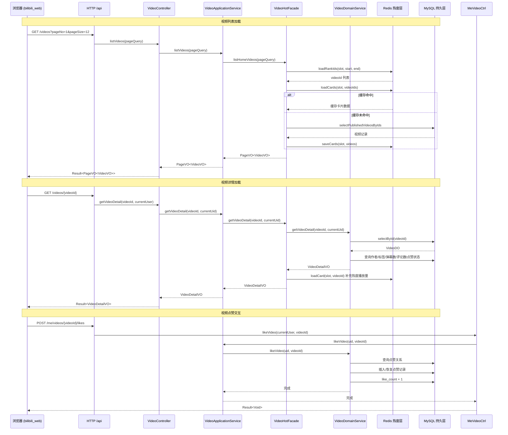
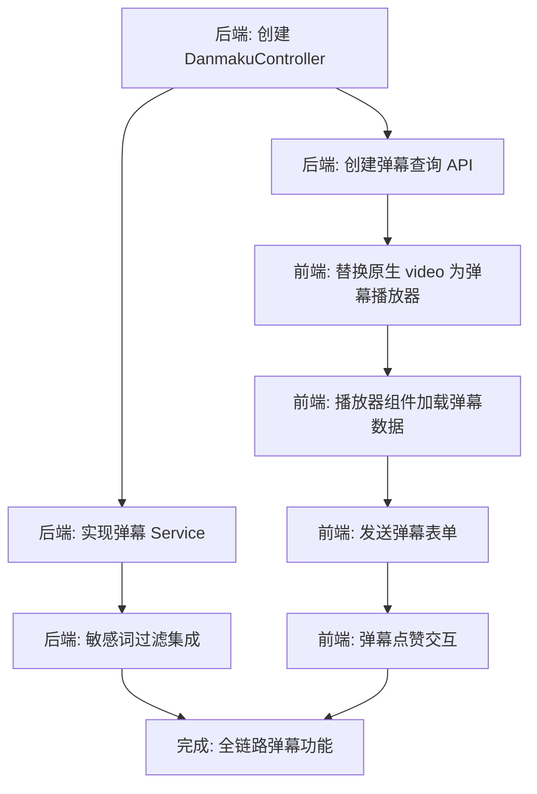

本文档聚焦于 bilibili 项目中**用户端的视频浏览体验与互动功能**，涵盖首页视频流加载、视频详情页播放、评论交互以及弹幕数据模型的当前状态。该模块是用户端最核心的交互场景，连接了前端 Vue 3 SPA 与后端 Spring Boot RESTful API 两个层面。

## 整体数据流架构

视频浏览与交互涉及**三层协作**：前端视图层负责 UI 渲染与用户事件捕获，后端应用服务层编排业务流程，领域服务层则完成数据持久化与一致性保障。以下架构图展示了从用户进入首页到完成一次评论交互的完整调用链路：

Sources: [VideoDetailView.vue](bilibili_web/src/views/VideoDetailView.vue#L25-L49), [VideoController.java](bilibili_SpringBoot/src/main/java/com/bilibili/video/controller/VideoController.java#L34-L52), [VideoApplicationServiceImpl.java](bilibili_SpringBoot/src/main/java/com/bilibili/video/service/application/impl/VideoApplicationServiceImpl.java#L36-L38), [VideoHotFacade.java](bilibili_SpringBoot/src/main/java/com/bilibili/video/service/hot/VideoHotFacade.java#L72-L80), [VideoDomainServiceImpl.java](bilibili_SpringBoot/src/main/java/com/bilibili/video/service/domain/impl/VideoDomainServiceImpl.java#L94-L125)

## 首页视频流与热榜

首页是用户进入系统后的第一个落脚点，采用**双栏布局**：左侧为精选视频展示区与最新视频网格，右侧为实时热榜。页面挂载时通过 `Promise.all` 并行发出两个请求——视频列表和排行榜，两者互不依赖，减少了总等待时间。

前端 `HomeView.vue` 通过 `api.get<PageVO<VideoVO>>('/videos', { pageNo: 1, pageSize: 12 })` 拉取视频列表，同时 `api.get<PageVO<VideoRankVO>>('/videos/rank', { pageNo: 1, pageSize: 8 })` 获取热榜数据。热榜展示为带序号的横向卡片列表，每个条目包含封面缩略图、标题、UP 主名和播放量。

**视频卡片组件 `VideoCard.vue`** 是列表渲染的基础单元，接受 `VideoVO | VideoRankVO` 作为 props。它负责展示封面图（16:10 宽高比）、时长角标、标题（最多两行截断）、作者名和播放量/发布时间元数据。当传入 `VideoRankVO` 时，还会额外渲染 TOP N 排名角标。卡片整体具有 hover 上浮动效，增强了浏览时的交互反馈。

后端的视频列表查询路径经过**热度系统优化**：`VideoApplicationServiceImpl.listHomeVideos` 委托给 `VideoHotFacade.listHomeVideos`，该门面首先从 Redis 获取当前活跃的热度 Slot，加载排序后的视频 ID 列表，再批量获取视频卡片缓存。当缓存缺失时，回源到 `VideoMapper.selectPublishedVideosByIds` 从 MySQL 获取并写入 Redis。这套**双 Slot 热度排行榜**架构在 [Redis Lua 脚本驱动的双 Slot 热度排行榜](24-redis-lua-jiao-ben-qu-dong-de-shuang-slot-re-du-pai-xing-bang) 中有深入解析。

Sources: [HomeView.vue](bilibili_web/src/views/HomeView.vue#L27-L43), [VideoCard.vue](bilibili_web/src/components/VideoCard.vue#L1-L32), [VideoHotFacade.java](bilibili_SpringBoot/src/main/java/com/bilibili/video/service/hot/VideoHotFacade.java#L47-L70)

## 视频详情页核心功能

视频详情页 (`VideoDetailView.vue`) 是整个视频交互的主战场，页面路由为 `/video/:id`。它采用**双栏网格布局**——主内容区包含播放器、视频信息面板和评论区，侧边栏展示作者卡片。在响应式层面，当视口宽度低于 1080px 时退化为单栏。

### 数据加载策略

页面通过 `watch(() => route.params.id, loadVideo, { immediate: true })` 监听路由参数变化并立即触发加载。`loadVideo` 函数的关键设计点包括：**并行请求**——视频详情与评论列表通过 `Promise.all` 同时发出；**播放量上报**——在详情成功返回后立即异步 `POST /videos/{videoId}/views`，使用 `.catch(() => undefined)` 静默处理失败，不影响用户浏览体验；**ID 校验**——在请求前用正则 `/^\d+$/` 验证参数合法性，避免无效网络请求。

后端 `getVideoDetail` 的数据组装过程位于 `VideoDomainServiceImpl` 第 94-125 行：首先从 `t_video` 表查询主记录，然后**聚合五项补充信息**——作者信息（`t_user_info`）、标签列表（`t_video_tag` JOIN `t_tag`）、弹幕数量（`t_danmaku` COUNT）、评论数量（优先使用 `video.commentCount` 冗余字段，否则 COUNT 查询）、以及当前用户的点赞/关注状态。热度门面层还会用 Redis 缓存中的实时播放量覆盖数据库中的陈旧值。

### 视频播放器

当前前端使用 HTML5 原生 `<video>` 标签作为播放器，配置了 `controls`（浏览器原生控件）、`playsinline`（移动端内联播放）属性。播放器宽高比锁定为 16:9，海报图使用 `detail.coverUrl`。这是一个**轻量实现**，后续可替换为自定义播放器（如 DPlayer、artplayer）以支持弹幕渲染层。

Sources: [VideoDetailView.vue](bilibili_web/src/views/VideoDetailView.vue#L23-L49), [VideoDomainServiceImpl.java](bilibili_SpringBoot/src/main/java/com/bilibili/video/service/domain/impl/VideoDomainServiceImpl.java#L94-L125)

## 用户交互功能：点赞与关注

视频详情页提供两个核心交互按钮——**点赞视频**和**关注作者**，两者都需要登录态校验。

点赞交互的前端实现在 `toggleVideoLike` 函数中（第 52-73 行）：它根据 `detail.value.isLiked` 状态决定调用 `POST` 还是 `DELETE /me/videos/{id}/likes`，并在请求成功后**乐观更新**本地状态和计数。后端 `VideoDomainServiceImpl.likeVideo`（第 137-178 行）采用了**软删除 + 恢复**模式——查询已有记录时，若状态为 DELETED 则将其恢复为 NORMAL，而非创建新记录，这避免了唯一约束冲突。对应的 SQL 使用条件更新 `UPDATE ... WHERE id = ? AND status = 1 SET status = 0` 确保并发安全。取消点赞时使用 `GREATEST(like_count - 1, 0)` 防止计数器下溢。

关注交互 (`toggleFollow`) 遵循类似模式，调用 `POST/DELETE /me/followings/{authorUid}`。后端通过 `FollowingMapper` 操作 `t_following` 表中的关注关系。

两个操作都通过 `actionLoading` 布尔值防止重复提交，在请求期间禁用按钮。

Sources: [VideoDetailView.vue](bilibili_web/src/views/VideoDetailView.vue#L52-L95), [MeVideoLikeController.java](bilibili_SpringBoot/src/main/java/com/bilibili/video/controller/MeVideoLikeController.java#L31-L47), [VideoDomainServiceImpl.java](bilibili_SpringBoot/src/main/java/com/bilibili/video/service/domain/impl/VideoDomainServiceImpl.java#L137-L205)

## 评论系统交互

评论区是视频详情页最复杂的交互区域，支持**发表评论、回复评论、点赞评论、删除评论**四项操作，并以**树形结构**展示一级评论及其子回复。

### 前端评论交互流

评论列表由独立的 `CommentList.vue` 组件渲染，它接收 `comments` 和 `currentUid` 两个 props，通过 `emit` 向父组件广播三个事件：`reply`（点击回复）、`toggleLike`（点赞/取消赞）、`delete`（删除自己的评论）。父组件 `VideoDetailView.vue` 维护 `replyTarget` 状态——当用户点击某条评论的"回复"按钮时，`replyTarget` 被设置为该评论对象，输入框标签随之变为"回复 {nickname}"，提交评论时将 `replyTarget.id` 作为 `parentId` 传递。

评论提交逻辑（`submitComment`，第 104-128 行）包含三层校验：登录态检查、内容非空检查、评论错误清空。成功后清空表单、重置回复目标、刷新评论列表并递增详情页的 `commentCount`。前端评论表单的 `parentId` 默认为 0（顶级评论），当存在 `replyTarget` 时使用其 ID。

### 后端评论 API 设计

评论的查询与写入由**两个控制器**分工：`CommentController` 负责公开查询（`GET /videos/{videoId}/comments`），`MeCommentController` 负责认证用户的写操作。后者的所有端点都标注了 `@PreAuthorize("isAuthenticated()")` 类级别约束，个别端点还有更细粒度的权限校验，如创建评论需要 `@accessAuthz.canComment`，删除评论需要 `@authz.canDeleteComment`（校验当前用户是否为评论作者）。

评论数据模型 `CommentVO` 包含 `childComments` 嵌套列表，后端返回时已组装好树形结构，前端无需额外处理层级关系。

Sources: [VideoDetailView.vue](bilibili_web/src/views/VideoDetailView.vue#L97-L163), [CommentList.vue](bilibili_web/src/components/CommentList.vue#L1-L77), [CommentController.java](bilibili_SpringBoot/src/main/java/com/bilibili/comment/controller/CommentController.java#L32-L39), [MeCommentController.java](bilibili_SpringBoot/src/main/java/com/bilibili/comment/controller/MeCommentController.java#L33-L67), [CommentService.java](bilibili_SpringBoot/src/main/java/com/bilibili/comment/service/CommentService.java#L9-L20)

## 弹幕数据模型：当前状态与扩展点

弹幕（Danmaku）系统在**数据层已建模完毕**，但 API 端点和前端渲染层尚未实现。以下梳理当前已有的基础设施和待建设部分。

### 已完成的数据层

数据库中存在两张弹幕相关表，定义在 `bilibili.sql` 第 71-99 行：

| 表名 | 字段 | 说明 |
|------|------|------|
| `t_danmaku` | `id` (BIGINT, snowflake) | 弹幕主键 |
| | `video_id` (BIGINT) | 所属视频 |
| | `user_id` (BIGINT) | 发送用户 |
| | `content` (TEXT) | 弹幕文本内容 |
| | `show_time` (BIGINT) | 在视频中的显示时间点（毫秒） |
| | `like_count` (BIGINT) | 弹幕点赞数 |
| | `status` (TINYINT) | 0=正常, 1=已删除 |
| `t_danmaku_like` | `id` (BIGINT, snowflake) | 点赞关系主键 |
| | `danmaku_id` (BIGINT) | 弹幕 ID |
| | `user_id` (BIGINT) | 点赞用户 |
| | `status` (TINYINT) | 0=正常, 1=已取消 |
| | UNIQUE KEY `uk_user_danmaku` | 用户-弹幕唯一约束 |

对应的 Java 实体类 `DanmakuDO` 和 `DanmakuLikeDO` 已就绪，MyBatis-Plus Mapper 接口 `DanmakuMapper` 和 `DanmakuLikeMapper` 继承了 `BaseMapper`，具备完整的 CRUD 能力。

弹幕计数已在视频详情聚合流程中启用：`VideoDomainServiceImpl.countDanmaku`（第 250-256 行）对 `t_danmaku` 按 `video_id` 和 `status = 0` 执行 COUNT 查询，结果写入 `VideoDetailVO.danmakuCount` 并返回给前端。

### 尚未实现的部分

| 待建设组件 | 说明 |
|-----------|------|
| **弹幕 Controller** | 缺少 `DanmakuController` / `MeDanmakuController`，无发送、查询、删除弹幕的 REST API |
| **弹幕 Service** | 无业务层处理弹幕的发送逻辑、敏感词过滤、权限校验 |
| **前端弹幕渲染层** | 当前 `<video>` 标签为纯原生播放器，未集成弹幕滚动渲染组件（如 DPlayer、Danmaku.js） |
| **弹幕查询 API 前端调用** | 前端 `types.ts` 中 `VideoDetailVO.danmakuCount` 已定义，但详情页未展示弹幕数，也无弹幕列表获取逻辑 |

### 扩展建议

若要完整实现弹幕功能，建议按以下路径推进：

弹幕 Service 应复用 IM 模块中已有的**敏感词过滤机制**（`SensitiveWordTrieService`，参见 [敏感词过滤与内容审核](22-min-gan-ci-guo-lu-yu-nei-rong-shen-he)），确保弹幕内容合规。弹幕查询 API 建议支持按 `video_id` 批量加载并按 `show_time` 排序，前端播放器可在视频加载完成后一次性拉取全部弹幕。

Sources: [bilibili.sql](bilibili_SpringBoot/src/main/resources/bilibili.sql#L71-L99), [DanmakuDO.java](bilibili_SpringBoot/src/main/java/com/bilibili/video/model/entity/DanmakuDO.java#L8-L30), [DanmakuLikeDO.java](bilibili_SpringBoot/src/main/java/com/bilibili/video/model/entity/DanmakuLikeDO.java#L8-L26), [DanmakuMapper.java](bilibili_SpringBoot/src/main/java/com/bilibili/video/mapper/DanmakuMapper.java#L1-L6), [VideoDomainServiceImpl.java](bilibili_SpringBoot/src/main/java/com/bilibili/video/service/domain/impl/VideoDomainServiceImpl.java#L250-L256), [types.ts](bilibili_web/src/types.ts#L65)

## API 端点汇总

以下表格汇总了视频浏览与交互模块当前已实现的所有 REST API：

| 方法 | 路径 | 说明 | 认证要求 | 控制器 |
|------|------|------|---------|--------|
| `GET` | `/videos` | 分页获取视频列表 | 否 | `VideoController` |
| `GET` | `/videos/rank` | 分页获取热榜排行 | 否 | `VideoController` |
| `GET` | `/videos/{videoId}` | 获取视频详情 | 可选（影响点赞/关注状态） | `VideoController` |
| `POST` | `/videos/{videoId}/views` | 上报播放量 | 否 | `VideoController` |
| `POST` | `/me/videos/{videoId}/likes` | 点赞视频 | 是（需 canLike 权限） | `MeVideoLikeController` |
| `DELETE` | `/me/videos/{videoId}/likes` | 取消点赞 | 是（需 canLike 权限） | `MeVideoLikeController` |
| `GET` | `/videos/{videoId}/comments` | 获取评论列表（树形） | 否 | `CommentController` |
| `POST` | `/me/videos/{videoId}/comments` | 发表评论 | 是（需 canComment 权限） | `MeCommentController` |
| `DELETE` | `/me/comments/{commentId}` | 删除评论 | 是（仅评论作者） | `MeCommentController` |
| `POST` | `/me/comments/{commentId}/likes` | 点赞评论 | 是（需 canLike 权限） | `MeCommentController` |
| `DELETE` | `/me/comments/{commentId}/likes` | 取消点赞评论 | 是（需 canLike 权限） | `MeCommentController` |

Sources: [VideoController.java](bilibili_SpringBoot/src/main/java/com/bilibili/video/controller/VideoController.java#L22-L60), [MeVideoLikeController.java](bilibili_SpringBoot/src/main/java/com/bilibili/video/controller/MeVideoLikeController.java#L22-L48), [CommentController.java](bilibili_SpringBoot/src/main/java/com/bilibili/comment/controller/CommentController.java#L23-L40), [MeCommentController.java](bilibili_SpringBoot/src/main/java/com/bilibili/comment/controller/MeCommentController.java#L24-L68)

## 关键设计模式与技术要点

### 乐观更新模式

前端点赞和关注交互均采用**乐观更新**策略——在 API 响应返回前即修改本地 UI 状态，请求失败时回滚。这种模式通过 `detail.value.isLiked = !detail.value.isLiked` 和对应计数器的增减实现，显著提升了用户感知的响应速度。

### 软删除与状态恢复

后端的点赞和关注关系表均使用 `status` 字段（0=正常, 1=已删除）实现逻辑删除，而非物理删除。取消操作将 status 设为 1，重新操作时恢复为 0。这种设计保留了历史行为记录，便于数据分析和审计。

### 热度系统与数据库的双层播放量

视频的播放量存在**两个数据源**：Redis 热度系统中的实时计数（高频更新，用于首页/排行展示）和 MySQL `t_video.view_count` 残余值（通过定时任务从 Redis 回写）。`VideoHotFacade.getVideoDetail` 会优先使用 Redis 中的实时播放量覆盖数据库值，确保用户看到的是最新数据。

### 视频类型定义与 BigInt 处理

前端 `types.ts` 中所有实体 ID 字段均为 `string` 类型，这是因为后端使用雪花算法生成的 `Long` 型 ID 超出了 JavaScript `Number.MAX_SAFE_INTEGER` 的范围。前端通过 `json-bigint` 库（配置为 `storeAsString: true`）在 `api.ts` 的 `transformResponse` 中将 JSON 中的大整数解析为字符串，避免精度丢失。