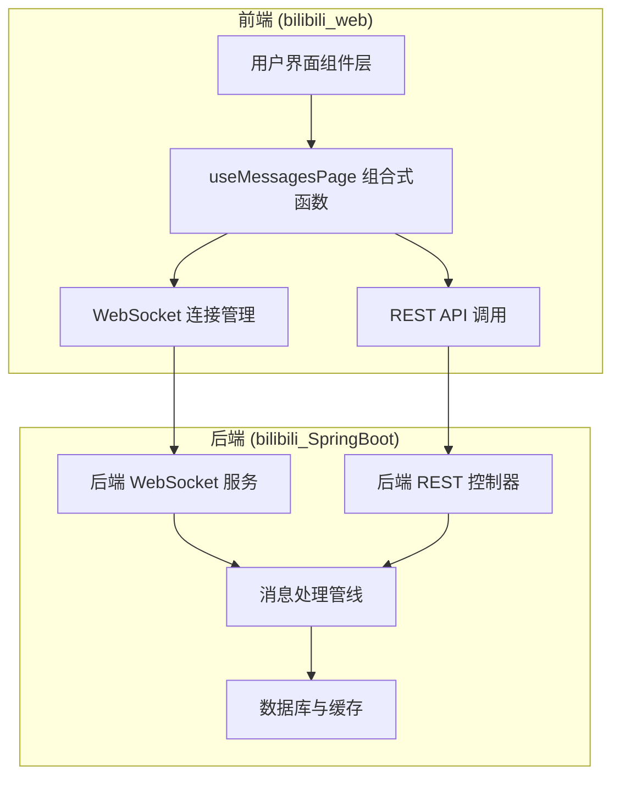
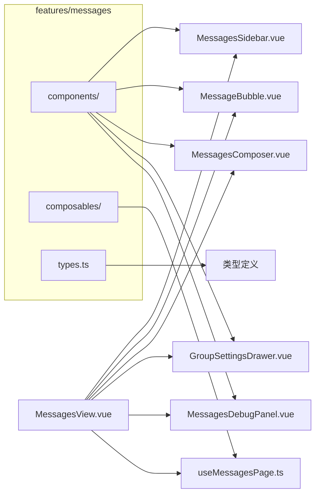
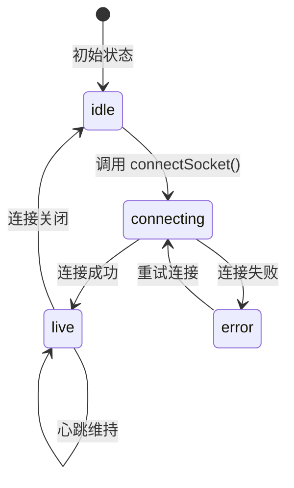
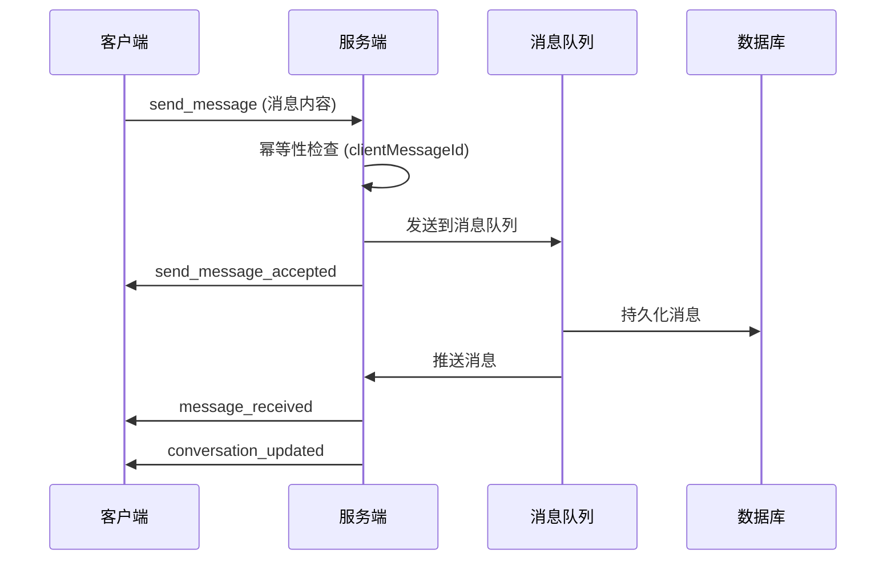
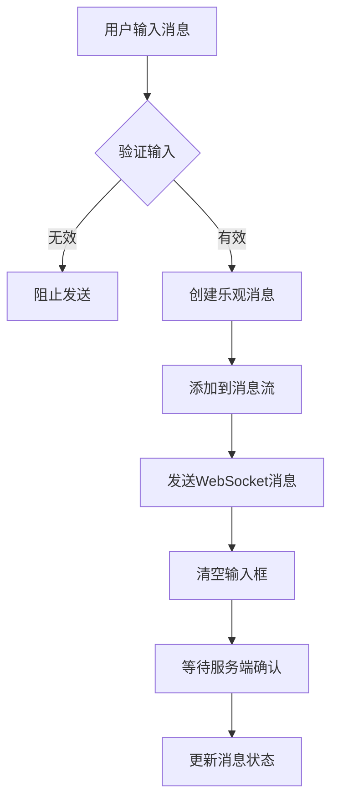
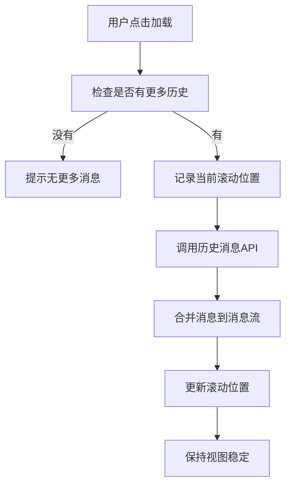
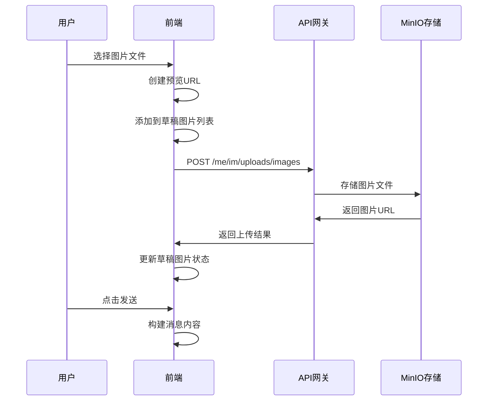

本文档深入解析用户端（bilibili_web）中即时通信系统的前端架构、核心组件与集成机制。该系统基于 Vue 3 Composition API 构建，通过 WebSocket 实现双向实时通信，支持私聊与群聊两种会话类型，具备消息收发、历史记录加载、图片上传、群组管理等完整功能。

## 整体架构与数据流

IM 前端采用分层架构设计，通过 `useMessagesPage` 组合式函数统一管理状态与业务逻辑，组件层仅负责 UI 渲染与用户交互。数据流遵循单向原则：用户操作触发组合函数中的方法，方法通过 WebSocket 或 REST API 与后端交互，返回结果更新响应式状态，Vue 的响应式系统自动将变化传播到组件。



Sources: [useMessagesPage.ts](bilibili_web/src/features/messages/composables/useMessagesPage.ts#L1-L100), [ImWebSocketHandler.java](bilibili_SpringBoot/src/main/java/com/bilibili/im/websocket/handler/ImWebSocketHandler.java#L1-L50)

## 核心组件结构

IM 功能的所有代码位于 `src/features/messages` 目录下，采用 Feature-based 组织方式，将相关组件、组合式函数和类型定义聚合在同一模块中。



**组件职责划分**：

| 组件 | 职责 | 关键特性 |
|------|------|----------|
| **MessagesView** | 主页面容器，协调所有子组件 | 组合所有子组件，管理全局布局 |
| **MessagesSidebar** | 会话列表侧边栏 | 显示私人/群组会话切换，连接状态指示 |
| **MessageBubble** | 单条消息展示 | 支持文本、图片、位置信息，区分发送/接收方向 |
| **MessagesComposer** | 消息输入与发送 | 文本输入、图片上传、发送状态管理 |
| **GroupSettingsDrawer** | 群组管理抽屉 | 群资料编辑、成员管理、群规则设置 |
| **MessagesDebugPanel** | 调试面板 | 显示事件日志、连接状态、实时消息流 |

Sources: [目录结构](bilibili_web/src/features/messages), [MessagesView.vue](bilibili_web/src/views/MessagesView.vue#L1-L50)

## WebSocket 连接管理

WebSocket 连接是 IM 系统的实时通信基础。前端在用户认证成功后自动建立连接，并通过心跳机制维持连接活性。

**连接生命周期**：



**连接建立流程**：

1. 前端构建 WebSocket URL：`${protocol}//${window.location.host}/ws/im?token=${JWT_TOKEN}`
2. 通过 `new WebSocket(url)` 建立连接
3. 后端 `ImWebSocketHandshakeInterceptor` 验证 JWT Token
4. 验证通过后，`ImWebSocketHandler` 注册连接到连接注册表
5. 启动心跳定时器（30秒间隔）

```typescript
// 核心连接逻辑
function connectSocket() {
  if (!currentToken.value) return
  
  const url = new URL(wsUrl.value)
  url.searchParams.set('token', currentToken.value)
  
  const ws = new WebSocket(url.toString())
  socket.value = ws
  
  ws.addEventListener('open', () => {
    connectionState.value = 'live'
    startHeartbeat()
  })
  
  ws.addEventListener('message', (event) => {
    handleSocketMessage(String(event.data || ''))
  })
}
```

**心跳机制**：

前端每 30 秒发送 `{"type": "heartbeat"}` 数据包，后端响应 `{"type": "heartbeat_ack"}`。如果心跳失败，连接状态会更新为错误状态，用户可手动重连。

Sources: [useMessagesPage.ts#L762-L826](bilibili_web/src/features/messages/composables/useMessagesPage.ts#L762-L826), [ImWebSocketHandshakeInterceptor.java](bilibili_SpringBoot/src/main/java/com/bilibili/im/websocket/interceptor/ImWebSocketHandshakeInterceptor.java#L38-L64)

## 消息协议与数据格式

IM 系统使用自定义 JSON 协议进行 WebSocket 通信，支持多种消息类型以满足不同业务场景。

**协议数据包结构**：

```typescript
type WsPacket<T = unknown> = {
  type?: string          // 消息类型
  code?: number          // 状态码
  message?: string       // 消息描述
  data?: T              // 业务数据
}
```

**支持的消息类型**：

| 消息类型 | 方向 | 描述 | 数据结构 |
|----------|------|------|----------|
| `heartbeat` | 客户端→服务端 | 心跳包 | 无数据 |
| `heartbeat_ack` | 服务端→客户端 | 心跳响应 | 无数据 |
| `send_message` | 客户端→服务端 | 发送消息 | SendMessageCommand |
| `send_message_accepted` | 服务端→客户端 | 消息已接受 | AcceptedPayload |
| `message_received` | 服务端→客户端 | 接收新消息 | MessagePushPayload |
| `conversation_updated` | 服务端→客户端 | 私人会话更新 | ConversationUpdatedPayload |
| `group_conversation_updated` | 服务端→客户端 | 群组会话更新 | GroupConversationUpdatedPayload |
| `error` | 服务端→客户端 | 错误通知 | 错误信息 |

**消息发送流程**：



**消息数据结构**：

```typescript
type MessagePushPayload = {
  conversationId?: string      // 会话ID
  senderId?: string | number   // 发送者ID
  receiverId?: string | number // 接收者ID
  serverMessageId?: string | number // 服务端消息ID
  clientMessageId?: string | number // 客户端消息ID
  senderLocation?: string      // 发送者位置
  messageType?: number         // 消息类型 (1=文本, 2=图片, 3=富文本)
  sendTime?: string            // 发送时间
  content?: MessageContent     // 消息内容
}
```

Sources: [types.ts](bilibili_web/src/features/messages/types.ts#L41-L51), [ImWebSocketMessageType.java](bilibili_SpringBoot/src/main/java/com/bilibili/im/websocket/model/enums/ImWebSocketMessageType.java#L8-L17)

## 会话管理与状态

IM 系统支持两种会话类型：私人会话和群组会话。每种会话类型有独立的管理逻辑和数据结构。

**会话状态管理**：

```mermaid
graph TB
    subgraph "状态存储"
        A[conversations] --> B[私人会话 Record<peerUid, ConversationItem>]
        C[groupWindows] --> D[群组会话 Record<groupId, GroupConversationWindowVO>]
        E[messagesByStream] --> F[消息流 Record<streamKey, MessageItem[]>]
        G[pendingMessages] --> H[待确认消息 Record<clientKey, MessageItem>]
    end
    
    I[useMessagesPage] --> A
    I --> C
    I --> E
    I --> G
```

**会话激活流程**：

当用户点击会话列表中的某个会话时，系统会执行以下操作：

1. **私人会话激活**：
   - 加载对方用户资料 (`loadPeerProfile`)
   - 确保历史消息已加载 (`ensureHistoryLoaded`)
   - 标记会话为已读 (`markConversationRead`)
   - 滚动到消息流底部

2. **群组会话激活**：
   - 加载群组资料 (`loadGroupProfile`)
   - 加载群组历史消息 (`ensureGroupHistoryLoaded`)
   - 加载群组成员列表 (`loadGroupMembers`)
   - 更新群组名称草稿

**会话窗口加载**：

系统启动时自动加载用户的会话窗口列表，包括私人会话和群组会话：

```typescript
async function loadConversationWindows() {
  const [singlePayload, groupPayload] = await Promise.all([
    api.get<ConversationWindowListVO>('/me/im/conversations'),
    api.get<GroupConversationWindowListVO>('/me/im/conversations/groups'),
  ])
  
  // 处理私人会话
  for (const record of singlePayload.records || []) {
    applyConversationWindow(record)
  }
  
  // 处理群组会话
  for (const record of groupPayload.records || []) {
    applyGroupConversationWindow(record)
  }
}
```

Sources: [useMessagesPage.ts#L273-L302](bilibili_web/src/features/messages/composables/useMessagesPage.ts#L273-L302), [useMessagesPage.ts#L613-L650](bilibili_web/src/features/messages/composables/useMessagesPage.ts#L613-L650)

## 消息发送与接收

消息发送采用乐观更新策略，先显示"发送中"状态，待服务端确认后更新为已发送状态。

**消息发送流程**：



**乐观更新机制**：

前端在用户发送消息时立即创建一条"待确认"消息，显示在消息流中，提供即时反馈：

```typescript
const optimistic: MessageItem = {
  id: '',
  serverMessageId: '',
  dedupeKey: `${currentUid.value}:${clientMessageId}`,
  direction: 'outgoing',
  senderId: currentUid.value,
  senderLocation: '',
  time: '发送中',
  epoch: Date.now(),
  text,
  imageUrls,
  pending: true,
  failed: false,
  failReason: '',
  peerUid: activeTargetType.value === 'group' ? currentUid.value : peerUid,
  clientKey,
}

mergeMessages(streamKey, [optimistic])
pendingMessages.value = {
  ...pendingMessages.value,
  [clientKey]: optimistic,
}
```

**消息接收处理**：

当收到 `message_received` 类型消息时，系统根据会话类型分别处理：

1. **私人消息处理**：
   - 加载发送者资料
   - 创建或更新会话记录
   - 更新未读计数（如果不在当前会话）

2. **群组消息处理**：
   - 加载群组资料和发送者资料
   - 更新群组会话窗口
   - 滚动到消息流底部（如果是当前会话）

**消息去重机制**：

使用 `dedupeKey` 字段确保消息不会重复显示。对于发送中的消息，使用 `clientMessageId` 作为唯一标识；对于已确认的消息，使用 `serverMessageId`。

Sources: [useMessagesPage.ts#L1004-L1090](bilibili_web/src/features/messages/composables/useMessagesPage.ts#L1004-L1090), [useMessagesPage.ts#L911-L978](bilibili_web/src/features/messages/composables/useMessagesPage.ts#L911-L978)

## 历史消息加载

IM 系统支持分页加载历史消息，采用"向上翻页"模式，即用户点击"加载更早消息"按钮时加载更旧的消息。

**历史消息加载策略**：



**API 端点**：

- **私人历史消息**：`GET /me/im/messages/history?peerUid={peerUid}&beforeServerMessageId={id}`
- **群组历史消息**：`GET /me/im/groups/{groupId}/messages/history?beforeServerMessageId={id}`

**分页参数**：

| 参数 | 类型 | 描述 |
|------|------|------|
| `peerUid` | string | 对方用户ID（私人会话） |
| `groupId` | string | 群组ID（群组会话） |
| `beforeServerMessageId` | string | 分页游标，加载此ID之前的消息 |

**滚动位置保持**：

加载历史消息后，系统会保持用户的视图位置，避免跳动：

```typescript
async function loadOlderMessages() {
  const stream = messageStream.value
  const previousHeight = stream?.scrollHeight || 0
  
  if (activeTargetType.value === 'group') {
    await loadGroupHistoryPage(activeGroupId.value, true)
  } else {
    await loadHistoryPage(activePeerUid.value, true)
  }
  
  await nextTick()
  if (stream) {
    const nextHeight = stream.scrollHeight
    stream.scrollTop = nextHeight - previousHeight
  }
}
```

**历史消息状态管理**：

每种会话类型都有独立的历史消息状态：

```typescript
// 私人会话历史状态
type ConversationItem = {
  hasMoreHistory: boolean
  nextBeforeServerMessageId: string
  historyLoaded: boolean
}

// 群组会话历史状态
type GroupHistoryState = {
  hasMoreHistory: boolean
  nextBeforeServerMessageId: string
  historyLoaded: boolean
}
```

Sources: [useMessagesPage.ts#L652-L742](bilibili_web/src/features/messages/composables/useMessagesPage.ts#L652-L742), [ImMessageController.java](bilibili_SpringBoot/src/main/java/com/bilibili/im/message/controller/ImMessageController.java#L58-L69)

## 图片上传与消息类型

IM 系统支持发送文本、图片和富文本消息，图片上传采用预览-上传-发送的三步流程。

**图片上传流程**：



**消息类型枚举**：

| 类型值 | 常量 | 描述 |
|--------|------|------|
| 1 | MESSAGE_TYPE_TEXT | 纯文本消息 |
| 2 | MESSAGE_TYPE_IMAGE | 图片消息 |
| 3 | MESSAGE_TYPE_RICH | 富文本消息（文本+图片） |

**草稿图片状态管理**：

```typescript
type DraftImageItem = {
  localId: string        // 本地标识符
  previewUrl: string     // 预览URL（Object URL）
  uploadedUrl: string    // 上传后的URL
  uploading: boolean     // 是否正在上传
  error: string          // 错误信息
}
```

**消息类型解析**：

系统根据消息内容自动判断消息类型：

```typescript
function resolveMessageType(text: string, imageUrls: string[]): number {
  if (text && imageUrls.length) return MESSAGE_TYPE_RICH
  if (imageUrls.length) return MESSAGE_TYPE_IMAGE
  return MESSAGE_TYPE_TEXT
}
```

**发送状态验证**：

在发送前验证所有图片是否已上传完成：

```typescript
const canSend = computed(() => {
  const targetAvailable = (activeTargetType.value === 'single' && !!activePeerUid.value) ||
    (activeTargetType.value === 'group' && !!activeGroupId.value)
  if (!targetAvailable) return false
  if (hasUploadingImages.value) return false
  return !!messageDraft.value.trim() || draftImages.value.some((item) => !!item.uploadedUrl)
})
```

Sources: [useMessagesPage.ts#L1027-L1087](bilibili_web/src/features/messages/composables/useMessagesPage.ts#L1027-L1087), [MeImImageUploadController.java](bilibili_SpringBoot/src/main/java/com/bilibili/im/upload/controller/MeImImageUploadController.java#L28-L34)

## 群组管理功能

IM 系统提供完整的群组管理功能，包括群资料编辑、成员管理和群规则设置。

**群组设置抽屉**：

群组设置通过抽屉组件实现，包含三个标签页：

| 标签页 | 功能 | 权限要求 |
|--------|------|----------|
| 群资料 | 编辑群名称、群头像 | 群主、管理员 |
| 成员管理 | 邀请成员、设置角色、禁言、移出 | 群主、管理员 |
| 群管理 | 全员禁言、群规则 | 群主、管理员 |

**群组权限模型**：

```typescript
const activeGroupRole = computed(() => {
  if (String(activeGroupProfile.value?.ownerUserId || '') === currentUid.value) {
    return 1 // 群主
  }
  const membership = activeGroupMembers.value.find(
    (member) => String(member.userId || '') === currentUid.value,
  )
  return Number(membership?.role || 0) // 0=普通成员, 2=管理员, 3=普通成员
})

const canManageActiveGroup = computed(() => activeGroupRole.value === 1 || activeGroupRole.value === 2)
```

**群组管理 API**：

| 操作 | API 端点 | 方法 | 描述 |
|------|----------|------|------|
| 获取群资料 | `/me/im/groups/{groupId}` | GET | 获取群组详细信息 |
| 修改群名称 | `/me/im/groups/{groupId}/name` | PUT | 更新群组名称 |
| 上传群头像 | `/me/im/groups/{groupId}/avatar` | PUT | 更新群组头像 |
| 获取群成员 | `/me/im/groups/{groupId}/members` | GET | 获取成员列表 |
| 邀请成员 | `/me/im/groups/{groupId}/members` | POST | 邀请新成员 |
| 移出成员 | `/me/im/groups/{groupId}/members/{userId}` | DELETE | 移出指定成员 |
| 设置成员角色 | `/me/im/groups/{groupId}/members/{userId}/role` | PUT | 更新成员角色 |
| 设置成员禁言 | `/me/im/groups/{groupId}/members/{userId}/mute` | PUT | 设置成员禁言状态 |
| 设置全员禁言 | `/me/im/groups/{groupId}/mute` | PUT | 设置全员禁言状态 |

**群组设置抽屉组件**：

群组设置抽屉 (`GroupSettingsDrawer.vue`) 包含以下功能模块：

1. **群资料编辑**：
   - 群名称输入框
   - 群头像上传
   - 保存状态显示

2. **成员管理**：
   - 成员列表展示
   - 邀请成员输入框
   - 成员角色显示与修改
   - 成员禁言设置
   - 移出成员按钮

3. **群管理**：
   - 全员禁言开关
   - 群规则编辑（预留）

Sources: [useMessagesPage.ts#L363-L595](bilibili_web/src/features/messages/composables/useMessagesPage.ts#L363-L595), [GroupSettingsDrawer.vue](bilibili_web/src/features/messages/components/GroupSettingsDrawer.vue#L1-L100)

## 错误处理与用户体验

IM 系统实现了多层次的错误处理机制，确保用户在异常情况下仍能获得良好的体验。

**错误类型分类**：

| 错误类型 | 处理方式 | 用户提示 |
|----------|----------|----------|
| 网络连接错误 | 自动重试，显示连接状态 | "连接异常" |
| 消息发送失败 | 标记消息为失败状态 | "发送失败" + 错误原因 |
| 图片上传失败 | 显示上传错误，允许重试 | "有图片上传失败" |
| API 请求失败 | 捕获异常，显示错误信息 | 具体错误描述 |
| WebSocket 错误 | 更新连接状态，提供重连按钮 | "连接异常" |

**消息状态指示**：

消息气泡通过视觉样式反映发送状态：

```css
.message-bubble.pending {
  opacity: 0.72;  /* 发送中：半透明 */
}

.message-bubble.failed {
  opacity: 1;
  border-color: rgba(239, 68, 68, 0.35);  /* 失败：红色边框 */
  background: rgba(239, 68, 68, 0.06);    /* 失败：红色背景 */
}
```

**事件日志系统**：

调试面板 (`MessagesDebugPanel.vue`) 记录所有 WebSocket 事件和系统状态，便于开发调试：

```typescript
type EventLogItem = {
  type: string    // 事件类型 (ws, error, ui, raw)
  body: string    // 事件内容
  time: string    // 发生时间
}
```

**连接状态管理**：

```typescript
const connectionLabel = computed(() => {
  if (connectionState.value === 'live') return '已连接'
  if (connectionState.value === 'connecting') return '连接中'
  if (connectionState.value === 'error') return '连接异常'
  return '未连接'
})
```

Sources: [useMessagesPage.ts#L828-L888](bilibili_web/src/features/messages/composables/useMessagesPage.ts#L828-L888), [MessageBubble.vue](bilibili_web/src/features/messages/components/MessageBubble.vue#L55-L69)

## 性能优化策略

IM 系统采用多种性能优化策略，确保在大量消息和用户场景下仍能保持流畅体验。

**1. 虚拟滚动（规划中）**：

对于大量历史消息，计划实现虚拟滚动，只渲染可视区域内的消息。

**2. 消息分页加载**：

历史消息采用分页加载，避免一次性加载过多数据：

- 初始加载最近 50 条消息
- 每次向上翻页加载 50 条
- 使用 `beforeServerMessageId` 作为分页游标

**3. 状态更新优化**：

使用 Vue 3 的响应式系统，确保只有相关组件更新：

```typescript
// 使用 computed 属性派生状态
const activeMessages = computed(() => {
  if (!activeStreamKey.value) return []
  return messagesByStream.value[activeStreamKey.value] || []
})
```

**4. 防抖与节流**：

- 消息发送防抖：避免快速连续发送
- 滚动事件节流：优化滚动性能
- 心跳间隔：30秒一次，避免频繁通信

**5. 内存管理**：

```typescript
// 组件卸载时清理资源
onBeforeUnmount(() => {
  disconnectSocket()
  revokeDraftPreviews() // 释放 Object URL
})
```

**6. 图片上传优化**：

- 支持多图片同时上传
- 上传前压缩（预留）
- 上传失败自动重试（预留）

**7. 连接状态优化**：

- 自动重连机制（规划中）
- 连接状态缓存
- 离线消息队列（规划中）

Sources: [useMessagesPage.ts#L268-L271](bilibili_web/src/features/messages/composables/useMessagesPage.ts#L268-L271), [useMessagesPage.ts#L105-L128](bilibili_web/src/features/messages/composables/useMessagesPage.ts#L105-L128)

## 集成指南与最佳实践

### 前端集成步骤

1. **路由配置**：
   ```typescript
   {
     path: '/messages',
     name: 'messages',
     component: () => import('./views/MessagesView.vue'),
     meta: { requiresAuth: true },
   }
   ```

2. **认证状态**：
   确保用户已登录，JWT Token 存储在 `localStorage` 中。

3. **组件使用**：
   ```vue
   <script setup>
   import { useMessagesPage } from '@/features/messages/composables/useMessagesPage'
   
   const {
     activeMessages,
     sendMessage,
     connectSocket,
     // ... 其他状态和方法
   } = useMessagesPage()
   </script>
   ```

### 后端配置要求

1. **WebSocket 端点**：
   ```yaml
   app:
     im:
       websocket:
         enabled: true
         path: /ws/im
         allowed-origins: "*"
   ```

2. **依赖服务**：
   - RabbitMQ：消息队列
   - Redis：会话缓存、幂等性检查
   - MySQL：消息持久化
   - MinIO：图片存储

### 开发调试建议

1. **调试面板**：
   启用 `MessagesDebugPanel` 查看实时事件日志。

2. **网络监控**：
   使用浏览器开发者工具监控 WebSocket 消息。

3. **错误追踪**：
   关注控制台错误和事件日志中的错误类型。

4. **性能分析**：
   使用 Vue Devtools 分析组件渲染性能。

## 相关页面链接

- **前端相关**：
  - [用户端路由与页面体系](4-yong-hu-duan-lu-you-yu-ye-mian-ti-xi) - 了解整体路由结构
  - [视频浏览与弹幕交互](5-shi-pin-liu-lan-yu-dan-mu-jiao-hu) - 其他实时功能参考

- **后端相关**：
  - [IM 领域模型与应用层编排](16-im-ling-yu-mo-xing-yu-ying-yong-ceng-bian-pai) - 后端架构详解
  - [WebSocket 连接管理与自定义协议](17-websocket-lian-jie-guan-li-yu-zi-ding-yi-xie-yi) - WebSocket 实现细节
  - [RabbitMQ 消息队列与消费者设计](18-rabbitmq-xiao-xi-dui-lie-yu-xiao-fei-zhe-she-ji) - 消息队列架构

- **运维相关**：
  - [Docker Compose 多服务编排](25-docker-compose-duo-fu-wu-bian-pai) - 部署配置
  - [Prometheus + Grafana 监控栈搭建](27-prometheus-grafana-jian-kong-zhan-da-jian) - 监控方案