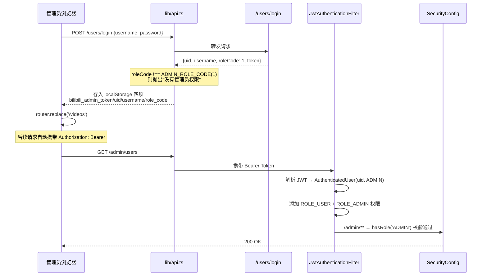
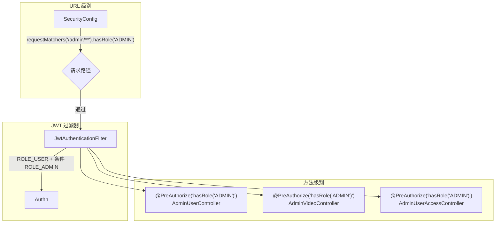
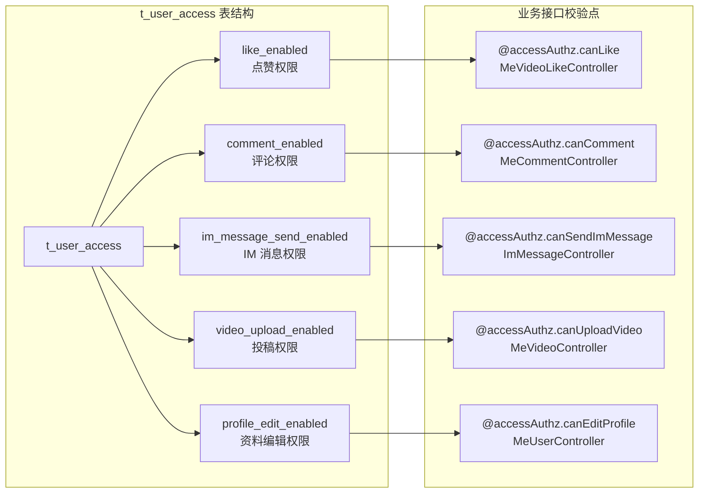
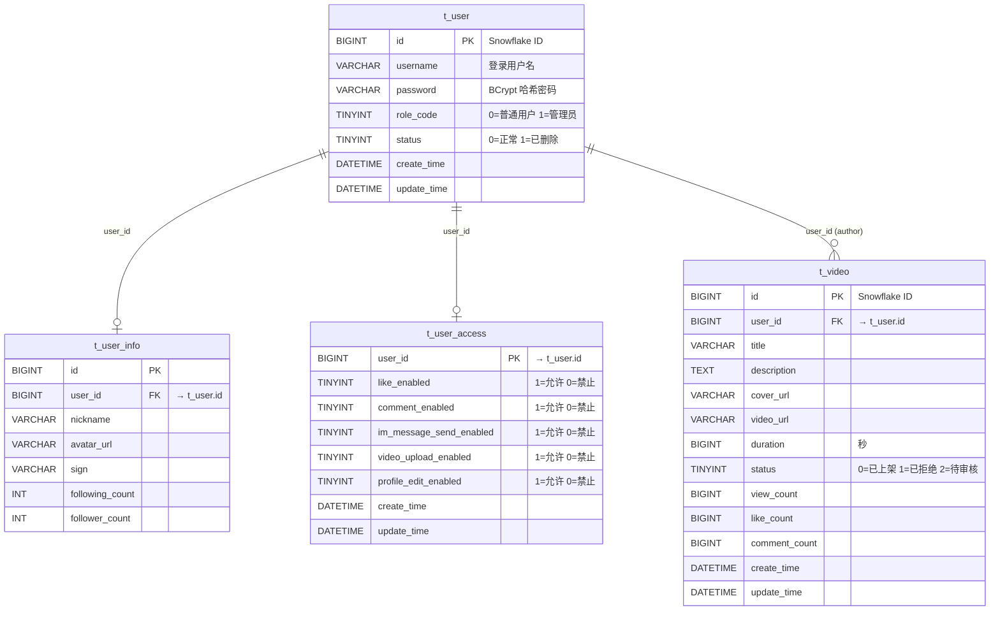
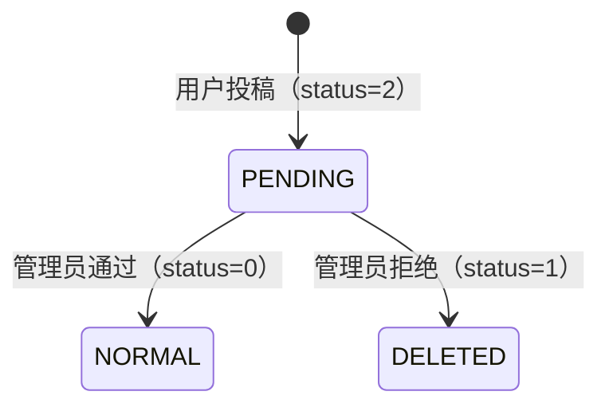

管理端（bilibili_admin_web）是平台的后台管理界面，提供**视频审核**和**用户管理**两大核心功能。它与后端 Spring Boot 服务通过 REST API 通信，依托 **JWT 认证 + 角色编码** 双层机制保障访问安全——前端路由守卫拦截未登录用户，后端 Spring Security 在 URL 级别和方法级别双重校验管理员权限。

## 整体架构与技术栈

管理端采用 **Vue 3 + TypeScript + Vite** 技术栈，运行时通过 Axios 与后端通信。整个管理端仅包含三个页面视图——登录页、视频管理页、用户管理页——通过一个统一的 `AdminShell` 布局组件实现侧边栏导航与内容区域分离。

```mermaid
graph TB
    subgraph "bilibili_admin_web（前端）"
        Login[AdminLoginView<br/>登录页]
        Shell[AdminShell<br/>侧栏布局]
        Videos[AdminVideosView<br/>视频审核]
        Users[AdminUsersView<br/>用户管理]
        Auth[lib/auth.ts<br/>认证状态管理]
        API[lib/api.ts<br/>Axios HTTP 客户端]
    end

    subgraph "bilibili_SpringBoot（后端）"
        SecF[JwtAuthenticationFilter<br/>JWT 认证过滤器]
        SecC[SecurityConfig<br/>安全配置]
        AVC[AdminVideoController]
        AUC[AdminUserController]
        AUAC[AdminUserAccessController]
        AVS[AdminVideoService]
        AUS[AdminUserService]
        AUAS[AdminUserAccessService]
        DB[(MySQL<br/>t_user / t_user_access / t_video)]
        Cache[(Redis / Spring Cache<br/>user:access-snapshot)]
    end

    Login -->|POST /users/login| API
    API -->|Bearer Token| SecF
    SecF --> SecC
    Shell --> Videos
    Shell --> Users
    Videos -->|/admin/videos/*| AVC
    Users -->|/admin/users| AUC
    Users -->|/admin/users/{id}/video-business-ban| AUAC
    AVC --> AVS --> DB
    AUC --> AUS --> DB
    AUAC --> AUAS --> AUAS
    AUAS -->|CacheEvict| Cache
    AUAS --> DB
```

**前端目录结构精简如表所示：**

| 路径 | 职责 |
|------|------|
| `src/router.ts` | 路由定义与 `beforeEach` 管理员守卫 |
| `src/lib/auth.ts` | `authState` 响应式状态、`loginAsAdmin()`、`logout()`、`isAdmin()` |
| `src/lib/api.ts` | Axios 实例、请求拦截器（自动注入 `Authorization: Bearer`）、401/403 响应拦截器 |
| `src/components/AdminShell.vue` | 侧边栏 + 主内容区布局壳 |
| `src/views/AdminLoginView.vue` | 管理员登录表单 |
| `src/views/AdminVideosView.vue` | 视频审核——待审核/已通过/已拒绝三标签页 |
| `src/views/AdminUsersView.vue` | 用户列表查询与视频业务封禁/解禁 |
| `src/types.ts` | 共享类型定义：`ADMIN_ROLE_CODE`、`AdminVideoVO`、`AdminUserVO` 等 |

Sources: [router.ts](bilibili_admin_web/src/router.ts#L1-L54), [auth.ts](bilibili_admin_web/src/lib/auth.ts#L1-L82), [api.ts](bilibili_admin_web/src/lib/api.ts#L1-L94)

## 认证流程与角色模型

系统的角色模型定义在后端枚举 `UserRole` 中，只有两种角色：**USER(0)** 和 **ADMIN(1)**。角色编码持久化在 `t_user.role_code` 列中，登录时随 JWT Token 一并返回给前端。



**前端 `loginAsAdmin()` 的关键逻辑**是：调用 `/users/login` 接口获取登录凭证后，首先校验返回的 `roleCode` 是否等于 `ADMIN_ROLE_CODE`（值为 1）。如果不匹配，直接抛出"你没有管理员权限"错误，不会存储任何凭证。通过校验后，`authState` 响应式对象与 `localStorage` 同步更新，保存以下四项数据：

| 存储键 | 内容 |
|--------|------|
| `bilibili_admin_token` | JWT Token，后续每个请求的 `Authorization` 头 |
| `bilibili_admin_uid` | 管理员用户 ID |
| `bilibili_admin_username` | 管理员用户名 |
| `bilibili_admin_role_code` | 角色编码（固定为 1） |

前端路由守卫在 `router.beforeEach` 中执行双重检查：对 `meta.requiresAdmin` 为 true 的路由，验证 `authState.token` 非空且 `isAdmin()` 返回 true；已登录管理员访问 `/login` 路径时自动重定向到 `/videos`。

Sources: [UserRole.java](bilibili_SpringBoot/src/main/java/com/bilibili/common/enums/UserRole.java#L1-L42), [auth.ts](bilibili_admin_web/src/lib/auth.ts#L56-L82), [router.ts](bilibili_admin_web/src/router.ts#L30-L53)

## 后端安全防护体系

后端采用 **URL 级别 + 方法级别** 的双重权限校验策略。`SecurityConfig` 中配置 `/admin/**` 路径下所有请求必须具备 `ROLE_ADMIN` 角色，三个管理控制器上又各自标注了 `@PreAuthorize("hasRole('ADMIN')")` 注解，形成纵深防御。



**`JwtAuthenticationFilter` 的处理流程**是：从请求头解析 Bearer Token → 通过 `AuthenticatedUserResolver` 还原 `AuthenticatedUser(uid, role)` → 调用 `resolveAuthorities()` 生成权限列表。权限列表始终包含 `ROLE_USER`，当且仅当 `role` 为 `ADMIN` 时额外添加 `ROLE_ADMIN`。若 Token 解析失败，清除 SecurityContext，后续的 `@PreAuthorize` 校验自然不通过。

认证失败时（无 Token 或 Token 过期），由 `RestAuthenticationEntryPoint` 返回 401 响应；权限不足时（非管理员访问管理接口），由 `RestAccessDeniedHandler` 返回 403 响应。前端 Axios 响应拦截器捕获 401/403 后自动清除本地存储并重定向到登录页。

Sources: [SecurityConfig.java](bilibili_SpringBoot/src/main/java/com/bilibili/config/security/SecurityConfig.java#L68-L109), [JwtAuthenticationFilter.java](bilibili_SpringBoot/src/main/java/com/bilibili/security/JwtAuthenticationFilter.java#L42-L78), [api.ts](bilibili_admin_web/src/lib/api.ts#L54-L94)

## 视频审核功能

视频审核是管理端的默认首页功能，管理员可以查看**待审核**、**已通过**和**已拒绝**三个分类下的视频，并对待审核视频执行通过或拒绝操作。后端使用 `RecordStatus` 枚举管理视频状态——NORMAL(0) 表示已上架、DELETED(1) 表示已拒绝、PENDING(2) 表示待审核。

| 标签页 | 前端 TabKey | 后端 API 端点 | 对应状态 |
|--------|-------------|---------------|----------|
| 待审核 | `pending` | `GET /admin/videos/pending` | `RecordStatus.PENDING` (2) |
| 已通过 | `published` | `GET /admin/videos/published` | `RecordStatus.NORMAL` (0) |
| 已拒绝 | `deleted` | `GET /admin/videos/deleted` | `RecordStatus.DELETED` (1) |

三个列表端点均使用**游标分页**（Cursor-based Pagination）——请求时传入上一页最后一条记录的 `id` 作为 `cursor`，后端查询 `WHERE id < cursor ORDER BY id DESC LIMIT 21`，取前 20 条返回，若第 21 条存在则标记 `hasMore = true` 并附带 `nextCursor`。

**审核操作**通过 `PUT /admin/videos/{videoId}/status` 执行，请求体包含目标状态 `status`（0 为通过即设为 NORMAL，1 为拒绝即设为 DELETED）。后端 `AdminVideoService.reviewVideo()` 会先校验视频存在且当前处于 PENDING 状态，再执行 `UPDATE t_video SET status = #{newStatus} WHERE id = #{videoId} AND status = #{oldStatus}` 的乐观更新，避免重复审核。

前端 `AdminVideosView.vue` 采用左侧列表 + 右侧审核抽屉的双栏布局。点击列表中的"查看审核"按钮，右侧面板展示视频封面、标题、投稿人、时长和简介等详情，以及通过/拒绝操作按钮。审核完成后自动刷新列表。

Sources: [AdminVideoController.java](bilibili_SpringBoot/src/main/java/com/bilibili/admin/controller/AdminVideoController.java#L1-L60), [AdminVideoServiceImpl.java](bilibili_SpringBoot/src/main/java/com/bilibili/admin/service/impl/AdminVideoServiceImpl.java#L1-L74), [AdminVideosView.vue](bilibili_admin_web/src/views/AdminVideosView.vue#L1-L204)

## 用户管理功能

用户管理页提供对平台所有用户的**查询**和**视频业务封禁/解禁**能力。后端由两个控制器协作：`AdminUserController` 负责用户列表查询，`AdminUserAccessController` 负责权限操作。

**用户查询接口** `GET /admin/users` 支持分页参数（`pageNo`、`pageSize`）和关键词搜索（`keyword`）。查询逻辑跨三张表 JOIN——`t_user`（账号基础信息）、`t_user_info`（昵称头像等）、`t_user_access`（功能权限开关）。关键词同时匹配用户名（模糊匹配）和用户 ID（精确匹配）。权限字段的默认值处理采用 `IFNULL(ua.xxx_enabled, 1)`，即未在 `t_user_access` 表中录入记录的用户默认拥有所有权限。

**视频业务封禁**（`POST /admin/users/{userId}/video-business-ban`）通过 `AdminUserAccessMapper.upsertVideoBusinessBanned()` 将用户的 `like_enabled`、`comment_enabled`、`video_upload_enabled` 三个字段同时置为 0。对应的解禁操作（`DELETE /admin/users/{userId}/video-business-ban`）将这三个字段恢复为 1。两次操作均使用 `INSERT ... ON DUPLICATE KEY UPDATE` 的 upsert 模式，确保无论用户是否已有 access 记录都能正确处理。

前端 `AdminUserVO` 中的 `videoBusinessBanned` 字段并非数据库直接存储，而是通过 SQL 计算得出：

```sql
CASE
    WHEN IFNULL(ua.like_enabled, 1) = 1
     AND IFNULL(ua.comment_enabled, 1) = 1
     AND IFNULL(ua.video_upload_enabled, 1) = 1
    THEN FALSE
    ELSE TRUE
END AS videoBusinessBanned
```

这意味着只要点赞、评论、投稿三个权限中任意一个被禁用，该用户即被视为"已封禁"状态。每次权限变更后，Spring Cache 中 `user:access-snapshot` 缓存会被立即驱逐（`@CacheEvict`），确保后续业务接口（如点赞、评论、上传）能及时读取最新权限状态。

**用户列表中展示的关键信息：**

| 字段 | 含义 |
|------|------|
| `roleCode` | 角色编码：0 = 普通用户，1 = 管理员 |
| `status` | 账号状态：0 = 正常，1 = 已停用 |
| `likeEnabled` / `commentEnabled` / `videoUploadEnabled` | 细粒度权限开关（true/false） |
| `imMessageSendEnabled` | IM 消息发送权限 |
| `profileEditEnabled` | 个人资料编辑权限 |
| `videoBusinessBanned` | 视频业务综合封禁状态（计算字段） |

Sources: [AdminUserController.java](bilibili_SpringBoot/src/main/java/com/bilibili/admin/controller/AdminUserController.java#L1-L35), [AdminUserAccessController.java](bilibili_SpringBoot/src/main/java/com/bilibili/admin/controller/AdminUserAccessController.java#L1-L58), [AdminUserAccessServiceImpl.java](bilibili_SpringBoot/src/main/java/com/bilibili/admin/service/impl/AdminUserAccessServiceImpl.java#L1-L68), [AdminUserMapper.xml](bilibili_SpringBoot/src/main/resources/mapper/AdminUserMapper.xml#L1-L53)

## 用户访问权限模型

除管理员的主动封禁操作外，系统在全局业务层也通过 `t_user_access` 表实现了**细粒度的功能权限控制**。这个机制独立于管理端操作，影响所有普通用户的日常使用。`access` 子系统提供五项独立的权限开关，业务控制器通过 `@PreAuthorize("@accessAuthz.canXxx(authentication)")` 在方法级别逐一校验。



`AccessAuthzService` 作为 Spring Bean（名称 `accessAuthz`）注册在容器中，各业务控制器通过 SpEL 表达式 `@accessAuthz.canLike(authentication)` 调用它。该服务从 `UserAccessService` 获取 `UserAccessState`，而底层数据经由 `SpringUserAccessSnapshotCache` 缓存（缓存键：`user:access-snapshot::#{userId}`），避免每次请求都查库。当管理员执行封禁/解禁或 IM 消息限制操作时，`@CacheEvict` 注解确保缓存被即时清除。

**权限默认值策略：** `t_user_access` 表中未录入记录的用户，所有权限默认为"开启"（`IFNULL(xxx_enabled, 1)`）。`UserAccessSnapshot.defaults(userId)` 方法在缓存未命中时返回全部为 `true` 的默认快照，与 SQL 层的默认值逻辑一致。

Sources: [AccessAuthzService.java](bilibili_SpringBoot/src/main/java/com/bilibili/access/authorization/AccessAuthzService.java#L1-L53), [UserAccessServiceImpl.java](bilibili_SpringBoot/src/main/java/com/bilibili/access/service/impl/UserAccessServiceImpl.java#L1-L100), [UserAccessSnapshot.java](bilibili_SpringBoot/src/main/java/com/bilibili/access/model/cache/UserAccessSnapshot.java#L1-L20), [V7__create_user_access_table.sql](bilibili_SpringBoot/src/main/resources/db/migration/V7__create_user_access_table.sql#L1-L12)

## 数据模型与数据库设计

管理端涉及的核心数据模型如下图所示。角色编码通过 Flyway 迁移 `V18` 添加到 `t_user` 表，而用户功能权限通过独立的 `t_user_access` 表管理（一对一关系，`user_id` 为主键）。



**视频状态流转逻辑：**



管理员对视频的审核操作本质上是一次带条件的状态更新（`WHERE status = 2`），只有处于 PENDING 状态的视频才能被审核，防止对已审核视频的误操作。

Sources: [V7__create_user_access_table.sql](bilibili_SpringBoot/src/main/resources/db/migration/V7__create_user_access_table.sql#L1-L12), [V18__add_role_code_to_user.sql](bilibili_SpringBoot/src/main/resources/db/migration/V18__add_role_code_to_user.sql#L1-L4), [bilibili.sql](bilibili_SpringBoot/src/main/resources/bilibili.sql#L4-L69)

## 前端状态管理与错误处理

管理端不使用 Pinia 或 Vuex 等全局状态管理库，而是通过 `auth.ts` 中的 `reactive` 对象 `authState` 管理认证状态，再配合各视图组件的本地 `ref` 管理页面级状态（加载中、错误信息、分页参数等）。

**API 通信的错误处理链路：**

| 层级 | 处理逻辑 |
|------|----------|
| Axios 请求拦截器 | 自动注入 `Authorization: Bearer {token}` 到请求头 |
| Axios 响应拦截器 | `code === 0` 时返回 `data`；非零 code 抛出 `Error(message)`；401/403 清除本地存储并跳转 `/login` |
| 视图组件 `catch` | 捕获错误并赋值给 `errorMessage` 响应式变量，模板中显示红色错误提示 |
| JSON 解析 | 使用 `json-bigint` 处理 Snowflake ID 等大整数，避免 JavaScript 精度丢失（`storeAsString: true`） |

Sources: [api.ts](bilibili_admin_web/src/lib/api.ts#L1-L94), [AdminVideosView.vue](bilibili_admin_web/src/views/AdminVideosView.vue#L64-L85), [AdminUsersView.vue](bilibili_admin_web/src/views/AdminUsersView.vue#L36-L65)

## 管理端 API 速查表

下表汇总管理端前端调用的所有后端接口：

| HTTP 方法 | 路径 | 功能 | 请求参数 | 返回类型 |
|-----------|------|------|----------|----------|
| POST | `/users/login` | 管理员登录 | `{username, password}` | `UserLoginVO` |
| GET | `/admin/videos/pending` | 待审核视频列表 | `cursor?` | `CursorPageVO<AdminPendingVideoVO>` |
| GET | `/admin/videos/published` | 已上架视频列表 | `cursor?` | `CursorPageVO<AdminPendingVideoVO>` |
| GET | `/admin/videos/deleted` | 已拒绝视频列表 | `cursor?` | `CursorPageVO<AdminPendingVideoVO>` |
| PUT | `/admin/videos/{videoId}/status` | 审核视频 | `{status: 0\|1}` | `Result<Void>` |
| GET | `/admin/users` | 用户分页查询 | `pageNo, pageSize, keyword?` | `PageVO<AdminUserVO>` |
| POST | `/admin/users/{userId}/video-business-ban` | 封禁视频业务 | — | `Result<AdminUserVO>` |
| DELETE | `/admin/users/{userId}/video-business-ban` | 解禁视频业务 | — | `Result<AdminUserVO>` |

所有 `/admin/**` 路径的接口均要求请求头携带有效 JWT Token 且 Token 中包含管理员角色编码。后端统一返回格式为 `{code, message, data}`，其中 `code === 0` 表示成功。

Sources: [AdminVideoController.java](bilibili_SpringBoot/src/main/java/com/bilibili/admin/controller/AdminVideoController.java#L17-L60), [AdminUserController.java](bilibili_SpringBoot/src/main/java/com/bilibili/admin/controller/AdminUserController.java#L18-L35), [AdminUserAccessController.java](bilibili_SpringBoot/src/main/java/com/bilibili/admin/controller/AdminUserAccessController.java#L22-L58)

## 阅读建议

本文聚焦于管理端的功能划分与权限模型设计。如果你希望深入了解认证细节，可阅读 [JWT 认证与 Spring Security 权限体系](9-jwt-ren-zheng-yu-spring-security-quan-xian-ti-xi)；如果你对管理端 API 背后的业务逻辑和数据访问层感兴趣，可参考 [管理后台 API](15-guan-li-hou-tai-api)；若想理解用户细粒度权限在即时通信等具体业务场景中的拦截效果，可阅读 [用户隐私设置与消息屏蔽](23-yong-hu-yin-si-she-zhi-yu-xiao-xi-ping-bi)。