本文档系统性地剖析 Bilibili 项目 Spring Boot 后端的**分层架构设计**与**领域模块划分**。通过分析代码结构、类职责、依赖关系和配置体系，帮助开发者快速理解项目的整体架构脉络，为后续的功能开发、问题排查和架构演进提供清晰的参考框架。

## 整体架构概览

本项目采用**经典分层架构**与**领域驱动设计（DDD）相结合**的方式组织代码。整体架构分为四个核心层次：表现层（Controller）、应用层（Application Service）、领域层（Domain Service）和基础设施层（Infrastructure）。各层职责明确，依赖关系清晰，通过接口抽象实现松耦合。

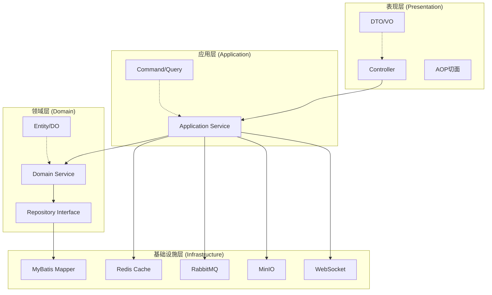

**架构特点**：
- **单体应用**：所有业务模块部署在同一个 Spring Boot 应用中，便于开发和调试
- **模块化包结构**：按业务领域划分包，每个包内包含完整的 Controller-Service-Mapper 三层结构
- **IM 模块采用 DDD 架构**：即时通信模块因为业务复杂度较高，采用了更严格的领域驱动设计
- **统一响应格式**：所有 API 返回 `Result<T>` 包装类，确保响应格式一致性

Sources: [pom.xml](bilibili_SpringBoot/pom.xml#L1-L197), [BilibiliSpringBootApplication.java](bilibili_SpringBoot/src/main/java/com/bilibili/BilibiliSpringBootApplication.java#L1-L17)

## 技术栈概览

项目基于 Spring Boot 4.0.3 构建，采用 Java 17 作为开发语言，结合多种成熟的技术组件构建完整的技术栈：

| 层次 | 技术组件 | 版本 | 用途 |
|------|----------|------|------|
| **核心框架** | Spring Boot | 4.0.3 | 应用框架 |
| **Web 框架** | Spring WebMVC | - | RESTful API 开发 |
| **ORM 框架** | MyBatis-Plus | 3.5.15 | 数据库访问与映射 |
| **安全框架** | Spring Security + JWT | - | 认证与授权 |
| **缓存** | Redis + Spring Cache | - | 数据缓存与会话管理 |
| **消息队列** | RabbitMQ | - | 异步消息处理 |
| **对象存储** | MinIO | 8.6.0 | 视频、图片等文件存储 |
| **实时通信** | WebSocket + Netty | - | 即时通信与弹幕 |
| **数据库** | MySQL 8.0 | - | 主数据存储 |
| **数据库迁移** | Flyway | - | 数据库版本管理 |
| **监控** | Spring Actuator + Micrometer | - | 应用监控与指标收集 |
| **API 文档** | SpringDoc OpenAPI + Knife4j | 3.0.1 | API 文档生成 |
| **工具库** | Lombok, OkHttp, AspectJ | - | 开发效率提升 |

Sources: [pom.xml](bilibili_SpringBoot/pom.xml#L24-L173)

## 分层架构详解

### Controller 层（表现层）

Controller 层是系统的入口，负责接收 HTTP 请求、参数校验、调用应用服务并返回响应。本项目遵循 RESTful 设计原则，每个业务领域都有独立的 Controller 类。

**核心职责**：
1. **请求路由**：通过 `@RestController` 和 `@RequestMapping` 定义 API 端点
2. **参数解析**：自动将请求参数映射到 DTO 对象
3. **认证上下文获取**：通过 `@AuthenticationPrincipal` 获取当前认证用户信息
4. **响应封装**：使用 `Result<T>` 统一包装返回结果

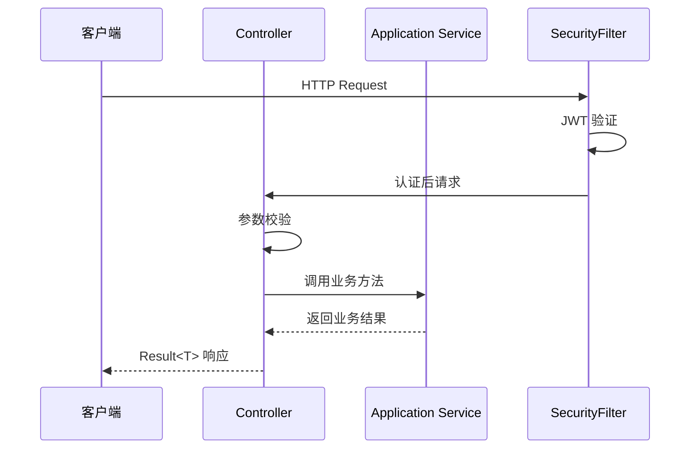

**典型 Controller 示例**：

```java
@RestController
@RequestMapping("/users")
@Tag(name = "User", description = "User authentication and profile APIs")
public class UserController {

    private final UserService userService;
    private final JwtTokenService jwtTokenService;

    @PostMapping("/login")
    @Operation(summary = "User login")
    public Result<UserLoginVO> login(@RequestBody UserLoginDTO dto) {
        UserLoginVO loginVO = userService.login(dto);
        String token = jwtTokenService.generateToken(
                loginVO.getUid(),
                UserRole.fromCodeOrDefault(loginVO.getRoleCode(), UserRole.USER)
        );
        loginVO.setToken(token);
        return Result.success(loginVO);
    }
}
```

**Controller 设计规范**：
- 使用 `@Tag` 注解为 Swagger 文档提供接口分组
- 使用 `@Operation` 注解描述接口功能
- 通过构造函数注入依赖，避免字段注入
- 统一使用 `Result.success()` 和 `Result.error()` 包装响应

Sources: [UserController.java](bilibili_SpringBoot/src/main/java/com/bilibili/user/controller/UserController.java#L1-L62), [VideoController.java](bilibili_SpringBoot/src/main/java/com/bilibili/video/controller/VideoController.java#L1-L61)

### Service 层（应用层）

Service 层是业务逻辑的核心，分为**应用服务（Application Service）**和**领域服务（Domain Service）**两种类型。应用服务负责用例编排和事务管理，领域服务负责核心业务规则和领域逻辑。

**应用服务特点**：
1. **用例驱动**：每个应用服务方法对应一个完整的业务用例
2. **事务管理**：使用 `@Transactional` 注解管理数据库事务
3. **编排协调**：协调多个领域服务和基础设施组件完成复杂业务流程
4. **DTO 转换**：将外部 DTO 转换为内部领域对象

**领域服务特点**：
1. **业务规则封装**：封装不归属于单个实体的业务规则
2. **无状态设计**：领域服务通常是无状态的，便于测试和复用
3. **接口抽象**：通过接口定义领域服务契约，实现可替换性

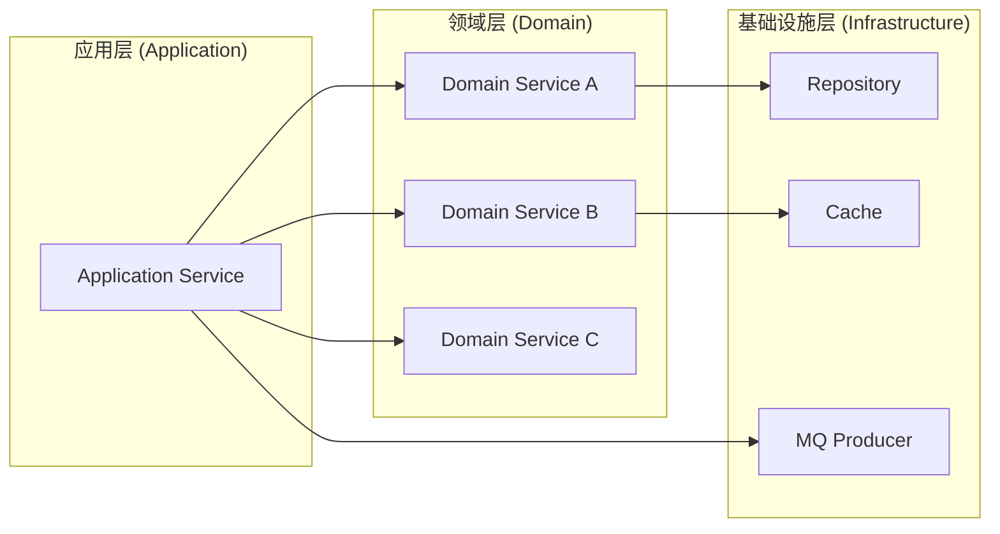

**IM 模块的 DDD 架构示例**：

IM 模块采用了更严格的 DDD 分层，应用服务位于 `im.app` 包，领域服务位于 `im.domain` 包：

```java
// 应用服务 - 负责用例编排
@Service
public class ImApplicationServiceImpl implements ImApplicationService {

    private final UserAccessService userAccessService;
    private final MessagePermissionDomainService messagePermissionDomainService;
    private final ChatConversationService chatConversationService;
    private final ImMessageProducer imMessageProducer;
    // ... 其他依赖

    @Override
    @Transactional(rollbackFor = Exception.class)
    public SendMessageVO acceptMessage(Long senderId, String clientIp, SendMessageCommand command) {
        // 1. 权限验证
        userAccessService.validateCanSendImMessage(senderId);
        validateMessageContent(command.getMessageType(), command.getContent());
        
        // 2. 会话解析
        String conversationId = resolveConversationId(senderId, command.getReceiverId(), conversationType);
        
        // 3. 消息分发
        ImMessageDispatchEvent dispatchEvent = buildDispatchEvent(...);
        imMessageProducer.publish(dispatchEvent);
        
        // 4. 构建响应
        return buildSendMessageVO(...);
    }
}

// 领域服务 - 负责业务规则
@Service
public class MessagePermissionDomainServiceImpl implements MessagePermissionDomainService {

    @Override
    public void validateCanSendMessage(Long senderId, Long receiverId) {
        // 检查接收者是否存在
        // 检查是否被拉黑
        // 检查隐私策略
        // 检查联系人关系
    }
}
```

Sources: [ImApplicationServiceImpl.java](bilibili_SpringBoot/src/main/java/com/bilibili/im/app/impl/ImApplicationServiceImpl.java#L1-L197), [MessagePermissionDomainServiceImpl.java](bilibili_SpringBoot/src/main/java/com/bilibili/im/domain/impl/MessagePermissionDomainServiceImpl.java#L1-L84)

### Mapper 层（数据访问层）

Mapper 层负责数据库访问，基于 MyBatis-Plus 框架实现。每个业务实体都有对应的 Mapper 接口，继承自 `BaseMapper<T>` 提供基础的 CRUD 操作。

**Mapper 层特点**：
1. **接口继承**：继承 `BaseMapper<T>` 获取通用数据库操作方法
2. **自定义查询**：通过 XML 文件或注解定义复杂查询
3. **分页支持**：集成 MyBatis-Plus 分页插件
4. **逻辑删除**：通过 `@TableLogic` 注解支持逻辑删除

**Mapper 接口示例**：

```java
public interface UserMapper extends BaseMapper<UserDO> {

    IPage<UserSearchVO> selectUsersByNickname(Page<UserSearchVO> page,
                                              @Param("nickname") String nickname,
                                              @Param("desc") boolean desc);
}
```

**XML 映射文件示例**（位于 `resources/mapper/` 目录）：
- `UserMapper.xml`：用户相关查询
- `VideoMapper.xml`：视频相关查询
- `AdminUserMapper.xml`：管理后台用户查询
- `im/` 目录：IM 相关 Mapper

**实体类设计规范**：
- 使用 `@TableName` 注解映射数据库表名
- 使用 `@TableId` 注解定义主键策略
- 使用 `@TableField` 注解映射字段属性
- 使用 `@TableLogic` 注解标记逻辑删除字段

```java
@Data
@TableName("t_user")
public class UserDO implements Serializable {

    @TableId(type = IdType.ASSIGN_ID)
    private Long id;

    private String username;
    private String password;
    private Integer roleCode;

    @TableLogic
    private Integer status;

    private LocalDateTime createTime;

    @TableField(fill = FieldFill.INSERT_UPDATE)
    private LocalDateTime updateTime;

    private LocalDateTime deleteTime;
}
```

Sources: [UserMapper.java](bilibili_SpringBoot/src/main/java/com/bilibili/user/mapper/UserMapper.java#L1-L16), [UserDO.java](bilibili_SpringBoot/src/main/java/com/bilibili/user/model/entity/UserDO.java#L1-L41)

### Model 层（数据模型层）

Model 层定义了系统的数据模型，包括实体类（Entity）、数据传输对象（DTO）和视图对象（VO）三种类型。它们在不同层次间传递数据，确保各层之间的职责分离。

**模型分类与职责**：

| 模型类型 | 包路径 | 职责 | 使用场景 |
|----------|--------|------|----------|
| **Entity (DO)** | `model.entity` | 数据库实体映射 | Mapper 层与数据库交互 |
| **DTO** | `model.dto` | 数据传输对象 | Controller 接收请求参数 |
| **VO** | `model.vo` | 视图对象 | Controller 返回响应数据 |
| **Command** | `model.command` | 命令对象 | 应用服务接收复杂命令 |

**数据流向**：

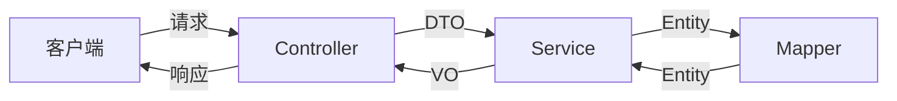

**DTO 设计原则**：
- **请求隔离**：DTO 只包含客户端需要传递的字段，隐藏内部实现细节
- **验证注解**：使用 JSR 303/349 注解进行参数验证
- **不可变性**：建议使用 `@Data` 注解生成 getter/setter，但不暴露内部状态

**VO 设计原则**：
- **视图定制**：VO 只包含前端需要的字段，避免暴露敏感信息
- **嵌套结构**：复杂视图可以使用嵌套 VO 结构
- **空值处理**：使用 `@JsonInclude(JsonInclude.Include.NON_NULL)` 避免空值序列化

**典型模型示例**：

```java
// DTO - 请求参数
@Data
public class UserLoginDTO {
    private String username;
    private String password;
}

// VO - 响应数据
@Data
public class UserLoginVO {
    private Long uid;
    private String username;
    private Integer roleCode;
    private String token;
}

// Entity - 数据库实体
@Data
@TableName("t_user")
public class UserDO implements Serializable {
    @TableId(type = IdType.ASSIGN_ID)
    private Long id;
    private String username;
    private String password;
    // ... 其他字段
}
```

Sources: [UserLoginDTO.java](bilibili_SpringBoot/src/main/java/com/bilibili/user/model/dto/UserLoginDTO.java), [UserLoginVO.java](bilibili_SpringBoot/src/main/java/com/bilibili/user/model/vo/UserLoginVO.java), [UserDO.java](bilibili_SpringBoot/src/main/java/com/bilibili/user/model/entity/UserDO.java#L1-L41)

## 领域模块划分

项目按业务领域划分为多个独立的模块，每个模块包含完整的 Controller-Service-Mapper 三层结构。以下是主要业务模块的职责和相互关系：

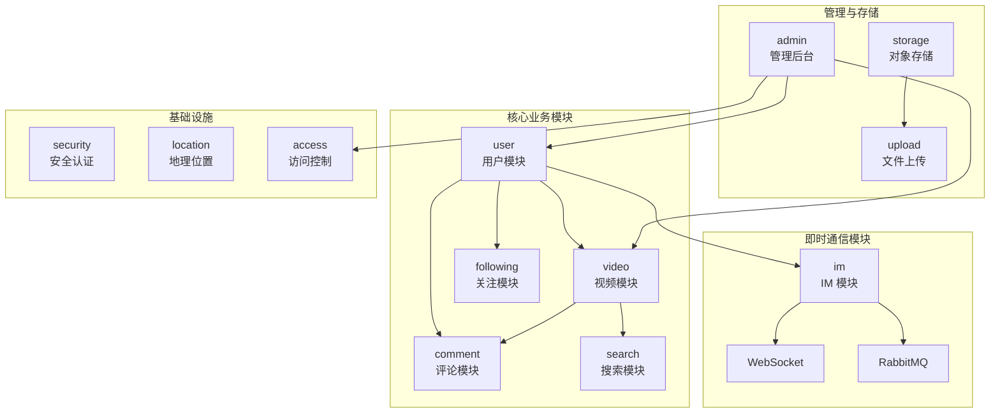

### 用户模块 (user)

用户模块负责用户认证、注册、个人资料管理等功能。是整个系统的基础模块，为其他模块提供用户身份和权限支持。

**核心功能**：
- 用户注册与登录
- JWT Token 生成与验证
- 用户个人资料查询与更新
- 用户存在性验证

**类结构**：
- `UserController`：用户相关 API 端点
- `UserService`：用户业务逻辑接口
- `UserServiceImpl`：用户业务逻辑实现
- `UserMapper`：用户数据访问接口
- `UserDO`：用户实体类
- `UserInfoDO`：用户信息实体类

**关键业务流程**：

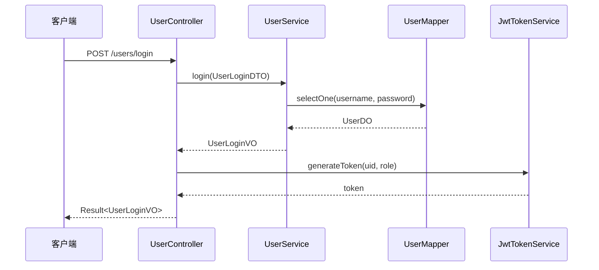

Sources: [UserController.java](bilibili_SpringBoot/src/main/java/com/bilibili/user/controller/UserController.java#L1-L62), [UserServiceImpl.java](bilibili_SpringBoot/src/main/java/com/bilibili/user/service/impl/UserServiceImpl.java#L1-L199)

### 视频模块 (video)

视频模块负责视频的上传、存储、播放、点赞、排行榜等功能。是平台的核心内容模块，与用户模块、评论模块紧密关联。

**核心功能**：
- 视频列表查询与分页
- 视频详情查看
- 视频点赞与取消点赞
- 视频排行榜
- 视频播放量统计

**类结构**：
- `VideoController`：视频相关 API 端点
- `VideoApplicationService`：视频应用服务接口
- `VideoApplicationServiceImpl`：视频应用服务实现
- `VideoMapper`：视频数据访问接口
- `VideoDO`：视频实体类
- `VideoLikeDO`：视频点赞实体类

**视频热度系统**：

项目采用 Redis Lua 脚本驱动的双 Slot 热度排行榜系统，通过 `VideoHotLuaRepository` 实现：

- **双 Slot 设计**：使用两个 Redis Slot 交替存储热度数据，避免长时间占用单个 Slot
- **定时轮换**：通过 `VideoHotRotationTask` 定时任务轮换 Slot
- **热度计算**：基于视频播放量、点赞数等指标计算热度值

Sources: [VideoController.java](bilibili_SpringBoot/src/main/java/com/bilibili/video/controller/VideoController.java#L1-L61), [VideoApplicationService.java](bilibili_SpringBoot/src/main/java/com/bilibili/video/service/application/VideoApplicationService.java#L1-L25)

### 评论模块 (comment)

评论模块负责视频评论的创建、查询、点赞等功能。支持多级评论结构，与视频模块紧密关联。

**核心功能**：
- 评论创建与删除
- 评论列表查询（支持分页）
- 评论点赞与取消点赞
- 多级评论支持

**类结构**：
- `CommentController`：评论相关 API 端点
- `CommentService`：评论业务逻辑接口
- `CommentServiceImpl`：评论业务逻辑实现
- `CommentMapper`：评论数据访问接口
- `CommentDO`：评论实体类
- `CommentLikeDO`：评论点赞实体类

### 即时通信模块 (im)

IM 模块是系统中最复杂的模块，采用了完整的 DDD 架构设计。负责用户间的即时消息通信，包括单聊、群聊、消息推送、消息持久化等功能。

**模块分层**：

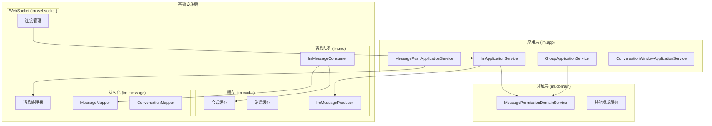

**子模块职责**：

| 子模块 | 包路径 | 职责 |
|--------|--------|------|
| **应用服务** | `im.app` | 用例编排，事务管理 |
| **领域服务** | `im.domain` | 核心业务规则 |
| **消息队列** | `im.mq` | 异步消息处理 |
| **缓存** | `im.cache` | 会话、消息缓存 |
| **WebSocket** | `im.websocket` | 实时通信连接管理 |
| **会话管理** | `im.conversation` | 会话创建、查询 |
| **群聊** | `im.group` | 群聊功能 |
| **消息** | `im.message` | 消息处理 |
| **审核** | `im.moderation` | 敏感词过滤 |
| **隐私** | `im.privacy` | 隐私设置 |

**IM 消息处理流程**：

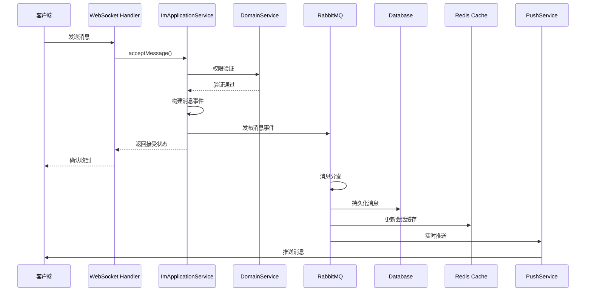

**关键配置**：

IM 模块的配置位于 `application.yaml` 的 `app.im` 部分，包括：
- MQ 配置：交换机、队列、路由键
- WebSocket 配置：路径、允许的源
- 并发配置：各消费者的并发数、预取数

Sources: [ImApplicationServiceImpl.java](bilibili_SpringBoot/src/main/java/com/bilibili/im/app/impl/ImApplicationServiceImpl.java#L1-L197), [MessagePermissionDomainServiceImpl.java](bilibili_SpringBoot/src/main/java/com/bilibili/im/domain/impl/MessagePermissionDomainServiceImpl.java#L1-L84), [application.yaml](bilibili_SpringBoot/src/main/resources/application.yaml#L114-L159)

### 其他业务模块

**关注模块 (following)**：
- 用户关注与取消关注
- 关注列表与粉丝列表查询
- 关注关系验证

**搜索模块 (search)**：
- 用户搜索
- 视频搜索
- 搜索历史管理

**管理后台模块 (admin)**：
- 管理员用户管理
- 视频审核与管理
- 用户访问控制管理

**存储模块 (storage)**：
- MinIO 对象存储配置
- 文件上传服务
- 预签名 URL 生成

**上传模块 (upload)**：
- 头像上传
- 视频上传
- 群头像上传

**访问控制模块 (access)**：
- 用户访问权限验证
- 访问频率限制
- 用户状态检查

Sources: [项目目录结构](bilibili_SpringBoot/src/main/java/com/bilibili/)

## 基础设施层

### 配置管理

项目采用分层配置管理策略，通过 `@Configuration` 注解定义配置类，使用 `@Value` 注解注入配置属性。

**配置类结构**：

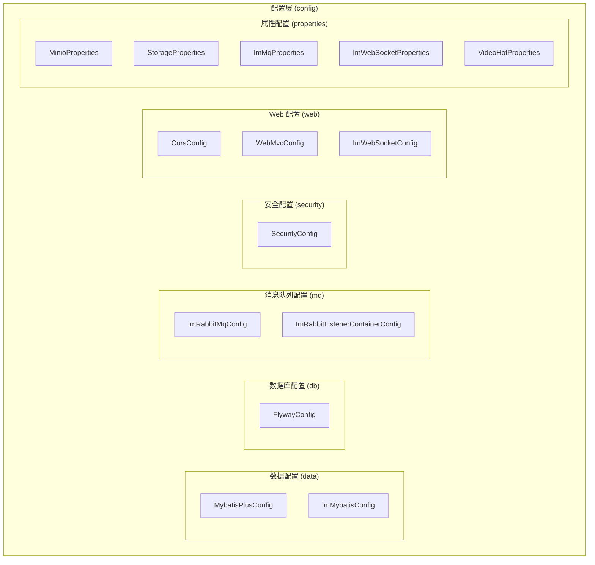

**配置类职责**：

| 配置类 | 职责 |
|--------|------|
| `SecurityConfig` | Spring Security 安全配置 |
| `WebMvcConfig` | Web MVC 配置，JSON 序列化配置 |
| `CorsConfig` | 跨域配置 |
| `ImWebSocketConfig` | WebSocket 端点配置 |
| `MybatisPlusConfig` | MyBatis-Plus 插件配置 |
| `FlywayConfig` | Flyway 数据库迁移配置 |
| `ImRabbitMqConfig` | IM 模块 RabbitMQ 配置 |
| `MinioProperties` | MinIO 存储配置属性 |

**配置属性绑定**：

```java
@Configuration
@ConfigurationProperties(prefix = "storage.minio")
public class MinioProperties {
    private String endpoint;
    private String publicEndpoint;
    private String accessKey;
    private String secretKey;
    private String region;
    private String bucket;
    // ... 其他属性
}
```

Sources: [SecurityConfig.java](bilibili_SpringBoot/src/main/java/com/bilibili/config/security/SecurityConfig.java#L1-L109), [WebMvcConfig.java](bilibili_SpringBoot/src/main/java/com/bilibili/config/web/WebMvcConfig.java#L1-L55)

### 安全认证体系

项目采用 JWT + Spring Security 的认证授权体系，实现无状态的 RESTful API 安全保护。

**认证流程**：

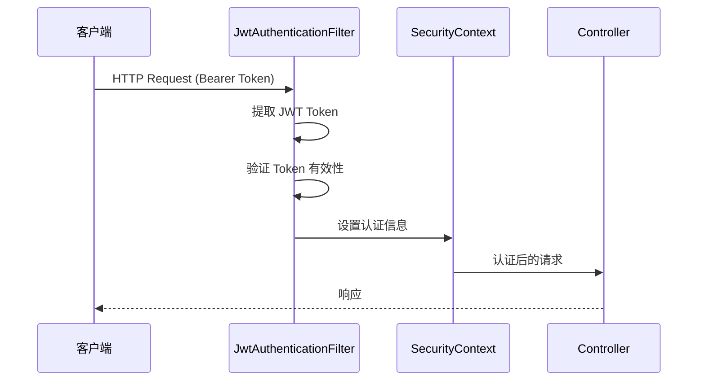

**安全配置要点**：
- **无状态会话**：`SessionCreationPolicy.STATELESS`
- **公开路径**：登录、注册、健康检查等端点
- **公开 GET 路径**：视频列表、用户资料、搜索等只读接口
- **公开 POST 路径**：视频播放量统计等特定接口
- **管理员路径**：`/admin/**` 路径需要 ADMIN 角色
- **其他路径**：需要认证

**JWT Token 结构**：
- **Payload**：包含用户 ID (uid) 和角色代码 (roleCode)
- **有效期**：7 天（604800 秒）
- **签名算法**：HS256

Sources: [SecurityConfig.java](bilibili_SpringBoot/src/main/java/com/bilibili/config/security/SecurityConfig.java#L83-L108), [JwtTokenService.java](bilibili_SpringBoot/src/main/java/com/bilibili/security/JwtTokenService.java)

### 缓存策略

项目使用 Redis 作为缓存层，通过 Spring Cache 抽象简化缓存操作。IM 模块还实现了更复杂的缓存策略。

**缓存配置**：
- **缓存类型**：Redis
- **默认 TTL**：5 分钟（300000 毫秒）
- **空值缓存**：禁用（避免缓存穿透）

**IM 模块缓存**：
- **会话缓存**：缓存用户会话列表，减少数据库查询
- **消息缓存**：缓存最近消息，提高消息加载速度
- **用户存在性缓存**：缓存用户存在性检查结果

**缓存键设计**：
- 使用 `RedisSearchKeys` 类统一管理缓存键前缀
- 遵循 `业务:实体:标识` 的命名规范

Sources: [application.yaml](bilibili_SpringBoot/src/main/resources/application.yaml#L15-L19), [RedisSearchCacheTuning.java](bilibili_SpringBoot/src/main/java/com/bilibili/config/redis/RedisSearchCacheTuning.java#L1-L11)

### 消息队列

项目使用 RabbitMQ 作为消息队列，主要用于 IM 模块的异步消息处理。通过消息队列实现消息的可靠投递、削峰填谷和系统解耦。

**MQ 架构**：

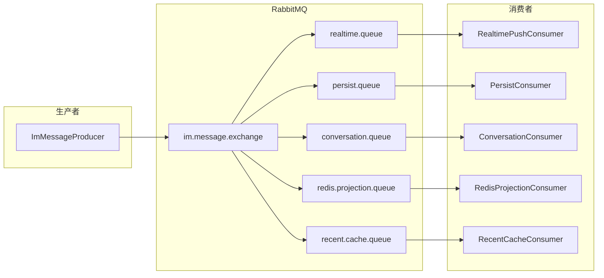

**消息类型**：
- **实时推送**：将消息实时推送给在线用户
- **消息持久化**：将消息保存到数据库
- **会话更新**：更新会话的最后消息和未读数
- **Redis 投影**：将消息数据投影到 Redis 缓存
- **最近消息缓存**：更新最近消息缓存

**消息可靠性保障**：
- **发布确认**：`publisher-confirm-type: correlated`
- **消息返回**：`publisher-returns: true`
- **消费者重试**：最大重试 4 次，指数退避策略
- **并发控制**：各队列独立配置并发数和预取数

Sources: [application.yaml](bilibili_SpringBoot/src/main/resources/application.yaml#L116-L148), [ImRabbitMqConfig.java](bilibili_SpringBoot/src/main/java/com/bilibili/config/mq/ImRabbitMqConfig.java)

### 数据库管理

项目使用 MySQL 8.0 作为主数据库，通过 Flyway 进行数据库版本管理。

**Flyway 迁移文件**：

```
src/main/resources/db/migration/
├── V2__align_video_upload_task_for_minio_upload.sql
├── V3__create_chat_tables.sql
├── V4__create_chat_session_table.sql
├── V5__migrate_chat_conversation_id_to_string_rule.sql
├── V6__add_client_message_id_to_chat_message.sql
├── V7__create_user_access_table.sql
├── V8__add_is_dm_contact_to_contact_relation.sql
├── V9__add_sender_location_to_chat_message.sql
├── V10__add_last_server_message_id_to_chat_conversation.sql
├── V11__add_server_message_id_to_chat_message.sql
├── V12__create_group_chat_core_tables.sql
├── V13__create_group_conversation_table.sql
├── V14__add_conversation_type_and_target_id_to_chat_message.sql
├── V15__change_chat_group_message_to_use_message_id.sql
├── V16__move_group_last_read_seq_to_conversation.sql
├── V17__create_im_sensitive_word_table.sql
└── V18__add_role_code_to_user.sql
```

**数据库表结构示例**（聊天相关表）：
- `chat_message`：聊天消息表
- `chat_conversation`：聊天会话表
- `contact_relation`：联系人关系表
- `user_privacy_setting`：用户隐私设置表

Sources: [V3__create_chat_tables.sql](bilibili_SpringBoot/src/main/resources/db/migration/V3__create_chat_tables.sql#L1-L55), [FlywayConfig.java](bilibili_SpringBoot/src/main/java/com/bilibili/config/db/FlywayConfig.java)

### 监控与可观测性

项目集成了 Spring Boot Actuator 和 Micrometer，提供应用监控和指标收集能力。

**监控端点**：
- `/actuator/health`：健康检查
- `/actuator/metrics`：应用指标
- `/actuator/prometheus`：Prometheus 格式指标

**关键指标**：
- **JVM 指标**：内存使用、GC 情况、线程数
- **HTTP 指标**：请求量、响应时间、错误率
- **数据库指标**：连接池状态、查询性能
- **缓存指标**：命中率、内存使用
- **MQ 指标**：队列深度、消费速率

**AOP 日志切面**：

项目通过 `ServiceLogAspect` 实现 Service 层的统一日志记录：

```java
@Aspect
@Component
public class ServiceLogAspect {

    @Around("execution(public * com.bilibili..service.impl..*(..))")
    public Object aroundService(ProceedingJoinPoint joinPoint) throws Throwable {
        // 记录方法调用、参数、耗时、结果
        // 区分成功、业务异常、系统异常
    }
}
```

Sources: [application.yaml](bilibili_SpringBoot/src/main/resources/application.yaml#L102-L109), [ServiceLogAspect.java](bilibili_SpringBoot/src/main/java/com/bilibili/common/aop/ServiceLogAspect.java#L1-L97)

## 架构特点与设计模式

### 统一响应格式

所有 API 返回统一的 `Result<T>` 包装类，确保响应格式一致性：

```java
@Data
public class Result<T> implements Serializable {
    private int code;
    private String message;
    private T data;

    public static <T> Result<T> success(T data) {
        Result<T> result = new Result<>();
        result.setCode(0);
        result.setMessage("OK");
        result.setData(data);
        return result;
    }

    public static <T> Result<T> error(int code, String message) {
        Result<T> result = new Result<>();
        result.setCode(code);
        result.setMessage(message);
        result.setData(null);
        return result;
    }
}
```

### 全局异常处理

通过 `GlobalExceptionHandler` 统一处理异常，返回标准错误响应：

```java
@RestControllerAdvice
public class GlobalExceptionHandler {

    @ExceptionHandler(UnauthorizedException.class)
    public ResponseEntity<Result<Void>> handleUnauthorizedException(UnauthorizedException ex) {
        return ResponseEntity.status(HttpStatus.UNAUTHORIZED)
                .body(Result.error(401, ex.getMessage()));
    }

    @ExceptionHandler(IllegalArgumentException.class)
    public ResponseEntity<Result<Void>> handleIllegalArgumentException(IllegalArgumentException ex) {
        return ResponseEntity.status(HttpStatus.BAD_REQUEST)
                .body(Result.error(400, ex.getMessage()));
    }
}
```

### 依赖注入模式

项目采用构造函数注入模式，避免字段注入的潜在问题：

```java
@Service
public class UserServiceImpl implements UserService {

    private final UserMapper userMapper;
    private final UserInfoMapper userInfoMapper;

    @Autowired
    public UserServiceImpl(UserMapper userMapper,
                           UserInfoMapper userInfoMapper) {
        this.userMapper = userMapper;
        this.userInfoMapper = userInfoMapper;
    }
}
```

### 接口与实现分离

所有 Service 层都遵循接口与实现分离的原则，便于测试和扩展：

```java
// 接口定义
public interface UserService {
    Long register(UserRegisterDTO dto);
    UserLoginVO login(UserLoginDTO dto);
    // ...
}

// 实现类
@Service
public class UserServiceImpl implements UserService {
    // 实现细节
}
```

### 分页查询抽象

项目定义了通用的分页查询和响应类：

```java
// 分页查询参数
@Data
public class PageQueryDTO {
    private Integer pageNum = 1;
    private Integer pageSize = 10;
}

// 分页响应
@Data
public class PageVO<T> {
    private List<T> records;
    private long total;
    private long pageNum;
    private long pageSize;

    public static <T> PageVO<T> from(IPage<T> page) {
        // 转换逻辑
    }
}
```

## 总结

Bilibili 项目 Spring Boot 后端采用**分层架构与领域驱动设计相结合**的方式，构建了一个结构清晰、职责明确、易于扩展的系统架构。通过本文档的分析，我们可以看到：

1. **分层清晰**：Controller → Service → Mapper 三层结构职责明确，依赖关系清晰
2. **模块化设计**：按业务领域划分模块，每个模块包含完整的三层结构
3. **DDD 架构**：IM 等复杂模块采用严格的领域驱动设计，提高业务逻辑的封装性
4. **技术栈成熟**：采用 Spring Boot 生态成熟组件，确保系统的稳定性和可维护性
5. **配置管理规范**：分层配置管理，属性绑定清晰，便于部署和维护
6. **安全体系完善**：JWT + Spring Security 实现无状态认证授权
7. **可观测性支持**：集成 Actuator 和 Micrometer，提供完整的监控指标

这种架构设计既保证了系统的可维护性和可扩展性，又兼顾了开发效率和性能要求，为平台的持续演进奠定了坚实的基础。

## 后续阅读建议

建议按照以下顺序深入学习各模块：

1. **[JWT 认证与 Spring Security 权限体系](9-jwt-ren-zheng-yu-spring-security-quan-xian-ti-xi)**：深入了解安全认证实现细节
2. **[数据库设计与 Flyway 迁移管理](10-shu-ju-ku-she-ji-yu-flyway-qian-yi-guan-li)**：了解数据库表结构和迁移策略
3. **[用户与社交关系模块](11-yong-hu-yu-she-jiao-guan-xi-mo-kuai)**：学习用户模块的完整实现
4. **[视频管理与弹幕系统](12-shi-pin-guan-li-yu-dan-mu-xi-tong)**：了解核心业务模块实现
5. **[IM 领域模型与应用层编排](16-im-ling-yu-mo-xing-yu-ying-yong-ceng-bian-pai)**：深入学习 DDD 架构实践