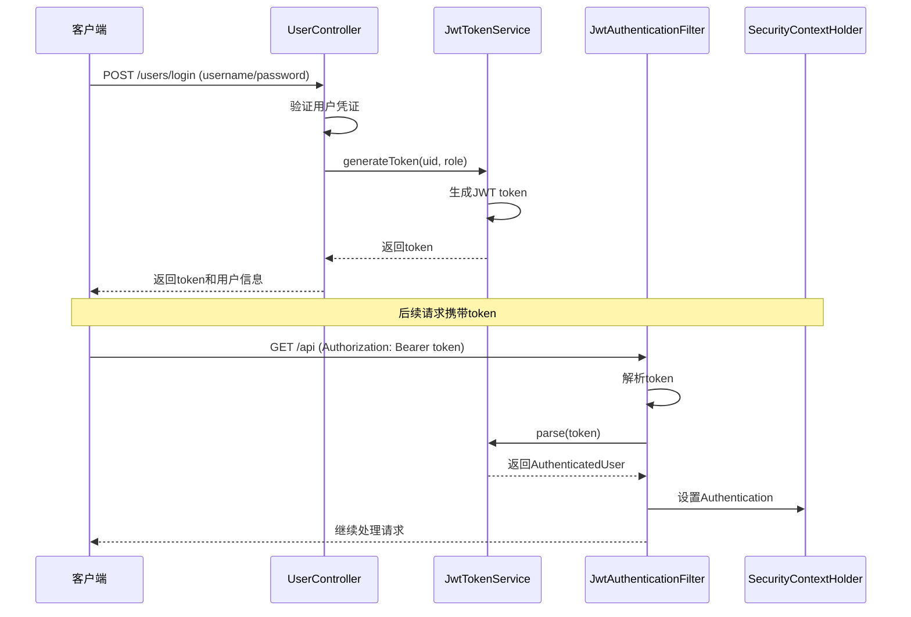
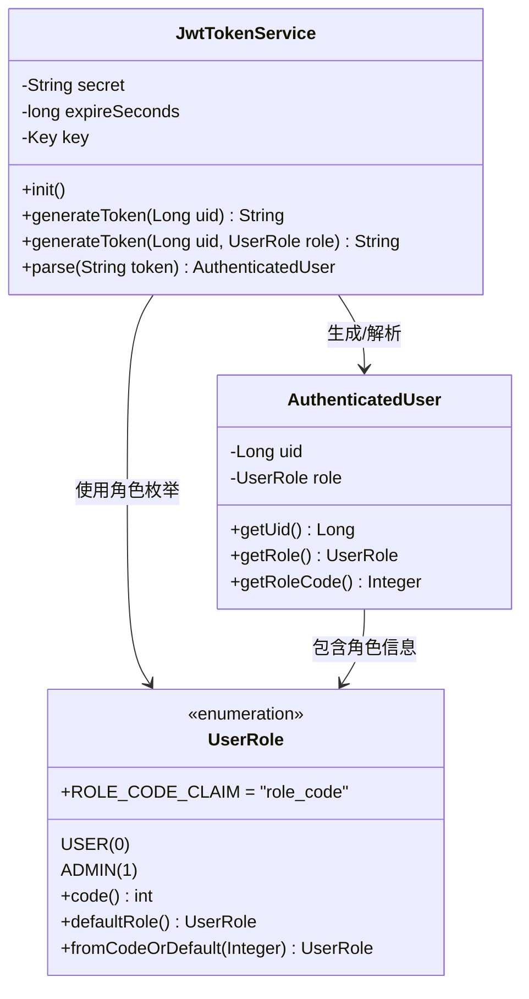
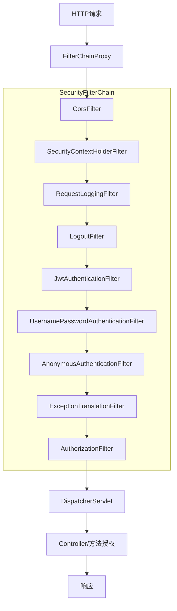
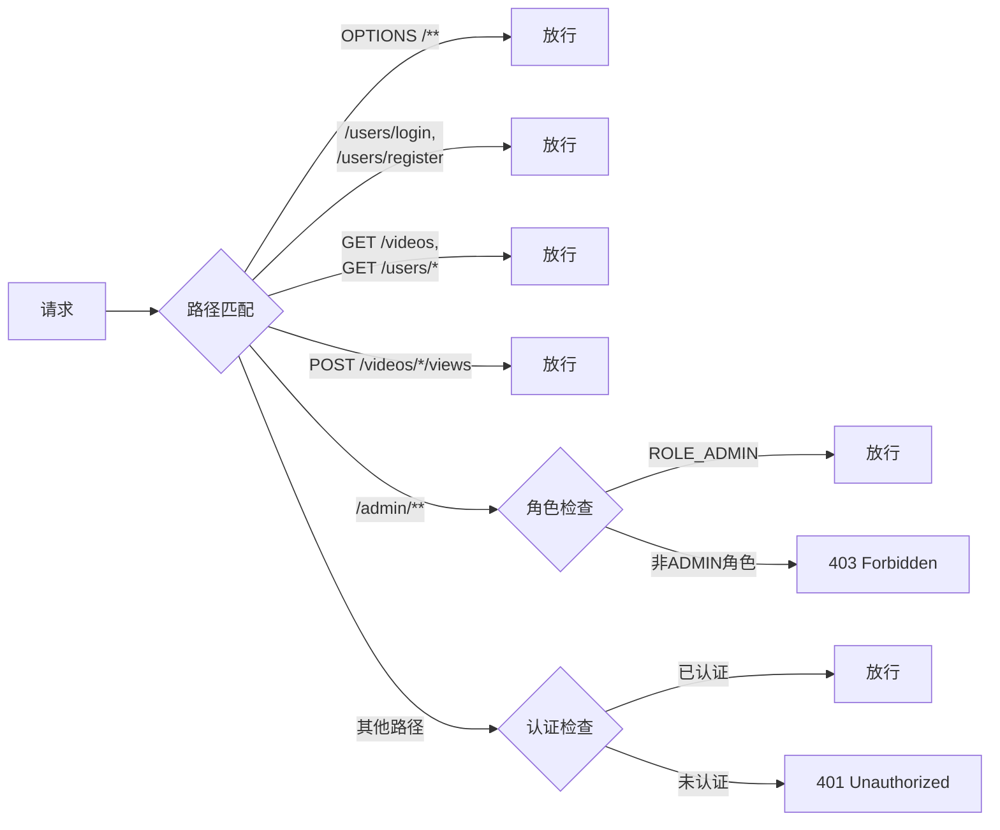
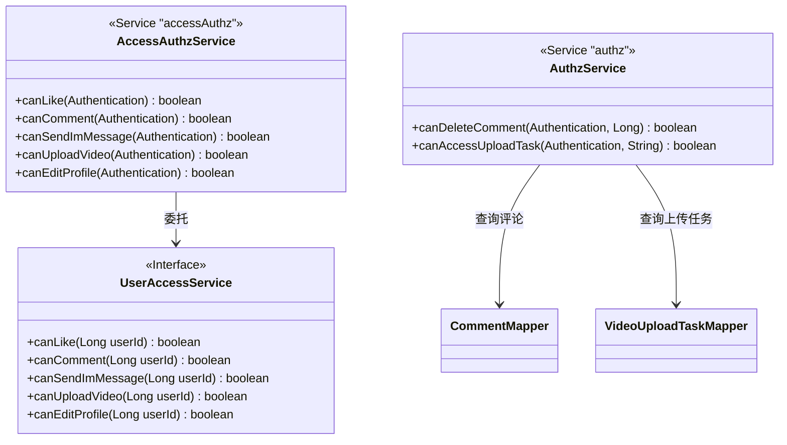
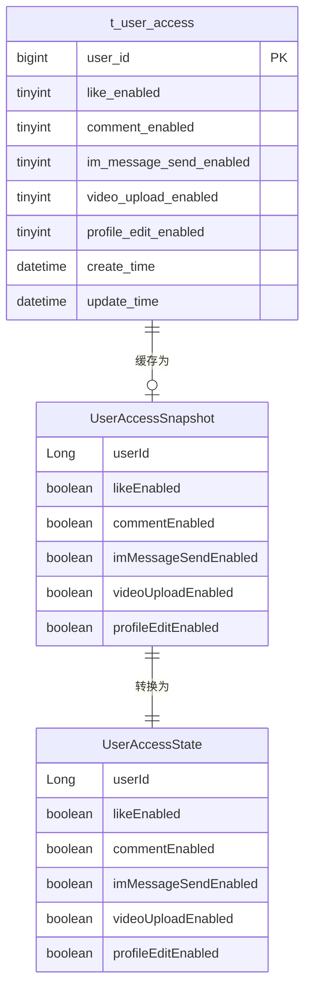
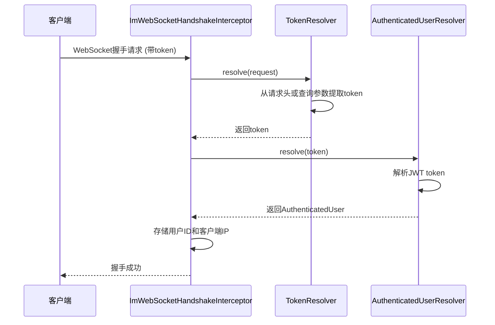
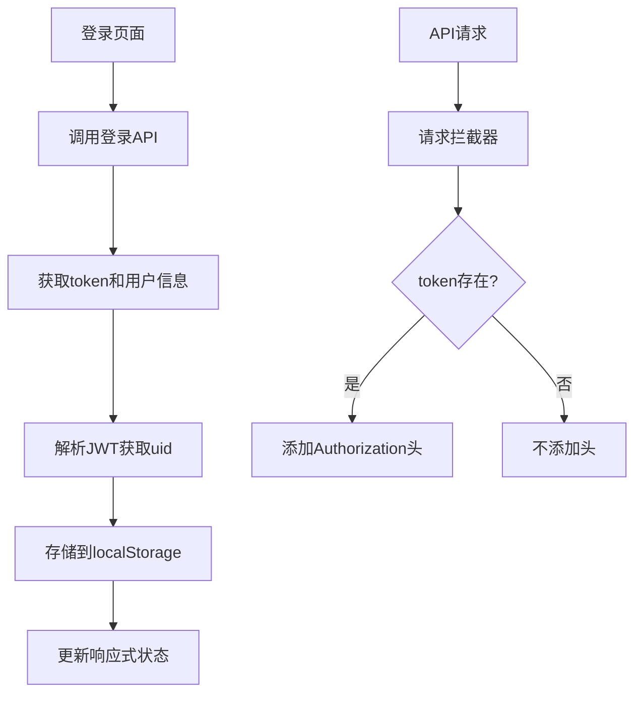
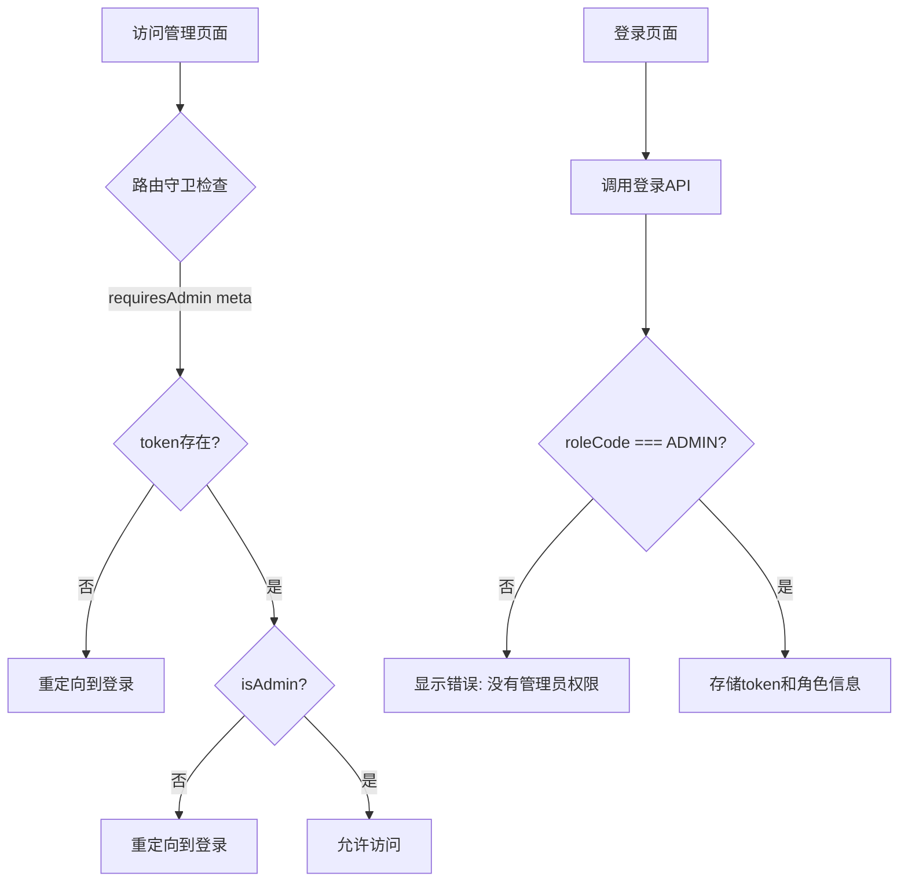

本文档详细阐述了bilibili项目中基于JWT的认证机制和Spring Security权限控制体系。该体系通过无状态的JWT token实现用户身份验证，并结合URL级、方法级和业务级三层权限控制，为用户端和管理端提供统一的安全访问控制。

## JWT 认证流程概览

项目采用JWT（JSON Web Token）实现无状态认证，整个认证流程围绕`JwtTokenService`展开。当用户通过`/users/login`接口登录成功后，系统生成包含用户ID和角色信息的JWT token。前端在后续请求中通过`Authorization: Bearer <token>`请求头携带token，后端通过`JwtAuthenticationFilter`过滤器解析token并构建安全上下文。

认证流程的核心步骤包括：用户登录获取token → 前端存储token → 请求携带token → 过滤器解析token → 构建认证上下文 → 权限验证。这种无状态设计避免了服务端会话存储，提高了系统的可扩展性。



Sources: [SecurityConfig.java](bilibili_SpringBoot/src/main/java/com/bilibili/config/security/SecurityConfig.java#L1-L109), [JwtTokenService.java](bilibili_SpringBoot/src/main/java/com/bilibili/security/JwtTokenService.java#L1-L65), [JwtAuthenticationFilter.java](bilibili_SpringBoot/src/main/java/com/bilibili/security/JwtAuthenticationFilter.java#L1-L78)

## JWT Token 生成与解析

`JwtTokenService`是JWT认证的核心组件，负责token的生成和解析。该服务使用HMAC-SHA256算法对token进行签名，确保token的完整性和真实性。token的有效期默认为7天（604800秒），可通过配置文件调整。

token的有效载荷包含三个关键字段：`sub`（主题，存储用户ID）、`role_code`（角色代码）、`iat`（签发时间）和`exp`（过期时间）。角色代码通过`UserRole`枚举定义，其中`USER`对应0，`ADMIN`对应1。



配置示例：

```yaml
jwt:
  secret: ${JWT_SECRET:change-this-secret-at-least-32-bytes-long}
  expireSeconds: 604800
```

Sources: [JwtTokenService.java](bilibili_SpringBoot/src/main/java/com/bilibili/security/JwtTokenService.java#L1-L65), [UserRole.java](bilibili_SpringBoot/src/main/java/com/bilibili/common/enums/UserRole.java#L1-L42), [application.yaml](bilibili_SpringBoot/src/main/resources/application.yaml#L100-L102)

## Spring Security 过滤器链配置

`SecurityConfig`配置了Spring Security的过滤器链，定义了请求处理流程和权限规则。该配置启用了方法级安全（`@EnableMethodSecurity`），并禁用了CSRF保护（适用于REST API场景）和会话管理（无状态会话策略）。

过滤器链的顺序至关重要：`RequestLoggingFilter`在`SecurityContextHolderFilter`之后执行，用于记录请求日志；`JwtAuthenticationFilter`在`UsernamePasswordAuthenticationFilter`之前执行，用于JWT认证。这种顺序确保了认证在日志记录之前完成，便于后续日志记录用户身份信息。



过滤器链中的关键组件：
1. **JwtAuthenticationFilter**：从请求头提取Bearer token，解析用户身份并设置安全上下文
2. **RequestLoggingFilter**：记录请求日志、生成traceId、记录认证信息
3. **ExceptionTranslationFilter**：处理认证和授权异常，返回适当的HTTP状态码

Sources: [SecurityConfig.java](bilibili_SpringBoot/src/main/java/com/bilibili/config/security/SecurityConfig.java#L1-L109), [JwtAuthenticationFilter.java](bilibili_SpringBoot/src/main/java/com/bilibili/security/JwtAuthenticationFilter.java#L1-L78), [RequestLoggingFilter.java](bilibili_SpringBoot/src/main/java/com/bilibili/security/RequestLoggingFilter.java#L1-L78)

## URL 级权限控制

URL级权限控制在`SecurityConfig`中通过`authorizeHttpRequests`方法配置，定义了哪些路径需要认证，哪些路径可以公开访问。配置遵循最小权限原则，只公开必要的路径。

权限规则按优先级排列：

1. **CORS预检请求**：`OPTIONS /**`完全放行，确保跨域请求正常
2. **公开路径**：`/users/login`和`/users/register`无需认证
3. **公开GET请求**：包括健康检查、视频列表、用户公开资料、搜索等
4. **公开POST请求**：视频播放量统计接口
5. **管理端路径**：`/admin/**`需要`ROLE_ADMIN`角色
6. **其他路径**：需要认证（`authenticated()`）



配置示例：

```java
.authorizeHttpRequests(auth -> {
    if (docsPublic) {
        auth.requestMatchers(DOC_PATHS).permitAll();
    }
    auth.requestMatchers(HttpMethod.OPTIONS, "/**").permitAll();
    auth.requestMatchers(PUBLIC_PATHS).permitAll();
    auth.requestMatchers(HttpMethod.GET, PUBLIC_GET_PATHS).permitAll();
    auth.requestMatchers(HttpMethod.POST, PUBLIC_POST_PATHS).permitAll();
    auth.requestMatchers("/admin/**").hasRole("ADMIN");
    auth.anyRequest().authenticated();
})
```

Sources: [SecurityConfig.java](bilibili_SpringBoot/src/main/java/com/bilibili/config/security/SecurityConfig.java#L85-L109), [application.yaml](bilibili_SpringBoot/src/main/resources/application.yaml#L150-L151)

## 方法级权限控制

方法级权限控制通过`@PreAuthorize`注解实现，在Controller方法执行前进行细粒度的权限检查。这种控制方式支持SpEL（Spring Expression Language）表达式，可以调用自定义的授权服务。

项目中定义了两个主要的授权服务：

1. **AccessAuthzService**（Bean名称：`accessAuthz`）：控制业务功能权限，如点赞、评论、发消息、上传视频、编辑资料
2. **AuthzService**（Bean名称：`authz`）：控制资源级权限，如删除评论、访问上传任务



使用示例：

```java
@PreAuthorize("@accessAuthz.canLike(authentication)")
@PostMapping("/videos/{videoId}/likes")
public Result<Void> likeVideo(@PathVariable Long videoId) {
    // 点赞逻辑
}

@PreAuthorize("@authz.canDeleteComment(authentication, #commentId)")
@DeleteMapping("/comments/{commentId}")
public Result<Void> deleteComment(@PathVariable Long commentId) {
    // 删除评论逻辑
}
```

Sources: [AccessAuthzService.java](bilibili_SpringBoot/src/main/java/com/bilibili/access/authorization/AccessAuthzService.java#L1-L53), [AuthzService.java](bilibili_SpringBoot/src/main/java/com/bilibili/authorization/AuthzService.java#L1-L62), [MeCommentController.java](bilibili_SpringBoot/src/main/java/com/bilibili/comment/controller/MeCommentController.java#L1-L50)

## 业务权限模型

业务权限模型基于用户访问状态快照（`UserAccessSnapshot`）实现，支持细粒度的功能权限控制。该模型将权限分为五个维度：点赞、评论、发消息、上传视频、编辑资料。

权限状态存储在`t_user_access`表中，通过`UserAccessService`提供权限检查服务。为了提高性能，权限状态会缓存在Redis中，通过`UserAccessSnapshotCache`管理。



权限检查流程：

1. 从缓存获取用户访问状态快照
2. 检查特定权限标志
3. 如果权限不足，抛出`AccessDeniedException`

配置示例：

```yaml
# 默认权限状态
public static UserAccessSnapshot defaults(Long userId) {
    return new UserAccessSnapshot(userId, true, true, true, true, true);
}
```

Sources: [UserAccessSnapshot.java](bilibili_SpringBoot/src/main/java/com/bilibili/access/model/cache/UserAccessSnapshot.java#L1-L20), [UserAccessServiceImpl.java](bilibili_SpringBoot/src/main/java/com/bilibili/access/service/impl/UserAccessServiceImpl.java#L1-L100), [V7__create_user_access_table.sql](bilibili_SpringBoot/src/main/resources/db/migration/V7__create_user_access_table.sql#L1-L12)

## 异常处理机制

异常处理机制通过`RestAuthenticationEntryPoint`和`RestAccessDeniedHandler`实现，为REST API提供统一的错误响应格式。这种设计避免了传统的重定向到登录页面，而是返回JSON格式的错误信息。

异常处理遵循以下规则：
1. **未认证异常**：访问受保护资源时未提供有效token，返回401状态码和"login required"消息
2. **权限不足异常**：已认证但权限不足，返回403状态码和"access denied"消息

```mermaid
flowchart TD
    A[请求] --> B{认证状态}
    
    B -->|未认证且访问受保护资源| C[AuthenticationEntryPoint]
    C --> D[返回401<br>{"code":401, "message":"login required"}]
    
    B -->|已认证| E{权限检查}
    
    E -->|URL级权限不足| F[AccessDeniedHandler]
    F --> G[返回403<br>{"code":403, "message":"access denied"}]
    
    E -->|方法级权限不足| F
    
    E -->|权限通过| H[继续处理]
```

异常处理器实现：

```java
@Component
public class RestAuthenticationEntryPoint implements AuthenticationEntryPoint {
    @Override
    public void commence(HttpServletRequest request, HttpServletResponse response,
                        AuthenticationException authException) throws IOException {
        response.setStatus(HttpServletResponse.SC_UNAUTHORIZED);
        response.setContentType(MediaType.APPLICATION_JSON_VALUE);
        objectMapper.writeValue(response.getWriter(), Result.error(401, "login required"));
    }
}
```

Sources: [RestAuthenticationEntryPoint.java](bilibili_SpringBoot/src/main/java/com/bilibili/security/RestAuthenticationEntryPoint.java#L1-L35), [RestAccessDeniedHandler.java](bilibili_SpringBoot/src/main/java/com/bilibili/security/RestAccessDeniedHandler.java#L1-L35)

## WebSocket 认证集成

WebSocket认证通过`ImWebSocketHandshakeInterceptor`在握手阶段实现，确保只有认证用户才能建立WebSocket连接。该拦截器复用了HTTP请求的JWT认证机制，支持通过查询参数传递token。

WebSocket认证流程：

1. 客户端发起WebSocket握手请求，携带token（通过查询参数或Authorization头）
2. 拦截器解析token并验证有效性
3. 验证成功，将用户ID和客户端IP存入WebSocket会话属性
4. 验证失败，返回401状态码，握手失败



查询参数传递token示例：

```
ws://localhost:8080/ws/im?token=eyJhbGciOiJIUzI1NiIsInR5cCI6IkpXVCJ9...
```

Sources: [ImWebSocketHandshakeInterceptor.java](bilibili_SpringBoot/src/main/java/com/bilibili/im/websocket/interceptor/ImWebSocketHandshakeInterceptor.java#L1-L86), [DefaultTokenResolver.java](bilibili_SpringBoot/src/main/java/com/bilibili/security/resolver/impl/DefaultTokenResolver.java#L1-L59)

## 前端集成方案

前端集成分为用户端和管理端两个独立的实现，两者都通过localStorage存储token和用户信息，并在请求拦截器中自动添加Authorization头。

### 用户端集成

用户端使用Vue 3 Composition API管理认证状态，提供响应式的认证状态管理。登录成功后，系统从JWT token中解析用户ID，确保token与用户信息的一致性。



关键实现：

```typescript
// 请求拦截器自动添加token
http.interceptors.request.use((config) => {
  const token = localStorage.getItem('bilibili_token')
  if (token) {
    config.headers.Authorization = `Bearer ${token}`
  }
  return config
})

// JWT解析函数
function parseJwtUid(token: string): string | null {
  const segments = token.split('.')
  const payload = JSON.parse(atob(segments[1]))
  return payload.sub ?? null
}
```

### 管理端集成

管理端增加了角色验证逻辑，确保只有管理员角色才能访问管理功能。前端通过路由守卫检查认证状态和角色权限，未授权访问会被重定向到登录页面。



管理员角色验证：

```typescript
export function isAdmin() {
  return authState.roleCode === ADMIN_ROLE_CODE // 1
}

router.beforeEach((to) => {
  if (to.meta.requiresAdmin && (!authState.token || !isAdmin())) {
    logout()
    return '/login'
  }
})
```

Sources: [bilibili_web/src/lib/auth.ts](bilibili_web/src/lib/auth.ts#L1-L89), [bilibili_web/src/lib/api.ts](bilibili_web/src/lib/api.ts#L1-L73), [bilibili_admin_web/src/lib/auth.ts](bilibili_admin_web/src/lib/auth.ts#L1-L82), [bilibili_admin_web/src/router.ts](bilibili_admin_web/src/router.ts#L1-L54)

## 安全配置最佳实践

### 1. 无状态会话策略

项目采用无状态会话策略（`SessionCreationPolicy.STATELESS`），完全依赖JWT进行身份验证，不依赖服务端会话。这种设计提高了系统的可扩展性，特别适合微服务架构。

### 2. CSRF保护禁用

对于REST API场景，CSRF保护被禁用（`csrf(AbstractHttpConfigurer::disable)`）。这是因为JWT token本身提供了请求的真实性验证，而CSRF保护主要用于基于cookie的会话认证。

### 3. CORS配置

CORS配置通过`CorsConfig`类实现，允许特定的源进行跨域请求。配置存储在`application.yaml`中，支持多环境配置。

```yaml
cors:
  allowedOrigins: http://localhost:63342,http://127.0.0.1:63342,http://localhost:8080,http://127.0.0.1:8080,http://localhost:5174,http://127.0.0.1:5174,http://150.158.146.80:5174
```

### 4. 文档访问控制

通过`app.docs.public`配置控制Swagger文档的访问权限。在生产环境中，建议设置为`false`，防止未授权访问API文档。

### 5. 安全响应头

项目通过`RestAuthenticationEntryPoint`和`RestAccessDeniedHandler`返回统一的JSON格式错误响应，避免暴露敏感的错误信息。建议后续补充以下安全响应头：

- HSTS（HTTP Strict Transport Security）
- X-Content-Type-Options
- X-Frame-Options
- CSP（Content Security Policy）

Sources: [SecurityConfig.java](bilibili_SpringBoot/src/main/java/com/bilibili/config/security/SecurityConfig.java#L85-L109), [CorsConfig.java](bilibili_SpringBoot/src/main/java/com/bilibili/config/web/CorsConfig.java#L1-L30), [application.yaml](bilibili_SpringBoot/src/main/resources/application.yaml#L100-L102)

## 权限体系架构图

综合以上各节内容，项目权限体系采用三层架构设计：

```mermaid
flowchart TD
    subgraph "第一层：认证层"
        A[JWT Token] --> B[JwtAuthenticationFilter]
        B --> C[SecurityContextHolder]
    end
    
    subgraph "第二层：URL权限层"
        D[SecurityConfig] --> E[公开路径]
        D --> F[管理端路径]
        D --> G[其他路径]
    end
    
    subgraph "第三层：方法/业务权限层"
        H[@PreAuthorize] --> I[AccessAuthzService]
        H --> J[AuthzService]
        I --> K[业务功能权限]
        J --> L[资源级权限]
    end
    
    subgraph "异常处理层"
        M[AuthenticationEntryPoint] --> N[401 Unauthorized]
        O[AccessDeniedHandler] --> P[403 Forbidden]
    end
    
    A --> B
    B --> C
    C --> H
    C --> D
    D --> M
    D --> O
    H --> M
    H --> O
```

Sources: [SecurityConfig.java](bilibili_SpringBoot/src/main/java/com/bilibili/config/security/SecurityConfig.java#L1-L109), [AccessAuthzService.java](bilibili_SpringBoot/src/main/java/com/bilibili/access/authorization/AccessAuthzService.java#L1-L53), [AuthzService.java](bilibili_SpringBoot/src/main/java/com/bilibili/authorization/AuthzService.java#L1-L62)

## 下一步阅读建议

完成本章节后，建议按以下顺序继续阅读：

1. **[数据库设计与 Flyway 迁移管理](10-shu-ju-ku-she-ji-yu-flyway-qian-yi-guan-li)**：了解用户表、角色字段和权限表的数据库设计
2. **[用户与社交关系模块](11-yong-hu-yu-she-jiao-guan-xi-mo-kuai)**：深入用户模块的业务逻辑和权限控制
3. **[管理后台 API](15-guan-li-hou-tai-api)**：了解管理端API的权限控制和用户管理功能
4. **[WebSocket 连接管理与自定义协议](17-websocket-lian-jie-guan-li-yu-zi-ding-yi-xie-yi)**：深入了解WebSocket的认证和连接管理