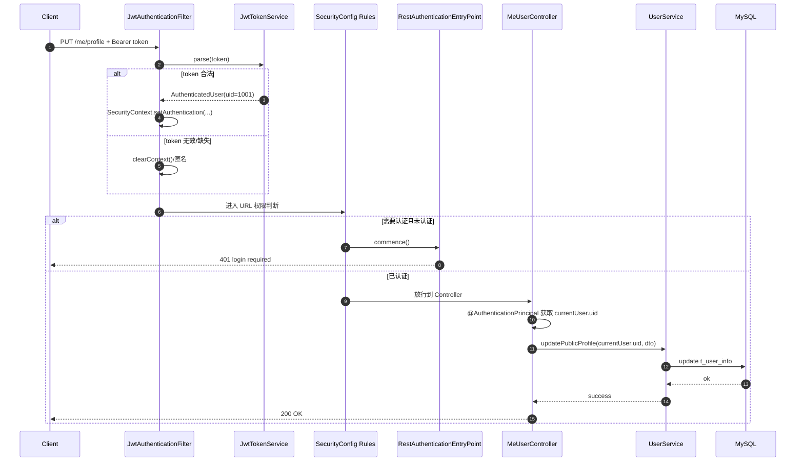

# Spring Security + JWT 实战与数据流说明（本项目）

本文针对“没学过 Spring Security 的 Java 初级工程师”，目标是：

1. 看懂本项目安全代码到底怎么工作。
2. 能独立在新项目里复用同一套方案。

---

## 0. 最新安全策略更新（2026-02）

本次做了 3 个关键调整，目的就是解决你提到的“控制层看不出权限”的问题。

### 0.1 登录校验统一到过滤器链

- 公开接口：在 `SecurityRuleMatrix` 里标 `PUBLIC`。
- 其余接口：默认 `authenticated()`。
- 代码位置：
  - `src/main/java/com/bilibili/config/security/SecurityConfig.java`
  - `src/main/java/com/bilibili/config/security/SecurityRuleMatrix.java`
  - `src/main/java/com/bilibili/config/security/SecurityRule.java`

你可以理解为：  
**URL 级别“要不要登录”，只看安全配置，不再散落在控制器里。**

### 0.2 控制层新增“资源归属”可见校验

为了让“用户 A 不能操作用户 B 的资源”在控制层一眼可见，新增了声明式注解：

- 删除评论（必须是评论作者）：
  - `MeCommentController.deleteComment`
  - `@PreAuthorize("@authz.canDeleteComment(authentication, #commentId)")`
- 访问上传任务（必须是任务拥有者）：
  - `MeVideoUploadController.uploadChunk/getUploadStatus/completeUpload`
  - `@PreAuthorize("@authz.canAccessUploadTask(authentication, #uploadId)")`

### 0.3 权限逻辑集中到 `AuthzService`

新增统一权限服务：
- `src/main/java/com/bilibili/authorization/AuthzService.java`

作用：
- `canDeleteComment(...)`：检查评论归属
- `canAccessUploadTask(...)`：检查上传任务归属

这样做的意义是：
1. 控制层可读（看注解就知道权限）
2. 权限代码集中（便于维护）
3. Service 层保留兜底校验（双保险）

---

## 1. 你先记住的总体结构

本项目安全链路分 4 层：

1. `SecurityConfig`：定义“哪些接口放行，哪些接口必须登录”。
2. `JwtAuthenticationFilter`：每次请求解析 `Authorization: Bearer <token>`。
3. `SecurityContext`：保存“当前登录用户”。
4. `@PreAuthorize + /me 接口设计`：以框架方式完成鉴权，避免手写 `uid` 比对。

一句话：
**先认证（你是谁），再授权（你能做什么），最后做资源归属校验（是不是操作自己的资源）。**

---

## 2. 你问的三个组件分别做什么

先给你一个“模块输入输出总览表”，后面再拆每个模块细节。

| 模块 | 输入是什么 | 输出是什么 | 主要用途 |
| --- | --- | --- | --- |
| `JwtAuthenticationFilter` | 请求头 `Authorization: Bearer <token>` | `SecurityContext` 里写入当前用户认证信息（或保持匿名） | 把 token 变成“当前登录用户” |
| `RestAuthenticationEntryPoint` | “需要登录但当前未认证”的异常场景 | 401 JSON | 统一处理未登录 |
| `RestAccessDeniedHandler` | “已登录但权限不足”的异常场景 | 403 JSON | 统一处理无权限 |
| `@PreAuthorize(\"@authz...\")` | 当前认证信息 + 资源 ID（如 `commentId/uploadId`） | 通过 / 403 | 方法级“资源归属”鉴权，控制层可见 |
| `JwtTokenService` | 登录成功后的 `uid/username` 或请求 token | 生成 token / 解析出用户信息 | token 签发与解析 |

---

## 2.1 `JwtAuthenticationFilter`

文件：`src/main/java/com/bilibili/security/JwtAuthenticationFilter.java`

### 它在干什么
- 这是“请求进来后最先跑的一层认证组件”之一。
- 它只做认证上下文准备，不做业务判断。

### 输入
- 原始 HTTP 请求（尤其是请求头）：
  - `Authorization: Bearer eyJ...`

### 处理步骤
1. 读取 `Authorization` 头。  
2. 判断是否以 `Bearer ` 开头。  
3. 截取 token，交给 `JwtTokenService.parse(token)`。  
4. 解析成功则构造 `Authentication`，塞进 `SecurityContextHolder`。  
5. 解析失败则清空上下文，继续放行到后续规则（会被当作未登录）。  

### 输出
- 成功：后续模块可以拿到“当前用户是谁”（`AuthenticatedUser`）。  
- 失败：后续模块看到的是匿名用户。  

### 价值
- 把“字符串 token”转换成“框架可识别的登录态”。
- 不让 Controller 手写 token 解析逻辑。

---

## 2.2 `RestAuthenticationEntryPoint`

文件：`src/main/java/com/bilibili/security/RestAuthenticationEntryPoint.java`

### 它在干什么
- 当安全规则要求“必须登录”，但当前请求没有有效认证时，负责统一返回 401。

### 输入
- Security 产生的“认证失败事件”（未登录/无效 token/过期 token 导致未认证）。  

### 输出
- HTTP 状态：`401`  
- JSON：`{"code":401,"message":"login required"}`  

### 价值
- 前后端协作更稳定：前端只要看到 401 就跳登录页或刷新 token。
- 避免默认 HTML 错误页污染 API 响应。

---

## 2.3 `RestAccessDeniedHandler`

文件：`src/main/java/com/bilibili/security/RestAccessDeniedHandler.java`

### 它在干什么
- 请求已经认证通过，但权限规则不满足时，统一返回 403。

### 输入
- Security 产生的“授权失败事件”（AccessDenied）。  

### 输出
- HTTP 状态：`403`  
- JSON：`{"code":403,"message":"access denied"}`  

### 价值
- 明确区分 401（未登录）和 403（已登录但禁止）。
- 让权限问题可以快速定位。

---

## 2.4 `@PreAuthorize + @AuthenticationPrincipal`（资源归属可见鉴权）

文件：  
- `src/main/java/com/bilibili/controller/MeUserController.java`  
- `src/main/java/com/bilibili/controller/MeFollowingController.java`

### 它在干什么
- `@AuthenticationPrincipal AuthenticatedUser currentUser`：由框架注入当前登录用户。  
- `@PreAuthorize(\"@authz...\")`：在控制层直接声明“是否有权操作该资源”。  
- 资源归属规则集中在 `AuthzService`，避免散落在多个 Service 方法里。

### 输入
- SecurityContext 中的认证主体（由 `JwtAuthenticationFilter` 写入）。  

### 输出
- 已认证且资源归属合法：进入业务方法。  
- 已认证但资源归属不合法：返回 403。  
- 未认证：先被 URL 规则拦截并返回 401。  

### 价值
- 控制层可直接读到权限规则（看注解即可）。  
- 结合 `/me/**` + `AuthzService`，同时解决“是否登录”和“是否归属本人”两个问题。  

---

## 2.5 `JwtTokenService`（签发与解析）

文件：`src/main/java/com/bilibili/security/JwtTokenService.java`

### 它在干什么
- 登录成功后签发 token。  
- 请求进来时解析 token，还原 `uid/username`。  

### 输入
- 签发时输入：`uid`。  
- 解析时输入：token 字符串。  

### 输出
- 签发输出：JWT 字符串。  
- 解析输出：`AuthenticatedUser(uid)`。  

### 价值
- 统一 token 算法、过期策略、密钥读取。
- 避免 token 逻辑散落到多个控制器。

---

## 2.6 一个“最原始输入”到“业务完成”的完整场景

场景：用户 `uid=1001` 调用 `PUT /me/profile` 修改昵称。

### 原始输入
- URL：`/me/profile`  
- Method：`PUT`  
- Header：`Authorization: Bearer <token>`  
- Body：`{"nickname":"Tom2","sign":"new sign"}`  

### 经过的模块顺序（重点）
1. **Security 过滤器链启动**（由 `SecurityConfig` 组织）。  
2. **`JwtAuthenticationFilter`**：  
   - 读 Header -> 解析 token -> 写入 `SecurityContext`。  
3. **`SecurityConfig` 的 URL 规则判断**：  
   - `/me/**` 配置为 `authenticated()`，必须登录。  
4. **进入 `MeUserController.updateMyProfile`**（`@PreAuthorize` 再次校验登录态）。  
5. 通过 `@AuthenticationPrincipal` 取到当前 uid。  
6. **调用 `userService.updatePublicProfile`** 执行业务落库。  
7. 返回 `Result.success(null)`。  

### 三种结果对照
- token 缺失/无效：第 3 步失败 -> `RestAuthenticationEntryPoint` 返回 401。  
- token 有效且已登录：进入 Service，业务成功。  
- token 有效但访问角色受限接口（如未来 ADMIN）：返回 403。  

---

## 2.7 安全框架流程图（详细）

下面给两张图：一张是“登录签发 token”，一张是“带 token 访问受保护接口”。

### 图 A：登录签发 token（`POST /users/login`）

```mermaid
flowchart TD
    A[Client: POST /users/login<br/>username + password] --> B[UserController.login]
    B --> C[UserService.login]
    C --> D[UserMapper 查询 t_user]
    D --> E{用户名密码正确?}
    E -- 否 --> F[抛 IllegalArgumentException]
    F --> G[GlobalExceptionHandler 返回 400]
    E -- 是 --> H[构造 UserLoginVO(uid, username)]
    H --> I[JwtTokenService.generateToken(uid)]
    I --> J[Jwts.builder<br/>subject=uid<br/>iat/exp/sign]
    J --> K[返回 token 字符串]
    K --> L[UserLoginVO.token = token]
    L --> M[Result.success(UserLoginVO)]
    M --> N[Client 拿到 token]
```

### 图 B：受保护接口访问（以 `PUT /me/profile` 为例）

```mermaid
flowchart TD
    A[Client: PUT /me/profile<br/>Authorization: Bearer token] --> B[Spring Security Filter Chain]
    B --> C[JwtAuthenticationFilter]
    C --> D{Header 有 Bearer token?}
    D -- 否 --> E[保持匿名上下文]
    D -- 是 --> F[JwtTokenService.parse(token)]
    F --> G{解析成功?}
    G -- 否 --> E
    G -- 是 --> H[SecurityContext 写入 AuthenticatedUser(uid)]

    E --> I[SecurityConfig.authorizeRequests]
    H --> I
    I --> J{该 URL 要 authenticated()?}
    J -- 否 --> K[直接进入 Controller]
    J -- 是且未认证 --> L[RestAuthenticationEntryPoint]
    L --> M[返回 401: login required]

    J -- 是且已认证 --> N[进入 MeUserController.updateMyProfile]
    N --> O[@AuthenticationPrincipal 注入 currentUser]
    O --> T[UserService.updatePublicProfile(currentUser.uid, dto)]
    T --> U[UserInfoMapper.update]
    U --> V[Result.success]
    V --> W[返回 200]
```

### 图 C：时序图（同一个受保护请求的调用顺序）



> 说明：  
> - 401 由 Security 层 `RestAuthenticationEntryPoint` 负责。  
> - 当前采用 `/me/**`，通过接口设计避免 path uid 越权。  
> - `RestAccessDeniedHandler` 主要用于 Security 授权规则本身拒绝（例如未来 `hasRole('ADMIN')`）。  

---

## 3. `configure(HttpSecurity http)` 到底在组装什么

文件：`src/main/java/com/bilibili/config/security/SecurityConfig.java`

`configure` 本质是在“拼一条安全处理管线”。

你可以把它理解成：
- 先定义全局策略（是否 session、是否 csrf）。
- 再定义异常怎么返回。
- 再定义 URL 访问规则。
- 最后把 JWT 过滤器插入链条。

下面按执行语义解释。

## 3.1 `csrf().disable()`

- 关闭 CSRF 防护。
- 适用于当前这种 API + JWT 无状态方案。
- 如果未来走 Cookie Session，需要重新评估是否开启。

## 3.2 `sessionManagement().sessionCreationPolicy(STATELESS)`

- 指定为无状态。
- 服务端不保存登录会话，身份完全由 token 提供。

## 3.3 `exceptionHandling()`

- 配置两类安全异常的统一输出：
  - `authenticationEntryPoint(...)` -> 401
  - `accessDeniedHandler(...)` -> 403

这样前端永远拿到一致的 JSON，而不是默认 HTML 错误页。

## 3.4 `authorizeRequests()` 规则段

这段在做 URL 与权限的映射：

- `permitAll()`：无需登录即可访问
  - `/users/login`
  - `/users/register`
  - `GET /users/*`、`GET /users/*/followers` 等公开读取接口
  - `OPTIONS /**`（解决跨域预检）

- `authenticated()`：必须登录
  - `/me/**`
  - `POST /users/logout`

你后续新增接口时，第一步就是先在这里决定：公开还是必须登录。

## 3.5 `addFilterBefore(jwtAuthenticationFilter, UsernamePasswordAuthenticationFilter.class)`

这句最关键：
- 把 `JwtAuthenticationFilter` 插入到标准用户名密码过滤器之前。
- 目的：在权限判断前先完成 token 解析和身份注入。

没有这句，`Authorization` 头不会被解析，自然所有受保护接口都会被当成未登录。

---

## 4. 一次完整请求的数据流（以改资料为例）

接口：`PUT /me/profile`

1. 前端发送请求，带 `Authorization: Bearer <token>`。
2. 请求进入 Spring Security 过滤器链。
3. `JwtAuthenticationFilter`：
   - 解析 token 成功 -> `SecurityContext` 写入 `AuthenticatedUser(uid)`。
4. `SecurityConfig` 规则判断：该接口需要 `authenticated()`。
5. 因为上下文已有认证，放行到 Controller。
6. `MeUserController` 通过 `@AuthenticationPrincipal` 获取当前 uid。
7. 进入 `userService.updatePublicProfile(...)` 执行业务。

如果第 3 步 token 无效：
- 上下文为空 -> 第 4 步被判定未登录 -> `RestAuthenticationEntryPoint` 返回 401。

---

## 5. 为什么要改成 `/me/**` + `@PreAuthorize`？

以前 path 里传 `uid`，就需要手写比对逻辑。  
现在改成 `/me/**` 后，不再从请求里接收操作者 uid：  
- 操作者 uid 只来自 token 的认证上下文。  
- 框架负责校验登录态，业务只关心当前用户操作。  

这样是更标准的“非侵入式 + 低误用”设计。

---

## 6. 登录接口为什么在 Controller 里生成 token

当前设计：
- `UserService.login` 负责账号密码校验。
- `UserController.login` 负责把校验结果转换为对外 token 响应。

这样职责清晰：
- Service：业务校验。
- Controller：HTTP 协议层输出。

后续你也可以把 token 签发下沉到 `AuthService`，两种都可行。

---

## 7. 本项目关键代码对照表

- 安全规则入口：`src/main/java/com/bilibili/config/security/SecurityConfig.java`
- token 解析过滤器：`src/main/java/com/bilibili/security/JwtAuthenticationFilter.java`
- token 签发/解析：`src/main/java/com/bilibili/security/JwtTokenService.java`
- 未登录返回：`src/main/java/com/bilibili/security/RestAuthenticationEntryPoint.java`
- 无权限返回：`src/main/java/com/bilibili/security/RestAccessDeniedHandler.java`
- 当前用户注入：`@AuthenticationPrincipal AuthenticatedUser`
- 登录返回 token：`src/main/java/com/bilibili/controller/UserController.java`
- 本人接口：`src/main/java/com/bilibili/controller/MeUserController.java`
- 本人关注接口：`src/main/java/com/bilibili/controller/MeFollowingController.java`

---

## 8. 你以后新项目可直接复用的落地步骤

1. 加依赖：`spring-security-web`、`spring-security-config`、`jjwt`。
2. 写 `SecurityConfig`：放行登录注册，保护其余接口。
3. 写 `JwtTokenService`：统一签发与解析。
4. 写 `JwtAuthenticationFilter`：解析请求头并写入上下文。
5. 写 401/403 处理器，返回统一 JSON。
6. 本人操作统一使用 `/me/**`，不让前端传操作者 uid。
7. 方法上加 `@PreAuthorize`，参数里用 `@AuthenticationPrincipal` 取当前用户。

这个模板在 Spring MVC 与 Spring Boot 都通用，区别主要在配置装配方式。

---

## 9. 你现在就能做的两步练习

1. 手动调试一遍链路（Postman）
- 登录拿 token
- 调受保护接口
- 去掉 token 看 401
- 改 path uid 看 403

2. 新增一个“仅登录可访问”的测试接口
- 先在 `SecurityConfig` 加 `authenticated()` 规则
- 在 Controller 里使用 `@AuthenticationPrincipal` 读取当前用户

做完这两步，你就真正掌握这套安全流了。

