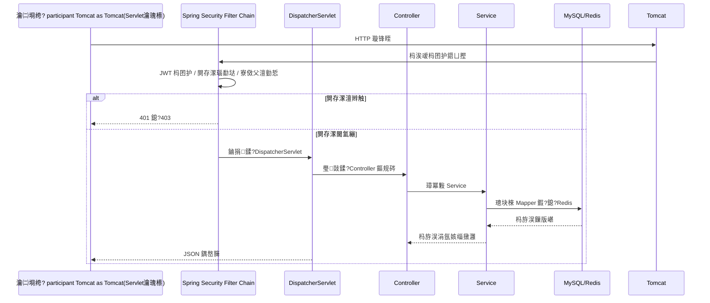

# 椤圭洰鍚姩涓庤閰嶆祦绋?
鏈枃璇存槑褰撳墠椤圭洰浠庡惎鍔ㄥ埌瑁呴厤锛屽啀鍒拌姹傚鐞嗙殑瀹屾暣閾捐矾銆?
## 1. 鍚姩鎬昏锛圱omcat -> Spring锛?
```mermaid
flowchart TD
    A["Tomcat 鍚姩 Web 搴旂敤"] --> B["鍙戠幇 WebInit<br/>AbstractAnnotationConfigDispatcherServletInitializer"]
    A --> C["鍙戠幇 SecurityWebApplicationInitializer<br/>AbstractSecurityWebApplicationInitializer"]

    B --> D["鍒涘缓 Root ApplicationContext"]
    D --> E["鍔犺浇 AppConfig"]
    E --> E1["@ComponentScan com.bilibili"]
    E --> E2["@EnableTransactionManagement"]
    E --> E3["@EnableAspectJAutoProxy"]
    E --> E4["@EnableScheduling"]
    E1 --> E5["娉ㄥ唽 JdbcConfig / MybatisPlusConfig / RedisConfig / SecurityConfig / Service 绛?]

    B --> F["鍒涘缓 DispatcherServlet"]
    F --> G["鍒涘缓 Servlet ApplicationContext"]
    G --> H["鍔犺浇 AppMvcConfig"]
    H --> H1["@EnableWebMvc"]
    H --> H2["娉ㄥ唽 MultipartResolver"]

    C --> I["鍚?Servlet 瀹瑰櫒娉ㄥ唽 DelegatingFilterProxy"]
    I --> J["浠ｇ悊鍒?bean: springSecurityFilterChain"]
    J --> K["杩囨护閾炬潵婧? SecurityConfig"]

    D -. 鐖跺鍣?.-> G
```

## 2. 瀹瑰櫒灞傜骇锛堢埗瀹瑰櫒 + 瀛愬鍣級

```mermaid
flowchart LR
    R[Root 瀹瑰櫒<br/>鏉ヨ嚜 AppConfig] --> S[Servlet 瀛愬鍣?br/>鏉ヨ嚜 AppMvcConfig]

    R1[JdbcConfig: DataSource / TxManager / DataSourceInitializer] --> R
    R2[MybatisPlusConfig: SqlSessionFactory / MapperScan] --> R
    R3[RedisConfig: LettuceConnectionFactory / StringRedisTemplate] --> R
    R4[SecurityConfig: 瀹夊叏杩囨护閾剧浉鍏?bean] --> R
    R5[Service / Mapper / Task / AOP bean] --> R

    S1[Controller] --> S
    S2[MVC HandlerMapping / HandlerAdapter] --> S

    S --> U[瀛愬鍣ㄥ彲璁块棶鐖跺鍣?bean]
    R -. 鐖跺鍣ㄤ笉鑳藉弽鍚戣闂瓙瀹瑰櫒 controller .-> X[涓嶅彲瑙乚
```

## 3. 璇锋眰閾捐矾锛堜竴娆?API 璋冪敤锛?


## 4. 浠ｇ爜瀹氫綅锛堝缓璁槄璇婚『搴忥級

1. `src/main/java/com/bilibili/config/bootstrap/WebInit.java`  
浣滅敤锛氭敞鍐?root 閰嶇疆 `AppConfig`銆乻ervlet 閰嶇疆 `AppMvcConfig`銆乁TF-8 杩囨护鍣ㄣ€佷笂浼犲弬鏁般€?
2. `src/main/java/com/bilibili/config/core/AppConfig.java`  
浣滅敤锛歳oot 瀹瑰櫒鍏ュ彛锛堟壂鎻忋€佷簨鍔°€丄OP銆佸畾鏃朵换鍔★級銆?
3. `src/main/java/com/bilibili/config/web/AppMvcConfig.java`  
浣滅敤锛歁VC 瀛愬鍣ㄥ叆鍙ｏ紙`@EnableWebMvc`銆乣MultipartResolver`锛夈€?
4. `src/main/java/com/bilibili/config/bootstrap/SecurityWebApplicationInitializer.java`  
浣滅敤锛氬悜 servlet 瀹瑰櫒娉ㄥ唽 security filter proxy銆?
5. `src/main/java/com/bilibili/config/security/SecurityConfig.java`  
浣滅敤锛氭瀯寤哄畨鍏ㄩ摼璺紙URL 瑙勫垯銆丣WT 杩囨护鍣ㄣ€丆ORS銆佸紓甯稿鐞嗭級銆?
6. `src/main/java/com/bilibili/config/data/JdbcConfig.java`  
浣滅敤锛氭暟鎹簮銆佷簨鍔＄鐞嗗櫒銆丼QL 鍒濆鍖栧櫒銆?
7. `src/main/java/com/bilibili/config/data/MybatisPlusConfig.java`  
浣滅敤锛歁yBatis-Plus 浼氳瘽宸ュ巶涓?mapper 鎵弿銆?
8. `src/main/java/com/bilibili/config/data/RedisConfig.java`  
浣滅敤锛歊edis 杩炴帴宸ュ巶涓?`StringRedisTemplate`銆?
## 5. 鍏抽敭璇存槑

- `AppConfig` 鐪嬭捣鏉モ€滅┖鈥濓紝浣嗗畠閫氳繃娉ㄨВ椹卞姩浜嗘牳蹇冭閰嶃€?- Spring Security 宸ヤ綔鍦ㄨ繃婊ゅ櫒灞傦紝涓嶄緷璧?MVC 鍐呴儴鏈哄埗鎵嶈兘娉ㄥ唽銆?- 鍗充娇娌℃湁鏄惧紡 `@Import`锛宍@ComponentScan("com.bilibili")` 浠嶄細鎵弿鍒板悇閰嶇疆绫汇€?
