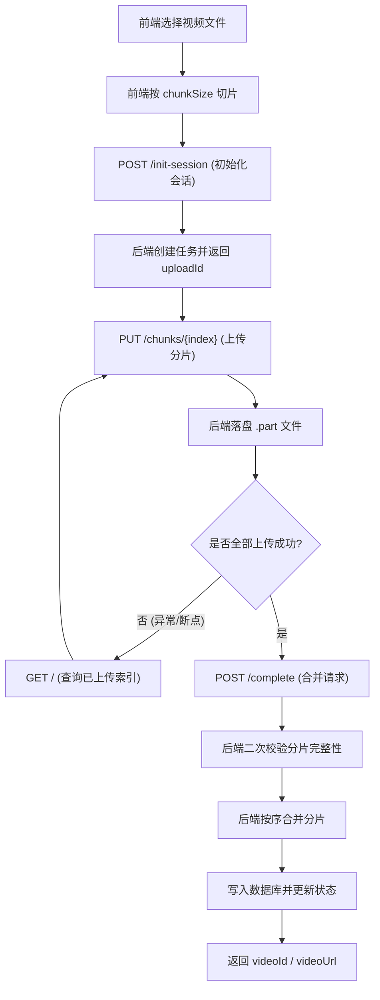

# Video 分片上传接口与闭环流程

## 1. 接口清单（`/me/videos/uploads`）

1. `POST /me/videos/uploads/init-session`  
2. `PUT /me/videos/uploads/{uploadId}/chunks/{index}`  
3. `GET /me/videos/uploads/{uploadId}`  
4. `POST /me/videos/uploads/{uploadId}/complete`  

所有接口都需要登录（Bearer Token）。

---

## 2. 接口说明

### 2.1 初始化上传

`POST /me/videos/uploads/init-session`

请求体：

```json
{
  "fileName": "demo.mp4",
  "totalSize": 10485760,
  "chunkSize": 1048576,
  "totalChunks": 10,
  "contentType": "video/mp4",
  "fileMd5": "optional-md5"
}
```

响应体（`data`）：

```json
{
  "uploadId": "0d0e9f9bbec1412f9af1b95a1d96d3e3",
  "chunkSize": 1048576,
  "totalChunks": 10,
  "expireTime": "2026-02-20T14:36:12.102"
}
```

---

### 2.2 上传分片

`PUT /me/videos/uploads/{uploadId}/chunks/{index}`  
`Content-Type: multipart/form-data`

表单字段：

- `file`: 当前分片二进制

说明：

- `index` 从 `0` 开始
- 非最后一片大小必须等于 `chunkSize`
- 最后一片大小由后端按总大小校验
- 同一分片重复上传是幂等的（同大小会直接判定成功）

---

### 2.3 查询上传状态（断点续传）

`GET /me/videos/uploads/{uploadId}`

响应体（`data`）：

```json
{
  "uploadId": "0d0e9f9bbec1412f9af1b95a1d96d3e3",
  "totalChunks": 10,
  "uploadedChunkCount": 6,
  "uploadedChunks": [0,1,2,4,5,7],
  "completed": false,
  "expireTime": "2026-02-20T14:36:12.102"
}
```

---

### 2.4 完成上传（合并并入库）

`POST /me/videos/uploads/{uploadId}/complete`

请求体：

```json
{
  "title": "我的第一个分片视频",
  "description": "demo",
  "coverUrl": "http://localhost:9000/media/cover/2026/02/19/abc.jpg",
  "duration": 120
}
```

响应体（`data`）：

```json
{
  "uploadId": "0d0e9f9bbec1412f9af1b95a1d96d3e3",
  "videoId": 1928374651203942400,
  "videoUrl": "http://localhost:9000/media/video/2026/02/19/xx.mp4"
}
```

---

## 3. 闭环流程（前后端协作）

### 3.1 流程图



### 3.2 文字流程

1. 前端切片，计算 `totalSize/chunkSize/totalChunks`  
2. 前端调用 `init` 获取 `uploadId`  
3. 前端并发/串行上传分片到 `chunks/{index}`  
4. 前端可随时调用 `GET status` 做断点续传  
5. 全部分片上传成功后调用 `complete`  
6. 后端校验分片齐全 -> 顺序合并 -> 写入 `t_video`  
7. 返回 `videoId/videoUrl`，投稿闭环完成

---

## 4. 后端关键保证

1. `uploadId` 必须归属当前登录用户（防止跨用户串改）  
2. 任务超时会过期（默认 24 小时）  
3. `complete` 会再次校验完整性，只有后端成功合并才算最终完成  
4. 合并成功后会清理临时分片目录
