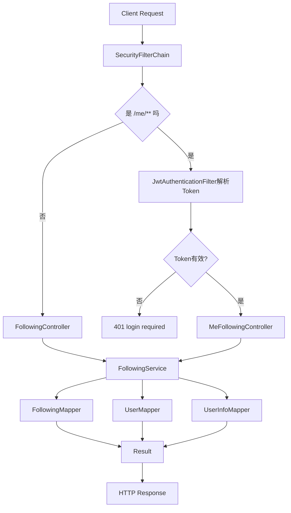

# 关注关系模块接口与调用链路说明（FollowingController / MeFollowingController）

## 1. 范围

本文覆盖以下两个控制器，并按“控制层 -> 服务层 -> 数据访问层”说明接口处理链路：

- `com.bilibili.controller.FollowingController`
- `com.bilibili.controller.MeFollowingController`

## 2. 模块总览

| 控制器 | 路径前缀 | 主要职责 |
| --- | --- | --- |
| `FollowingController` | `/users` | 查询用户的粉丝、关注、互关好友 |
| `MeFollowingController` | `/me` | 当前用户执行关注和取关 |

### 2.1 控制层到服务层映射

| 控制器方法 | Service 方法 |
| --- | --- |
| `FollowingController.followers` | `FollowingService.followersQuery(Long uid)` |
| `FollowingController.followings` | `FollowingService.followingsQuery(Long uid)` |
| `FollowingController.friends` | `FollowingService.friendsQuery(Long uid)` |
| `MeFollowingController.follow` | `FollowingService.follow(Long uid, Long targetUid)` |
| `MeFollowingController.unfollow` | `FollowingService.unfollow(Long uid, Long targetUid)` |

## 3. 接口明细

## 3.1 `GET /users/{uid}/followers`

- 控制器：`FollowingController.followers`
- 鉴权：公开接口（无需登录）
- 路径参数：`uid`
- 返回：`Result<List<FollowersQueryVO>>`

### 调用链路

1. `FollowingController.followers(uid)` 调用 `followingService.followersQuery(uid)`。
2. `FollowersService.followersQuery` 校验 `uid`。
3. 查询 `t_following`：`following_user_id = uid and status = 0`，按 `update_time desc` 排序。
4. 调 `buildUserCardListByRelations(..., true)` 将关系记录映射为用户信息卡片。
5. 返回粉丝列表。

### 涉及数据

- 表：`t_following`（查询）
- 表：`t_user_info`（批量查询用于组装返回）

## 3.2 `GET /users/{uid}/followings`

- 控制器：`FollowingController.followings`
- 鉴权：公开接口（无需登录）
- 路径参数：`uid`
- 返回：`Result<List<FollowersQueryVO>>`

### 调用链路

1. `FollowingController.followings(uid)` 调用 `followingService.followingsQuery(uid)`。
2. `FollowersService.followingsQuery` 校验 `uid`。
3. 查询 `t_following`：`user_id = uid and status = 0`，按 `update_time desc` 排序。
4. 调 `buildUserCardListByRelations(..., false)` 组装关注列表。
5. 返回关注列表。

### 涉及数据

- 表：`t_following`（查询）
- 表：`t_user_info`（批量查询用于组装返回）

## 3.3 `GET /users/{uid}/friends`

- 控制器：`FollowingController.friends`
- 鉴权：公开接口（无需登录）
- 路径参数：`uid`
- 返回：`Result<List<FollowersQueryVO>>`

### 调用链路

1. 查询“我关注的人”：`user_id = uid and status = 0`。
2. 取出我关注的 uid 集合。
3. 查询“反向关系”：`user_id in myFollowingUserIds and following_user_id = uid and status = 0`。
4. 对两批数据做交集，得到互关好友关系。
5. 使用 `buildUserCardListByRelations(..., false)` 返回好友卡片列表。

### 涉及数据

- 表：`t_following`（两次查询）
- 表：`t_user_info`（批量查询用于组装返回）

## 3.4 `POST /me/followings/{targetUid}`

- 控制器：`MeFollowingController.follow`
- 鉴权：类级 `@PreAuthorize("isAuthenticated()")`
- 路径参数：`targetUid`
- 返回：`Result<Void>`

### 调用链路

1. JWT 过滤器解析 token，将 `AuthenticatedUser` 放入 `SecurityContext`。
2. 控制器通过 `@AuthenticationPrincipal` 取当前用户 uid。
3. 调 `followingService.follow(uid, targetUid)`。
4. `FollowersService.follow` 执行参数校验（不能为空、不能关注自己）。
5. `ensureUserExists` 校验双方用户存在且状态正常。
6. 查询 `t_following` 是否已有关系：
   1. 不存在：插入新关系 `status=0`。
   2. 已存在且已关注：直接返回（幂等）。
   3. 已存在但是取关状态：更新为 `status=0`。
7. 调 `increaseFollowStats` 更新 `t_user_info` 计数字段：
   - 当前用户 `following_count + 1`
   - 目标用户 `follower_count + 1`

### 涉及数据

- 表：`t_following`（插入或更新）
- 表：`t_user`（存在性校验）
- 表：`t_user_info`（计数更新）
- 事务：`@Transactional(rollbackFor = Exception.class)`

## 3.5 `DELETE /me/followings/{targetUid}`

- 控制器：`MeFollowingController.unfollow`
- 鉴权：类级 `@PreAuthorize("isAuthenticated()")`
- 路径参数：`targetUid`
- 返回：`Result<Void>`

### 调用链路

1. 控制器拿到当前登录 uid 后调用 `followingService.unfollow(uid, targetUid)`。
2. `FollowersService.unfollow` 校验参数并校验双方用户存在。
3. 更新 `t_following`：`status: 0 -> 1`。
4. 如果更新行为 `0` 行，直接返回（幂等，表示原本就没关注或已取消）。
5. 更新成功时调用 `decreaseFollowStats`：
   - 当前用户 `following_count - 1`（最小不低于 0）
   - 目标用户 `follower_count - 1`（最小不低于 0）

### 涉及数据

- 表：`t_following`（更新）
- 表：`t_user`（存在性校验）
- 表：`t_user_info`（计数更新）
- 事务：`@Transactional(rollbackFor = Exception.class)`

## 4. 鉴权与错误码约定

## 4.1 鉴权入口

- `/users/{uid}/followers`、`/users/{uid}/followings`、`/users/{uid}/friends`：公开。
- `/me/followings/{targetUid}`（POST/DELETE）：需要登录（JWT）。

## 4.2 统一返回结构

所有接口返回 `Result<T>`：

- 成功：`{"code":0,"message":"OK","data":...}`
- 失败：`{"code":错误码,"message":"错误信息","data":null}`

## 4.3 常见错误

- 400：参数错误或业务非法（如 `uid` 非法、关注自己）
- 401：未登录访问 `/me/**`
- 403：已登录但权限不足
- 500：服务内部异常（例如更新计数失败）

## 5. 关注关系端到端链路图

## 6. 备注（当前实现边界）

- 当前查询接口返回的是列表，不分页。
- 关注关系采用 `status` 软状态：`0` 表示关注中，`1` 表示已取消关注。
- 关注/取关做了幂等处理，避免重复操作导致异常。
- 互关好友查询通过两次关系查询 + 交集实现，数据量较大时可考虑专用 SQL 优化。
