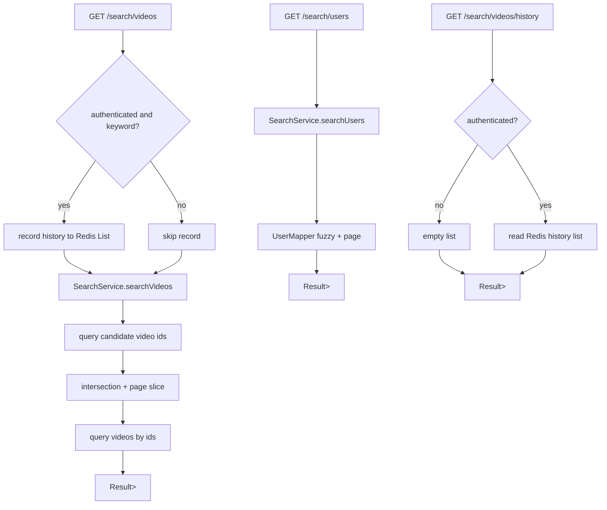

# 搜索模块接口与调用链路说明（SearchController）

## 1. 范围

本文覆盖以下控制器与服务链路，并按“控制层 -> 服务层 -> 数据访问层/缓存层”说明处理流程：

- `com.bilibili.controller.SearchController`
- `com.bilibili.service.SearchService`
- `com.bilibili.service.impl.SearchServiceImpl`

## 2. 模块总览

| 控制器 | 路径前缀 | 主要职责 |
| --- | --- | --- |
| `SearchController` | `/search` | 视频搜索、用户搜索、当前用户视频搜索历史 |

### 2.1 控制层到服务层映射

| 控制器方法 | Service 方法 |
| --- | --- |
| `searchVideos` | `SearchService.searchVideos(String keyword, Long categoryId, PageQueryDTO pageQuery)` + 条件触发 `recordVideoSearchHistory` |
| `searchUsers` | `SearchService.searchUsers(String nickname, String timeOrder, PageQueryDTO pageQuery)` |
| `listMyVideoSearchHistory` | `SearchService.listVideoSearchHistory(Long uid)` |

## 3. 接口明细

## 3.1 `GET /search/videos`

- 控制器：`SearchController.searchVideos`
- 鉴权：公开接口（可选登录态）
- 查询参数：
  - `keyword`（可选）
  - `categoryId`（可选）
  - `pageNo`、`pageSize`
- 返回：`Result<List<VideoVO>>`

### 调用链路

1. 控制器先判断是否需要记录历史：
   1. 当前用户已登录
   2. `keyword` 非空白
2. 满足条件时调用 `recordVideoSearchHistory(uid, keyword)` 写 Redis 历史。
3. 调用 `searchService.searchVideos(keyword, categoryId, pageQuery)` 执行检索。
4. `SearchServiceImpl.searchVideos` 校验至少有一个检索条件（`keyword` 或 `categoryId`）。
5. 构建候选集：
   1. `keyword` 条件：`VideoMapper.selectPublishedVideoIdsByTitle`
   2. `categoryId` 条件：`VideoMapper.selectPublishedVideoIdsByCategoryId`
6. 多条件时做交集保留；单条件时直接使用该条件结果。
7. 在候选 ID 上做内存分页，得到当前页 `videoId` 列表。
8. `VideoMapper.selectPublishedVideosByIds` 批量查详情并返回。

### 涉及数据

- 表：`t_video`、`t_video_tag`、`t_tag`、`t_user_info`
- Redis（登录且有 keyword 时）：`search:history:video:{uid}`

### 关键行为

- `keyword` 与 `categoryId` 是“AND”语义（交集），不是“OR”语义。
- 候选集有上限（按页大小放大后再截断），避免大范围扫描。

## 3.2 `GET /search/users`

- 控制器：`SearchController.searchUsers`
- 鉴权：公开接口
- 查询参数：
  - `nickname`（必填）
  - `timeOrder`（可选，默认 `asc`，可选 `asc/desc`）
  - `pageNo`、`pageSize`
- 返回：`Result<PageVO<UserSearchVO>>`

### 调用链路

1. 控制器调用 `searchService.searchUsers(...)`。
2. 服务层校验：
   1. `nickname` 非空白
   2. `timeOrder` 仅允许 `asc/desc`
3. 构造 MyBatis-Plus `Page` 分页对象。
4. `UserMapper.selectUsersByNickname` 联表 `t_user + t_user_info` 执行模糊查询并分页返回。

### 涉及数据

- 表：`t_user`、`t_user_info`

## 3.3 `GET /search/videos/history`

- 控制器：`SearchController.listMyVideoSearchHistory`
- 鉴权：公开接口（可选登录态）
- 返回：`Result<List<String>>`

### 调用链路

1. 若未登录（`currentUser == null`），控制器直接返回空列表，不进入服务层。
2. 若已登录，调用 `searchService.listVideoSearchHistory(uid)`。
3. 服务层从 Redis 列表读取最近 N 条关键字并返回（为空时返回空数组）。

### 涉及数据

- Redis：`search:history:video:{uid}`

### 关键行为

- 该接口不是强制登录接口，但“匿名访问固定返回空数组”。

## 4. 搜索历史缓存策略

写入逻辑（`recordVideoSearchHistory`）：

1. `LPUSH` 新关键字到列表头部
2. `LTRIM` 仅保留最近 `10` 条
3. `EXPIRE` 过期时间 `1` 小时

读取逻辑（`listVideoSearchHistory`）：

1. `LRANGE 0..9` 读取最近记录
2. 结果为空时返回空列表

## 5. 鉴权与错误码约定

## 5.1 鉴权入口

- `/search/**` 在安全配置中是公开 GET 路径。
- 但登录态会影响行为：
  - `/search/videos`：登录用户会记录 keyword 历史
  - `/search/videos/history`：登录用户返回个人历史，匿名返回空

## 5.2 统一返回结构

所有接口返回 `Result<T>`：

- 成功：`{"code":0,"message":"OK","data":...}`
- 失败：`{"code":错误码,"message":"错误信息","data":null}`

## 5.3 常见错误

- 400：
  - `at least one search condition is required`
  - `categoryId is invalid`
  - `nickname is required`
  - `timeOrder must be asc or desc`
- 500：内部异常

## 6. 关键实现边界

- 视频搜索返回 `List<VideoVO>`（非 `PageVO`），分页是在候选 ID 上手工切片后再回表。
- 历史记录目前不去重，同一关键词可重复出现多次。
- 搜索历史仅实现了“视频”域（`DOMAIN_VIDEO`）的读写。

## 7. 端到端链路图

