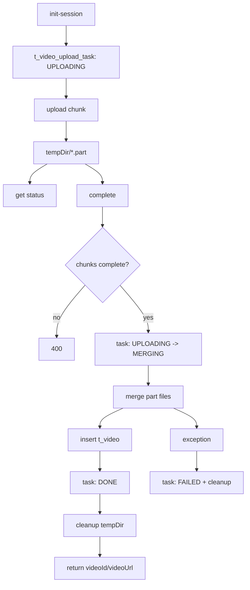

# 视频上传模块接口与调用链路说明（MeVideoUploadController）

> 注意：本文档描述的是旧的“Spring Boot 接收分片并本地落盘”实现。当前代码已经改为 MinIO Multipart 直传，
> 实际接口和链路请以
> [`src/main/resources/doc/not-frontend-exposed/存储模块-MinIO Multipart直传改造方案.md`](/home/huangnv/biliibli/bilibili_SpringBoot/src/main/resources/doc/not-frontend-exposed/存储模块-MinIO%20Multipart直传改造方案.md)
> 以及 `com.bilibili.upload.video` 包下现有代码为准。

## 1. 范围

本文覆盖以下控制器与服务链路，并按“控制层 -> 服务层 -> 数据访问层 -> 文件存储”说明处理流程：

- `com.bilibili.upload.video.controller.MeVideoUploadController`
- `com.bilibili.upload.video.service.VideoUploadService`
- `com.bilibili.upload.video.service.impl.VideoUploadServiceImpl`
- `com.bilibili.storage.multipart.MultipartObjectStorageService`

## 2. 模块总览

| 控制器 | 路径前缀 | 主要职责 |
| --- | --- | --- |
| `MeVideoUploadController` | `/me/videos/uploads` | 分片上传会话初始化、分片写入、上传状态查询、合并发布视频 |

补充上传入口：

- `POST /me/uploads/video-cover`：上传视频封面，返回封面 URL

### 2.1 控制层到服务层映射

| 控制器方法 | Service 方法 |
| --- | --- |
| `initUpload` | `VideoUploadService.initUpload(Long uid, VideoUploadInitDTO dto)` |
| `uploadChunk` | `VideoUploadService.uploadChunk(Long uid, String uploadId, Integer index, MultipartFile file)` |
| `getUploadStatus` | `VideoUploadService.getUploadStatus(Long uid, String uploadId)` |
| `completeUpload` | `VideoUploadService.completeUpload(Long uid, String uploadId, VideoUploadCompleteDTO dto)` |

## 3. 接口明细

## 3.1 `POST /me/videos/uploads/init-session`

- 控制器：`MeVideoUploadController.initUpload`
- 鉴权：类级 `@PreAuthorize("isAuthenticated()")`
- 请求体：`VideoUploadInitDTO`

```json
{
  "fileName": "lesson01.mp4",
  "totalSize": 10485760,
  "chunkSize": 1048576,
  "totalChunks": 10,
  "contentType": "video/mp4",
  "fileMd5": "optional"
}
```

- 返回：`Result<VideoUploadInitVO>`

### 调用链路

1. 控制器从 `@AuthenticationPrincipal` 取当前 uid。
2. `VideoUploadServiceImpl.initUpload` 校验参数：
   1. `uid`、请求体有效
   2. `fileName/totalSize/chunkSize/totalChunks` 正数且匹配
   3. 大小不超过 `storage.video.maxSize`
   4. `contentType` 在允许白名单中
3. 生成 `uploadId`，过期时间为当前时间 +24h。
4. 插入 `t_video_upload_task`，状态置为 `UPLOADING(0)`，记录临时目录。
5. 创建临时目录并返回上传初始化信息。

### 涉及数据

- 表：`t_video_upload_task`（插入）
- 文件系统：`tmp/{videoSubDir}/{uid}/{uploadId}`

## 3.2 `PUT /me/videos/uploads/{uploadId}/chunks/{index}`

- 控制器：`MeVideoUploadController.uploadChunk`
- 鉴权：
  - 类级 `isAuthenticated()`
  - 方法级 `@PreAuthorize("@authz.canAccessUploadTask(authentication, #uploadId)")`
- 请求：`multipart/form-data`，参数 `file`
- 返回：`Result<Void>`

### 调用链路

1. 通过 `AuthzService.canAccessUploadTask` 先校验上传任务归属。
2. 服务层校验 `uid/index/file`。
3. `getOwnedTask` 二次校验任务存在、归属、未过期。
4. `ensureTaskUploadable` 要求状态为 `UPLOADING`。
5. 校验分片索引范围与目标分片大小。
6. 分片落盘流程（由 `VideoUploadStorageService` 执行）：
   1. 先写 `index.part.tmp`
   2. 再原子移动为 `index.part`
7. 若目标分片已存在且大小正确，直接返回（幂等）。

### 涉及数据

- 表：`t_video_upload_task`（读取）
- 文件系统：分片文件写入

## 3.3 `GET /me/videos/uploads/{uploadId}`

- 控制器：`MeVideoUploadController.getUploadStatus`
- 鉴权：同 3.2（登录 + 任务归属校验）
- 返回：`Result<VideoUploadStatusVO>`

### 调用链路

1. 校验任务归属并读取任务记录。
2. 扫描临时目录 `*.part`，解析已上传分片下标并排序。
3. 返回：
   1. `totalChunks`
   2. `uploadedChunks`
   3. `uploadedChunkCount`
   4. `completed`（状态是否为 `DONE`）
   5. `expireTime`

### 涉及数据

- 表：`t_video_upload_task`（读取）
- 文件系统：分片目录读取

## 3.4 `POST /me/videos/uploads/{uploadId}/complete`

- 控制器：`MeVideoUploadController.completeUpload`
- 鉴权：同 3.2（登录 + 任务归属校验）
- 请求体：`VideoUploadCompleteDTO`

```json
{
  "title": "SpringBoot 入门",
  "description": "第1集",
  "coverUrl": "http://example.com/cover.jpg",
  "duration": 600
}
```

- 返回：`Result<VideoUploadCompleteVO>`

### 调用链路

1. 校验用户、任务归属、请求参数。
2. 若任务已经是 `DONE`，直接返回已有结果（幂等）。
3. 校验任务可上传，校验标题长度与分片完整性。
4. 状态 CAS 抢占合并权：`UPLOADING -> MERGING`。
5. 通过 `VideoUploadStorageService` 合并分片到最终文件（`video/yyyy/MM/dd/{uuid}.ext`）。
6. 插入 `t_video`（发布视频，初始化播放/点赞/评论计数）。
7. 更新上传任务为 `DONE`，回填 `finalVideoId/finalVideoUrl`。
8. 清理临时目录并返回发布结果。
9. 异常分支：标记任务为 `FAILED`，并尝试清理最终文件。

### 涉及数据

- 表：`t_video_upload_task`（状态流转）
- 表：`t_video`（发布入库）
- 文件系统：分片合并、临时文件清理
- 事务：`@Transactional(rollbackFor = Exception.class)`（DB 事务 + 文件补偿）

## 4. 上传任务状态机

| 状态码 | 枚举 | 含义 |
| --- | --- | --- |
| 0 | `UPLOADING` | 上传中，可继续上传分片 |
| 1 | `MERGING` | 合并中 |
| 2 | `DONE` | 完成，已落库视频 |
| 3 | `EXPIRED` | 过期 |
| 4 | `FAILED` | 失败 |

## 5. 鉴权与错误码约定

## 5.1 鉴权入口

- `/me/videos/uploads/**` 全部要求登录。
- `/{uploadId}` 相关接口额外校验任务归属（`@authz.canAccessUploadTask`）。

## 5.2 统一返回结构

所有接口返回 `Result<T>`：

- 成功：`{"code":0,"message":"OK","data":...}`
- 失败：`{"code":错误码,"message":"错误信息","data":null}`

## 5.3 常见错误

- 400：参数错误、分片不完整、任务状态非法、任务过期
- 401：未登录访问 `/me/**`
- 403：访问他人的上传任务
- 500：合并或发布过程异常

## 6. 关键实现边界

- 仅支持分片完整后统一合并发布，不支持断点秒传去重（`fileMd5` 当前未参与去重）。
- 文件路径通过 `resolveFromRoot` 做目录穿越防护。
- 文件系统与数据库无法天然原子一致，当前通过失败补偿降低残留风险。

## 7. 端到端链路图


