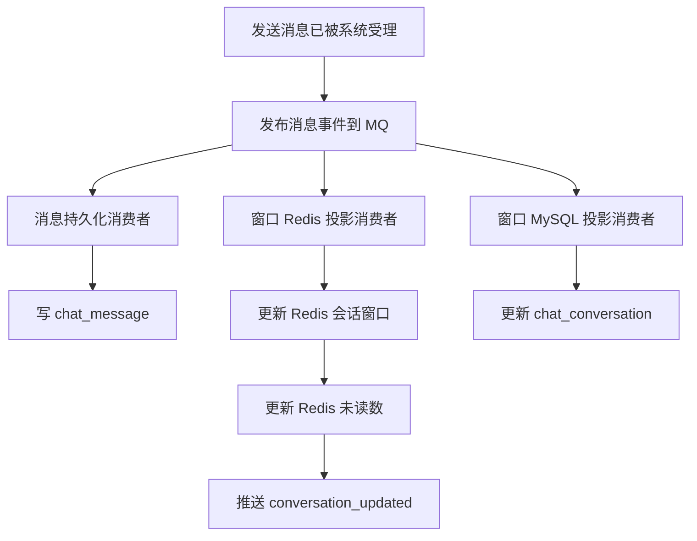
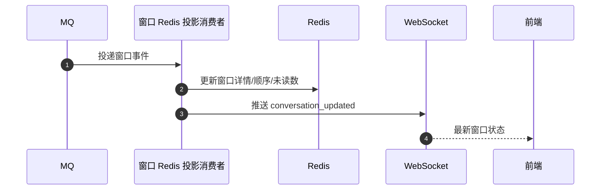
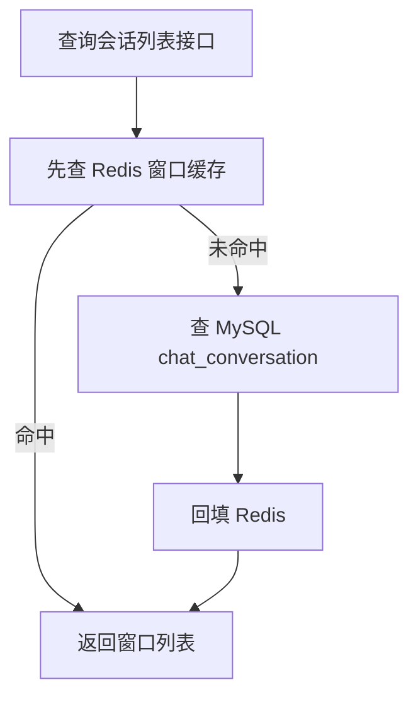

# IM 会话窗口 Redis-MySQL 双投影方案

本文档描述的是会话窗口的推荐演进方案：

- 消息历史仍以 MySQL 为真相源
- 会话窗口走 Redis 快路径
- `chat_conversation` 走 MySQL 异步投影收敛

本文档讨论的是窗口层，不是消息正文持久化层。

## 1. 目标

当前会话窗口关注的是：

- `lastMessage`
- `lastMessageTime`
- `unreadCount`
- 最近窗口顺序

这些字段本质上都属于“投影状态”，用户对实时性很敏感。

因此窗口层更适合：

- Redis 负责实时投影和快速推送
- MySQL `chat_conversation` 负责异步收敛和兜底持久化

## 2. 核心原则

### 2.1 消息正文与窗口状态分开处理

- `chat_message`：消息历史主存，必须优先保证持久化
- `chat_conversation`：窗口投影，不必阻塞实时推送

### 2.2 窗口不必等 MySQL 写完再推送

如果窗口推送完全依赖 `chat_conversation` 更新完成，再读取库中状态推送，那么窗口实时性会被 MySQL 写入速度限制。

更合适的方式是：

- 窗口 Redis 投影先更新
- 直接根据 Redis 中的窗口状态进行推送
- MySQL `chat_conversation` 异步收敛

## 3. 推荐架构

同一条消息事件进入 MQ 后，分发成多条职责明确的消费链：

1. 消息持久化消费者
2. 会话窗口 Redis 投影消费者
3. 会话窗口 MySQL 投影消费者

其中：

- 消息持久化消费者负责 `chat_message`
- Redis 投影消费者负责窗口快路径和推送
- MySQL 投影消费者负责 `chat_conversation`

## 4. 总体流程图

## 5. 各消费者职责

### 5.1 消息持久化消费者

职责：

- 持久化 `chat_message`
- 保证消息历史可靠落库

特点：

- 这条链是消息正文真相源
- 不和窗口快路径耦合

### 5.2 窗口 Redis 投影消费者

职责：

- 更新 Redis 会话窗口缓存
- 更新 Redis 未读数
- 更新最近窗口顺序
- 直接推送 `conversation_updated`

特点：

- 这是窗口实时体验的核心链路
- 不依赖 `chat_conversation` 写完才推送

### 5.3 窗口 MySQL 投影消费者

职责：

- 把窗口状态异步投影到 `chat_conversation`

特点：

- 负责最终收敛
- 负责缓存失效或 Redis 丢失后的兜底恢复基础

## 6. Redis 窗口快路径

### 6.1 写入流程

### 6.2 读取流程

## 7. 为什么不建议“只靠定时回写 MySQL”

如果只做：

- Redis 快速更新
- 定时任务稍后批量刷回 MySQL

会有这些问题：

1. `chat_conversation` 可能长期落后
2. Redis 一旦失效，回源 MySQL 会看到旧窗口状态
3. 排障时很难判断到底是窗口事件没更新，还是定时任务没刷到

所以更推荐：

- Redis 快路径消费者实时更新
- MySQL 投影消费者同步消费同一事件
- 定时任务只做对账和兜底

## 8. 为什么不建议按“缓存命中/未命中”切两套主流程

不推荐：

- 缓存命中时只写 Redis
- 缓存未命中时才写 MySQL

原因：

- 缓存是否存在只是基础设施状态，不应决定业务主流程
- 同一条窗口变更如果走两套不同状态机，排障会非常困难

推荐：

- 无论缓存命中与否
- 窗口 Redis 投影和窗口 MySQL 投影都消费同一事件

## 9. 幂等与顺序

该方案落地时必须考虑两件事：

### 9.1 幂等

Redis 投影消费者和 MySQL 投影消费者都应支持重复消费不出错。

例如：

- 同一条窗口事件重复到达
- 不应导致未读数乱加、窗口顺序乱跳

### 9.2 顺序

同一会话的窗口事件最好保证顺序稳定。

否则可能出现：

- 较旧事件覆盖较新窗口状态

常见防护方式：

- 按 `conversationId` 做顺序消费约束
- 或更新时用 `lastMessageTime` 做新旧比较，只允许新事件覆盖旧状态

## 10. 推荐落地顺序

建议按下面顺序逐步实现：

1. 保持 `chat_message` 仍然优先持久化
2. 会话列表查询先接 Redis cache-aside
3. 新增窗口 Redis 投影消费者
4. 窗口推送改为基于 Redis 投影结果
5. 保留窗口 MySQL 投影消费者做异步收敛
6. 最后补充对账和兜底任务

## 11. 总结

这套方案的核心不是“Redis 取代 MySQL”，而是：

- 消息历史仍然交给 MySQL
- 会话窗口改走 Redis 快路径
- `chat_conversation` 改成异步收敛投影

一句话概括：

- `chat_message` 负责可靠
- Redis 窗口投影负责实时
- `chat_conversation` 负责最终收敛

这样既不会把窗口体验卡死在 MySQL 上，也不会让窗口状态完全失去持久化落点。
