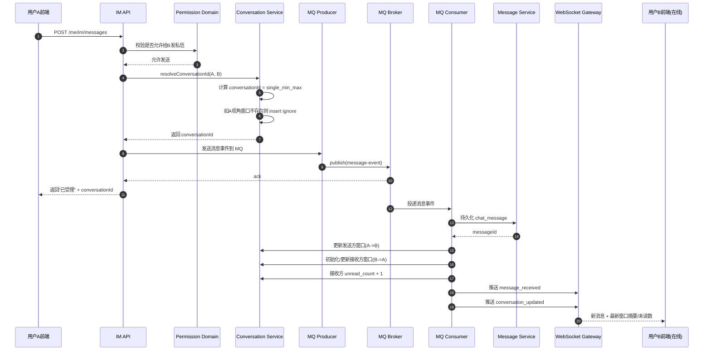
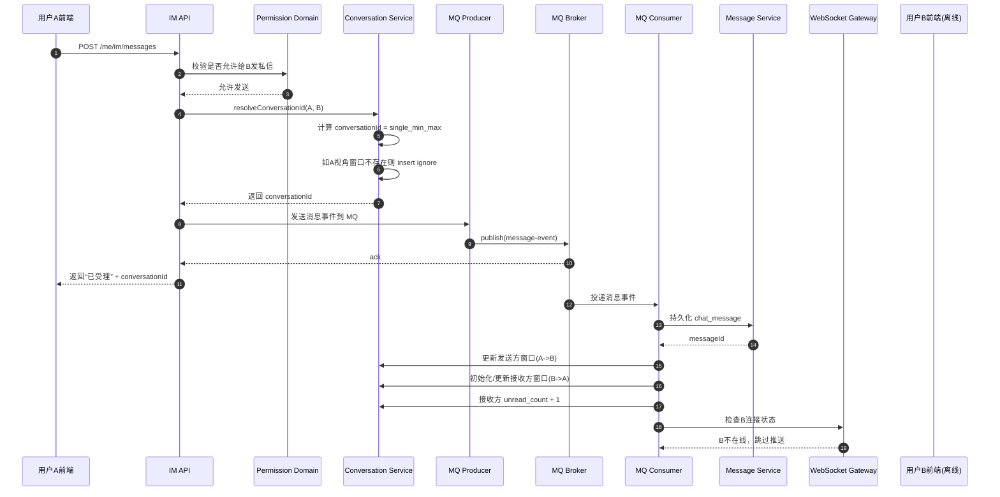
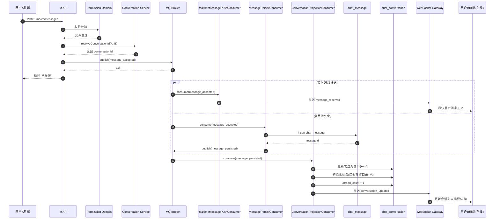
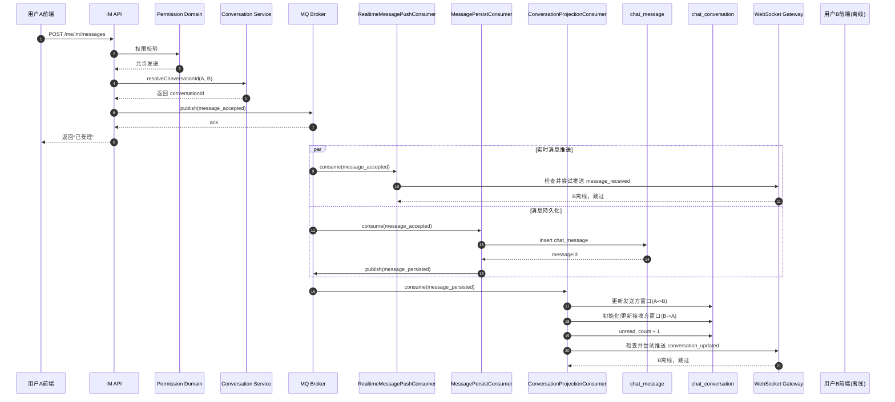

# IM 消息发送时序说明

本文档描述的是当前讨论中准备落地的 IM 发送方案，不是“当前代码已完全实现的现状”，而是后续接入 MQ 与 WebSocket 时建议采用的目标流程。

## 1. 前提约定

### 1.1 发送成功语义

发送成功 = 消息已被系统受理。

具体指：

1. 通过权限校验。
2. 成功得到共享 `conversationId`。
3. 成功把消息事件投递到 MQ。

注意：

- 这不等于“消息已经持久化到 MySQL”。
- 这也不等于“对方已经收到并展示”。

### 1.2 conversationId 规则

单聊统一按如下规则计算：

```text
single_{min(senderId, receiverId)}_{max(senderId, receiverId)}
```

例如：

- A=1001，B=1002
- 则共享会话 ID 为：`single_1001_1002`

### 1.3 chat_conversation 的定位

`chat_conversation` 是“用户视角的窗口表”。

同一段单聊通常会有两条窗口记录：

- 一条属于 A 视角：`owner_user_id=A, target_id=B`
- 一条属于 B 视角：`owner_user_id=B, target_id=A`

它们共用同一个 `conversation_id`。

### 1.4 MQ 前后职责边界

MQ 前（同步受理阶段）：

1. 权限校验
2. 计算 `conversationId`
3. 如发送方窗口不存在，则初始化发送方窗口
4. 组装消息事件
5. 投递 MQ
6. HTTP 返回“已受理”

MQ 后（异步消费阶段）：

1. 持久化消息到 `chat_message`
2. 更新发送方窗口
3. 初始化或更新接收方窗口
4. 增加接收方未读数
5. 如接收方在线，则通过 WebSocket 推送窗口更新/消息更新

### 1.5 当前推荐的事件链版本

如果目标优先级是：

- HTTP 尽快返回“已受理”
- 接收方尽快看到消息正文
- 会话窗口和未读允许稍后收敛

则更适合采用“三阶段事件链”而不是“单消费者包办全部逻辑”。

这里的“三阶段”指的是三类异步职责，不一定要求一开始就拆成三个独立可横向扩容的大型模块，但职责边界要先按这三段设计：

1. 实时消息推送阶段
2. 消息持久化阶段
3. 会话窗口投影阶段

## 2. 参与角色

- 用户 A：发送方
- 用户 B：接收方
- IM API：HTTP 接口层
- Permission Domain：私信权限校验
- Conversation Service：会话窗口初始化与更新
- MQ Producer：消息事件生产者
- MQ Broker：消息队列
- MQ Consumer：消息异步消费者
- Message Service：消息持久化服务
- WebSocket Gateway：WebSocket 推送通道
- Frontend B：接收方前端

如果采用三阶段事件链，可以进一步细分为：

- RealtimeMessagePushConsumer：尽快向在线接收方推消息正文
- MessagePersistConsumer：持久化 `chat_message`
- ConversationProjectionConsumer：更新 `chat_conversation` 和未读数

---

## 3. 场景一：用户 B 在线

### 3.1 总体说明

B 在线时，消息的“真实状态”仍然先由后端异步更新数据库，然后再通过 WebSocket 把最新窗口和消息推送给 B 的前端。

也就是说：

- 先落库、更新窗口
- 再推 WebSocket

不要反过来。

### 3.2 时序图



### 3.3 关键点拆解

#### MQ 前

用户 A 发消息时：

1. 先做权限校验。
2. 计算共享 `conversationId`。
3. 如果 A 自己的窗口不存在，则初始化一条 A 视角窗口。
4. 只要消息事件成功投递到 MQ，就返回“发送成功（已受理）”。

#### MQ 后

消费者拿到事件后：

1. 把消息插入 `chat_message`。
2. 更新 A 的窗口：
   - `last_message`
   - `last_message_time`
   - `unread_count = 0`
3. 更新 B 的窗口：
   - 不存在则创建
   - 更新 `last_message`
   - 更新 `last_message_time`
   - `unread_count = unread_count + 1`
4. 最后通过 WebSocket 把变化推给 B。

### 3.4 B 在线时，前端是否要再查 MySQL

通常不需要立刻再查。

原因：

- 后端已经把最新窗口 DTO 和消息 DTO 通过 WebSocket 推给了 B。
- B 的前端可以直接用推送内容更新本地会话列表和当前聊天窗口。

但这不意味着永远不查库。

仍然需要查库的场景：

- 页面刷新
- WebSocket 断线重连
- 补历史消息
- 首次进入会话列表页

---

## 4. 场景二：用户 B 离线

### 4.1 总体说明

B 离线时，MQ 后半段仍然要完成消息持久化和窗口更新，只是最后不会有实时 WebSocket 推送。

这意味着：

- MySQL 里已经有消息
- B 的窗口也已经更新
- B 下次上线后通过拉取接口或重连同步得到最新状态

### 4.2 时序图



### 4.3 B 离线时的结果

虽然没有实时推送，但后端状态已经更新完成：

1. `chat_message` 中已经有这条消息。
2. B 的 `chat_conversation` 已经存在或被更新。
3. `unread_count` 已经增加。

因此 B 后续上线时只要拉会话列表或消息列表接口，就能看到：

- 新的会话摘要
- 更新后的未读数
- 之前离线期间收到的消息

---

## 5. 两种场景的核心差异

| 维度 | B 在线 | B 离线 |
| --- | --- | --- |
| HTTP 返回给 A | 已受理 | 已受理 |
| MQ 是否消费 | 是 | 是 |
| 消息是否落库 | 是 | 是 |
| 接收方窗口是否更新 | 是 | 是 |
| 未读数是否增加 | 是 | 是 |
| WebSocket 是否实时推送给 B | 是 | 否 |
| B 是否立即在前端看到消息 | 是 | 否 |
| B 后续如何看到消息 | WebSocket 实时更新 | 下次上线后拉接口恢复 |

---

## 6. 三消费者事件链版本

本节描述的是更贴近真实 IM 系统的版本。

核心思想：

- 消息正文优先尽快到达前端
- 消息持久化是主事实
- 会话窗口和未读数是派生投影

### 6.1 事件链定义

建议使用两类 MQ 事件：

1. `message_accepted`
   含义：HTTP 已受理，已通过权限校验，已拿到 `conversationId`
2. `message_persisted`
   含义：消息已经成功写入 `chat_message`

基于这两类事件，形成三段处理链：

1. `RealtimeMessagePushConsumer`
   - 消费 `message_accepted`
   - 尽快 WebSocket 推送消息正文给在线接收方
   - 不修改数据库
   - 推送失败不影响主流程

2. `MessagePersistConsumer`
   - 消费 `message_accepted`
   - 把消息写入 `chat_message`
   - 成功后继续投递 `message_persisted`

3. `ConversationProjectionConsumer`
   - 消费 `message_persisted`
   - 更新发送方窗口
   - 初始化或更新接收方窗口
   - 增加接收方未读数
   - 可在更新完成后再通过 WebSocket 推送 `conversation_updated`

### 6.2 在线场景时序图



### 6.3 离线场景时序图



### 6.4 为什么这样拆

这样拆的原因不是为了“为了拆而拆”，而是为了明确三种不同性质的工作：

1. 消息正文推送
   - 追求尽快
   - 可以 best effort
   - 失败不影响主事实成立

2. 消息持久化
   - 是主事实
   - 必须成功
   - 必须幂等

3. 会话窗口投影
   - 是基于主事实生成的派生状态
   - 可以比消息正文稍慢
   - 但最终必须收敛

### 6.5 这样设计是不是对的

结论：对，而且是合理的演进方向。

它比“单消费者事务后统一推送”更实时，也更接近成熟 IM 的思路。

但它不是零成本的。要把它做好，至少要补齐以下约束：

1. 每条消息都要有稳定幂等键
   - 建议至少有 `clientMessageId`
   - 后续消息落库、窗口更新、WebSocket 去重都依赖它

2. `ConversationProjectionConsumer` 不能直接消费 `message_accepted`
   - 它必须消费 `message_persisted`
   - 否则会出现“窗口已更新，但消息还没真正入库”的脏状态

3. WebSocket 推送要允许失败
   - 不能因为接收方不在线或连接异常而回滚数据库主流程

4. 前端必须按“最终收敛”设计
   - `message_received` 和 `conversation_updated` 分开处理
   - 不假设固定到达顺序

### 6.6 优化空间

当前这版设计还有这些值得提前考虑的优化点：

1. 给 `message_accepted` 加事件唯一键
   - 例如 `eventId`
   - 便于 MQ 消费幂等和排查问题

2. 给 `chat_message` 增加 `client_message_id`
   - 发送端本地乐观更新、服务端确认、重复消费去重都会更顺

3. WebSocket 推送消息正文时，最好带消息状态
   - 例如 `PUSHED` / `PERSISTED`
   - 前端可以把早到的正文先视为临时已接收，再等最终确认

4. 会话窗口事件最好带完整快照而不是局部 patch
   - 例如直接带 `conversationId`、`lastMessage`、`lastMessageTime`、`unreadCount`
   - 这样前端更容易直接覆盖更新

5. 同一 `conversationId` 的持久化顺序要控制
   - 否则并发消息可能导致消息顺序和窗口摘要错乱
   - 常见做法是按 `conversationId` 做局部有序消费

6. 发送者前端仍建议保留 local echo
   - 这样发送者体验最好
   - 不必等待任何下游消费者

### 6.7 当前项目最务实的落地建议

如果现在就开始写代码，建议按下面的顺序逐步落地，而不是一次把复杂度拉满：

1. 先定义 `message_accepted` / `message_persisted` 两类事件 DTO
2. 先实现 `MessagePersistConsumer`
3. 再实现 `ConversationProjectionConsumer`
4. 最后再补 `RealtimeMessagePushConsumer`

原因很直接：

- 主事实和派生状态先稳定
- 实时推送最后接入
- 出问题时更容易定位

## 6. 什么时候更新窗口，什么时候通知前端

正确顺序必须是：

```text
消息落库 -> 窗口更新 -> WebSocket 推送前端
```

而不是：

```text
先推前端 -> 再更新数据库
```

原因：

- 如果先推送，前端立刻刷新接口时可能查到旧数据。
- 这样会导致前端看到的会话列表和数据库状态短暂不一致。

因此统一原则是：

1. 后端先完成数据库状态变更。
2. 再通过 WebSocket 把最新结果推给在线前端。

---

## 7. 建议推送给前端的事件

推荐拆成两类：

### 7.1 `message_received`

用于当前聊天窗口直接插入消息气泡。

建议字段：

- `conversationId`
- `senderId`
- `receiverId`
- `messageType`
- `content`
- `sendTime`
- `messageId`

### 7.2 `conversation_updated`

用于会话列表更新摘要、时间和未读数。

建议字段：

- `conversationId`
- `ownerUserId`
- `targetId`
- `lastMessage`
- `lastMessageTime`
- `unreadCount`

---

## 8. 一句话总结

### B 在线

消息被系统受理后进入 MQ，消费者落库并更新双方窗口，最后通过 WebSocket 把消息和窗口摘要直接推给 B 前端，B 不必为这次变化立刻查 MySQL。

### B 离线

消息仍然会被消费者落库并更新 B 的窗口与未读数，只是不会实时推送；B 下次上线时再通过接口从 MySQL 恢复窗口和消息状态。
