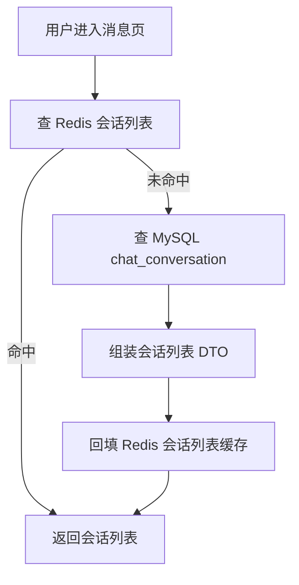
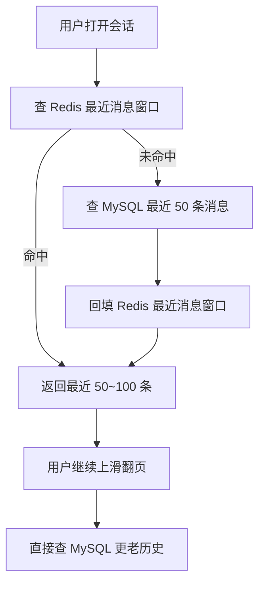
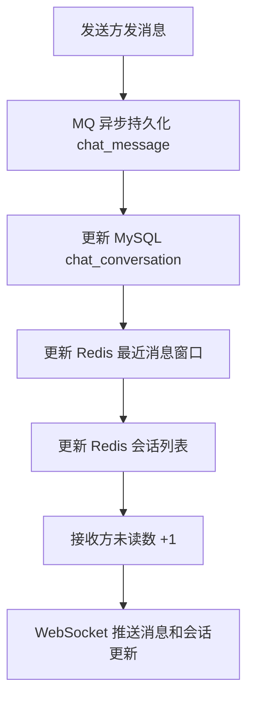
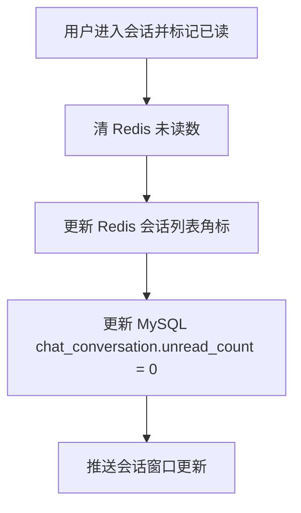

# IM 缓存策略说明

本文档描述的是当前 IM 模块更适合采用的 Redis + MySQL 缓存策略，重点覆盖以下三类热点数据：

1. 会话列表缓存
2. 未读数缓存
3. 最近 50~100 条消息缓存

本文档讨论的是推荐落地方向，不等于“当前代码已全部实现”。

## 1. 设计目标

### 1.1 核心原则

- MySQL 负责全量历史、正式持久化、最终一致数据
- Redis 负责热点数据、实时状态、高频读写加速
- Redis 不是聊天记录唯一真相源

### 1.2 为什么不是“全量历史都缓存”

深历史消息的访问频率通常不高，用户真正高频查看的是：

- 消息页里的会话列表
- 每个会话的未读数
- 当前会话最近一屏消息

因此更适合缓存热点窗口，而不是缓存整张消息表。

## 2. 缓存范围

### 2.1 会话列表缓存

缓存内容建议包括：

- `conversationId`
- `targetId`
- `targetName`
- `targetAvatar`
- `lastMessage`
- `lastMessageTime`
- `unreadCount`

推荐用途：

- 用户进入消息首页时优先读取
- WebSocket 推送 `conversation_updated` 后同步更新

### 2.2 未读数缓存

缓存内容建议包括：

- 每个用户的各会话未读数
- 可选地维护一个总未读数

推荐用途：

- 会话列表展示未读角标
- 顶部消息入口展示总未读数
- 已读时快速清零

### 2.3 最近 50~100 条消息缓存

缓存内容建议包括：

- 当前会话最近一小段消息窗口
- 每条消息的基础展示字段：
  - `messageId`
  - `clientMessageId`
  - `senderId`
  - `messageType`
  - `content`
  - `sendTime`
  - `senderLocation`

推荐用途：

- 用户进入某个会话时优先读取最近消息窗口
- 新消息到达后直接增量更新

注意：

- 这里只缓存“最近消息窗口”
- 深分页历史消息仍然查 MySQL

## 3. 推荐 Key 设计

以下 key 只是建议命名，不要求和当前代码完全一致。

### 3.1 会话列表缓存

```text
im:conv:list:{uid}
```

推荐数据结构：

- `ZSET`

推荐 score：

- `lastMessageTime` 时间戳

推荐 value：

- `conversationId`

配套详情缓存：

```text
im:conv:meta:{uid}:{conversationId}
```

推荐数据结构：

- `HASH`

### 3.2 未读数缓存

```text
im:conv:unread:{uid}
```

推荐数据结构：

- `HASH`

推荐 field：

- `conversationId`

推荐 value：

- `unreadCount`

如果需要总未读数，也可以维护：

```text
im:conv:unread:total:{uid}
```

### 3.3 最近消息窗口缓存

```text
im:msg:recent:{conversationId}
```

推荐数据结构：

- `LIST`

推荐策略：

- 按时间正序或倒序统一存储
- 每次写入后做 `LTRIM`
- 长度控制在 `50 ~ 100`

## 4. 读流程

### 4.1 打开消息首页

目标：

- 优先读取会话列表缓存
- 未命中时查 MySQL 并回填 Redis



### 4.2 打开某个会话

目标：

- 优先读取最近消息窗口缓存
- 未命中时查 MySQL 最近 50 条并回填 Redis
- 更老的历史消息直接查 MySQL



## 5. 写流程

### 5.1 新消息发送成功后的写路径

推荐原则：

- MySQL 仍然是主存
- Redis 作为热副本同步更新
- 不建议只写 Redis，等很久后再批量刷回 MySQL



写入细节建议：

1. `chat_message` 持久化成功后，再更新 Redis 最近消息窗口
2. 会话列表缓存同步刷新最后一条消息和最后时间
3. 接收方未读数缓存递增
4. 发送方会话列表中的未读数保持为 `0`

### 5.2 已读 / 清未读

目标：

- 用户打开会话后，快速清除未读数
- Redis 先更新，MySQL 同步或异步收敛



## 6. 为什么不建议“登录就全量预热所有最近消息”

不推荐方案：

- 用户一进入消息页
- 把该用户所有会话最近 50 条消息全部加载到 Redis

原因：

1. 会浪费 Redis 内存
2. 首次进入消息页会变慢
3. 大量会话根本不会被点开
4. 很多缓存填充后短时间内不会再次使用

因此更推荐：

- 会话列表先缓存
- 某个会话真正被打开时，再懒加载其最近消息窗口

## 7. 一致性建议

### 7.1 推荐模式

- MySQL 作为真相源
- Redis 作为热缓存
- 写请求到来时尽量同步更新 Redis
- 定时任务只做对账和兜底修正

### 7.2 不推荐模式

- 只写 Redis
- 依赖固定时间任务批量回刷 MySQL

因为聊天业务对以下信息很敏感：

- 最后一条消息摘要
- 未读数
- 当前会话最近消息

如果长时间只停留在 Redis 而未同步到 MySQL，用户刷新、重连、多端切换时容易看到不一致状态。

## 8. 推荐实施优先级

结合当前项目现状，更建议按如下顺序逐步接入：

1. 会话列表缓存
2. 未读数缓存
3. 最近 50~100 条消息缓存

如果后续继续扩展，再补：

1. 在线状态 Redis 化
2. 多实例 WebSocket 路由
3. Redis 与 MySQL 定时对账任务

## 9. 总结

这套方案的核心思路是：

- 用 MySQL 保存完整历史和最终状态
- 用 Redis 托住聊天首页最热的那部分数据
- 只缓存“会话列表、未读数、最近消息窗口”
- 不缓存深历史消息
- 不做登录后全量预热
- 用“按需加载 + 增量更新”替代“大批量预热 + 定时回刷”

对当前 IM 项目来说，这是实现成本、性能收益和系统复杂度之间更平衡的一种方案。
