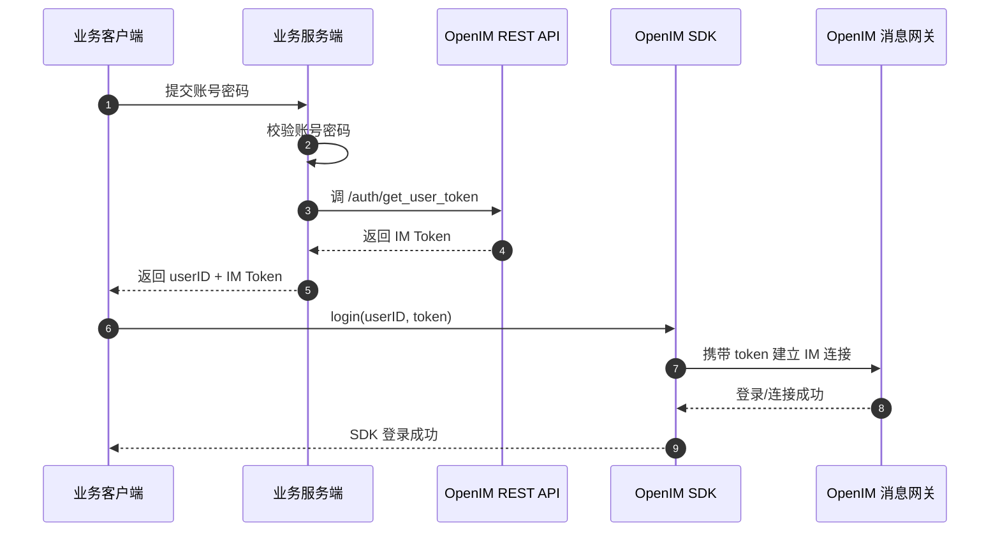
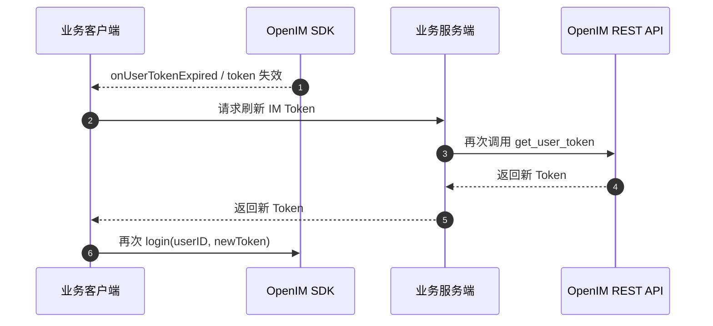
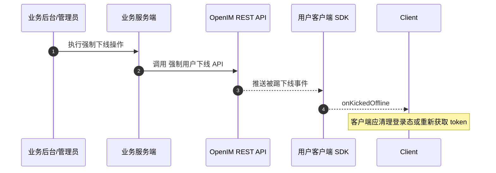
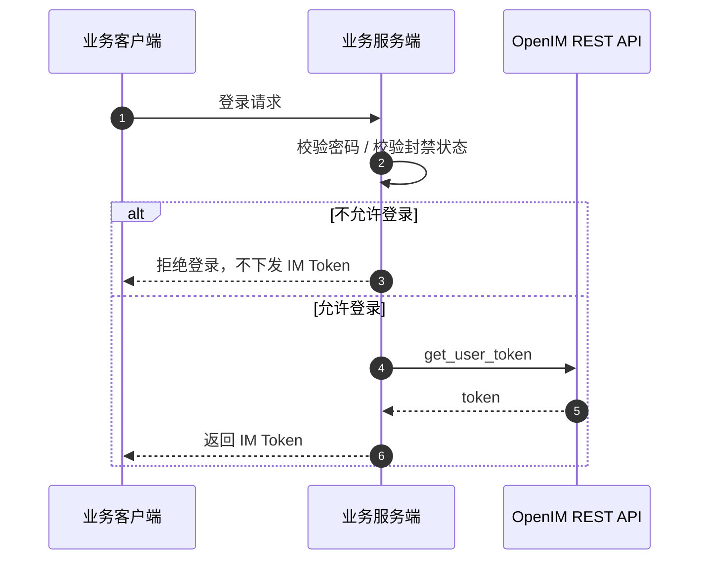
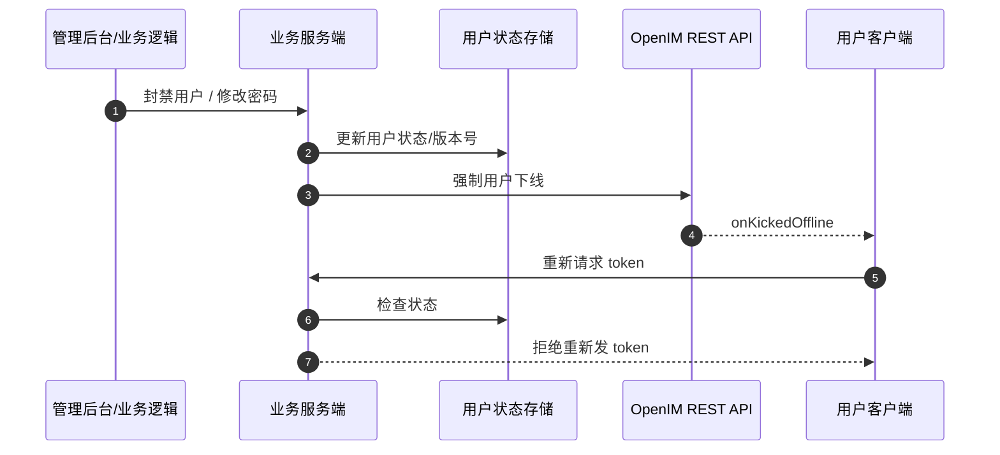

# OpenIM Token 体系与场景说明

本文选取 OpenIM 作为参考对象，说明它的 token 体系是怎么工作的，并结合你当前项目最关心的几个场景做拆解。

注意：

- 文中“OpenIM 官方已明确说明”的部分，我会直接按官方文档表述来讲。
- 文中“结合你当前项目做的落地推断”我会明确标出来，避免把推断误当成官方行为。

---

## 1. 先说结论

OpenIM 的整体认证思路不是传统的 Session-only，而是：

1. 业务系统自己校验账号密码
2. 业务服务端向 OpenIM Server 换取 IM Token
3. 客户端拿着 `userID + token` 调 SDK `login`
4. SDK 再用这个 token 去建立 IM 长连接

这意味着：

- OpenIM 把“业务账号认证”留给你的业务系统
- OpenIM 自己更像是“拿 token 说话”的 IM 基础设施
- token 是 IM 登录的核心凭证

---

## 2. OpenIM 的官方主链路

### 2.1 官方链路概括

OpenIM 官方“如何与现有系统集成”文档给出的主链路是：

1. 你的业务服务端保管用户资料和密码校验
2. 用户登录成功后，业务服务端调用 OpenIM 的“获取用户 token”接口
3. 业务服务端把 IM Token 返回给客户端
4. 客户端调用 OpenIM SDK `login`

这条链路里，OpenIM 没有要求你把业务用户密码直接交给 IM Server。

---

## 3. 场景一：正常登录

这是最核心、也是 OpenIM 官方明确支持的场景。

### 3.1 说明

- 用户先登录你的业务系统
- 业务系统校验通过后，去 OpenIM 侧换 IM Token
- 客户端拿这个 token 去登录 SDK

### 3.2 流程图

### 3.3 你可以借鉴到自己项目里的点

- 业务登录和 IM 登录分开
- 业务服务端是 token 下发方
- 客户端不自己拼 token，也不直接跟 IM Server 交换用户密码

---

## 4. 场景二：Token 过期后重新登录

这个场景 OpenIM 官方也写得很明确。

### 4.1 说明

OpenIM SDK 登录文档提到，以下场景需要重新调用 `login`：

- APP 启动后，从服务端重新获取 token
- token 过期后，从服务端重新获取 token
- 被管理员强制下线后，从服务端重新获取 token
- 用户主动退出登录后，从服务端重新获取 token

也就是说：

- token 不是一劳永逸
- token 失效后，要重新找业务服务端拿新 token

### 4.2 流程图

### 4.3 对你项目的启发

你后面做 WebSocket 或 IM 登录时，也最好沿用这个模型：

- token 过期不是“连接自己修复”
- 而是“客户端回业务服务端换新 token，再重连”

---

## 5. 场景三：管理员强制用户下线

这个场景 OpenIM 官方也有明确 API。

### 5.1 说明

OpenIM 有“强制用户下线”接口，官方文档说明：

- 可以强制用户从某个终端退出登录
- 客户端 SDK 会收到 `onKickedOffline` 回调

这意味着：

- token 体系不是“永远放任用户在线”
- 服务端仍然可以主动切断某个终端会话

### 5.2 流程图

### 5.3 对你项目的启发

这和你前面担心的“JWT 不能立即失效”很相关。

即使整体是 token 模型，也仍然可以通过：

- 服务端状态变更
- 主动断连/踢下线

来实现即时控制。

---

## 6. 场景四：用户被封禁、修改密码

这一部分不是 OpenIM 文档直接展开的完整实现，而是基于官方主链路做的落地推断，更贴近你当前项目。

### 6.1 先说判断

如果你的项目沿用 OpenIM 这种体系，那么：

- “账号密码是否正确”
- “用户是否被封禁”
- “密码修改后旧 token 是否还继续有效”

这些事情，本质上都应该由 **业务服务端** 控制，而不是让 IM SDK 自己决定。

### 6.2 两种常见落点

#### 落点 A：发 token 前就拦住

适合：

- 用户被封禁
- 用户密码校验失败
- 用户状态不允许登录

流程图：

#### 落点 B：用户状态变化后主动踢下线

适合：

- 用户登录后被封禁
- 管理员强制下线
- 修改密码后需要让旧连接失效

流程图：

### 6.3 这里和你项目最贴合的落地方式

对你当前项目，最适合的是：

- 继续沿用 JWT / token 体系
- 但在业务服务端补一层“服务端状态校验”
- 状态建议用 Redis 做高频校验，MySQL 做真实数据源

也就是：

- token 负责“你是谁”
- Redis / MySQL 负责“你现在还能不能继续用这份身份”

---

## 7. OpenIM 这套模型为什么适合你当前项目

因为你现在的项目状态很像这种模式：

1. 业务系统已经有自己的用户体系
2. IM 模块是新增能力，不想推翻原有认证
3. 需要 WebSocket / 长连接
4. 需要多设备登录和异步消息链路

如果直接翻回传统 Session-only：

- 你现有 JWT 认证链路要大改
- WebSocket 握手和 HTTP 认证要重做一套
- 登录态迁移成本更高

所以更顺的路线是：

- 保留 JWT / token 思路
- 在业务服务端做状态控制
- 在 IM 层做长连接接入和消息链路

---

## 8. 对你当前项目的直接建议

结合 OpenIM 的思路，你现在这套项目更建议这样落地：

1. HTTP 登录继续沿用你现在的 JWT 体系
2. WebSocket 握手时也带 token
3. 握手阶段校验：
   - token 是否有效
   - 用户是否被封禁
   - tokenVersion / 密码版本是否匹配
4. 校验通过后，把 `userId` 放入 `WebSocketSession.attributes`
5. 用户状态变化时：
   - 更新 Redis / MySQL 状态
   - 必要时主动断开该用户现有连接

这条路线和你前面讨论出来的：

- JWT + Redis 状态校验
- MQ 异步消息
- WebSocket 推送

是能自然拼起来的。

---

## 9. 关键结论

OpenIM 这套 token 模型可以概括成一句话：

**业务系统负责“验人并发 token”，IM 系统负责“拿 token 建立实时通信能力”。**

这套方式的优点是：

- 业务账号体系和 IM 体系解耦
- 客户端拿 token 即可接入 IM
- token 过期、被踢下线等场景有明确重登路径

对你当前项目，最值得借鉴的不是“照搬 OpenIM 所有细节”，而是这三个原则：

1. 业务认证和 IM 通信能力分层
2. token 是长连接接入凭证
3. 服务端状态变化要能主动影响在线连接

---

## 10. 参考资料

以下是本文主要参考的 OpenIM 官方文档：

- 如何与现有系统集成  
  https://docs.openim.io/zh-hans/guides/solution/integrate

- 获取用户 token  
  https://docs.openim.io/zh-hans/restapi/apis/authenticationmanagement/getusertoken

- SDK login  
  https://docs.openim.io/zh-hans/sdks/api/initialization/login

- 强制用户下线  
  https://docs.openim.io/zh-hans/restapi/apis/authenticationmanagement/forcelogout

文中关于“封禁 / 改密码 / Redis 状态校验”的部分，是我基于 OpenIM 官方主链路，结合你当前项目架构做的工程化落地推断，不是 OpenIM 文档逐字规定的固定实现。
