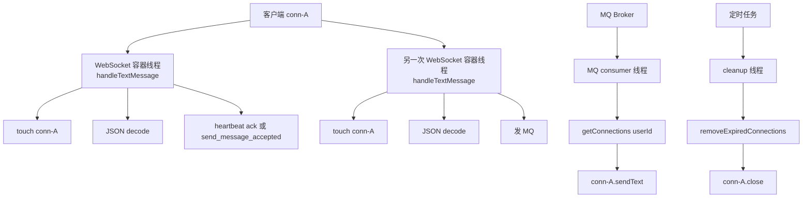
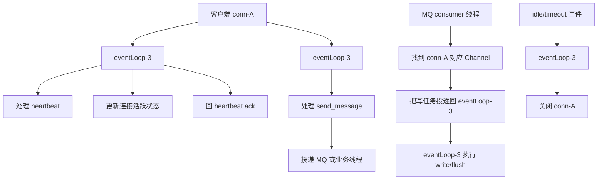

# 单机 IM 场景下 Spring WebSocket 与 Netty 对比说明

本文只讨论一个问题：

- 在当前这个项目的 IM 实现里
- 如果暂时不考虑分布式，只看单机
- 为什么很多人仍然会说 Netty 比 Spring WebSocket 更适合做 IM 接入层

本文不会把结论说成“Spring WebSocket 不能做 IM”。更准确地说是：

- 你当前这套实现更适合快速完成业务功能
- Netty 更适合在单机下把长连接接入层做得更轻、更稳、更可控

---

## 1. 当前项目中的对比对象

这里对比的不是抽象概念，而是你当前代码里的这套实现：

- 连接注册表：`src/main/java/com/bilibili/im/websocket/connection/impl/InMemoryImConnectionRegistry.java`
- WebSocket 入口：`src/main/java/com/bilibili/im/websocket/handler/ImWebSocketHandler.java`
- Spring 连接包装：`src/main/java/com/bilibili/im/websocket/connection/impl/SpringSessionConnection.java`
- 实时推送：`src/main/java/com/bilibili/im/websocket/service/impl/MessagePushServiceImpl.java`
- 心跳清理：`src/main/java/com/bilibili/im/websocket/task/ImWebSocketHeartbeatCleanupTask.java`
- 协议编解码：`src/main/java/com/bilibili/im/websocket/protocol/ImProtocolCodec.java`

当前链路的核心特点是：

1. 基于 Spring WebSocket 收消息和发消息。
2. 在线连接保存在单机内存 `ConcurrentHashMap` 中。
3. 入站消息采用文本 JSON 协议。
4. 实时推送时，业务线程会从注册表里拿到连接并直接发送。
5. 心跳超时通过定时任务全量扫描连接表清理。

---

## 2. 先说结论

在你当前这个 IM 场景里，Netty 相比 Spring WebSocket 的主要优势，不是“功能更多”，而是下面这几件事：

1. 连接归属更清晰，能把同一个连接的大部分 IO 操作收敛到固定 event loop 线程。
2. 收发链路更薄，减少 `TextMessage`、`String`、DTO、JSON 往返带来的对象分配和 GC 压力。
3. 写路径控制更细，能更好处理慢连接、背压、写缓冲积压。
4. 心跳和空闲连接管理更自然，不需要像现在这样周期性全量扫描。
5. 对单机高连接数场景更友好，线程模型、内存模型、发送模型都更接近“长连接基础设施”。

但也要明确：

- Netty 不能消灭网卡带宽上限
- Netty 不能消灭文件描述符上限
- Netty 不能让重业务逻辑自动变快
- Netty 不能把群发的 O(n) 复杂度变成 O(1)

它能做的是：

- 让网络接入层本身更轻
- 让单机在相同硬件上承受更多连接和更高稳定吞吐
- 让很多当前“能跑但不够好控”的点变得可治理

---

## 3. 当前 Spring WebSocket 在这个 IM 里的运行方式

下面用一个真实场景说明当前实现的线程和连接关系。

假设用户 `1001` 的连接是 `conn-A`，接着发生三件事：

1. 客户端发 heartbeat
2. 客户端再发一条业务消息
3. MQ 消费后，服务端把消息推回这个连接

### 3.1 当前实现的简化流转图

### 3.2 这个图里真正的关键信息

同一个 `conn-A`，可能先后被这些线程碰到：

- WebSocket 入站线程
- MQ consumer 线程
- 定时清理线程

注意这里的“先后”不是严格串行保证，而只是业务观察视角下的描述。运行时这些线程可以重叠。

例如：

- MQ 线程正在 `sendText`
- 清理线程正在 `close`
- WebSocket 线程刚好又在 `touch`

所以当前连接对象和连接注册表，本质上是多线程共享资源。

这也是为什么当前实现里需要：

- `ConcurrentHashMap`
- `volatile lastActiveTimeMillis`
- 多处 `null` 判断和失败兜底

---

## 4. Netty 在同一场景里的典型运行方式

Netty 里常见做法是：

- `conn-A` 建立后绑定到某个固定的 event loop，例如 `eventLoop-3`
- 这个连接的大部分 IO 相关处理尽量都回到 `eventLoop-3`

### 4.1 Netty 版本的简化流转图

### 4.2 这和当前实现的本质区别

区别不在于“Netty 完全不切线程”，而在于：

- 其他线程不直接随意改 `conn-A`
- 真正操作 `conn-A` 的读、写、close，尽量回到它所属的 event loop

这会让 `conn-A` 更接近“有线程归属的对象”，而不是“公共共享对象”。

---

## 5. Netty 比当前实现更好的点，以及对应的实际场景

下面只写和你当前项目直接相关的点。

### 5.1 好处一：连接不再是重度共享对象

#### 当前实现的场景

在当前实现里，下面这些动作都可能碰同一个连接：

- `ImWebSocketHandler.handleTextMessage(...)` 里的 `touch`
- `MessagePushServiceImpl.pushMessageReceived(...)` 里的 `sendText`
- `ImWebSocketHeartbeatCleanupTask.cleanupExpiredSessions()` 里的 remove 和 close

这意味着：

- 连接注册表是共享状态
- 连接活跃时间是共享状态
- 连接关闭和发送之间存在竞态

#### Netty 怎么更好

Netty 里更常见的做法是：

- heartbeat 由所属 event loop 更新活跃状态
- MQ 想推送，不直接写连接，而是把写任务投回所属 event loop
- close 连接也尽量由所属 event loop 执行

#### 为什么会更好

这样做的好处是：

- 少共享
- 少并发容器热点
- 少 `volatile` 可见性成本
- 少竞态窗口
- 同一个连接的状态更容易收敛

#### 实际收益

对应到你的项目里，最直接的收益就是：

- `conn-A` 更不容易出现“刚在推送，清理线程又同时关掉”的窗口
- 连接状态不再那么依赖全局共享注册表去协调

---

### 5.2 好处二：线程模型更稳定，减少调度和 cache 抖动

#### 当前实现的场景

当前单机里，至少有这些线程来源：

- WebSocket 入站线程
- MQ consumer 线程
- 定时任务线程

这些线程都可能碰连接相关对象。

即使单次调用栈大多是一个线程跑完，系统层面仍然是“多类线程共同处理连接生命周期”。

#### Netty 怎么更好

Netty 的 event loop 会长期管理一批固定连接：

- 一个连接绑定一个 event loop
- 这个连接的大多数 IO 事件都落在同一个线程

#### 为什么会更好

这样做会减少：

- 线程调度复杂度
- 跨线程共享状态
- CPU cache 在多个核心之间来回失效

#### 实际收益

在高心跳、高推送的情况下，系统更不容易出现：

- CPU 明明没满，但延迟开始抖动
- 同样的连接数下，线程开销越来越大

---

### 5.3 好处三：收发链路更薄，减少对象分配和 GC 压力

#### 当前实现的场景

当前一条心跳或业务消息，大致会经历：

1. 底层帧变成 Spring `TextMessage`
2. 取出 `String payload`
3. JSON 反序列化成 `ImWebSocketInboundMessageDTO`
4. 构造出站 DTO
5. JSON 序列化成字符串
6. 再包成 `TextMessage`

代表位置：

- `ImWebSocketHandler`
- `ImProtocolCodec`
- `ImProtocolResponseFactory`

#### Netty 怎么更好

Netty 的典型优化手段包括：

- `ByteBuf`
- 更薄的 pipeline
- 更少的中间对象
- 需要时可以直接升级为二进制协议

#### 为什么会更好

单机高连接场景下，最重的往往不是一条消息的业务逻辑，而是：

- 心跳包很多
- 每条消息都在持续制造短命对象
- Young GC 频率越来越高

Netty 不是零分配，但通常能显著减少这种固定成本。

#### 实际收益

在你这个 IM 场景里，最明显的是：

- 心跳处理更轻
- message_received / heartbeat_ack 这种高频小包更省对象
- 同样消息量下，GC 更不容易先抖起来

---

### 5.4 好处四：写路径控制更细，慢连接影响更可控

#### 当前实现的场景

你现在的推送模型是：

1. `getConnections(userId)`
2. 遍历连接
3. `connection.sendText(payload)`
4. 失败就 `unregister`

代表位置：

- `MessagePushServiceImpl`
- `ConversationWindowPushServiceImpl`

这套在中小规模下很直接，但缺点是：

- 对慢连接几乎没有细粒度治理
- 发送线程直接负责写
- 没有显式背压控制
- 没有 per-connection 写队列治理

#### Netty 怎么更好

Netty 常用能力包括：

- `Channel.isWritable()`
- `WriteBufferWaterMark`
- 更细的 write / flush 控制
- 出站缓冲控制
- 慢连接识别和主动断开

#### 为什么会更好

慢连接的真正问题不是它自己慢，而是它会拖累整体发送稳定性。

Netty 能让你更细地决定：

- 什么时候继续写
- 什么时候先别写
- 什么时候缓冲已危险
- 什么时候该踢掉慢连接保护整体

#### 实际收益

对应到你的单机 IM：

- 某些弱网客户端不容易把整个推送吞吐拖垮
- 同样是群发或大量推送时，写路径更可治理

---

### 5.5 好处五：心跳超时处理更自然，不必全量扫描

#### 当前实现的场景

当前超时连接清理是：

- 定时任务周期性触发
- 全量遍历 `connectionsByUser`
- 检查每个连接的 `lastActiveTimeMillis`
- 发现过期后 remove 和 close

代表位置：

- `ImWebSocketHeartbeatCleanupTask`
- `InMemoryImConnectionRegistry.removeExpiredConnections(...)`

#### 当前实现的问题

这套逻辑没有错，但在连接数大时会出现：

- 周期性扫描成本
- 扫描与推送/收包抢 CPU
- 清理与 `touch` 之间有竞态窗口

#### Netty 怎么更好

Netty 常见做法是：

- `IdleStateHandler`
- 基于 channel 的 idle 事件
- 时间轮定时器

#### 为什么会更好

它更像“连接自己触发超时事件”，而不是“后台拿着扫帚全表巡逻”。

#### 实际收益

在你这个项目里，最明显的是：

- 少一类全量扫描任务
- 减少心跳 touch 和清理之间的边界竞态
- 连接越多，这个收益越明显

---

### 5.6 好处六：更容易把接入层做成真正的长连接基础设施

#### 当前实现的场景

现在的 WebSocket 入口、协议处理、连接管理、推送逻辑都还在同一个 SpringBoot 应用里。

这没有问题，但它更偏“业务应用中内嵌一套实时能力”。

#### Netty 怎么更好

Netty 更适合把这一层单独看成：

- 长连接接入层
- 心跳保活层
- 协议接入层
- 推送网关层

#### 为什么会更好

即使只看单机，长期收益也很明显：

- 协议升级更方便
- ACK、重试、已读等能力更容易往接入层扩
- “连接治理”和“业务处理”更容易拆清楚

#### 实际收益

对你这个项目来说，最现实的收益是：

- 后续如果继续叠加 IM 能力，不会让 `ImWebSocketHandler` 和 registry 再继续膨胀

---

## 6. 当前 Spring WebSocket 不是“错”，只是优化方向不同

这个点很重要。

你当前的实现有几个明显优点：

1. 开发效率高。
2. 业务链路清楚。
3. 和 Spring 生态、鉴权、配置、监控集成方便。
4. 对中小规模 IM 和功能验证阶段非常合适。

所以不应该得出“现在的实现不好”的结论。更准确地说是：

- 当前实现优先的是“业务落地速度和可维护性”
- Netty 优先的是“长连接接入层的资源效率和可控性”

---

## 7. 用一句话对比你当前项目里的两种思路

### 7.1 当前 Spring WebSocket 思路

- 先把 IM 功能做通
- 连接、消息、推送都在业务应用里协作完成
- 容忍一定弱一致并发窗口

### 7.2 Netty 思路

- 先把连接层做轻、做稳、做可控
- 同一个连接尽量有固定线程归属
- 其他线程不要直接碰连接，更多是给连接所属线程投递任务

---

## 8. 一个最终的对照表

| 对比项 | 当前 Spring WebSocket 实现 | Netty 常见做法 | Netty 为什么更优 |
|---|---|---|---|
| 连接归属 | 多类线程都可能碰连接 | 同一连接尽量归固定 event loop | 少共享、少竞态 |
| 入站处理 | `TextMessage + String + JSON DTO` | 更薄的 pipeline / `ByteBuf` | 少对象、少 GC |
| 推送写出 | 业务线程直接 `sendText` | 回到 channel 所属 event loop 写 | 写路径更稳定 |
| 慢连接治理 | 失败后 remove 为主 | 可写性、水位线、背压控制 | 更可控 |
| 心跳超时 | 定时全量扫描 | idle 事件 / 时间轮 | 少扫描、少竞争 |
| 线程模型 | 框架托管，多线程共同参与连接生命周期 | 少量 event loop 管大量连接 | 更适合长连接 |
| 后续演进 | 容易继续把业务和连接耦在一起 | 更适合做接入层基础设施 | 更利于长期扩展 |

---

## 9. 最后结论

如果只看你当前这个单机 IM 场景，Netty 比 Spring WebSocket 更好的地方，不是“多了几个 API”，而是：

1. 让连接不再那么像全局共享对象。
2. 让同一个连接的读写和状态变化尽量回到固定线程。
3. 让高频小包的固定成本更低。
4. 让慢连接、背压、超时治理更可控。
5. 让接入层更像一个真正的长连接基础设施。

所以一句最简洁的话可以总结成：

> 你当前这套更擅长把 IM 功能做出来，Netty 更擅长把 IM 接入层做得更轻、更稳、更适合高连接数场景。

---

## 10. 对当前项目的建议

如果后面你只是继续做单机，但希望逐步向 Netty 友好的方向演进，优先级建议是：

1. 继续保持“连接抽象”和“Spring Session”解耦，不让上层重新依赖 `WebSocketSession`。
2. 让连接相关状态进一步收口，减少多线程直接碰连接对象。
3. 让推送路径和清理路径尽量统一治理，不要继续扩散“谁拿到连接谁就直接操作”的模式。
4. 如果未来压测目标继续提升，再考虑把接入层独立出来并逐步换成 Netty。

