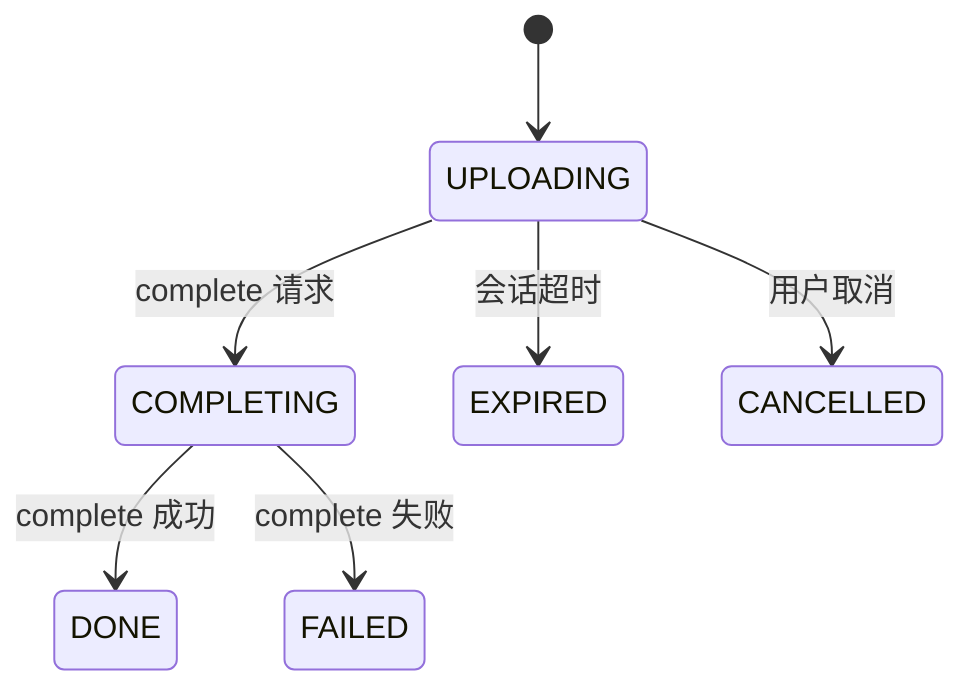
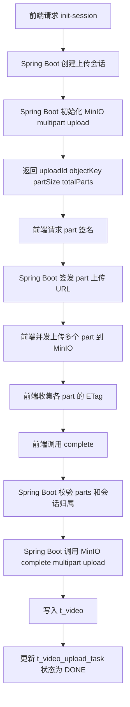
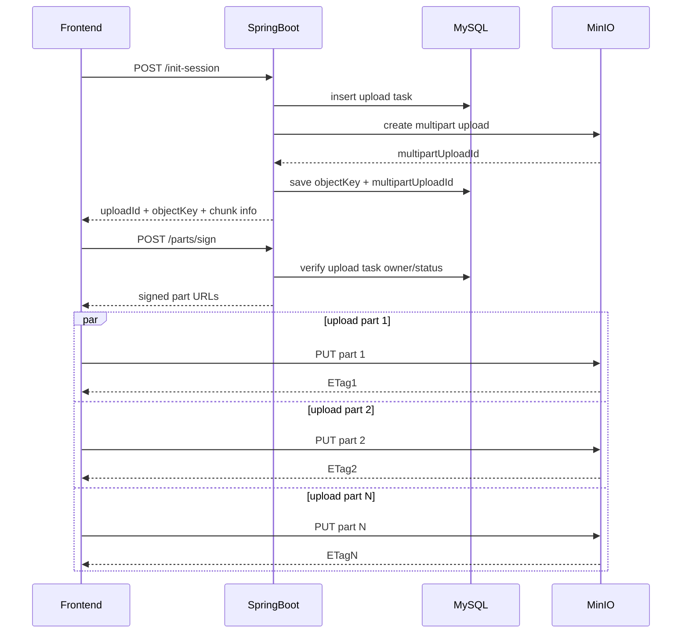
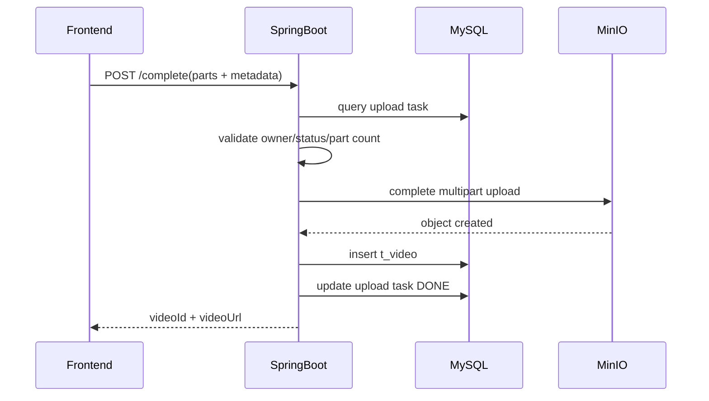

# 存储模块 MinIO Multipart 直传改造方案

## 1. 目标

本文描述将当前“视频分片先上传到 Spring Boot，再由服务端落本地文件并合并”的方案，改造为“前端直传 MinIO，后端只负责签发上传会话、校验与落库”的实施方案。

本次方案重点覆盖视频上传，不处理旧数据迁移。

约束：

1. 旧本地文件和旧上传任务数据可以删除，不做迁移。
2. MinIO 以 Docker 方式部署。
3. 视频上传采用 S3-compatible Multipart Upload 思路。
4. 前端允许并发上传多个分片。

## 2. 现状与问题

当前上传链路核心实现：

- `com.bilibili.upload.video.controller.MeVideoUploadController`
- `com.bilibili.upload.video.service.impl.VideoUploadServiceImpl`
- `com.bilibili.storage.LocalVideoUploadStorageService`

当前问题：

1. 视频分片请求直接打到 Spring Boot，上传流量经过 Nginx 和 Tomcat。
2. 前端并发上传多个分片时，会同时占用多个 Tomcat 请求线程。
3. 分片文件落本地磁盘，最终文件合并也在服务端执行，I/O 压力集中在应用机。
4. 本地存储和数据库写入耦合较重，不利于后续扩展。

## 3. 改造后的总体思路

改造后链路：

1. 前端先向后端申请上传会话。
2. 后端为当前用户创建上传任务，并生成对象 key。
3. 后端为指定 `partNumber` 签发 MinIO 上传 URL。
4. 前端直接把每个分片上传到 MinIO，不再经过 Spring Boot。
5. 前端上传完所有 part 后调用 `complete`。
6. 后端校验上传任务归属、part 完整性和元数据，完成 MinIO multipart upload。
7. 后端写入 `t_video`，并更新上传任务状态为完成。

这样做的本质是：

- 大文件数据流走 MinIO
- Spring Boot 只处理控制面
- Tomcat 不再长期承接视频上传流量

## 4. 改造范围

本次改造只覆盖以下内容：

1. 视频上传链路切换到 MinIO Multipart 直传。
2. 上传任务表继续保留，用于管理业务会话和状态。
3. 本地视频存储实现废弃。
4. 头像/封面存储本次不一起改造；后续可以单独切到 MinIO 单对象直传。

不在本次范围内：

1. 旧数据迁移
2. CDN 接入
3. 聊天图片/文件上传
4. 视频在线播放鉴权

## 5. 模块设计

## 5.1 后端职责

- 创建上传会话
- 生成对象 key
- 签发分片上传 URL
- 记录上传状态
- 完成 multipart upload
- 写业务数据
- 取消上传和清理超时任务

## 5.2 前端职责

- 切片
- 并发上传 part
- 记录每个 part 的上传结果
- 收集 `partNumber + ETag`
- 调用完成接口
- 失败重试指定分片

## 5.3 MinIO 职责

- 保存 part 数据
- 持久化最终对象
- 负责对象层面的 multipart 合并
- 提供 S3-compatible 预签名上传能力

## 6. 数据与对象命名

## 6.1 对象 key

视频最终对象 key 建议：

- `video/{uid}/{yyyy}/{MM}/{dd}/{uploadId}.mp4`

说明：

1. 带 `uid` 前缀，隔离用户命名空间。
2. 带日期目录，便于排查和管理。
3. 带 `uploadId`，保证一次上传会话唯一。

## 6.2 上传任务表

继续使用 `t_video_upload_task`，但语义调整为“业务上传会话”。

建议保留或新增的关键字段：

- `upload_id`
- `user_id`
- `file_name`
- `content_type`
- `file_size`
- `chunk_size`
- `total_chunks`
- `status`
- `final_video_url`
- `expire_time`

建议新增字段：

- `object_key`：最终对象 key
- `multipart_upload_id`：MinIO / S3 multipart upload id

如果不想立刻改表，也可以先复用 `temp_dir` 字段临时存对象 key，但不建议长期这么做。

## 7. 接口方案

## 7.1 初始化上传会话

`POST /me/videos/uploads/init-session`

请求体：

```json
{
  "fileName": "demo.mp4",
  "contentType": "video/mp4",
  "totalSize": 1073741824,
  "chunkSize": 5242880,
  "totalChunks": 205
}
```

响应体建议：

```json
{
  "uploadId": "a1b2c3d4",
  "objectKey": "video/1001/2026/03/21/a1b2c3d4.mp4",
  "chunkSize": 5242880,
  "totalChunks": 205,
  "expireTime": "2026-03-21T12:00:00"
}
```

后端动作：

1. 校验登录态。
2. 校验文件大小、类型、分片参数。
3. 创建上传会话记录。
4. 初始化 MinIO multipart upload，得到 `multipartUploadId`。
5. 保存 `objectKey` 和 `multipartUploadId`。

## 7.2 签发 part 上传 URL

`POST /me/videos/uploads/{uploadId}/parts/sign`

请求体：

```json
{
  "partNumbers": [1, 2, 3, 4]
}
```

响应体建议：

```json
{
  "uploadId": "a1b2c3d4",
  "parts": [
    {
      "partNumber": 1,
      "uploadUrl": "https://minio/...partNumber=1&...",
      "expireSeconds": 1800
    },
    {
      "partNumber": 2,
      "uploadUrl": "https://minio/...partNumber=2&...",
      "expireSeconds": 1800
    }
  ]
}
```

后端动作：

1. 校验上传会话属于当前用户。
2. 校验会话未过期、未完成。
3. 只为请求的 `partNumber` 列表签名。
4. 每个 URL 只对应当前对象、当前 `multipartUploadId` 和当前 `partNumber`。

## 7.3 完成上传

`POST /me/videos/uploads/{uploadId}/complete`

请求体建议：

```json
{
  "title": "demo",
  "description": "demo desc",
  "coverUrl": "http://...",
  "duration": 120,
  "parts": [
    {
      "partNumber": 1,
      "etag": "\"abc\""
    },
    {
      "partNumber": 2,
      "etag": "\"def\""
    }
  ]
}
```

后端动作：

1. 校验上传会话归属。
2. 校验 `parts` 数量是否完整。
3. 按 `partNumber` 排序。
4. 调用 MinIO complete multipart upload。
5. 获取最终对象 URL。
6. 写入 `t_video`。
7. 更新 `t_video_upload_task` 为完成状态。

## 7.4 取消上传

`DELETE /me/videos/uploads/{uploadId}`

后端动作：

1. 校验归属。
2. 调用 MinIO abort multipart upload。
3. 标记任务取消或失败。

## 7.5 查询上传状态

`GET /me/videos/uploads/{uploadId}`

返回：

- 当前状态
- 过期时间
- 已完成的 part 列表（可选）
- 最终视频 id / url（完成后）

## 8. 状态设计

建议状态：

- `UPLOADING`
- `COMPLETING`
- `DONE`
- `EXPIRED`
- `FAILED`
- `CANCELLED`

状态流转：



## 9. 总体流程图



## 10. 时序图

## 10.1 初始化与分片上传



## 10.2 完成上传



## 11. 风控与安全控制

## 11.1 只签发受限上传 URL

要求：

1. bucket 不开放匿名写入。
2. URL 只允许当前对象、当前 part 上传。
3. URL 过期时间控制在 15 到 30 分钟。

## 11.2 上传会话绑定用户

上传会话必须绑定：

- `uid`
- `uploadId`
- `objectKey`
- `multipartUploadId`
- `totalChunks`
- `fileSize`

这样即使签名泄露，也只能写入这一条上传会话对应的 part。

## 11.3 业务层限流

建议用 Redis 限制：

1. 单用户每分钟创建上传会话次数。
2. 单用户同时进行中的上传会话数。
3. 单用户每天累计上传视频总字节数。

## 11.4 未完成上传自动清理

要有两类清理：

1. 应用层定时任务：清理过期上传会话并触发 abort multipart upload。
2. MinIO 生命周期规则：清理长期残留的临时 multipart 数据。

## 12. 与当前实现的差异

当前实现：

1. 前端分片上传到 Spring Boot。
2. Spring Boot 落本地 `.part` 文件。
3. Spring Boot 合并文件。

目标实现：

1. 前端分片直接上传到 MinIO。
2. Spring Boot 不再承接视频二进制流量。
3. 最终合并由 MinIO multipart upload 完成。

核心收益：

1. Tomcat 线程压力显著下降。
2. Nginx 不再代理大文件分片到应用。
3. 应用机本地磁盘不再承担视频中间文件。
4. 视频上传链路更接近生产场景。

## 13. 代码实施计划

## 13.1 新增配置

新增 MinIO 配置，例如：

- endpoint
- publicEndpoint
- accessKey
- secretKey
- bucket
- videoPrefix
- expireSeconds

## 13.2 新增组件

建议新增：

- `MinioProperties`
- `MinioConfig`
- `MinioMultipartService`
- `VideoUploadPartSignDTO/VO`
- `VideoUploadCancelController` 或在现有 controller 扩展取消接口

## 13.3 调整现有组件

调整：

- `VideoUploadService`
- `VideoUploadServiceImpl`
- `VideoUploadTaskDO`
- `VideoUploadTaskMapper`
- 上传相关 controller

废弃：

- `LocalVideoUploadStorageService`
- 本地分片目录/本地 merge 逻辑

## 14. 实施顺序

1. 在 Docker Compose 中加入 MinIO。
2. 新增 MinIO 配置与客户端。
3. 扩展上传任务表结构，增加 `object_key`、`multipart_upload_id`。
4. 重写上传 service 为 multipart upload 控制面。
5. 调整 controller：`init`、`parts/sign`、`complete`、`cancel`、`status`。
6. 删除本地视频分片存储逻辑。
7. 增加过期清理任务。
8. 联调前端并发上传。

## 15. 结论

本次方案不是“把本地文件换个地方存”，而是把视频上传链路彻底改成：

- 后端管会话和校验
- 前端管并发分片上传
- MinIO 管对象与 multipart 合并

这是当前项目里比较合理的技术边界。实现复杂度高于直接 `putObject`，但能解决大文件、慢网络和并发上传三个核心问题。
