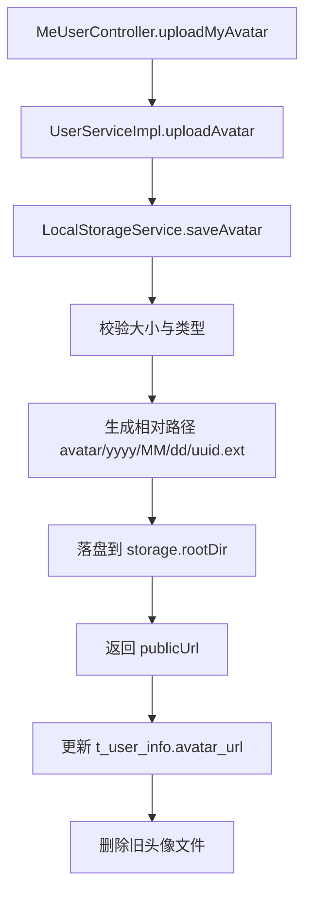
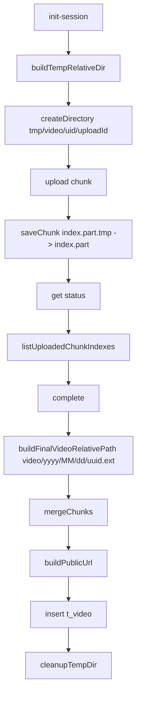

# 存储模块接口与调用链路说明（StorageService / VideoUploadStorageService）

## 1. 范围

本文覆盖文件存储相关接口、实现和调用方：

- 存储接口
  - `com.bilibili.storage.StorageService`
  - `com.bilibili.storage.VideoUploadStorageService`
- 本地实现
  - `com.bilibili.storage.LocalStorageService`
  - `com.bilibili.storage.LocalVideoUploadStorageService`
- 配置
  - `com.bilibili.config.properties.StorageProperties`
- 主要调用方
  - `UserServiceImpl.uploadAvatar`
  - `VideoUploadServiceImpl`（分片上传链路）

## 2. 模块总览

| 组件 | 主要职责 | 对外暴露 |
| --- | --- | --- |
| `StorageService` | 头像文件保存与按 URL 删除 | `saveAvatar`、`deleteByPublicUrl` |
| `VideoUploadStorageService` | 视频分片目录、分片写入、合并、清理 | 11 个视频上传文件操作方法 |
| `LocalStorageService` | 头像本地落盘实现 | `@Service` |
| `LocalVideoUploadStorageService` | 分片视频本地落盘实现 | `@Service` |
| `StorageProperties` | 根目录、公开地址、大小/类型限制 | `@Value` 读取配置 |

## 3. 核心接口

## 3.1 `StorageService`

```java
StoredFile saveAvatar(MultipartFile file);
void deleteByPublicUrl(String publicUrl);
```

语义：

1. `saveAvatar` 负责头像校验+落盘+返回公开 URL。
2. `deleteByPublicUrl` 负责从公网 URL 反解相对路径并删除本地文件。

## 3.2 `VideoUploadStorageService`

职责分组：

1. 约束与命名：`getMaxVideoSize`、`isAllowedVideoType`、`buildTempRelativeDir`、`buildFinalVideoRelativePath`、`buildPublicUrl`
2. 目录与分片：`createDirectory`、`saveChunk`、`listUploadedChunkIndexes`
3. 合并与清理：`mergeChunks`、`cleanupTempDir`、`deleteByRelativePath`

## 4. 调用链路

## 4.1 头像上传链路（`POST /me/avatar`）



关键保障：

1. 文件大小与 MIME 白名单校验。
2. 路径通过 `root.resolve(...).normalize()` + `startsWith(root)` 防目录穿越。
3. DB 更新失败时删除新文件，减少脏数据。

## 4.2 视频分片上传链路（`/me/videos/uploads/**`）



关键保障：

1. 分片写入采用 `.tmp` 后原子移动，避免半写入文件。
2. 已存在且大小匹配的分片直接返回，支持幂等重传。
3. 合并时逐片校验存在性，缺片直接失败。
4. 失败补偿：`markTaskFailed` 后尝试删除已合并目标文件。

## 5. 文件命名与目录规则

## 5.1 头像

- 相对目录：`{avatarSubDir}/{yyyy}/{MM}/{dd}`
- 文件名：`{32位uuid无横线}{ext}`
- 典型路径：`avatar/2026/03/03/9f0e...c1a2.jpg`

## 5.2 视频临时分片

- 临时目录：`tmp/{videoSubDir}/{uid}/{uploadId}`
- 分片文件：`{index}.part`
- 临时写文件：`{index}.part.tmp`

## 5.3 视频最终文件

- 相对路径：`{videoSubDir}/{yyyy}/{MM}/{dd}/{32位uuid}{ext}`
- 默认扩展名：无法解析时用 `.mp4`

## 6. 配置项

来源：`application.yaml` + `StorageProperties`

| 配置 | 含义 | 默认值 |
| --- | --- | --- |
| `storage.rootDir` | 本地存储根目录 | `F:/bilibili-data` |
| `storage.publicBaseUrl` | 公开访问 URL 前缀 | `http://localhost:9000/media` |
| `storage.avatarSubDir` | 头像子目录 | `avatar` |
| `storage.videoSubDir` | 视频子目录 | `video` |
| `storage.avatar.maxSize` | 头像最大大小 | `2097152` |
| `storage.video.maxSize` | 视频最大大小 | `2147483648` |
| `storage.allowedImageTypes` | 图片类型白名单 | `image/jpeg,image/png,image/webp` |
| `storage.allowedVideoTypes` | 视频类型白名单 | `video/mp4` |

## 7. 安全与一致性边界

已处理：

1. 路径穿越防护（`startsWith(root)`）
2. 文件类型和大小限制
3. 分片幂等与原子落盘
4. 业务失败时的文件补偿删除

需注意：

1. 文件系统与数据库不是单事务，极端故障下可能有残留文件。
2. `publicBaseUrl` 仅负责生成 URL，不负责静态文件服务本身（需网关/Nginx/对象存储网关配合）。
