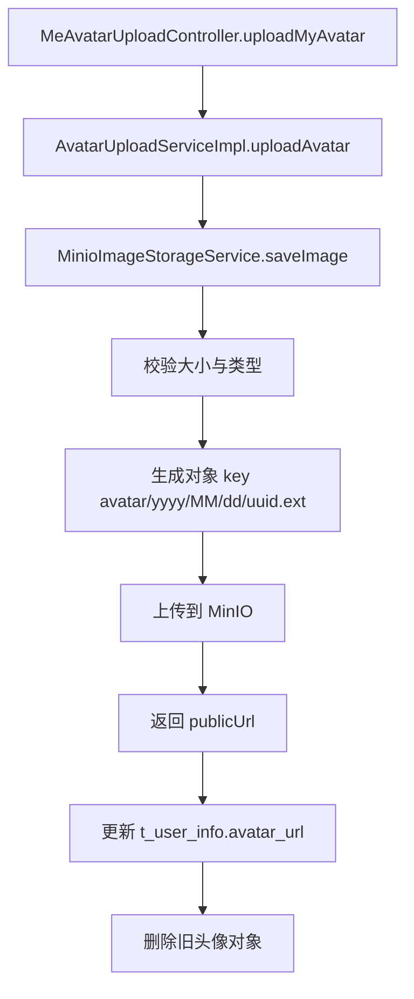

# 存储模块接口与调用链路说明（storage.image.ImageStorageService）

> 注意：本文档中视频上传部分描述的是旧的本地分片存储实现。当前代码已经将视频上传切换为 MinIO Multipart
> 直传，实际设计请参考
> [`src/main/resources/doc/not-frontend-exposed/存储模块-MinIO Multipart直传改造方案.md`](/home/huangnv/biliibli/bilibili_SpringBoot/src/main/resources/doc/not-frontend-exposed/存储模块-MinIO%20Multipart直传改造方案.md)。

## 1. 范围

本文覆盖文件存储相关接口、实现和调用方：

> 注意：头像上传业务入口已经迁入 `upload` 模块。`storage` 现在只负责 MinIO 存储能力，不再作为上传入口。

- 存储接口
  - `com.bilibili.storage.image.ImageStorageService`
- 配置
  - `com.bilibili.config.properties.StorageProperties`
- 主要调用方
  - `AvatarUploadServiceImpl.uploadAvatar`
  - `VideoUploadServiceImpl`（分片上传链路）

## 2. 模块总览

| 组件 | 主要职责 | 对外暴露 |
| --- | --- | --- |
| `ImageStorageService` | 通用图片存储与按 URL 删除 | `saveImage`、`deleteByPublicUrl` |
| `MinioImageStorageService` | 图片上传到 MinIO 与旧对象删除 | `@Service` |
| `StorageProperties` | 大小/类型限制等校验配置 | `@Value` 读取配置 |

## 3. 核心接口

## 3.1 `storage.image.ImageStorageService`

```java
StoredFile saveImage(MultipartFile file, ImageStorageType imageStorageType);
void deleteByPublicUrl(String publicUrl);
```

语义：

1. `saveImage` 负责图片校验+上传+返回公开 URL。
2. `deleteByPublicUrl` 负责从 MinIO 公网 URL 反解对象 key 并删除对象。

## 4. 调用链路

## 4.1 头像上传链路（`POST /me/uploads/avatar`）



关键保障：

1. 文件大小与 MIME 白名单校验。
2. DB 更新失败时删除新对象，减少脏数据。

## 4.2 视频上传链路

视频上传已经切换到 MinIO Multipart 直传，详细设计请参考：

- [`src/main/resources/doc/not-frontend-exposed/存储模块-MinIO Multipart直传改造方案.md`](/home/huangnv/biliibli/bilibili_SpringBoot/src/main/resources/doc/not-frontend-exposed/存储模块-MinIO%20Multipart直传改造方案.md)

## 5. 文件命名与目录规则

## 5.1 头像

- 相对目录：`{avatarSubDir}/{yyyy}/{MM}/{dd}`
- 文件名：`{32位uuid无横线}{ext}`
- 典型路径：`avatar/2026/03/03/9f0e...c1a2.jpg`

## 5.2 视频最终文件

- 对象 key：`{videoPrefix}/{uid}/{yyyy}/{MM}/{dd}/{32位uuid}{ext}`
- 默认扩展名：无法解析时用 `.mp4`

## 6. 配置项

来源：`application.yaml` + `StorageProperties`

| 配置 | 含义 | 默认值 |
| --- | --- | --- |
| `storage.avatar.maxSize` | 头像最大大小 | `2097152` |
| `storage.cover.maxSize` | 封面最大大小 | `5242880` |
| `storage.video.maxSize` | 视频最大大小 | `2147483648` |
| `storage.allowedImageTypes` | 图片类型白名单 | `image/jpeg,image/png,image/webp` |
| `storage.allowedVideoTypes` | 视频类型白名单 | `video/mp4` |
| `minio.avatarPrefix` | 头像对象前缀 | `avatar` |
| `minio.coverPrefix` | 封面对象前缀 | `cover` |
| `minio.videoPrefix` | 视频对象前缀 | `video` |

## 7. 安全与一致性边界

已处理：

1. 文件类型和大小限制
2. 业务失败时的新对象补偿删除
3. 旧头像对象删除失败不影响主流程

需注意：

1. 对象存储与数据库不是单事务，极端故障下可能有残留对象。
2. `publicEndpoint` 仅负责生成 URL，不负责业务鉴权。
