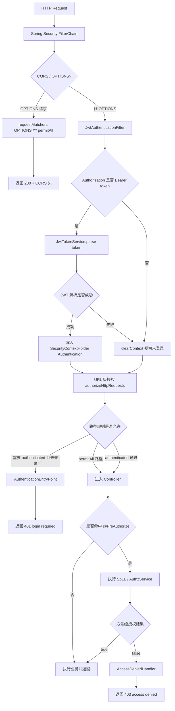
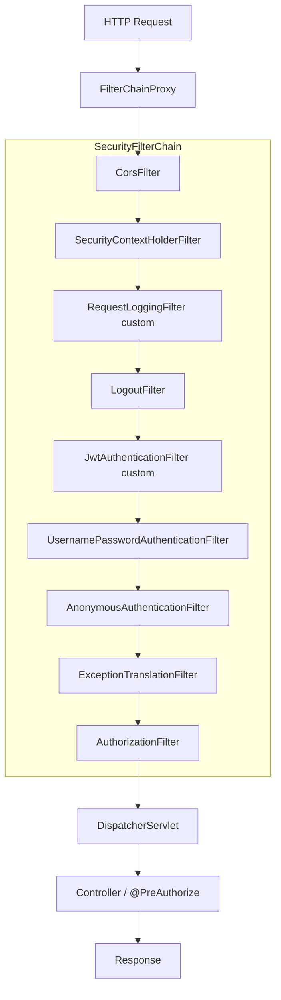

# 授权数据链路说明（bilibili_SpringBoot）

本文说明当前项目的授权链路，按三个层次展开：

1. 过滤器层：请求如何建立身份上下文
2. 决策层：URL 与方法权限如何判定
3. 异常层：401 与 403 如何返回

## 1. 总体结论

`Spring Security` 并不是网络层“第一个拿到数据”的组件，但它是进入 Controller 之前最关键的安全关卡。  
请求进入应用后，会先经过 `SecurityFilterChain` 的多个过滤器，再进入权限决策和业务控制器。

你当前通过这两行把自定义过滤器插入到了官方过滤器链中：

```java
.addFilterAfter(requestLoggingFilter, SecurityContextHolderFilter.class)
.addFilterBefore(jwtAuthenticationFilter, UsernamePasswordAuthenticationFilter.class)
```

## 2. 总体验证路径图（请求到授权结果）

这张图展示“从请求进入到 401/403/放行返回”的完整链路：



## 3. 过滤器链顺序图（含关键官方过滤器）

下面是当前项目的核心顺序关系（只画与授权强相关的过滤器）：



说明：

1. `requestLoggingFilter` 放在 `SecurityContextHolderFilter` 后，便于记录 `traceId` 和最终认证信息。
2. `jwtAuthenticationFilter` 放在 `UsernamePasswordAuthenticationFilter` 前，优先处理 Bearer Token。

## 4. 两个自定义过滤器的职责

### 4.1 RequestLoggingFilter（日志过滤器）

职责：

1. 为每个请求生成 `traceId`
2. 写入 `MDC`，并回写响应头 `X-Trace-Id`
3. 在 `finally` 里记录方法、路径、状态码、耗时、uid

这是典型的“环绕式”过滤器写法：  
先做前置处理 -> `filterChain.doFilter(...)` 传递给下游 -> 在 `finally` 做收尾日志。

### 4.2 JwtAuthenticationFilter（验证过滤器）

职责：

1. 读取 `Authorization` 请求头
2. 识别 `Bearer <token>`
3. 通过 `JwtTokenService.parse(token)` 解析用户身份
4. 构建 `UsernamePasswordAuthenticationToken`
5. 写入 `SecurityContextHolder.getContext().setAuthentication(authentication)`

其中：

1. `principal` 存的是 `AuthenticatedUser`（含 uid）。
2. `Collections.singletonList(new SimpleGrantedAuthority("ROLE_USER"))` 表示授予该用户一个权限标识，供后续角色表达式使用。
3. `@PreAuthorize("isAuthenticated()")` 主要判断“当前是否已认证”，不直接依赖 `ROLE_USER` 这个字符串。

若 token 解析失败，过滤器会清空安全上下文，后续按未登录处理。

## 5. 决策层：URL 级授权规则

`SecurityConfig` 里的核心规则如下：

```java
.authorizeHttpRequests(auth -> {
    if (docsPublic) {
        auth.requestMatchers(DOC_PATHS).permitAll();
    }
    auth.requestMatchers(HttpMethod.OPTIONS, "/**").permitAll();
    auth.requestMatchers(PUBLIC_PATHS).permitAll();
    auth.requestMatchers(HttpMethod.GET, PUBLIC_GET_PATHS).permitAll();
    auth.requestMatchers(HttpMethod.POST, PUBLIC_POST_PATHS).permitAll();
    auth.anyRequest().authenticated();
})
```

含义：

1. `permitAll` 路径无需登录即可访问。
2. `anyRequest().authenticated()` 是“其余请求必须已认证”，不是“一律拒绝”。

## 6. 决策层：方法级授权规则

你已启用 `@EnableMethodSecurity`，因此 Controller 中的 `@PreAuthorize(...)` 会在方法调用前执行。

例如：

```java
@PreAuthorize("@authz.canDeleteComment(authentication, #commentId)")
```

这里的 `authentication` 是 Spring Security 从当前 `SecurityContext` 自动取出的。  
`AuthzService` 返回 `true` 则放行，返回 `false` 则进入无权限处理流程。

## 7. 异常层：401 与 403 的分流

你配置了：

```java
.exceptionHandling(ex -> ex
    .authenticationEntryPoint(restAuthenticationEntryPoint)
    .accessDeniedHandler(restAccessDeniedHandler)
)
```

分流规则：

1. 未认证访问受保护资源 -> `RestAuthenticationEntryPoint` -> `401 login required`
2. 已认证但权限不足 -> `RestAccessDeniedHandler` -> `403 access denied`

这两个返回由 Spring Security 在异常翻译阶段触发，最终统一成你的 JSON 结构。

## 8. JwtTokenService 在链路中的位置

`JwtTokenService` 是 token 基础能力组件：

1. 启动时初始化签名密钥
2. 登录时生成 token
3. 请求时解析 token 并校验合法性

解析异常会被 `JwtAuthenticationFilter` 捕获，随后清理 `SecurityContext`，请求降级为匿名态。

## 9. 当前未展开或可补强的安全策略

### 9.1 已实现但本文前面未重点展开

1. 无状态会话策略：`SessionCreationPolicy.STATELESS`（不依赖服务端 Session）。
2. CSRF 关闭：`.csrf(AbstractHttpConfigurer::disable)`，配合 JWT API 场景使用。
3. 文档开关隔离：`app.docs.public` 控制 Swagger 是否匿名访问。
4. CORS 白名单：`cors.allowedOrigins` 控制浏览器跨域来源。

### 9.2 建议后续补强（当前代码未完整实现）

1. Token 撤销机制：登出后拉黑 token 或引入短 token + refresh token。
2. 登录防爆破：登录接口限流、失败次数锁定、验证码。
3. 细粒度角色模型：不仅 `ROLE_USER`，补充管理员/审核等角色权限矩阵。
4. 安全响应头策略：统一配置 HSTS、X-Content-Type-Options、X-Frame-Options、CSP。
5. 密钥轮换：`jwt.secret` 支持版本化轮换与过渡验证。

## 10. 一句话版本（可放汇报）

系统通过“过滤器建立身份上下文 + URL/方法双层授权 + 401/403 异常分流”完成完整授权链路；  
其中 JWT 过滤器负责把 token 还原为 `Authentication` 并写入 `SecurityContext`，后续所有安全注解都基于该上下文决策。
