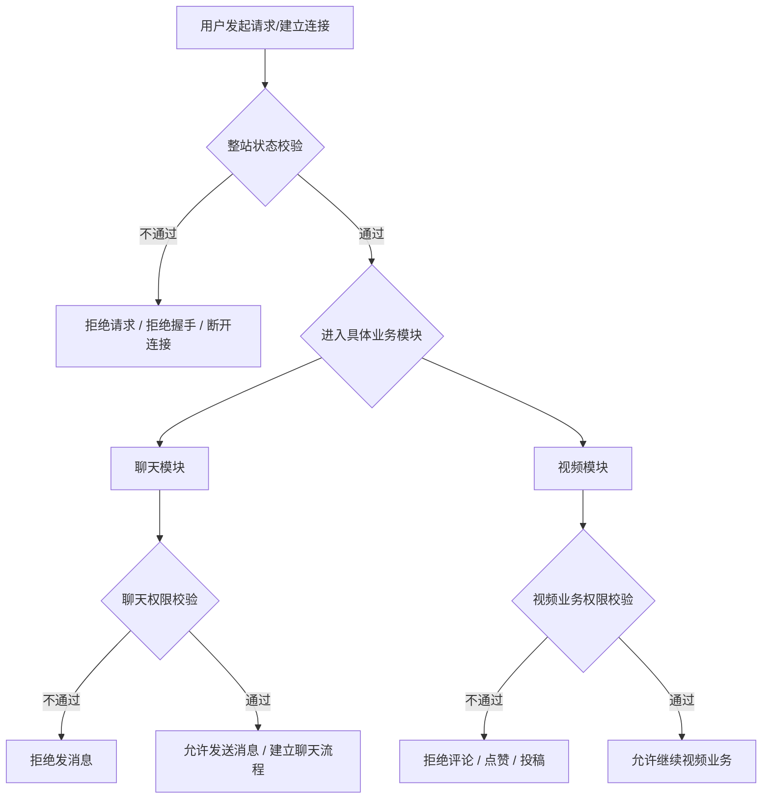

# 整站状态、聊天权限、视频业务权限关系说明

这份文档的目标是把你当前项目里三层容易混在一起的权限概念拆开：

1. 整站状态
2. 聊天权限
3. 视频业务权限

这样后面我们做：

- JWT + Redis 状态校验
- WebSocket 握手认证
- 聊天业务权限判断
- 视频站接口权限判断

就不会混乱。

---

## 1. 先说结论

这三层不是一回事，应该按下面的顺序理解：

1. **整站状态**
   决定这个账号“现在还能不能继续使用系统”

2. **业务模块权限**
   在整站状态通过的前提下，再看具体模块是否允许

3. **模块内对象级权限**
   例如聊天里“能不能给这个具体用户发消息”

也就是说：

- 整站状态是总闸门
- 聊天权限和视频业务权限是分闸门

---

## 2. 三层关系结构图

---

## 3. 三层的含义分别是什么

### 3.1 整站状态

整站状态回答的是：

> 这个用户账号现在还能不能继续作为一个正常账号使用整个系统？

典型问题包括：

- 用户是否存在
- 用户是否被封禁
- 用户是否被冻结
- token 是否仍有效
- 修改密码后旧登录态是否应失效
- 是否需要被强制下线

这层判断应该在：

- HTTP 请求进入时
- WebSocket 握手建立时
- 必要时状态变化后主动断开现有连接

### 3.2 聊天权限

聊天权限回答的是：

> 在整站状态通过的前提下，这个用户能不能给某个具体对象发私信？

典型问题包括：

- 对方是否把我拉黑
- 对方是否只允许联系人私信
- 对方是否拒绝所有私信
- 我是不是对方联系人

这层是 IM 业务规则，不是整站登录认证。

### 3.3 视频业务权限

视频业务权限回答的是：

> 在整站状态通过的前提下，这个用户能不能执行某个视频站业务动作？

典型动作包括：

- 点赞
- 评论
- 投稿
- 修改个人资料
- 关注

这层更偏：

- 接口访问权限
- 动作级权限
- 资源级权限

---

## 4. 当前项目里已经存在的表与字段

下面按三层来对应你当前项目。

---

## 5. 当前项目中的整站状态层

### 5.1 当前已经能看到的主要表

当前项目里最接近整站状态的表是用户主表。

对应代码：

- [`UserDO.java`](/home/huangnv/biliibli/bilibili_SpringBoot/src/main/java/com/bilibili/user/model/entity/UserDO.java)

当前能确认的关键字段有：

- `id`
  用户主键

- `password`
  用户密码哈希

- `status`
  用户状态字段

### 5.2 当前这层存在的问题

虽然已经有 `status`，但这层目前还没有被清晰抽象成：

- 全站统一认证状态模型
- Redis 高速状态校验模型
- WebSocket 握手统一状态判断模型

也就是说：

- 用户状态字段已经有了苗头
- 但“整站状态层”还没有完全成型

### 5.3 这层后面建议扩展的字段

如果你后面要把整站状态做完整，建议最终至少考虑这些字段或缓存模型：

- `userId`
- `status`
  例如：正常 / 封禁 / 冻结

- `tokenVersion`
  用于旧 token 失效控制

- `passwordVersion` 或 `passwordUpdatedAt`
  用于密码修改后让旧登录态失效

- `muteStatus`
  如果你以后要做全站禁言

注意：

- 这些字段不一定都要马上落 MySQL
- 也可以先由 MySQL + Redis 组合实现

---

## 6. 当前项目中的聊天权限层

聊天权限这层，在你当前项目里已经相对清晰了。

### 6.1 表一：`contact_relation`

定义位置：

- [`V3__create_chat_tables.sql`](/home/huangnv/biliibli/bilibili_SpringBoot/src/main/resources/db/migration/V3__create_chat_tables.sql)

关键字段：

- `user_id`
  关系发起视角用户 ID

- `target_user_id`
  目标用户 ID

- `is_contact`
  是否联系人

- `is_blocked`
  是否拉黑对方

- `is_muted`
  是否屏蔽对方

这张表解决的是：

- 用户和用户之间的关系
- 拉黑、联系人、屏蔽等对象级规则

### 6.2 表二：`user_privacy_setting`

定义位置：

- [`V3__create_chat_tables.sql`](/home/huangnv/biliibli/bilibili_SpringBoot/src/main/resources/db/migration/V3__create_chat_tables.sql)

关键字段：

- `user_id`
  用户 ID

- `private_message_policy`
  私信策略

当前策略值：

- `1` 允许所有人
- `2` 仅联系人
- `3` 陌生人允许首条
- `4` 不允许任何人

这张表解决的是：

- 用户自己的聊天隐私策略

### 6.3 聊天权限层当前的服务实现

对应代码：

- [`MessagePermissionDomainServiceImpl.java`](/home/huangnv/biliibli/bilibili_SpringBoot/src/main/java/com/bilibili/im/domain/impl/MessagePermissionDomainServiceImpl.java)

它目前做的判断包括：

- 不能给自己发消息
- 对方是否拉黑发送者
- 对方私信策略是否允许
- 联系人关系是否满足

### 6.4 这一层的定位

这一层已经很明确：

- 它不是登录认证
- 它是聊天模块里的对象级业务权限

所以这层应该继续保留在 IM 模块，不应该被混进全站认证层。

---

## 7. 当前项目中的视频业务权限层

视频业务权限这层，目前没有像 IM 那样单独抽出一套表，但业务入口已经存在。

### 7.1 当前这层更多依赖什么

从项目结构看，视频业务更多是依赖：

- 当前登录用户身份
- 接口本身的鉴权
- 资源是否属于当前用户

这部分当前主要靠：

- Spring Security 登录态
- 业务 service 层判断
- 资源归属判断

### 7.2 典型视频业务权限问题

这层未来更可能涉及：

- 能不能评论
- 能不能点赞
- 能不能投稿
- 能不能修改这个视频
- 能不能删除这个视频

### 7.3 这一层和整站状态的关系

视频业务权限的前提一定是：

- 整站状态先通过

例如：

- 用户被封禁
  那视频模块里就不该继续允许评论、点赞、投稿

- 用户整站状态正常
  才继续判断：
  - 这个视频是不是他自己的
  - 当前动作是否允许

所以视频业务权限应该是：

- 在整站状态之后执行
- 但独立于聊天权限层

---

## 8. 三层与当前表字段的对应表

| 层级 | 当前项目中最相关的表/对象 | 关键字段 | 负责的问题 |
| --- | --- | --- | --- |
| 整站状态 | `user` / `UserDO` | `id`, `password`, `status` | 账号是否还能继续用系统 |
| 聊天权限 | `contact_relation` | `is_contact`, `is_blocked`, `is_muted` | 我能不能给某个用户发消息 |
| 聊天权限 | `user_privacy_setting` | `private_message_policy` | 对方允许谁给他发消息 |
| 视频业务权限 | 目前更多在 service / controller 逻辑里 | 登录身份、资源归属 | 能不能执行视频相关动作 |

---

## 9. 你当前项目最适合的设计建议

### 9.1 整站状态

建议补成：

- JWT 负责身份
- Redis 负责状态高速校验
- MySQL 用户状态做真实数据源

即：

- HTTP 短请求：每次进来先校验整站状态
- WebSocket 握手：建立连接前先校验整站状态
- 状态变化时：主动断开现有 WebSocket 连接

### 9.2 聊天权限

继续保留在 IM 模块：

- `contact_relation`
- `user_privacy_setting`
- `MessagePermissionDomainService`

不要和整站状态混在一起。

### 9.3 视频业务权限

继续作为视频模块自己的业务权限层：

- 基于登录态
- 基于整站状态
- 再做具体业务动作判断

---

## 10. 关键结论

你当前项目里：

- **聊天权限层已经比较清楚**
- **整站状态层还没有完全抽象出来**
- **视频业务权限层还主要散落在业务逻辑里**

所以后面最合理的方向不是“把所有权限揉成一套”，而是：

1. 先补一层统一的整站状态模型
2. 聊天权限继续留在 IM 模块
3. 视频业务权限继续留在视频模块

这三层关系理顺之后，你后面做：

- JWT + Redis 状态校验
- WebSocket 握手认证
- 用户封禁后的即时下线

都会顺很多。
