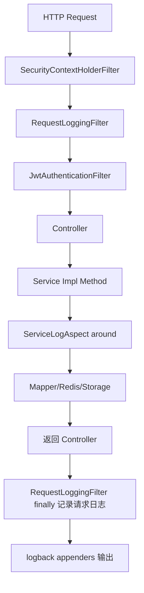

# 日志模块接口与调用链路说明（RequestLoggingFilter / ServiceLogAspect）

## 1. 范围

本文覆盖项目中日志模块的三个核心部分：

- `com.bilibili.security.RequestLoggingFilter`
- `com.bilibili.common.aop.ServiceLogAspect`
- `src/main/resources/logback.xml`

说明重点是“请求日志 -> 服务日志 -> 日志落盘”的调用链路，不涉及业务接口语义。

## 2. 模块总览

| 组件 | 所在层 | 主要职责 |
| --- | --- | --- |
| `RequestLoggingFilter` | Web 过滤器层 | 为每个请求生成 `traceId`，记录请求耗时和状态码 |
| `ServiceLogAspect` | AOP 服务层 | 对 `service.impl` 的 public 方法记录入参与结果摘要 |
| `logback.xml` | 日志基础设施层 | 统一日志格式，输出到控制台、应用日志、错误日志 |

## 3. 调用链路



关键点：

1. `RequestLoggingFilter` 通过 `.addFilterAfter(requestLoggingFilter, SecurityContextHolderFilter.class)` 注入过滤器链。
2. 服务层日志由 `@Around("execution(public * com.bilibili.service.impl..*(..))")` 统一拦截。
3. 两类日志都走 logback，同一日志模式下可通过 `traceId` 关联。

## 4. 核心入口明细

## 4.1 RequestLoggingFilter.doFilterInternal

- 入口：每个 HTTP 请求仅执行一次（`OncePerRequestFilter`）。
- 前置动作：
  - 生成 `traceId`（UUID 去 `-`）
  - 写入 `MDC.traceId`
  - 在响应头写入 `X-Trace-Id`
- 后置动作（`finally`）：
  - 从 `SecurityContext` 解析 `uid`（若已认证）
  - 计算耗时 `costMs`
  - 记录日志：`method/path/status/costMs/uid`
  - 清理 `MDC`（`uid`、`traceId`）

示例日志形态（字段）：

```text
request method=GET path=/videos?page=1&pageSize=10 status=200 costMs=12 uid=1001
```

## 4.2 ServiceLogAspect.aroundService

- 拦截范围：`com.bilibili.service.impl..*` 下所有 `public` 方法。
- 记录策略：
  - 成功：`service success method=... costMs=... args=... result=...`
  - 业务参数异常（`IllegalArgumentException`）：`warn`
  - 非预期异常：`error`（带堆栈）
- 入参摘要规则：
  - `MultipartFile` 输出文件名、大小、类型
  - 基础类型直接输出值
  - `Collection/Map` 输出大小
  - 其他对象输出类名，避免日志过大

## 5. 日志输出配置（logback.xml）

## 5.1 统一日志模式

`LOG_PATTERN` 包含：

- 时间、线程、级别、logger 名
- `traceId=%X{traceId:-}`
- `uid=%X{uid:-}`
- 消息体

这保证了请求日志和服务日志都能带上同一上下文字段。

## 5.2 Appender 说明

| Appender | 文件 | 用途 |
| --- | --- | --- |
| `CONSOLE` | 控制台 | 本地开发快速查看 |
| `APP_FILE` | `${LOG_HOME}/app.log` | 全量业务日志滚动归档 |
| `ERROR_FILE` | `${LOG_HOME}/error.log` | 仅 ERROR 级别日志 |

滚动策略：

- 按天 + 按大小切分（`SizeAndTimeBasedRollingPolicy`）
- `APP_FILE` 保留 14 天
- `ERROR_FILE` 保留 30 天

## 6. 与异常处理的关系

- 安全相关 401/403：由 `RestAuthenticationEntryPoint`、`RestAccessDeniedHandler` 直接返回 JSON。
- 业务异常：由 `GlobalExceptionHandler` 统一转换响应并记录 `warn/error`。
- 请求级日志仍会在 `RequestLoggingFilter` 的 `finally` 中记录一次，便于核对最终状态码。

## 7. 可观测性边界

当前日志模块已覆盖：

1. 请求入口与出口（含状态码和耗时）
2. 服务方法执行耗时与异常
3. `traceId` 跨层关联

当前未覆盖：

1. SQL 明细/慢查询专门日志
2. Redis 调用级别埋点
3. 分布式链路追踪（如 OpenTelemetry）
