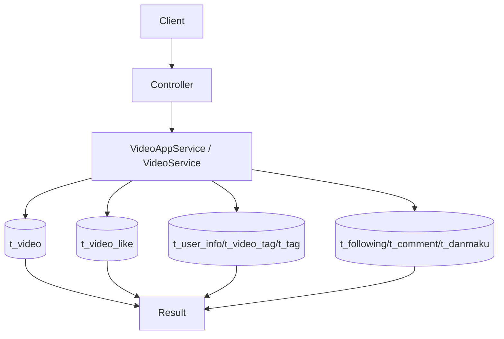

# 视频模块 VS（VideoService）接口与调用链路说明

## 1. 范围

本文只覆盖 VS（`VideoService`）相关能力：

- 首页视频列表
- 视频详情
- 用户投稿列表
- 点赞 / 取消点赞

## 2. 接口与方法映射

| 接口 | 控制器方法 | 服务方法 |
| --- | --- | --- |
| `GET /videos` | `VideoController.listVideos` | `VideoAppService.listVideos -> VideoService.listHomepageVideos` |
| `GET /videos/{videoId}` | `VideoController.getVideoDetail` | `VideoAppService.getVideoDetail -> VideoService.getVideoDetail` |
| `GET /users/{uid}/videos` | `UserVideoController.listPublishedVideos` | `VideoService.listPublishedVideos` |
| `POST /me/videos/{videoId}/likes` | `MeVideoLikeController.likeVideo` | `VideoService.likeVideo` |
| `DELETE /me/videos/{videoId}/likes` | `MeVideoLikeController.unlikeVideo` | `VideoService.unlikeVideo` |

## 3. 关键调用链

## 3.1 列表查询（首页 / 用户投稿）

1. 规范化分页参数（`pageNo/pageSize`）。
2. 使用 MyBatis-Plus `Page` 分页查询。
3. 通过 `VideoMapper.xml` 联表 `t_user_info` 返回 `nickname`。

## 3.2 视频详情

1. 校验 `videoId` 与视频状态（`t_video.status=0`）。
2. 组装基础字段：`videoUrl/title/cover/viewCount/likeCount/duration`。
3. 额外查询：
   - 作者信息：`t_user_info`
   - 标签：`t_video_tag + t_tag`
   - 弹幕数：`t_danmaku`
   - 评论数：优先 `t_video.comment_count`，为空再统计 `t_comment`
4. 若携带登录态，补充：
   - `isLiked`（`t_video_like`）
   - `isFollowed`（`t_following`）

## 3.3 点赞与取消点赞（软状态 + 幂等）

### 点赞

1. 校验 `uid/videoId` 和视频存在。
2. 查关系 `t_video_like(user_id, video_id)`：
   - 不存在：插入 `status=0`
   - 已是 `status=0`：直接返回（幂等）
   - `status=1`：恢复为 `status=0`
3. 生效时 `t_video.like_count + 1`。

### 取消点赞

1. 更新关系 `status:0 -> 1`。
2. 更新 0 行直接返回（幂等）。
3. 更新 1 行则 `t_video.like_count - 1`（不低于 0）。

## 4. 主要数据表

- `t_video`
- `t_video_like`
- `t_user_info`
- `t_video_tag`
- `t_tag`
- `t_following`
- `t_comment`
- `t_danmaku`

## 5. 鉴权与错误码

- 公开：`GET /videos`、`GET /videos/{videoId}`、`GET /users/{uid}/videos`
- 登录：`/me/videos/{videoId}/likes`

常见错误：

- 400：`videoId is invalid`、`video not found`
- 401：未登录访问 `/me/**`
- 500：关系写入或计数更新失败

## 6. VS 链路图

