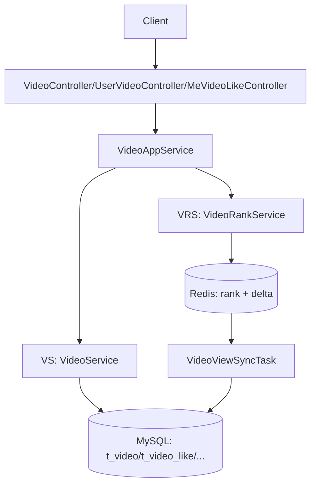

# 视频模块总览说明（按 VideoAppService 两部分拆分）

## 1. 范围

本文按 `VideoAppService` 的实现拆分视频模块：

- VS：`VideoService` 能力（列表、详情、用户投稿、点赞）
- VRS：`VideoRankService` 能力（播放增量、播放排行）

对应细节文档：

- `视频模块-VS（VideoService）接口与调用链路说明.md`
- `视频模块-VRS（VideoRankService）接口与调用链路说明.md`

## 2. VideoAppService 结构

`VideoAppServiceImpl` 是门面层，内部只组合两块能力：

| VideoAppService 方法 | 委托服务 | 对应文档 |
| --- | --- | --- |
| `listVideos` | `VideoService.listHomepageVideos` | VS 文档 |
| `getVideoDetail` | `VideoService.getVideoDetail` | VS 文档 |
| `listVideoRank` | `VideoRankService.listVideoViewRank` | VRS 文档 |
| `increaseViewCount` | `VideoService.validateViewableVideo` + `VideoRankService.increaseVideoViewScore` | VRS 文档 |

## 3. 控制器与两部分映射

| 控制器接口 | 归属部分 |
| --- | --- |
| `GET /videos` | VS |
| `GET /videos/{videoId}` | VS |
| `GET /users/{uid}/videos` | VS |
| `POST /me/videos/{videoId}/likes` | VS |
| `DELETE /me/videos/{videoId}/likes` | VS |
| `GET /videos/rank` | VRS |
| `POST /videos/{videoId}/views` | VRS |

## 4. 数据与缓存分工

- VS 主要数据表：
  - `t_video`、`t_video_like`、`t_user_info`、`t_video_tag`、`t_tag`、`t_following`、`t_comment`、`t_danmaku`
- VRS 主要缓存与回刷：
  - Redis：`rank:video:view`、`video:view:delta:{videoId}`、`video:view:dirty`
  - 定时任务：`VideoViewSyncTask` 回刷 `t_video.view_count`
  - 榜单策略：纯 Redis，不做 MySQL 预热灌榜，不回退 MySQL；空榜时直接返回空分页

## 5. 总链路图

