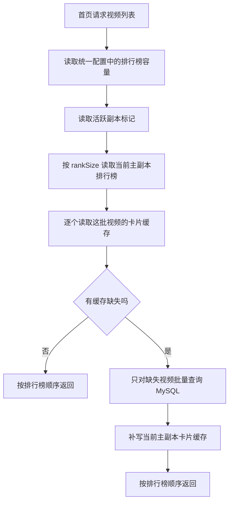
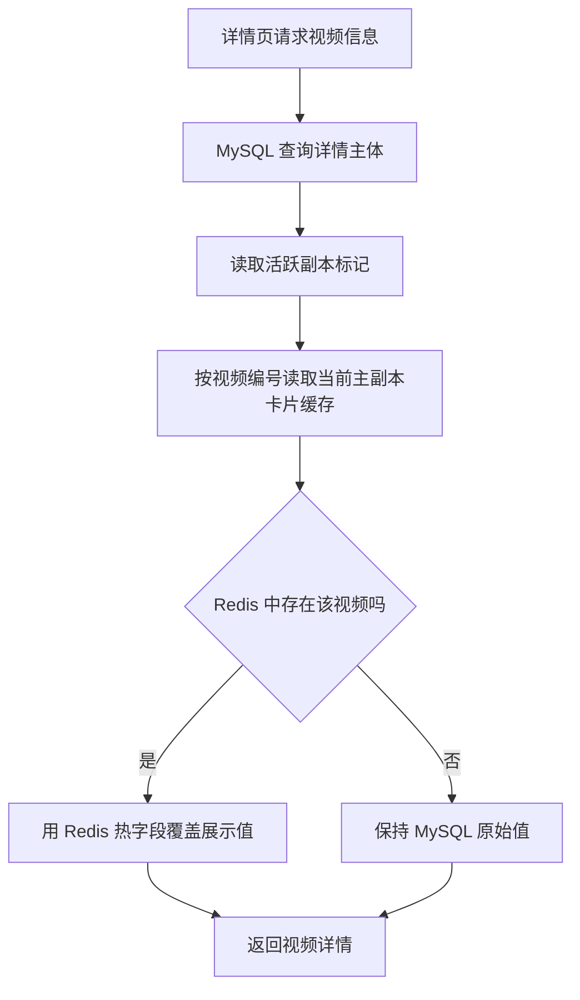
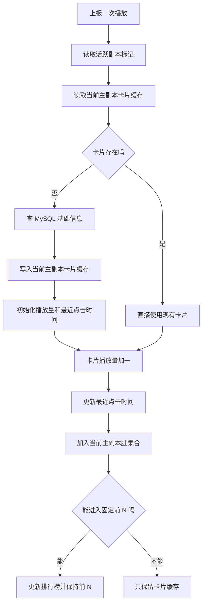
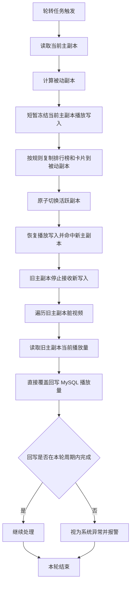
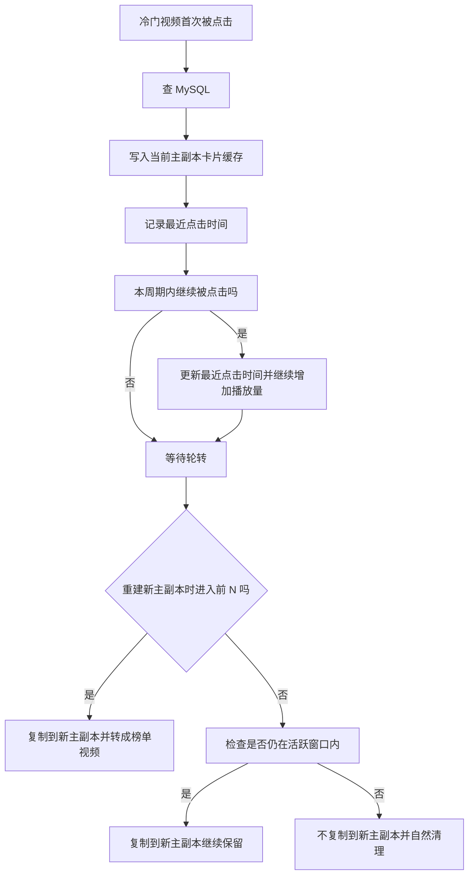

# 首页推荐与播放量 Redis 设计方案

## 1. 文档定位

本文描述的是一套建议实现方案，目标是实现：

- 首页主要从 Redis 读取视频排行榜与卡片信息
- 排行榜只保留前 N 个视频
- 视频卡片缓存可以超过 N 个
- 详情主体仍然查 MySQL，但热字段会用 Redis 覆盖
- 播放上报先写 Redis，不直接写 MySQL
- 按固定轮转周期做一次 A/B 副本复制、主副本切换、旧主回写

这份文档是设计稿，不等同于当前代码实现。

## 2. 参数统一配置原则

这套方案里有几类关键参数，**不要在代码里写死**，必须统一放到配置文件或公共常量类里。

推荐做法：

- 配置项写在 `application.yaml`
- 用 `@ConfigurationProperties` 统一读取
- 代码里通过公共配置对象或常量访问
- 首页读取、播放上报、轮转回写都从同一个配置对象取值，不允许各自写死

建议配置项如下：

| 配置项 | 说明 | 建议默认值 |
| --- | --- | --- |
| `app.video.rankSize` | 首页排行榜容量 | `100` |
| `app.video.switchIntervalMinutes` | A/B 副本轮转周期 | `5` |
| `app.video.activeWindowMinutes` | 榜单外视频活跃窗口 | `5` |
| `app.video.copyBatchSize` | 副本复制批次大小 | 可选 |
| `app.video.flushBatchSize` | MySQL 回写批次大小 | 可选 |

建议在代码里集中管理，例如：

- `VideoRedisTuningProperties`
- `VideoRedisTuningConstants`
- `VideoRedisKeyConstants`

代码落地约束：

- 首页 service 读取排行榜区间时，只能使用 `rankSize`
- 轮转 task 计算执行周期时，只能使用 `switchIntervalMinutes`
- 榜单外卡片清理时，只能使用 `activeWindowMinutes`
- 不允许在代码中直接出现 `100`、`5`、`0 99` 这类业务硬编码
- 如果后续新增分页大小、复制批次、回写批次，也统一放到同一个配置类里

本文后续出现的：

- “前 N”
- “轮转周期”
- “活跃窗口”

分别对应：

- `rankSize`
- `switchIntervalMinutes`
- `activeWindowMinutes`

## 3. 设计目标

- 首页优先读 Redis
- 首页只展示 Redis 排行榜中的前 N 视频
- 榜单外但最近被点击过的视频，也允许在卡片缓存中保留
- 详情页优先查 MySQL 主体，再用 Redis 热字段覆盖展示值
- 播放量尽量实时
- MySQL 只承担最终落盘
- 通过 A/B 双副本避免“旧主回写时还在被新请求写入”

## 4. 核心思路

这版方案不使用单独的播放增量 key，而是在视频卡片里直接维护：

- `viewCount`
- `lastViewAt`

同时维护：

- 固定前 N 的排行榜 ZSet
- 卡片缓存 Hash
- 脏视频集合 Set

每轮执行一遍：

1. 当前主副本假设为 `a`
2. 复制开始前，短暂冻结 `a` 的播放写入
3. 把 `a` 的当前状态复制到被动副本 `b`
4. 原子切换 `active = b`
5. 恢复播放写入，后续新请求开始打到 `b`
6. 旧主副本 `a` 不再接收新写入，作为静态快照回写 MySQL
7. 下一轮反过来，从 `b` 复制到 `a`

注意：

- 不需要两个 Redis 实例
- 只需要同一个 Redis 里的两套 key 空间 A/B
- standby 副本不是从 MySQL 重建，而是从当前 active 副本复制
- 为了拿到一致快照，复制期间短暂冻结 active 的播放写入
- 冻结窗口应尽量短，只覆盖复制和切换这段时间

## 5. Key 设计

## 5.1 活跃副本控制

| Key | 类型 | 说明 |
| --- | --- | --- |
| `home:video:active-slot` | String | 当前主副本标记，值为 `a` 或 `b` |

## 5.2 每个副本的排行榜

| Key | 类型 | 说明 |
| --- | --- | --- |
| `rank:video:view:a` | ZSet | A 副本固定前 N 排行榜 |
| `rank:video:view:b` | ZSet | B 副本固定前 N 排行榜 |

说明：

- member 为 `videoId`
- score 为当前展示热度或播放量
- 每个排行榜只保留前 `rankSize` 个 member

## 5.3 每个副本的卡片缓存

| Key | 类型 | 说明 |
| --- | --- | --- |
| `video:card:a:{videoId}` | Hash | A 副本视频卡片缓存 |
| `video:card:b:{videoId}` | Hash | B 副本视频卡片缓存 |

建议字段：

| Field | 说明 |
| --- | --- |
| `id` | 视频 id |
| `authorUid` | 作者 uid |
| `title` | 标题 |
| `coverUrl` | 封面地址 |
| `duration` | 时长 |
| `createTime` | 发布时间 |
| `nickname` | 作者昵称 |
| `viewCount` | 当前 Redis 中展示播放量 |
| `lastViewAt` | 最近一次点击时间 |
| `scope` | `top` 或 `ephemeral` |

说明：

- `viewCount` 是当前在线展示值
- 旧主副本回写 MySQL 时，直接使用当前 `viewCount` 覆盖数据库字段
- `lastViewAt` 用来判断一个榜单外视频是否仍在活跃窗口内
- 卡片缓存不要求只保存前 N 个视频，允许保存更多被点击过的热视频

## 5.4 每个副本的脏集合

| Key | 类型 | 说明 |
| --- | --- | --- |
| `video:dirty:a` | Set | A 副本中被更新过的脏视频 id |
| `video:dirty:b` | Set | B 副本中被更新过的脏视频 id |

## 6. 接口职责

| 场景 | 接口 | Redis 职责 | MySQL 职责 |
| --- | --- | --- | --- |
| 首页列表 | `GET /videos` | 返回前 N 排行榜及卡片 | miss 兜底 |
| 视频详情 | `GET /videos/{videoId}` | 返回该视频热字段 | 查询详情主体 |
| 播放上报 | `POST /videos/{videoId}/views` | 更新卡片、排行榜、脏集合 | 不直接写 |
| 定时任务 | 内部任务 | 复制副本、切换主副本、回写旧主 | 持久化真相源 |

## 7. 首页读取流程

读取步骤：

1. 读取统一配置：
   - `rankSize`
2. 读取 `home:video:active-slot`
3. 按配置的 `rankSize` 读取当前主副本排行榜：
   - `ZREVRANGE rank:video:view:{slot} 0 (rankSize - 1)`
4. 首页只处理这批排行榜视频 id
5. 逐个读取：
   - `video:card:{slot}:{videoId}`
6. 对 miss 的视频回源 MySQL
7. 将 miss 结果补写到当前主副本的卡片缓存
8. 按排行榜顺序返回首页卡片

说明：

- 首页不额外扩容排行榜
- 首页不从 MySQL 补齐排行榜之外的视频
- 排行榜固定前 `rankSize`，卡片缓存可以超过 `rankSize`
- `rankSize` 必须来自统一配置，不允许首页逻辑直接写死 `100`

### 首页读取流程图

## 8. 详情页读取流程

详情页读取规则：

1. 详情主体直接查 MySQL
2. 再按 `videoId` 去当前主副本的卡片缓存查这个视频
3. 如果 Redis 中存在：
   - 用 Redis 中的热字段覆盖展示值
   - 例如 `viewCount`
4. 如果 Redis 中不存在：
   - 保持 MySQL 原始值

说明：

- 详情主体真相源仍然是 MySQL
- Redis 只负责补充热字段
- 即使一个视频不在前 N 榜单里，只要它进入了卡片缓存，详情页也能读到 Redis 中较新的播放量

### 详情页读取流程图

## 9. 播放上报流程

一次播放会直接更新两个层面：

- 卡片缓存中的热字段
- 固定前 N 排行榜

步骤：

1. 读取 `home:video:active-slot`
2. 检查 `video:card:{slot}:{videoId}` 是否存在
3. 如果不存在：
   - 查 MySQL
   - 将基础信息写入 `video:card:{slot}:{videoId}`
   - 初始化：
     - `viewCount = mysqlViewCount`
     - `lastViewAt = now`
     - `scope = ephemeral`
4. 更新热字段：
   - `viewCount += 1`
   - `lastViewAt = now`
   - `SADD video:dirty:{slot} {videoId}`
5. 判断该视频是否应该进入固定前 N 排行榜：
   - 如果已经在榜内，则更新分数
   - 如果不在榜内，则和第 `rankSize` 名比较
   - 若足以进入前 N，则入榜并踢掉末位
   - 若不足以进入前 N，则只保留卡片缓存
6. 如果最终进入前 N，则把 `scope` 调整为 `top`

说明：

- 排行榜固定只有 `rankSize` 个名额
- 卡片缓存可以超过 `rankSize` 个视频
- 因此会存在“卡片缓存里有，但排行榜里没有”的视频
- 业务层不直接感知 `a` / `b`
- 播放写入统一经过一个 Redis 门面或 repository
- 统一写入入口在真正落 Redis 前解析当前 `active-slot`
- 不允许业务层提前读取并持有 slot 再向下传递
- 最稳的实现方式是用 Lua 脚本一次完成卡片、排行榜、脏标记更新

### 播放上报流程图

## 10. 轮转周期内的副本复制与回写流程

你确认的方案是 A/B 互相复制、轮流做主：

1. 假设当前主副本为 `a`
2. 到轮转周期时，先短暂冻结 `a` 的播放写入
3. 把 `a` 的当前状态复制到 `b`
4. 原子切换 `active = b`
5. 恢复播放写入，新请求开始命中 `b`
6. 原来的 `a` 不再接收新写入，作为旧主副本回写 MySQL
7. 下一个周期反过来：
   - 从 `b` 复制到 `a`
   - 切换 `active = a`
   - 回写旧主 `b`

关键点：

- standby 副本不是从 MySQL 构建
- standby 副本是从当前 active 副本复制
- MySQL 在这里是落盘目标，不是每轮的榜单重建源
- 为了保证复制出来的是同一时点快照，复制期间短暂冻结 active 写入
- 轮转周期必须统一读取 `switchIntervalMinutes`
- 榜单外视频是否保留必须统一读取 `activeWindowMinutes`
- 这些参数不允许在定时任务实现里写死
- 默认约束是上一轮旧主回写必须在一个轮转周期内完成
- 本方案直接假设 `5` 分钟足以完成旧主回写，不考虑跨轮次回写
- 如果旧主回写超过一个轮转周期，视为系统异常并报警，不继续按正常轮转处理

### 副本切换与回写流程图

## 11. 榜单外视频的活跃窗口清理规则

这版方案不依赖固定 TTL 自动过期，而是在每轮切换时主动检查：

- 如果一个榜单外视频距离最近一次点击已经超过 `activeWindowMinutes`
  - 不复制到新主副本
- 如果一个榜单外视频仍在活跃窗口内
  - 继续复制到新主副本

判断依据是卡片中的：

- `lastViewAt`

这比纯 TTL 更符合业务语义，因为清理动作和副本轮转是一致的。

### 榜单外视频生命周期图

## 12. 旧主副本回写 MySQL 的规则

切换完成后，旧主副本不再接收新写入，此时可以稳定回写。

因为这版方案不保留 `baseViewCount`，所以旧主副本回写时不再计算增量，直接使用当前卡片中的 `viewCount` 覆盖 MySQL：

- `UPDATE t_video SET view_count = ? WHERE id = ?`

本方案默认前提：

- 旧主副本回写是单线程串行执行
- 同一时刻只允许一个旧主副本回写
- 上一轮回写必须在下一轮轮转开始前完成
- 默认 `5` 分钟足以保证这一点
- 如果出现跨轮次回写，视为系统异常，而不是正常场景

因此本文不额外引入：

- `baseViewCount`
- `delta key`
- `view_sync_epoch`

回写成功后，旧主副本可以整批删除，不再继续服务请求。

## 13. 工程约束

为了让这套方案稳定，建议补上这些约束：

1. 副本复制 + 切换 + 回写过程加分布式锁
2. 切换 `home:video:active-slot` 必须原子
3. 首页只读 active 副本
4. 播放写入只写 active 副本
5. 复制期间短暂冻结 active 播放写入，避免复制过程拿到非同一时点快照
6. 旧主副本切换后禁止再接收写入
7. 标题、封面、昵称等基础字段更新时，要同步失效或更新卡片缓存
8. 排行榜容量、轮转周期、活跃窗口都必须走统一配置，不允许散落硬编码
9. 读取排行榜时统一通过 `rankSize` 计算区间，不直接写死 `0 99`
10. 定时任务触发频率统一通过 `switchIntervalMinutes` 派生，不直接写死 `5`
11. 榜单外视频清理判断统一通过 `activeWindowMinutes` 计算，不直接写死 `5`
12. Redis 物理副本 key 只允许在统一封装层内部解析，业务层不直接拼接 `a` / `b`
13. 业务层不允许提前读取并持有 `active-slot`，必须在真正写入前由统一封装重新解析
14. 播放热数据更新最好通过 Lua 脚本一次完成，避免卡片、排行榜、脏标记更新分离
15. 旧主副本回写必须在一个轮转周期内完成，默认按 `5` 分钟内完成处理
16. 如果旧主副本回写超过一个轮转周期，视为系统异常并触发报警，不继续视为正常运行态

## 14. Redis 访问封装约束

为了让 A/B 副本对业务代码无感，建议增加一层统一访问封装，例如：

- `VideoHotRepository`
- `VideoRedisFacade`
- `VideoRedisKeyResolver`

约束如下：

1. 业务层只调用逻辑方法，例如：
   - `increaseView(videoId)`
   - `getActiveCard(videoId)`
   - `listHomeCards()`
2. 业务层不直接读取：
   - `home:video:active-slot`
3. 业务层不直接拼接：
   - `rank:video:view:a`
   - `rank:video:view:b`
   - `video:card:a:{videoId}`
   - `video:card:b:{videoId}`
4. 统一封装层在真正执行 Redis 写入前，再解析当前 `active-slot`
5. 如果使用 Lua 脚本，则由脚本内部读取 `active-slot` 并更新：
   - 当前副本卡片
   - 当前副本排行榜
   - 当前副本脏标记

这样做的目的，是避免请求开始时拿到旧 slot，切换完成后又继续把数据写进旧副本。

## 15. 方案优点

- 首页排序和卡片播放量都可以实时
- 详情页主体查 MySQL，热字段查 Redis，职责清楚
- 不需要每次播放都打 MySQL
- 不需要单独维护 `video:view:delta:{videoId}`
- 不需要维护 `baseViewCount`
- 旧主回写时不会再被新请求污染
- 榜单外视频可按最近点击时间自然淘汰

## 16. 方案成本

- 比当前项目复杂很多
- 需要维护两套副本 key
- 需要维护 `lastViewAt`
- 复制与回写过程要保证一致性
- 运维和排错复杂度更高

## 17. 最终结论

你这版思路是可行的，核心顺序应固定为：

1. 活跃副本实时承接所有播放更新
2. 到轮转周期时，短暂冻结活跃副本播放写入
3. 把活跃副本复制到被动副本
4. 原子切换 active 指针
5. 恢复播放写入，新请求开始命中新主副本
6. 旧主副本作为静态快照回写 MySQL
7. 下一轮反向复制和切换

一句话概括：

- 在线读写只打 active 副本
- standby 先复制 active，再接流量
- 旧主副本在切换后再做回写
