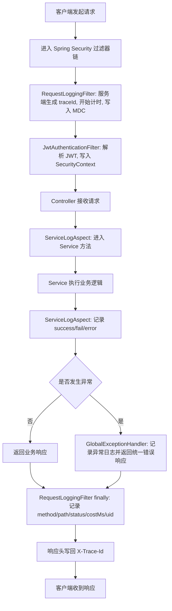

# 日志模块实战与数据流说明（Spring MVC + Spring Security + Logback）

本文档对应你当前项目里的日志实现，目标是：  
让只懂基础 Java 的同学也能看懂日志怎么流转、怎么规范使用、怎么迁移到其他项目。

---

## 1. 这个日志模块解决了什么问题

你现在的日志模块主要做了 3 件事：

1. **请求级日志（统一入口）**  
   每个 HTTP 请求都会记录：方法、路径、状态码、耗时、用户 uid、traceId。

2. **异常日志（统一出口）**  
   所有异常都走 `GlobalExceptionHandler`，统一记录并返回统一格式响应。

3. **业务关键日志（关键动作）**  
   通过 AOP 切面统一记录 Service 调用成功/失败/异常、耗时和参数摘要。

---

## 2. 组件清单（你项目中已落地）

### 2.1 `logback.xml`（日志总配置）

文件：`src/main/resources/logback.xml`

作用：

- 定义日志格式（带 `traceId`、`uid`）
- 控制日志级别（`INFO/WARN/ERROR`）
- 把日志输出到：
  - 控制台
  - `app.log`（业务日志）
  - `error.log`（仅错误日志）
- 定义滚动策略（按天 + 按大小切分）

---

### 2.2 `RequestLoggingFilter`（请求日志过滤器）

文件：`src/main/java/com/bilibili/security/RequestLoggingFilter.java`

作用：

- 每个请求进来时由服务端生成 `traceId`（不信任客户端传入）
- 把 `traceId` 放入 `MDC`
- 请求结束时记录一条统一日志
- 解析当前登录用户并写入 `uid`
- 响应头返回 `X-Trace-Id`，方便前后端对齐排查

---

### 2.3 `SecurityConfig`（过滤器链组装）

文件：`src/main/java/com/bilibili/config/SecurityConfig.java`

作用：

- 把 `RequestLoggingFilter` 加入 Spring Security 过滤器链
- 保证过滤器在请求链中稳定执行

---

### 2.4 `GlobalExceptionHandler`（异常统一处理）

文件：`src/main/java/com/bilibili/common/exception/GlobalExceptionHandler.java`

作用：

- `400/401/403` 用 `warn` 记录
- 兜底异常用 `error` + 堆栈记录
- 前端响应结构统一（`Result`）

---

### 2.5 Service AOP 日志切面

文件：

- `src/main/java/com/bilibili/common/aop/ServiceLogAspect.java`

作用：

- 拦截 `com.bilibili.service.impl` 下的公开方法
- 统一记录成功日志（方法名、耗时、参数摘要、结果摘要）
- 统一记录失败日志（`IllegalArgumentException` -> `warn`）
- 统一记录异常日志（其他异常 -> `error` + 堆栈）
- 业务类无需写 `getLogger`，降低代码侵入

---

## 3. 一次请求的数据流（核心）

下面是“真实请求”在你项目里经过的路径：

### 3.1 流程图



### 3.2 文字流程

1. 客户端请求进入服务（例如 `POST /me/followings/2002`）
2. 进入 Spring Security 过滤器链
3. `RequestLoggingFilter` 由服务端生成 `traceId`，开始计时
4. 请求继续向后传递，`JwtAuthenticationFilter` 解析 token 并写入 `SecurityContext`
5. Controller 调用 Service 时先进入 `ServiceLogAspect`（环绕通知）
6. Service 执行业务逻辑，切面统一记录成功/失败/异常日志
7. 若业务抛错，进入 `GlobalExceptionHandler` 记录并统一返回
8. 响应返回前，`RequestLoggingFilter` 在 `finally` 中打请求总日志（状态码、耗时、uid、traceId）
9. 客户端拿到响应头里的 `X-Trace-Id`

---

## 4. 日志字段解释（看日志时怎么读）

你的日志格式里关键字段：

- `traceId`：请求链路唯一 ID（一次请求一个）
- `uid`：当前登录用户 ID（未登录时为 `-`）
- `method`：HTTP 方法（GET/POST/PUT/DELETE）
- `path`：请求路径
- `status`：HTTP 状态码
- `costMs`：请求处理耗时（毫秒）

示例（简化）：

```text
... INFO  ... traceId=9a1f... uid=1001 - request method=POST path=/me/followings/2002 status=200 costMs=15 uid=1001
```

---

## 5. 使用规范（必须遵守）

### 5.1 日志级别规范

- `INFO`：正常关键流程（登录成功、关注成功）
- `WARN`：可预期失败（参数错误、鉴权失败、业务冲突）
- `ERROR`：系统异常（NPE、数据库连接错误、未知异常）

### 5.2 敏感信息规范

禁止打印：

- 明文密码
- Token 全值
- 文件二进制内容
- 用户敏感隐私字段

允许打印：

- uid、业务 ID、状态码、错误码、耗时、traceId

### 5.3 打点位置规范

- Controller：可不打或只打极少日志（避免重复）
- Service：不建议手写日志，交给 `ServiceLogAspect` 统一处理
- ExceptionHandler：统一异常日志（必须）
- Filter：统一请求日志（必须）

---

## 6. 如何在其他项目复用（迁移步骤）

如果你要把这套日志改造到新项目，按下面 6 步做：

1. 加入 `slf4j + logback` 依赖  
2. 放一份统一 `logback.xml`（含滚动策略）  
3. 写一个 `OncePerRequestFilter` 做请求日志与 `traceId`  
4. 配一个全局异常处理器统一记录异常  
5. 用 AOP 拦截 Service 层，统一记录成功/失败/异常日志  
6. 定一套团队日志规范（级别、字段、敏感信息）  

做到这 6 步，日志能力就已经达到“可运维、可排障”的标准。

---

## 7. 常见问题

### Q1：为什么要 `traceId`？

因为一次请求会经过很多层（过滤器、控制器、服务层）。  
`traceId` 能把这些日志串起来，排错速度会快很多。

### Q2：为什么请求日志放过滤器，不放 Controller？

过滤器是全局入口，所有请求都能覆盖，且不会漏记录 404/401/403 这类请求。

### Q3：为什么业务日志不“全量打印”？

日志太多会淹没关键信息，且有性能开销。  
正确做法是只打关键业务节点。

---

## 8. 你下一步建议

1. 给每个响应体增加 `traceId`（不仅响应头有，JSON 里也可返回）
2. 约定统一错误码枚举（让日志和前端错误提示一一对应）
3. 后续接入 ELK/Graylog 时，直接按 `traceId` 检索全链路
